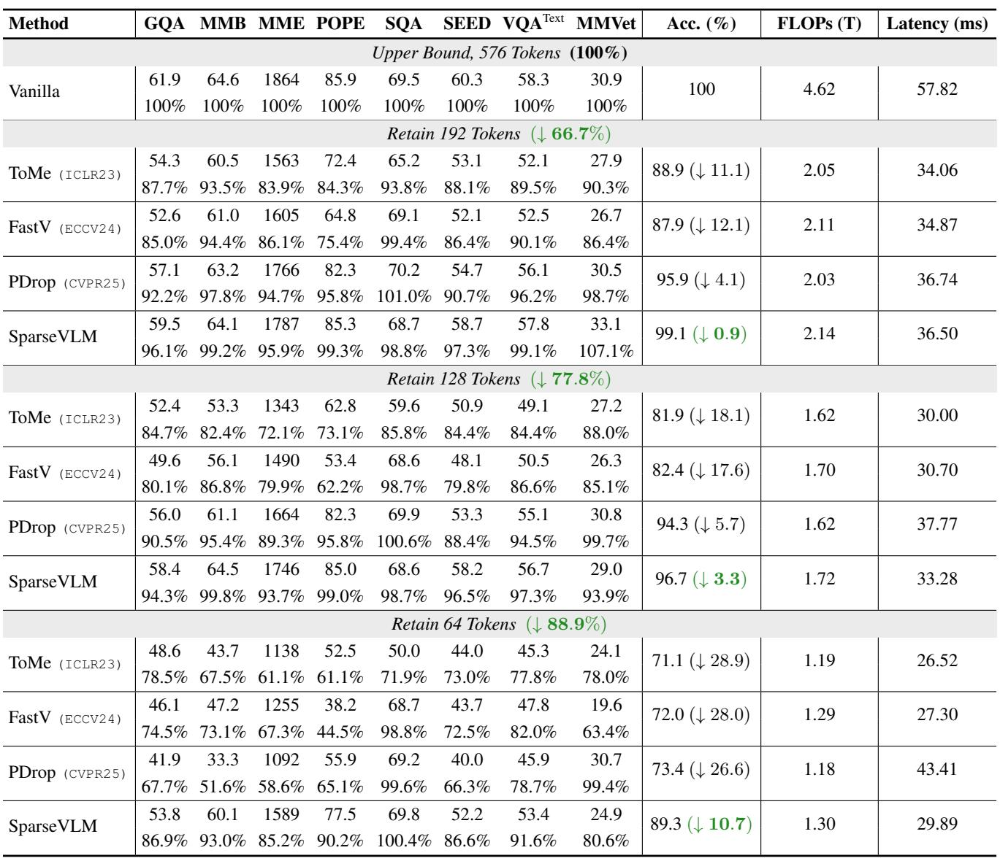
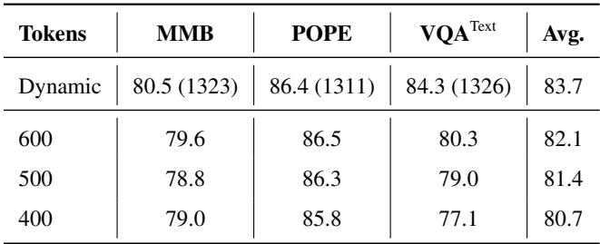
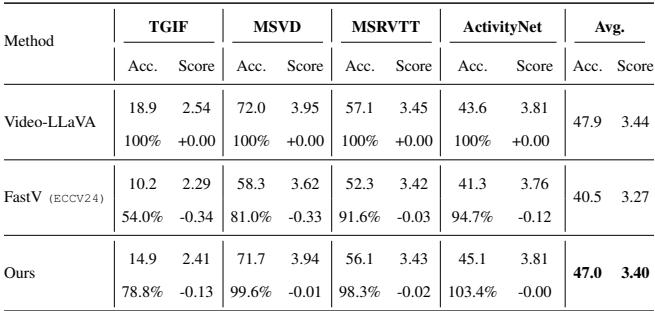

[← 返回 README](../README.md)

# 4. Experiments

## 📌 预览
实验部分在图像理解（8个 benchmark、3个 VLM）和视频理解（4个 benchmark、VideoLLaVA）上验证 SparseVLM 的效果，与 FastV、ToMe、PDrop 对比。

---

In this section, we validate our method within various vision-language architectures on comprehensive multimodal benchmarks, including image and video understanding tasks, to assess its generality, effectiveness, and efficiency.

---

## 4.1. Image Understanding Tasks

### Datasets

For image-based multimodal evaluation, we conduct experiments on eight widely adopted benchmarks, including GQA (Hudson & Manning, 2019), MMBench (MMB) (Liu et al., 2024c), MME (Fu et al., 2023), POPE (Li et al., 2023b), SQA (Lu et al., 2022), SEED-Bench (SEED) (Li et al., 2024a), VQAText (TextVQA) (Singh et al., 2019), and MMVet (Yu et al., 2024).

> 💡 **8 个 benchmark 覆盖**: 视觉推理(GQA)、综合能力(MMB, MME)、幻觉检测(POPE)、科学问答(SQA)、多模态理解(SEED)、文本识别(TextVQA)、综合VL能力(MMVet)。

### Implementation Details

We verify SparseVLM on three VLM frameworks: LLaVA (Liu et al., 2024b), Mini-Gemini (MGM) (Li et al., 2024c), and Qwen2-VL (Bai et al., 2023). LLaVA-1.5 employs CLIP-pretrained ViT-L as the visual tower, MGM further introduces a LAION-pretrained ConvNeXt-L (Liu et al., 2022) for high-resolution refinement, while Qwen2-VL owns dynamic resolution encoder.

> 💡 **三个 VLM 框架**:
> | 模型 | 视觉编码器 | 特点 |
> |------|-----------|------|
> | LLaVA-1.5 | CLIP ViT-L | 基础框架，576 tokens |
> | Mini-Gemini | CLIP ViT-L + ConvNeXt-L | 高分辨率双编码器 |
> | Qwen2-VL | 动态分辨率编码器 | 可变 token 数 |

---

### Main Results

In Table 1, we present the performance of SparseLLaVA (LLaVA equipped with SparseVLM) on image understanding benchmarks. To intuitively assess the performance, we provide the results by percentage format for comparative analysis, and the accuracy of the vanilla model with the 100% upper limit. We set 3 vision token count configurations (192, 128, and 64) to check the advantages of SparseVLM comprehensively. When pruning from 576 to 192 tokens, the SparseLLaVA only decreases the average accuracy by 0.9% without additional training and exceeds ToMe (Bolya et al., 2023) 10.2%. When only 64 tokens are kept, our method outperforms FastV (Chen et al., 2024a) by a significant margin of 17.3%, while ToMe performs worst due to its direct merging. Furthermore, we also compare the recent method PDrop (Xing et al., 2025) training-free version, which has lower FLOPs computation. However, our method outperforms it in accuracy and latency, which are the most crucial metrics for practical deployment.

*Table 1. Performance of SparseLLaVA under different vision token configurations. The vanilla number of vision tokens is 576.*

> 💡 **Table 1 批读**:
> - **576→192 tokens (↓66.7%)**:
>   - SparseVLM: **99.1%** 平均精度（仅降 0.9%）
>   - ToMe: 88.9%（降 11.1%）| FastV: 87.9%（降 12.1%）| PDrop: 95.9%
> - **576→128 tokens (↓77.8%)**:
>   - SparseVLM: **96.7%** | PDrop: 94.3% | FastV: 82.4% | ToMe: 81.9%
> - **576→64 tokens (↓88.9%)**:
>   - SparseVLM: **89.3%** | PDrop: 73.4% | FastV: 72.0% | ToMe: 71.1%
>   - 压缩越激进，SparseVLM 优势越明显
> - **MMVet 上甚至超过 100%**（107.1% at 192 tokens）：说明裁剪冗余 token 反而减少了噪声

---

*Figure 4. Performance of MGM w/ SparseVLM on three multimodal benchmarks. The horizontal axis represents the remaining number of vision tokens, while the vertical axis means the accuracy after percentage normalization.*

> 💡 **Figure 4 批读**:
> - MGM 上的结果趋势与 LLaVA 一致
> - 随着 token 减少，SparseVLM 与 FastV/ToMe 的差距持续扩大
> - 说明 text-aware 策略在高压缩率下优势更大

---

We further investigate our efficacy on Qwen2-VL. In Table 2, when 54.5% of vision tokens are removed, Qwen2-VL maintains an accuracy of 98.0%. Furthermore, for every 100 tokens pruned, the accuracy only drops by approximately 0.8%. This validates the effectiveness of our method at high resolutions and its compatibility with variable resolutions.

*Table 2. Performance of SparseVLM on Qwen2-VL.*

> 💡 **Table 2 批读**: Qwen2-VL 动态分辨率（平均 ~1300 tokens），裁剪到 400 tokens 仍保持 80.7% avg，说明 SparseVLM 适配动态分辨率模型。

---

## 4.2. Video Understanding Tasks

### Datasets

We test on four common video question answering benchmarks, TGIF-QA (Jang et al., 2017), MSVD-QA (Xu et al., 2017), MSRVTT-QA (Xu et al., 2017), and ActivityNet-QA (Yu et al., 2019). Specifically, following FastV's (Chen et al., 2024a) setup, we use the first 1000 samples per benchmark and score them using the Video ChatGPT (Maaz et al., 2024) evaluation tool, acknowledging the characteristic length imbalances in these datasets.

### Implementation Details

We directly apply our SparseVLM for Video-LLaVA (Lin et al., 2024), which is composed of several key components, including language bind encoder $f_M^v$ (Zhu et al., 2024a) for extracting features from raw visual inputs (e.g., images or videos), a language decoder model $f_L$ such as Vicuna (Touvron et al., 2023), a visual projection layer $f_P$, and a word embedding layer $f_T$.

### Main Results

In Table 3, we set the Video-LLaVA with 2048 video tokens as our upper bound for an overall average accuracy of 100.0% and a score of +0.00. To make a fair comparison, we both preserve 194 vision tokens (90.5% pruning ratio) for FastV (Chen et al., 2024a) and SparseVLM. It is clear that our approach consistently outperforms FastV across all benchmarks, both in accuracy (Acc.) and GPT evaluation score. SparseVideoLLaVA achieves a total average accuracy of 95.0%, a significant 14.7% higher than 80.3% of FastV. (From the GPT score perspective, SparseVLM only loses 0.04 points compared to 0.17 points of FastV.) These improvements suggest that when handling video modality containing temporal features, SparseVLM continues to deliver strong performance, generating accurate responses to diverse questions while utilizing significantly fewer tokens. This achieves an effective trade-off between inference efficiency and model performance.

*Table 3. The results of Video-LLaVA with SparseVLM on video question answering task. The original number of video tokens is 2048, while our experiment collectively prunes it down to 194 tokens.*

> 💡 **Table 3 批读** (Video Understanding):
> - **2048→194 tokens (90.5% 裁剪)**:
>   - SparseVLM avg: **95.0%** vs FastV: **80.3%** → 领先 **14.7%**
>   - GPT Score: SparseVLM 仅降 0.04 vs FastV 降 0.17
> - **MSVD 上接近无损**: 99.6% accuracy, -0.01 score
> - **ActivityNet 上甚至超过原模型**: 103.4%
> - 视频场景下 SparseVLM 优势更大（可能因为视频帧间冗余更多）

---

## 🔖 Section 总结

### 关键数字速查
| 设置 | SparseVLM | FastV | ToMe | PDrop |
|------|-----------|-------|------|-------|
| LLaVA 192 tokens | 99.1% | 87.9% | 88.9% | 95.9% |
| LLaVA 128 tokens | 96.7% | 82.4% | 81.9% | 94.3% |
| LLaVA 64 tokens | 89.3% | 72.0% | 71.1% | 73.4% |
| VideoLLaVA 194 tokens | 95.0% | 80.3% | - | - |

### 核心洞察
1. SparseVLM 在所有压缩率下均超越 FastV、ToMe、PDrop
2. 压缩越激进，优势越明显（64 tokens 时领先 FastV 17.3%）
3. 视频场景同样有效，甚至优势更大
4. 兼容不同 VLM 架构（LLaVA, MGM, Qwen2-VL, VideoLLaVA）
