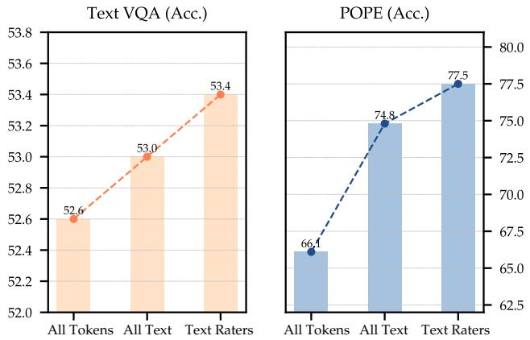
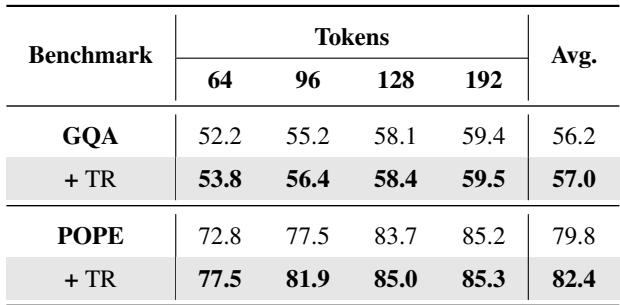
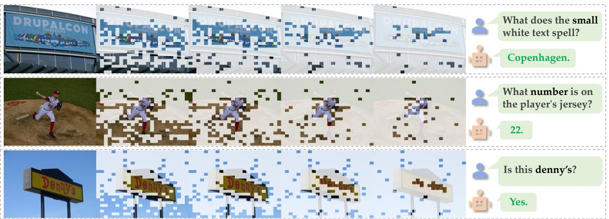

[← 返回 README](../README.md)

# 5. Analysis

## 📌 预览
消融实验分析四个方面：Text Rater 选择的效果、Token Recycling 的效果、计算效率、可视化分析。

---

## 5.1. Relevant Text Token Selection

We propose a selection mechanism to localize visually irrelevant text tokens to limit their negative effects in rating the significance of vision tokens. Here we conduct experiments to analyze the effects of the mechanism in Figure 5. Under the same number of vision tokens (64), we have 3 settings (using all tokens, only text tokens, and only text raters we select) with LLaVA (Liu et al., 2024a) to judge vision token candidates. In TextVQA (Singh et al., 2019), by building upon the text-aware manner, our mechanism improves the baseline (all tokens) by 0.8%, which validates that our extra selection is effective. Besides, we further outperform the vanilla text-aware method (only text tokens) by 2.7% on POPE (Li et al., 2023b). The huge margin means POPE sparsification is quite sensitive to question prompts, and text guidance is necessary. In summary, text rater selection is general and improves the performance across scenarios.

*Figure 5. The ablation study of text raters on LLaVA 7B.*

> 💡 **Figure 5 批读** (Text Rater 消融):
> - 三种设置对比（64 tokens）:
>   1. All tokens → 基线
>   2. Only text tokens → text-aware 但不筛选
>   3. Text raters (ours) → 筛选后的 text-aware
> - TextVQA: raters 比 all tokens 提升 **0.8%**
> - POPE: raters 比 only text 提升 **2.7%** → POPE 对 prompt 敏感
> - 结论：筛选 text rater 是通用有效的

---

## 5.2. Recycling of Pruned Tokens

To validate the effectiveness of our token recycling strategy, we perform ablation experiments on the LLaVA model (Liu et al., 2024a). The results are presented in Table 4. Across multiple sparsity ratios (64, 96, 128, 192), our algorithm achieves a significant average performance improvement of 1.2% and 7.2% on TextVQA (Singh et al., 2019) and POPE (Li et al., 2023b), respectively. Notably, as the number of pruned vision tokens increases, the benefit brought by our recycling method increases. For instance, when pruning from 192 to 64 tokens, the pruned token recycling significantly boosts the accuracy from 1.5% to 17.7% on POPE. We argue that when the size of the deleted pool grows, the amount of lost information increases. Our method effectively recycles the lost information and compresses it into few slots using the proposed reconstruction mechanism.

*Table 4. Ablation study on token reconstruction (TR). Experiments are conducted on GQA and POPE on LLaVA 7B.*

> 💡 **Table 4 批读** (Token Recycling 消融):
> - GQA: +TR 平均提升 **0.8%** (56.2→57.0)
> - POPE: +TR 平均提升 **2.6%** (79.8→82.4)
> - **关键发现**: 裁剪越多，recycling 收益越大
>   - 192 tokens: POPE +0.1%
>   - 64 tokens: POPE **+4.7%** (72.8→77.5)
> - 说明：裁剪越激进，丢失信息越多，recycling 的价值越大

---

## 5.3. Computational Efficiency

SparseVLM affords significant efficiency and storage gains for the inference process. We conduct a comparative analysis of CUDA time, and FLOPs on LLaVA-7B, and compare our method with the baseline method and FastV (Chen et al., 2024a). As displayed in Table 1, we conduct an inference efficiency analysis on a single NVIDIA A100-80GB with identical lengths of text prompts and single-image inputs. Compared to the baseline model, SparseVLM achieves a significant reduction of 43.1% in CUDA time and 62.8% in FLOPs while keeping 96.7% accuracy. Despite SparseVLM has a minimal overhead to calculate text raters and cluster-pruned vision tokens, it leads to fewer than FastV tokens with comparable accuracy. Additionally, SparseVLM saves 67% cache memory compared to vanilla LLaVA (where 302.4MB is reduced to 100.8MB), while keeping 99.1% accuracy. More efficiency visualization (e.g., efficiency on VideoLLaVA) can be found in the Appendix G.

> 💡 **效率分析**:
> | 指标 | 数值 |
> |------|------|
> | CUDA time 减少 | 43.1% |
> | FLOPs 减少 | 62.8% |
> | 精度保持 | 96.7% |
> | KV Cache 减少 | 67% (302.4→100.8 MB) |
> | 精度保持 (192 tokens) | 99.1% |

---

## 5.4. Qualitative Visualization

As shown in Figure 6, we visualize SparseVLM on various VQA questions. From left to right, we visualize the results after we apply token pruning to different layers. As the number of layers increases, more tokens are pruned and the Region of Interest (ROI) is gradually refined. The model systematically reduces less relevant image information while retaining key tokens closely tied to the question. The visualization reveals that SparseVLM, although discarding some overall image details, effectively retains essential visual tokens. These preserved tokens encapsulate the features necessary for answering the question, focusing on more relevant visual regions through their interaction with the question. More cases are in the Appendix H.

*Figure 6. Visualization of SparseVLM on different VQA prompts. From left to right, the visual representation becomes increasingly sparse, leaving fewer vision tokens. Best viewed in color.*

> 💡 **Figure 6 批读**:
> - 从左到右：逐层裁剪后的视觉 token 可视化
> - ROI 逐渐细化到与问题相关的区域
> - 说明 SparseVLM 确实在做"文本引导的注意力聚焦"
> - 不同问题 → 不同的保留区域 → text-aware 得到验证

---

## 🔖 Section 总结

### 核心洞察
1. **Text Rater 选择有效**: 比全 token / 纯文本 token 方案都更好
2. **Token Recycling 关键**: 高压缩率下收益显著（POPE +4.7% at 64 tokens）
3. **效率显著**: CUDA time -43%, FLOPs -63%, KV Cache -67%
4. **可视化验证**: SparseVLM 确实根据问题聚焦不同视觉区域
