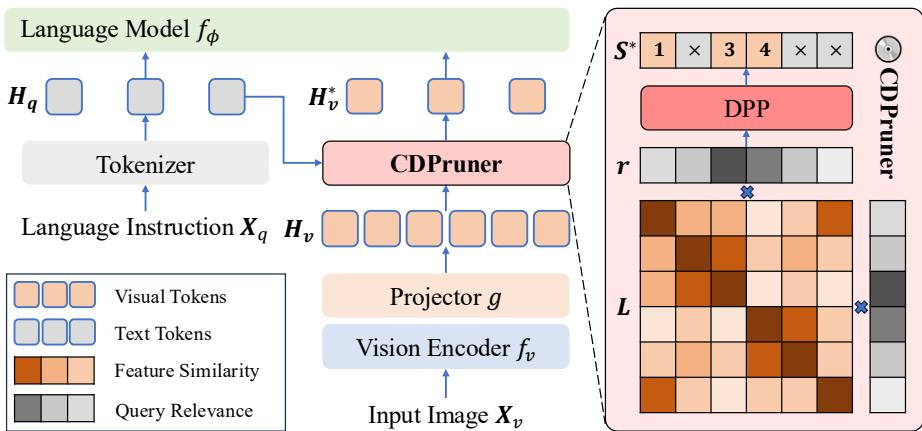
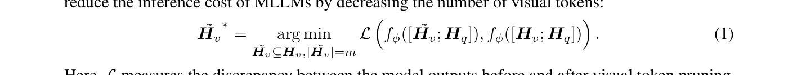
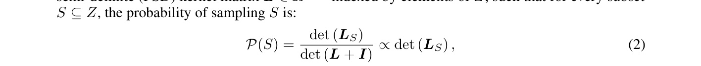
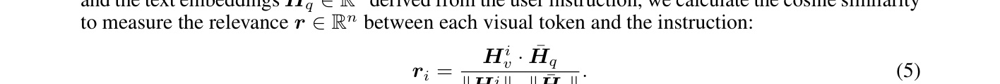
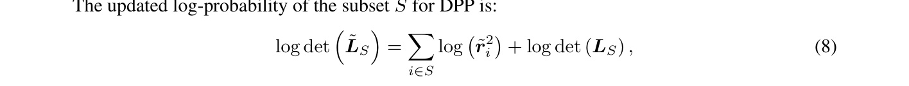

[← 返回 README](../README.md)

# 3 Method

## 📌 预览
Method 分四部分：3.1 回顾 visual token pruning 问题定义；3.2 用 DPP 建模 token 多样性；3.3 计算指令相关性；3.4 将两者融合得到 CDPruner。核心公式是条件 kernel 矩阵。

---

In this section, we first review visual token pruning in MLLMs in Section 3.1. Then, we model the feature similarity among visual tokens and their relevance to user instructions in Section 3.2 and Section 3.3. Finally, we present our CDPruner in Section 3.4, which maximizes the conditional diversity to obtain the optimal token subset. The overall design of CDPruner is shown in Figure 2.

*Figure 2: Overview of CDPruner. We first calculate the similarity between visual tokens conditioned on their relevance to the current instruction. Then, CDPruner uses a DPP to select the subset to keep. As a training-free and model-agnostic method, it ensures both the diversity and quality of the selected token subset, significantly reducing computational cost while maintaining considerable performance.*

> 💡 **Figure 2 批读**:
> - 流程：Image → Visual Encoder → Visual Tokens → CDPruner → Pruned Tokens → LLM
> - CDPruner 的输入：visual tokens $H_v$ + instruction embedding $\bar{H}_q$
> - CDPruner 的输出：选中的 token 子集
> - 关键：在 visual encoder 之后、LLM 之前做剪枝

---

## 3.1 Visual token pruning

> 💡 **3.1 要点预览**: 形式化定义 token pruning 问题——从 n 个 token 中选 m 个，使模型输出差异最小。

Existing MLLMs [Liu et al., 2024a, Wang et al., 2024, Chen et al., 2024c] typically consist of three core components: a vision encoder $f_v$, a multimodal projector $g$, and an LLM $f_\phi$. The vision encoder encodes the input image $X_v$ into a sequence of visual tokens $H_v = g(f_v(X_v)) \in \mathbb{R}^{n \times d}$, whose length is significantly greater than that of their textual counterparts $H_q$. Visual token pruning aims to reduce the inference cost of MLLMs by decreasing the number of visual tokens:

> 💡 **Eq. 1 批读**:
> - 目标：从 n 个 visual tokens 中选 m 个子集 $\tilde{H}_v$，使 pruning 后的 LLM 输出与原始输出尽可能接近
> - $\mathcal{L}$ 衡量 pruning 前后输出差异
> - 这是一个组合优化问题：从 n 中选 m，搜索空间为 $C(n,m)$

Here, $\mathcal{L}$ measures the discrepancy between the model outputs before and after visual token pruning, and $m$ is the number of visual tokens retained ($m < n$). Previous methods mainly rely on attention scores for pruning [Chen et al., 2024a, Xing et al., 2024, Zhang et al., 2024c, Shang et al., 2024, Yang et al., 2024b], which often leads to significant redundancy. Alvar et al. [2025] formulates the subset selection problem as a Max-Min Diversity Problem (MMDP) [Porumbel et al., 2011], but this approach overly focuses on extreme cases while neglecting global diversity.

> 💡 **现有方法的问题**:
> - Attention-based: 高 attention 的 token 往往集中在同一区域 → 冗余
> - MMDP (DivPrune): 最大化最小 pairwise 距离 → 只关注"最不相似"的 pair，忽略全局

---

## 3.2 DPP with token similarity

> 💡 **3.2 要点预览**: 用 DPP 建模 token 子集的多样性——子集被选中的概率正比于其 kernel 子矩阵的行列式。

DPP was initially introduced to model fermion repulsion in quantum physics [Macchi, 1975], and has been widely applied in list-wise diversity modeling [Chen et al., 2018, Celis et al., 2018, Sun et al., 2025]. Formally, a DPP $\mathcal{P}$ on a discrete set $Z = \{1, 2, \dots, n\}$ is a probability measure defined on the power set $2^Z$. When $\mathcal{P}$ gives nonzero probability to the empty set, there exists a positive semi-definite (PSD) kernel matrix $L \in \mathbb{R}^{n \times n}$ indexed by elements of $Z$, such that for every subset $S \subseteq Z$, the probability of sampling $S$ is:

> 💡 **Eq. 2 批读**:
> - DPP 的核心公式：子集 S 被选中的概率 ∝ det($L_S$)
> - $L_S$ 是 kernel 矩阵 $L$ 对应子集 S 的主子矩阵
> - **直觉**：行列式衡量的是向量组的"体积"，越多样的子集"体积"越大，被选中概率越高
> - 如果子集中两个 token 很相似 → 对应行/列几乎相同 → 行列式趋近 0 → 概率很低

where $L_S$ is the principal submatrix of $L$ corresponding to the subset $S$.

In the context of token pruning, we leverage DPP to model the diversity of the retained visual token subset. Given a sequence of visual tokens $H_v$, the kernel matrix $L$ is defined by the pairwise cosine similarity of visual features:

> 💡 **Eq. 3 批读**: Kernel 矩阵的每个元素是两个 visual token 的余弦相似度。

According to the DPP sampling process, the optimal subset $\tilde{H_v}^*$ is given by:

> 💡 **Eq. 4 批读**:
> - MAP inference：找使 det($L_S$) 最大的 size-m 子集
> - 这是 NP-hard 问题，但有贪心近似算法（保证 $1-1/e$ 近似比）
> - 注意：这里只考虑了 token 间的相似度，没有考虑指令 → 下一节补上

---

## 3.3 Instruction relevance

> 💡 **3.3 要点预览**: 引入指令相关性，使剪枝能根据不同问题动态调整。

The above only considers the feature similarity among visual tokens, resulting in the same pruning result regardless of user instructions. We further introduce instruction relevance as a condition to achieve dynamic pruning. Given the visual embeddings $H_v \in \mathbb{R}^{n \times d}$ extracted from the input image and the text embeddings $\bar{H}_q \in \mathbb{R}^d$ derived from the user instruction, we calculate the cosine similarity to measure the relevance $r \in \mathbb{R}^n$ between each visual token and the instruction:

> 💡 **Eq. 5 批读**:
> - 对每个 visual token 计算与指令的余弦相似度作为"相关性分数"
> - $\bar{H}_q$ 是指令的 embedding（一个向量），$H_v^i$ 是第 i 个 visual token
> - 相关性高的 token 更可能与当前问题有关

For MLLMs [Liu et al., 2023, 2024b, Li et al., 2024a] that employ visual encoders paired with corresponding text encoders (e.g., CLIP [Radford et al., 2021] and SigLIP [Zhai et al., 2023]), we use features extracted from both as visual and text embeddings, respectively. For MLLMs [Bai et al., 2025, Zhu et al., 2025] only contain dedicated visual encoders, we instead use the output of the multimodal projector as the visual embeddings, and take the average of all token embeddings corresponding to the instruction from the language model as the text embedding. For simplicity, we denote the visual and text embeddings obtained through both ways as $H_v$ and $\bar{H}_q$.

> 💡 **两种获取 embedding 的方式**:
> | MLLM 类型 | Visual Embedding | Text Embedding |
> |-----------|-----------------|----------------|
> | 有配对 text encoder（LLaVA 系列用 CLIP/SigLIP） | Visual encoder 输出 | Text encoder 输出 |
> | 只有 visual encoder（Qwen2.5-VL, InternVL3） | Projector 输出 | LLM 中 instruction token 的平均 |

*Figure 3: Visualization of relevance scores. We compute the relevance scores for several samples from the POPE benchmark using LLaVA-1.5-7B, with the instruction following the template: "Is there a {object} in the image?" Red indicates high relevance, while blue indicates low relevance.*

> 💡 **Figure 3 批读**:
> - 红色 = 高相关性，蓝色 = 低相关性
> - 问"有没有 dog" → 狗的区域高亮；问"有没有 bench" → 长椅区域高亮
> - 说明 CLIP 的 text-visual 对齐已经能很好地捕捉指令-图像区域的对应关系
> - 这是 CDPruner 能做"动态剪枝"的基础

Furthermore, we apply min-max normalization to the obtained relevance scores to ensure the values are within the range of 0 to 1:

> 💡 **Eq. 6 批读**: 简单的 min-max 归一化，把相关性分数映射到 [0, 1]。

---

## 3.4 CDPruner

> 💡 **3.4 要点预览**: 将特征相似度和指令相关性整合——用相关性分数调制 kernel 矩阵，得到"条件 kernel"。

Finally, we integrate feature similarity and instruction relevance for visual token pruning, leading to our proposed CDPruner, as shown in Figure 2. Specifically, we modulate the original kernel matrix with the relevance scores to obtain a new conditional kernel matrix:

> 💡 **Eq. 7 批读**:
> - **核心公式！** $\tilde{L} = \text{diag}(\tilde{r}) \cdot L \cdot \text{diag}(\tilde{r})$
> - 直觉：用相关性分数对 kernel 矩阵做"加权"
> - $\tilde{L}_{ij} = \tilde{r}_i \cdot L_{ij} \cdot \tilde{r}_j$
> - 效果：相关性低的 token 对应的行列值被缩小 → 不太可能被选中

The updated log-probability of the subset $S$ for DPP is:

> 💡 **Eq. 8 批读**:
> - 取 log 后，条件 kernel 的行列式 = 相关性项 + 多样性项
> - $\log \det(\tilde{L}_S) = \sum_{i \in S} \log(\tilde{r}_i^2) + \log \det(L_S)$
> - **第一项**：相关性越高的 token，log($\tilde{r}_i^2$) 越大 → 倾向选相关 token
> - **第二项**：原始 DPP 的多样性项 → 倾向选多样 token
> - 两项自然地统一在一个目标函数中

which jointly considers both feature similarity and instruction relevance of the retained visual tokens.

We then obtain the optimal subset via MAP inference. Although MAP inference for DPP is NP-hard, there exists a greedy algorithm with polynomial-time complexity that guarantees a $(1 - 1/e)$ approximation [Chen et al., 2018]. By using Cholesky decomposition, the overall time complexity can be reduced to $\mathcal{O}(nm^2)$. The additional latency is negligible when $m \ll n$, with less than 10ms per sample. The pseudocode for algorithm implementation is provided in the supplementary material.

> 💡 **算法复杂度**:
> - MAP inference 是 NP-hard，但贪心算法有 $(1-1/e) \approx 63\%$ 的近似保证
> - Cholesky 分解优化后复杂度 $O(nm^2)$
> - 实际额外延迟 < 10ms/样本（CUDA 并行化后）

---

## 🔖 Section 总结

### 关键公式速查
| 公式 | 含义 |
|------|------|
| Eq. 1 | Token pruning 目标函数 |
| Eq. 2 | DPP 概率：$P(S) \propto \det(L_S)$ |
| Eq. 3 | Kernel 矩阵：cosine similarity |
| Eq. 5 | 指令相关性：visual-text cosine similarity |
| **Eq. 7** | **条件 kernel：$\tilde{L} = \text{diag}(\tilde{r}) \cdot L \cdot \text{diag}(\tilde{r})$** |
| Eq. 8 | Log-det 分解为 relevance + diversity |

### 核心洞察
1. DPP 的行列式天然地惩罚相似 token → 实现多样性
2. 用相关性分数调制 kernel 矩阵 → 优雅地将指令融入多样性建模
3. 贪心算法 + Cholesky 分解让计算可行，额外开销可忽略
