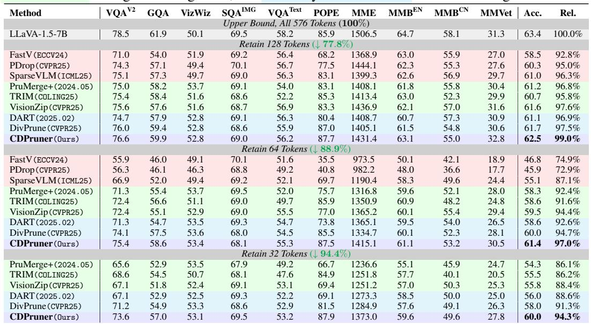
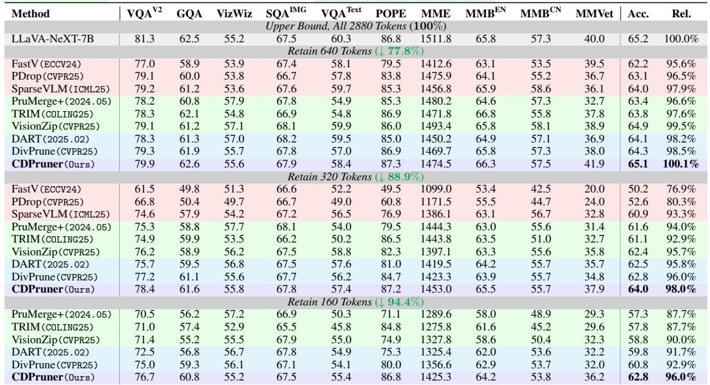
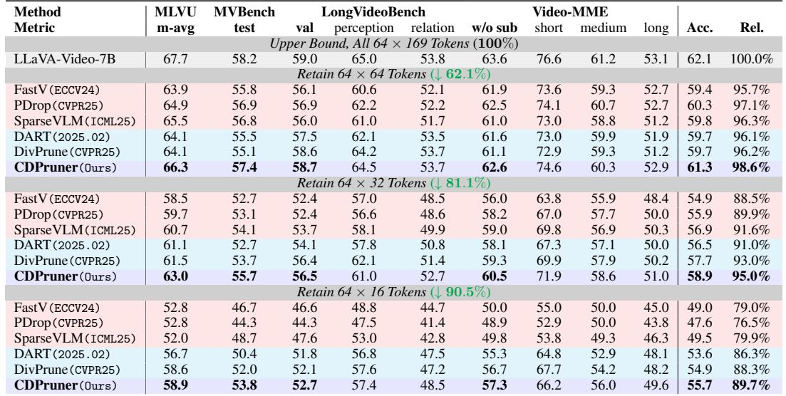
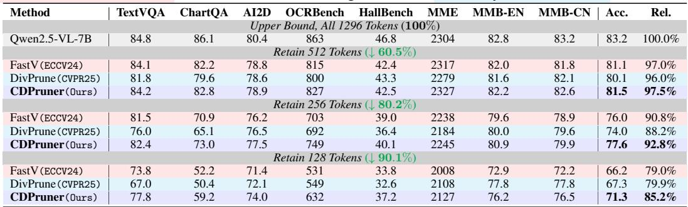
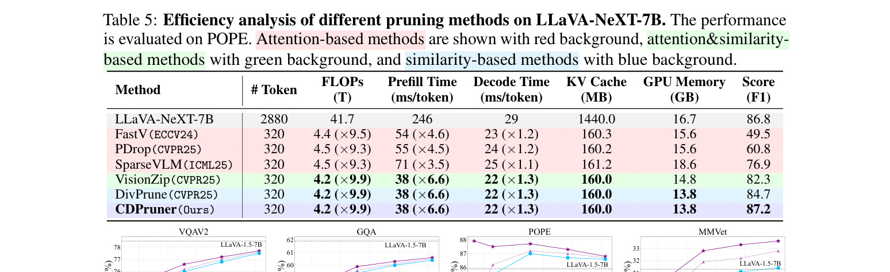
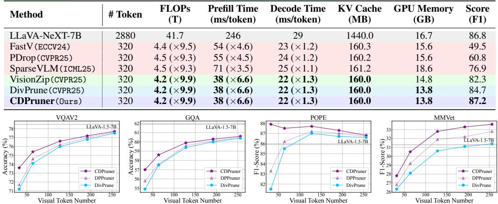

[← 返回 README](../README.md)

# 4 Experiments

## 📌 预览
实验涵盖 LLaVA-1.5、LLaVA-NeXT（高分辨率）、LLaVA-Video（视频）和 Qwen2.5-VL（先进架构）四种模型，在 14 个图像 benchmark 和 4 个视频 benchmark 上评测。CDPruner 在所有设置下均 SOTA，尤其在高压缩比时优势显著。

---

## 4.1 Experimental setup

> 💡 **4.1 要点预览**: 实验配置概览——模型、benchmark、对比方法。

**Model architectures.** We apply CDPruner to various MLLM architectures, including the LLaVA series such as LLaVA-1.5 [Liu et al., 2024a] for image understanding, LLaVA-NeXT [Liu et al., 2024b] for high-resolution inputs, and LLaVA-Video [Zhang et al., 2024d] for video understanding, as well as the current state-of-the-art open-source model Qwen2.5-VL [Bai et al., 2025]. Additional results on more model architectures are provided in the supplementary material.

**Evaluation benchmarks.** We evaluate our method on 14 image-based multimodal benchmarks, including 10 general VQA tasks such as VQAv2 [Goyal et al., 2017], GQA [Hudson and Manning, 2019], VizWiz [Gurari et al., 2018], ScienceQA-IMG [Lu et al., 2022], HallBench [Guan et al., 2024], POPE [Li et al., 2023], MME [Fu et al., 2024a], MMBench [Liu et al., 2025], MMBench-CN [Liu et al., 2025] and MM-Vet [Yu et al., 2023], and 4 text-oriented VQA tasks such as TextVQA [Singh et al., 2019], ChartQA [Masry et al., 2022], AI2D [Kembhavi et al., 2016] and OCRBench [Liu et al., 2024d]. We also conduct experiments on 4 widely-used video understanding benchmarks, including MLVU [Zhou et al., 2024], MVBench [Li et al., 2024b], LongVideoBench [Wu et al., 2024] and Video-MME [Fu et al., 2024b]. All experiments on these benchmarks follow the default settings and evaluation metrics. Detailed descriptions of each task are provided in the supplementary material.

**Comparison methods.** We choose several recent works of different types as comparison methods, including attention-based methods like FastV [Chen et al., 2024a], PyramidDrop [Xing et al., 2024] and SparseVLM [Zhang et al., 2024c], attention&similarity-based methods like LLaVA-Prumerge [Shang et al., 2024], TRIM [Song et al., 2024] and VisionZip [Yang et al., 2024b], as well as similarity-based methods like DART [Wen et al., 2025b] and DivPrune [Alvar et al., 2025].

> 💡 **实验设计亮点**:
> - 4 种不同架构的 MLLM（覆盖面广）
> - 18 个 benchmark（图像 + 视频 + OCR）
> - 8 种对比方法，覆盖 3 类 pruning 策略

---

## 4.2 Main results

> 💡 **4.2 要点预览**: LLaVA-1.5-7B 上的主实验，CDPruner 在所有压缩比下显著领先。

We first apply CDPruner to LLaVA-1.5, which is widely adopted for evaluating visual token pruning strategies. Table 1 presents the performance of different pruning methods on the LLaVA-1.5-7B model when retaining only 128, 64, or 32 visual tokens.

*Table 1: Performance comparison of different pruning methods on LLaVA-1.5-7B. Acc. denotes the average performance across 10 benchmarks, Rel. represents the average percentage of performance maintained. Attention-based methods are shown with red background, attention&similarity-based methods with green background, and similarity-based methods with blue background.*

> 💡 **Table 1 批读**:
> - **128 tokens (↓77.8%)**: CDPruner 保留 99.0% 性能，超 VisionZip 1.4%
> - **64 tokens (↓88.9%)**: Attention-based 方法暴跌 >25%，CDPruner 仅降 3.4%
> - **32 tokens (↓94.4%)**: CDPruner 保留 94.3%，超 DivPrune 3%
> - 压缩比越高，CDPruner 的优势越明显
> - **POPE 上 CDPruner 甚至超过未剪枝模型**——说明适当剪枝可减少幻觉

With 77.8% of tokens pruned, CDPruner remarkably maintains nearly all the original performance, surpassing VisionZip by 1.4%. When the number of visual tokens further decreases to 64, roughly one-tenth of the original token length, attention-based pruning methods exhibit significant performance degradation of over 25%, indicating that internal text-visual attention within the language model is not an ideal metric for pruning. Under the same reduction ratio, CDPruner only decreases the original performance by 3.4%, outperforming VisionZip and DivPrune by 2.6% and 2.3%, respectively. With only 5.6% of visual tokens retained, attention and similarity-based methods also encounter noticeable performance degradation because, despite selecting relatively important tokens, they include excessive redundancy and duplication. In this scenario, CDPruner still maintains 94.3% of the original performance, significantly outperforming the best similarity-based method, DivPrune, by 3%, which fully demonstrates its effectiveness.

Among all 10 benchmarks, CDPruner achieves particularly strong performance on POPE [Li et al., 2023], even exceeding the unpruned original LLaVA-1.5 model. Since POPE is specifically designed to evaluate visual hallucination, this result suggests that appropriate pruning may help mitigate hallucination in MLLMs, which we believe is a valuable direction for future research. On the other hand, CDPruner shows limited advantage on VizWiz [Gurari et al., 2018], primarily because questions in this benchmark often lack informative context (e.g., "What is this?"), making them insufficiently effective as conditional guidance for the DPP process.

> 💡 **两个有趣发现**:
> 1. **POPE 上超过未剪枝模型**：剪掉冗余 token 反而减少幻觉，因为模型不再被无关视觉信息干扰
> 2. **VizWiz 上优势不明显**：该数据集的问题太模糊（如 "What is this?"），指令相关性分数区分度不够

---

## 4.3 CDPruner for high resolution inputs

> 💡 **4.3 要点预览**: 高分辨率场景下视觉冗余更多，CDPruner 优势更大。

Increasing the resolution of input images can improve the performance of MLLMs, but this improvement comes with substantial computational overhead. Higher resolutions introduce more visual tokens, inherently increasing redundancy and thus making it more suitable for pruning. To evaluate this, we apply CDPruner to LLaVA-NeXT, a model specifically designed for handling high-resolution inputs. To ensure a fair comparison by controlling the number of visual tokens, we fix the input resolution to 672×672, resulting in 2,880 visual tokens.

*Table 2: Performance comparison of different pruning methods on LLaVA-NeXT-7B. Acc. denotes the average performance across 10 benchmarks, Rel. represents the average percentage of performance maintained.*

> 💡 **Table 2 批读**:
> - **640 tokens (↓77.8%)**: CDPruner **100.1%** — 居然超过原模型！说明 2880 个 token 中有大量冗余
> - **320 tokens (↓88.9%)**: 98.0%，超 DivPrune 2.0%
> - **160 tokens (↓94.4%)**: 96.0%，超 DivPrune 3.1%
> - 高分辨率下冗余更严重，CDPruner 的条件多样性选择效果更好

As shown in Table 2, with 77.8% of tokens pruned, CDPruner maintains performance comparable to, or slightly better than, the original LLaVA-NeXT, demonstrating the higher visual redundancy in high-resolution scenarios. As the reduction ratio further increases to 88.9% and 94.4%, CDPruner still retains up to 98% and 96% of the original performance, outperforming the second-best DivPrune by 2% and 3.1%, respectively. These results highlight the strong effectiveness of CDPruner in high-resolution contexts.

---

## 4.4 CDPruner for video understanding

> 💡 **4.4 要点预览**: 视频场景下帧间冗余极高，CDPruner 同样有效。

Video understanding is another task with high visual redundancy. To validate CDPruner in such a scenario, we apply it to LLaVA-Video, an advanced video MLLM. We set the maximum number of video frames to 64, each with a resolution of 384×384, resulting in over 10k tokens and considerable visual redundancy.

*Table 3: Performance comparison of different pruning methods on LLaVA-Video-7B with 64 frames per video. Acc. denotes the average accuracy across 4 video-based benchmarks, and Rel. represents the average percentage of performance maintained.*

> 💡 **Table 3 批读**:
> - **64×64 tokens (↓62.1%)**: CDPruner 98.6%，超 PDrop 1.5%
> - **64×32 tokens (↓81.1%)**: CDPruner 95.0%，超 DivPrune 2.0%
> - **64×16 tokens (↓90.5%)**: CDPruner 89.7%，超 SparseVLM 10%
> - 视频场景下的极端压缩比（每帧仅 16 token），text-based 方法崩溃，CDPruner 仍稳健

As demonstrated in Table 3, with 62.1% of visual tokens pruned, CDPruner maintains 98.6% of the original performance, outperforming PDrop by 1.5%. As the reduction ratio increases to 81.1%, CDPruner still preserves 95% performance, significantly exceeding DivPrune's 93%. Furthermore, when only 16 visual tokens are retained per frame, text-based methods exhibit substantial performance degradation, while CDPruner is able to maintain 89.7% performance, showing a substantial 10% improvement over SparseVLM. These results adequately demonstrate the effectiveness of CDPruner in video understanding applications.

---

## 4.5 CDPruner for advanced architectures

> 💡 **4.5 要点预览**: 在 Qwen2.5-VL 这种已内置 token 压缩的先进模型上，CDPruner 仍然有效。

In addition to the LLaVA series, we further apply CDPruner to the most advanced open-source MLLM architectures to validate its generalizability. Here, we select Qwen2.5-VL as a representative model, with the input resolution fixed at 1008×1008, yielding 1,296 visual tokens. Due to the unique structure of its visual encoder and multimodal projector, pruning methods that require the [cls] token are no longer applicable. Therefore, we compare CDPruner only against representative methods from the other two categories, attention-based FastV and similarity-based DivPrune, with results summarized in Table 4.

*Table 4: Performance comparison of different pruning methods on Qwen2.5-VL-7B. Acc. denotes the average accuracy, Rel. represents the average percentage of performance maintained.*

> 💡 **Table 4 批读**:
> - Qwen2.5-VL 的 projector 已经做过 token 压缩 → 进一步剪枝更难
> - **512 tokens (↓60.5%)**: CDPruner 97.5%, FastV 97.0%
> - **256 tokens (↓80.2%)**: CDPruner 92.8%, FastV 90.8%
> - **128 tokens (↓90.1%)**: CDPruner 85.2%, DivPrune 79.9% — 差距 5.3%！
> - 说明在已经预压缩的模型上，条件多样性的优势更大

Compared to the LLaVA series, Qwen2.5-VL exhibits a more noticeable performance drop after pruning. This is because visual tokens are already compressed within its projector. Nevertheless, CDPruner consistently outperforms other methods under the same reduction ratios. With 60.5% and 80.2% of tokens pruned, CDPruner retains 97.5% and 92.8% of the original performance, surpassing the second-best FastV by 0.5% and 2.0%, respectively. When only 128 visual tokens remained, competing methods suffer from severe performance degradation. In contrast, CDPruner maintains 85.2% of the original performance, significantly higher than DivPrune's 79.9%, demonstrating the strong generalizability of CDPruner on advanced MLLM architectures.

---

## 4.6 Efficiency analysis

> 💡 **4.6 要点预览**: 实际加速效果——FLOPs ×10 减少，延迟 ×6.6 减少。

To demonstrate the efficiency of CDPruner, we conduct a comparative analysis against other pruning methods in terms of FLOPs, CUDA latency, KV cache, and GPU memory on the high-resolution MLLM LLaVA-NeXT-7B. All experiments are performed on a single NVIDIA A100-80GB GPU. We choose POPE for evaluating inference efficiency, as it contains questions of similar length and happens to contain only one prefill and one decode stage.

*Table 5: Efficiency analysis of different pruning methods on LLaVA-NeXT-7B. The performance is evaluated on POPE.*

> 💡 **Table 5 批读**:
> | 指标 | 原始 (2880 tokens) | CDPruner (320 tokens) | 加速比 |
> |------|-------------------|----------------------|--------|
> | FLOPs | 19.4T | 2.0T | **×10** |
> | Prefill 延迟 | 162ms | 25ms | **×6.6** |
> | Decode 延迟 | 24ms | 18ms | **×1.3** |
> | KV Cache | 2250MB | 250MB | **×9** |
> | GPU Memory | 17.8GB | 15.2GB | ↓17% |
> | POPE F1 | 86.8 | 87.3 | **+0.5!** |
>
> CDPruner 在所有效率指标上都最优，同时性能最高。

As shown in Table 5, when the number of visual tokens is reduced from 2,880 to 320, CDPruner achieves nearly a ×10 reduction in FLOPs. Regarding CUDA latency, CDPruner reduces the time for prefill and decode stages by ×6.6 and ×1.3, respectively, significantly improving real-world inference efficiency. In addition to runtime latency, CDPruner also reduces KV cache and GPU memory. Compared to all other pruning methods, CDPruner consistently achieves the best efficiency while maintaining the highest performance.

---

## 4.7 Ablation study

> 💡 **4.7 要点预览**: 消融实验验证 DPP 优于 MMDP，指令相关性条件进一步提升性能。

We further conduct an ablation on the design of CDPruner, as illustrated in Figure 4. We compare the performance of different pruning strategies on LLaVA-1.5-7B across four benchmarks, under varying numbers of visual tokens. Here, DPPruner refers to a variant that directly applies DPP to visual token pruning without any condition.

*Figure 4: Ablation study of CDPruner design. DPPruner denotes applying DPP to visual token pruning without conditioning on instruction relevance, as a degraded variant of CDPruner.*

> 💡 **Figure 4 批读**:
> - **DivPrune (MMDP)** < **DPPruner (DPP without condition)** < **CDPruner (DPP + condition)**
> - 第一步提升：DPP 的全局多样性建模优于 MMDP
> - 第二步提升：加入指令相关性条件后，进一步提升
> - 在 POPE 上效果最明显（因为 POPE 的问题指向性很强）
> - 在不同 token 数量下，CDPruner 始终最优

This version consistently outperforms DivPrune, demonstrating that the global modeling of token diversity via DPP is more effective than MMDP. When instruction relevance is further incorporated as a condition, CDPruner achieves additional performance gains, validating the benefit of jointly modeling feature similarity and instruction relevance.

---

## 🔖 Section 总结

### 关键数字速查
| 模型 | 压缩比 | CDPruner 性能保留 | vs 第二名 |
|------|--------|------------------|-----------|
| LLaVA-1.5-7B | ↓88.9% (64 tokens) | 97.0% | +2.3% vs DivPrune |
| LLaVA-1.5-7B | ↓94.4% (32 tokens) | 94.3% | +3.0% vs DivPrune |
| LLaVA-NeXT-7B | ↓77.8% (640 tokens) | 100.1% | +0.6% vs VisionZip |
| LLaVA-NeXT-7B | ↓94.4% (160 tokens) | 96.0% | +3.1% vs DivPrune |
| LLaVA-Video-7B | ↓90.5% (64×16) | 89.7% | +1.4% vs DivPrune |
| Qwen2.5-VL-7B | ↓90.1% (128 tokens) | 85.2% | +5.3% vs DivPrune |

### 核心洞察
1. 压缩比越高，CDPruner 的优势越明显（条件多样性在极端情况下价值最大）
2. 高分辨率/视频场景冗余更多，CDPruner 效果更好
3. 适当剪枝可减少幻觉（POPE 上超过未剪枝模型）
4. DPP > MMDP，+ 指令条件后进一步提升
