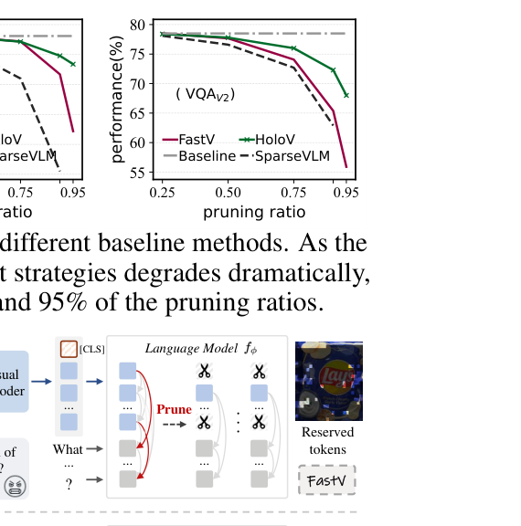
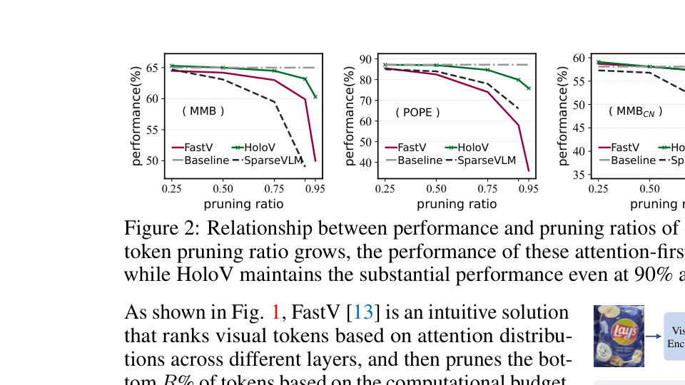

[← 返回 README](../README.md)

# Abstract

## 📌 预览

HoloV 的核心论点：现有 attention-first 剪枝方法保留的是语义相似的"高亮 token"，导致高剪枝率下性能骤降。HoloV 通过 crop-wise 自适应分配，保留全局视觉上下文。

---

Despite their powerful capabilities, Multimodal Large Language Models (MLLMs) suffer from considerable computational overhead due to their reliance on massive visual tokens. Recent studies have explored token pruning to alleviate this problem, which typically uses text-vision cross-attention or [CLS] attention to assess and discard redundant visual tokens.

> 💡 **背景**: MLLMs 的计算瓶颈来自大量视觉 token。现有方法用 attention 分数来决定哪些 token 重要、哪些冗余。

In this work, we identify a critical limitation of such attention-first pruning approaches, i.e., they tend to preserve semantically similar tokens, resulting in pronounced performance drops under high pruning ratios.

> 💡 **核心发现**: Attention-first 方法的致命缺陷——它倾向于保留**语义相似**的 token（因为相似 token 的 attention 也相似），导致信息冗余。剪枝率一高，性能就崩。

To this end, we propose HoloV, a simple yet effective, plug-and-play visual token pruning framework for efficient inference. Distinct from previous attention-first schemes, HoloV rethinks token retention from a holistic perspective. By adaptively distributing the pruning budget across different spatial crops, HoloV ensures that the retained tokens capture the global visual context rather than isolated salient features. This strategy minimizes representational collapse and maintains task-relevant information even under aggressive pruning.

> 💡 **方法概述**: HoloV 的核心思想是"空间均匀采样 + 局部显著性"：
> - 把图像 token 分成多个 crops
> - 每个 crop 按重要性分配剪枝配额（不是全局 top-k）
> - 这样每个区域都能保留一些 token，避免全局 attention 偏差导致的"赢者通吃"

Experimental results demonstrate that our HoloV achieves superior performance across various tasks, MLLM architectures, and pruning ratios compared to SOTA methods. For instance, LLaVA1.5 equipped with HoloV preserves 95.8% of the original performance after pruning 88.9% of visual tokens, achieving superior efficiency-accuracy trade-offs.

> 💡 **关键数字**: 88.9% 剪枝率（576→64 tokens）下保留 95.8% 性能。这是非常激进的剪枝，基本上只剩 1/9 的 token。

---

*Figure 1: Snapshots of FastV and our HoloV.*

> 💡 **Figure 1 批读**: 
> - FastV 保留的 token（彩色区域）集中在图像的边缘/角落——这就是位置偏置的直观表现
> - HoloV 保留的 token 分布更均匀，覆盖了图像的不同语义区域

*Figure 2: Relationship between performance and pruning ratios of different baseline methods.*

> 💡 **Figure 2 批读**:
> - 四个 benchmark 上，随着剪枝率从 0.25→0.95，FastV 和 SparseVLM 的性能骤降
> - HoloV 在高剪枝率（0.90, 0.95）下仍保持稳定，曲线平坦
> - 这是论文的核心卖点图——高剪枝率下的鲁棒性

---

## 🔖 Section 总结

### 核心洞察
1. Attention-first pruning 在高剪枝率下失效，因为保留的都是语义相似的 token
2. HoloV 通过 crop-wise 分配实现全局上下文保留
3. 88.9% 剪枝 → 95.8% 性能保留，plug-and-play
