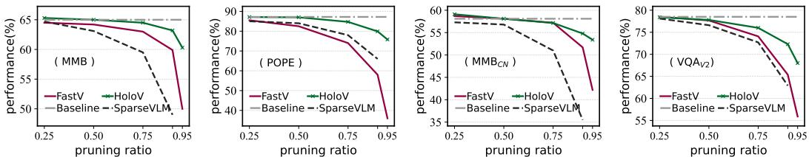
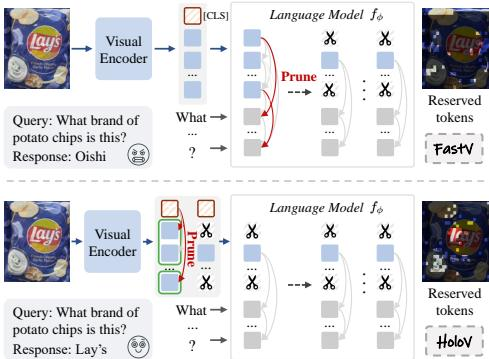
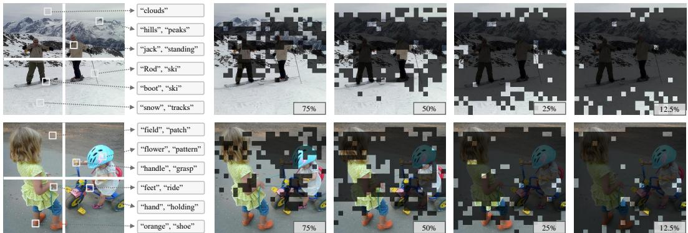

[← 返回 README](../README.md)

# 1 Introduction

## 📌 预览

Introduction 从 MLLM 的视觉 token 冗余问题出发，指出现有 attention-based 剪枝方法的三大缺陷：信息冗余、位置偏差、注意力弥散。受认知科学启发，提出 HoloV 的核心思想——保留全局语义连通性而非仅追逐高 attention token。

---

Multimodal Large Language Models (MLLMs) have demonstrated outstanding capabilities [80, 12] in tasks such as image captioning [35, 59, 14], visual question answering [24, 97, 36], and video understanding [34, 62, 77]. However, these models [43, 76, 38] typically require converting visual inputs into long sequence representations (i.e., visual tokens), which increases the computational complexity and cost of inference [95], especially for high-resolution images [41] and multi-frame videos [55], where redundant visual information further exacerbates the computational overhead.

> 💡 **背景**: MLLM 的核心瓶颈在于视觉 token 序列过长。高分辨率图像和多帧视频让这个问题更加突出——后文会提到 LLaVA-NeXT 一张图就生成 2880 个 token。

---

To address this challenge, researchers have introduced token pruning strategies [49, 13, 96, 85] that aim to retain the highlighted visual tokens as well as prune others for accelerating MLLM's inference. These methods typically define importance criteria for tokens, such as attention scores [13, 19] or gradient information [57, 56], to quantify the significance of visual tokens, and less important tokens are pruned during the inference phase, which balances speed and performance, but with limitations.

> 💡 **现有方案**: 两大类 token 重要性度量——attention score 和 gradient。这些方法在低剪枝率下效果不错，但本文要揭示它们在高剪枝率下的致命缺陷。

---

*Figure 2: Relationship between performance and pruning ratios of different baseline methods. As the token pruning ratio grows, the performance of these attention-first strategies degrades dramatically, while HoloV maintains the substantial performance even at 90% and 95% of the pruning ratios.*

> 💡 **Figure 2 批读**: 这张图是全文最核心的 motivation 图。可以看到：
> - FastV、SparseVLM 等方法在剪枝率超过 75% 后性能急剧下降（尤其 POPE 从 ~85% 跌到 ~50%）
> - HoloV 即使在 90%-95% 剪枝率下仍保持稳健性能
> - 关键信息：在高剪枝率区间，attention-first 方法的性能曲线呈断崖式下跌，而 HoloV 是缓慢下降

---

As shown in Fig. 1, FastV [13] is an intuitive solution that ranks visual tokens based on attention distributions across different layers, and then prunes the bottom $R\%$ of tokens based on the computational budget, thus reducing visual token redundancy. Subsequently, more work has followed this paradigm [89, 96, 4], designing different strategies to prune redundant visual tokens via cross-modal (i.e., text-vision) attention from LLMs. Besides, there are vision-centric pruning methods [75, 25, 92, 64, 86] (e.g., FasterVLM [91]) that presume those visual tokens with low correlation to the [CLS] token in ViT [17], or those exhibit duplicated features tokens [20] to be redundant.

> 💡 **两大流派**:
> - **Instruction-centric (text-vision attention)**：FastV、SparseVLM 等，用 LLM 中文本对视觉 token 的 cross-modal attention 来评估重要性
> - **Vision-centric ([CLS] attention)**：FasterVLM 等，用 ViT 的 [CLS] token attention 来判断视觉 token 冗余度
> 
> HoloV 最终选择了 vision-centric 路线（[CLS] attention），因为 text-vision attention 存在语言偏差问题。

---

*Figure 1: Snapshots of FastV and our HoloV.*

> 💡 **Figure 1 批读**: FastV 直接按 attention score 排序剪枝，保留的 token 集中在高 attention 区域（往往是语义重复的局部区域）。HoloV 则通过 crop-wise 分配，确保不同空间区域都有 token 被保留，从而维持全局语义覆盖。

---

Although these pruning methods can recognize the inefficiency of visual tokens in MLLMs, they are not consistently effective. As shown in Fig. 2, the performance decreases significantly as the pruning ratio increases. In our argument, this occurs because these approaches implicitly assume that visual tokens with high attention correspond to higher informativeness, which disregards the spatial-semantic relations of the visual scene, i.e., they tend to retain tokens from localized salient regions where attention is drawn to, rather than those conducive to holistic semantic comprehension. Thus, at a high pruning ratio, such methods would only retain homologous tokens with higher scores. In a complex scene with multiple objects, retaining only "highlighted tokens" may sever relative positional and semantic connectivity information or lose key tokens associated with the subject, leading to a dramatic performance degradation. Besides, the attention mechanism introduces systematic biases [78, 79], i.e., the position encoding mechanism of transformer-based MLLMs may introduce spatial priors, those in upper and lower areas visual tokens usually being assigned higher attention weights as shown in Fig. 3 right. This bias can distort the semantic contributions of the visual scene, leading the model to produce incorrect or logically contradictory inferences, or even hallucinations [98, 101]. Drawing inspiration from the above discussion, we raise the following question: "How to locate and preserve those not highlighted but critical to visual holistic understanding tokens?"

> 💡 **核心问题分析**: 这段话揭示了 attention-first 方法的三大缺陷：
> 1. **信息冗余**: 高 attention token 往往语义相似（homologous），剪枝后留下的都是重复信息
> 2. **位置偏差**: Transformer 的位置编码导致序列首尾的 token 天然获得更高 attention，但图像中目标通常在中间
> 3. **语义断裂**: 在复杂多目标场景中，仅保留"高亮"token 会切断对象间的空间-语义关系
>
> 最后提出的问题——"如何定位并保留那些未被高亮但对整体理解至关重要的 token？"——就是 HoloV 要回答的核心问题。

---

Cognitive science research suggests that the human visual system forms a complete semantic understanding by integrating local features with global scene cues [68, 2, 61] (e.g., background textures and spatial layouts). In MLLMs, we analyzed the text-mapping relationships of different visual tokens through the strategy in [58]. As shown in Fig. 3 left, the objects in a scene could be represented by a small number of scattered tokens, and the semantic relationships between those tokens from different regions facilitate the overall understanding, e.g., "snow", "ski", "hills" are kind of self-explanatory. Motivated by this insight, we propose HoloV, which explicitly balances overall semantic connectivity and contextual attention during visual token pruning, addressing the critical limitation of redundancy in attention-first strategies. Our analysis demonstrates the importance of preserving visual holistic context, offering a new perspective on efficient visual token pruning in MLLMs. Through extensive experiments on diverse benchmarks and MLLM architectures, we demonstrate that HoloV consistently surpasses existing state-of-the-art token pruning approaches, achieving up to $88.9\%$ token reduction while preserving about $96\%$ of the original performance. Besides, HoloV is model-agnostic and easily integrable into a wide range of MLLMs, making it well-suited for practical deployment.

> 💡 **认知科学启发**: 人类视觉系统通过整合局部特征和全局场景线索来形成完整语义理解。类比到 MLLM：
> - 场景中的对象可以由**分散在不同区域的少量 token** 表示
> - 这些 token 之间的语义关系（如"雪"+"滑雪"+"山丘"）共同支撑整体理解
> - 因此剪枝时需要保留来自不同区域的 token，而非集中在某一高 attention 区域

---

*Figure 3: LEFT - Examples of textual semantics corresponding to visual tokens from scattered crops. RIGHT - Sparsification visualization examples of FastV, where retention ratios are tagged in the pics.*

> 💡 **Figure 3 批读**:
> - **左图**: 展示了视觉 token 与文本语义的对应关系。不同空间区域的 token 对应不同语义（"snow"、"ski"、"hills"），它们共同构成场景理解
> - **右图**: FastV 的稀疏化可视化。随着保留率从 75% 降到 12.5%，FastV 保留的 token 越来越集中在图像上下边缘（位置偏差的直观证据），中心区域的关键信息被丢弃

---

## 🔖 Section 总结

### 核心洞察
1. Attention-first 剪枝在高比率下失败的根因：保留的 token 语义高度重复（representational collapse）
2. 位置偏差导致边缘 token 被过度保留，中心目标被误删
3. 全局语义连通性比局部 attention 显著性更重要
4. HoloV 的设计哲学：balance holistic context + local saliency
