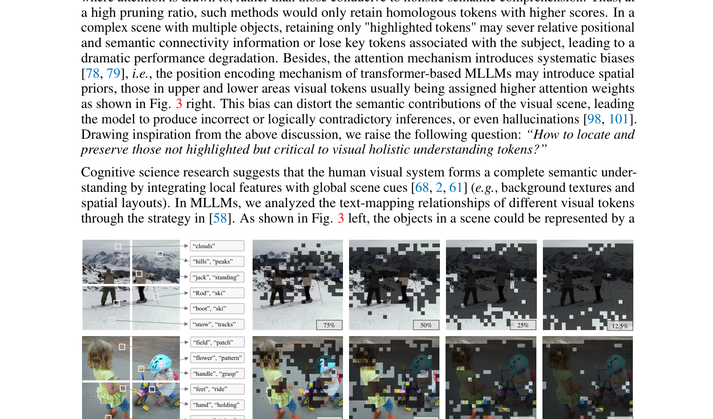

[← 返回 README](../README.md)

# 1 Introduction

## 📌 预览

Introduction 分为三部分：(1) MLLMs 的视觉 token 冗余问题；(2) 现有 attention-first pruning 的三大缺陷；(3) HoloV 的核心洞察——从认知科学出发，全局上下文比局部显著性更重要。

---

Multimodal Large Language Models (MLLMs) have demonstrated outstanding capabilities [80, 12] in tasks such as image captioning [35, 59, 14], visual question answering [24, 96, 36], and video understanding [34, 62, 77]. However, these models [43, 76, 38] typically require converting visual inputs into long sequence representations (i.e., visual tokens), which increases the computational complexity and cost of inference [94], especially for high-resolution images [41] and multi-frame videos [55], where redundant visual information further exacerbates the computational overhead.

> 💡 **问题背景**: 视觉 token 数量随分辨率增长：LLaVA-1.5 = 576 tokens, LLaVA-NeXT = 2880 tokens, LLaVA-OneVision = 7290 tokens。这是后续所有 token pruning 工作的出发点。

To address this challenge, researchers have introduced token pruning strategies [49, 13, 95, 85] that aim to retain the highlighted visual tokens as well as prune others for accelerating MLLM's inference. These methods typically define importance criteria for tokens, such as attention scores [13, 19] or gradient information [57, 56], to quantify the significance of visual tokens, and less important tokens are pruned during the inference phase, which balances speed and performance, but with limitations.

> 💡 **现有方法分类**: 
> - **Attention-based**: FastV、SparseVLM 等，用 text-vision cross-attention 评分
> - **Gradient-based**: 用梯度信息评估 token 重要性
> - 共同问题：都假设"高 attention = 高信息量"

As shown in Fig. 1, FastV [13] is an intuitive solution that ranks visual tokens based on attention distributions across different layers, and then prunes the bottom R% of tokens based on the computational budget, thus reducing visual token redundancy. Subsequently, more work has followed this paradigm [88, 95, 4], designing different strategies to prune redundant visual tokens via cross-modal (i.e., text-vision) attention from LLMs. Besides, there are vision-centric pruning methods [75, 25, 91, 64] (e.g., FasterVLM [90]) that presume those visual tokens with low correlation to the [CLS] token in ViT [17], or those exhibit duplicated features tokens [20] to be redundant.

> 💡 **两大流派**:
> 1. **Instruction-centric**: 在 LLM 内部，用 text-vision attention 决定剪枝（FastV、SparseVLM）
> 2. **Vision-centric**: 在 ViT 输出端，用 [CLS] attention 或特征相似度决定剪枝（FasterVLM、LLaVA-PruMerge）
> 
> HoloV 属于 vision-centric 流派，但引入了全新的评分机制。

Although these pruning methods can recognize the inefficiency of visual tokens in MLLMs, they are not consistently effective. As shown in Fig. 2, the performance decreases significantly as the pruning ratio increases. In our argument, this occurs because these approaches implicitly assume that visual tokens with high attention correspond to higher informativeness, which disregards the spatial-semantic relations of the visual scene, i.e., they tend to retain tokens from localized salient regions where attention is drawn to, rather than those conducive to holistic semantic comprehension. Thus, at a high pruning ratio, such methods would only retain homologous tokens with higher scores. In a complex scene with multiple objects, retaining only "highlighted tokens" may sever relative positional and semantic connectivity information or lose key tokens associated with the subject, leading to a dramatic performance degradation.

> 💡 **核心论点**: 为什么 attention-first 在高剪枝率下失效？
> - 高 attention token 往往集中在显著区域 → 语义相似/冗余
> - 剪枝率低时无所谓（还有很多 token），高时就出问题（只剩同质 token）
> - 例如一张多物体场景图，attention-first 可能只保留最显眼的物体，丢失背景和其他物体

Besides, the attention mechanism introduces systematic biases [78, 79], i.e., the position encoding mechanism of transformer-based MLLMs may introduce spatial priors, those in upper and lower areas visual tokens usually being assigned higher attention weights as shown in Fig. 3 right. This bias can distort the semantic contributions of the visual scene, leading the model to produce incorrect or logically contradictory inferences, or even hallucinations [97, 100]. Drawing inspiration from the above discussion, we raise the following question: "How to locate and preserve those not highlighted but critical to visual holistic understanding tokens?"

> 💡 **位置偏置**: 这是一个非常重要的发现。因为视觉 token 和文本 token 在 LLM 里一起处理，文本的位置偏置（首尾重要）会"传染"到视觉 token 上。图像序列的首尾对应图像的上边和下边——这显然不合理。

*Figure 3: Left - Examples of textual semantics corresponding to visual tokens from scattered crops. Right - Sparsification visualization examples of FastV, where retention ratios are tagged in the pics.*

> 💡 **Figure 3 批读**:
> - **左图**: 滑雪场景中，不同位置的 token 映射到不同文本语义——"clouds"、"hills"、"ski"、"snow" 等。这些散落在不同区域的 token 共同构成完整的场景理解。
> - **右图**: FastV 在不同保留比例下的可视化。可以看到保留的 token 集中在图像上下边缘，中间（实际最重要的区域）反而被丢弃。

Cognitive science research suggests that the human visual system forms a complete semantic understanding by integrating local features with global scene cues [68, 2, 61] (e.g., background textures and spatial layouts). In MLLMs, we analyzed the text-mapping relationships of different visual tokens through the strategy in [58]. As shown in Fig. 3 left, the objects in a scene could be represented by a small number of scattered tokens, and the semantic relationships between those tokens from different regions facilitate the overall understanding, e.g., "snow", "ski", "hills" are kind of self-explanatory. Motivated by this insight, we propose HoloV, which explicitly balances overall semantic connectivity and contextual attention during visual token pruning, addressing the critical limitation of redundancy in attention-first strategies. Our analysis demonstrates the importance of preserving visual holistic context, offering a new perspective on efficient visual token pruning in MLLMs.

> 💡 **认知科学启发**: 人类视觉系统通过整合**局部特征**和**全局场景线索**来理解场景。这正是 HoloV 的设计哲学——不能只看局部显著的 token，要保留全局的空间-语义关系。

Through extensive experiments on diverse benchmarks and MLLM architectures, we demonstrate that HoloV consistently surpasses existing state-of-the-art token pruning approaches, achieving up to 88.9% token reduction while preserving about 96% of the original performance. Besides, HoloV is model-agnostic and easily integrable into a wide range of MLLMs, making it well-suited for practical deployment.

> 💡 **贡献总结**:
> 1. 发现 attention-first pruning 的三大问题：信息冗余、位置偏置、注意力分散
> 2. 提出 HoloV：crop-wise 自适应分配 + 多样性评分
> 3. 88.9% 剪枝 → 95.8% 性能保留，支持多种 MLLM 架构

---

## 🔖 Section 总结

### 核心洞察
1. **Attention-first 的隐含假设有问题**: "高 attention = 高信息量" 在高剪枝率下不成立
2. **位置偏置是系统性的**: 文本的序列偏置传染到视觉 token
3. **全局上下文 > 局部显著性**: 认知科学也支持这个观点
4. **HoloV 的核心思想**: 分 crop 保留，确保每个区域都有代表性 token
