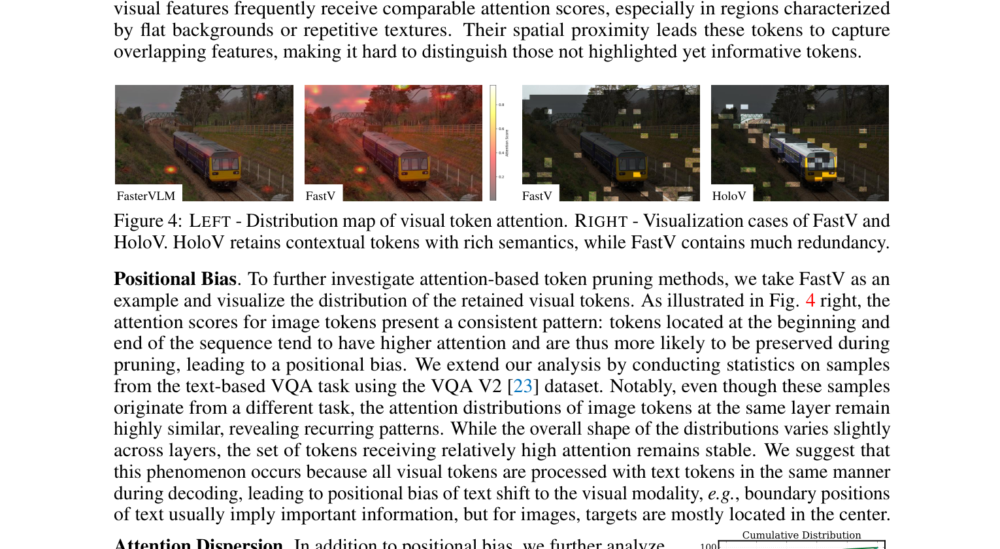
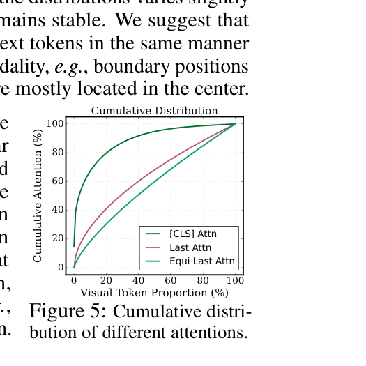
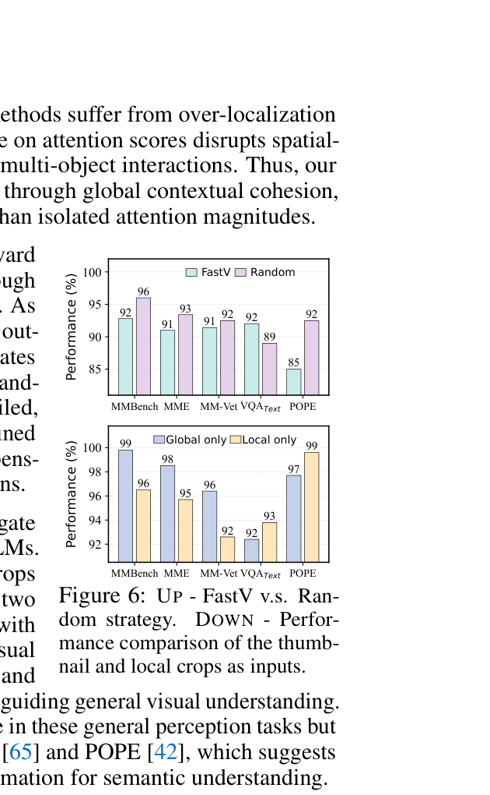

[← 返回 README](../README.md)

# 3 Preliminary and Motivation

## 📌 预览

这个 Section 是全文最重要的分析部分。先回顾 MLLM 架构和 attention 机制，然后通过三个实验/分析揭示 attention-first pruning 的三大问题：(1) 信息冗余；(2) 位置偏置；(3) 注意力分散。最后用 Random vs FastV 实验验证"全局上下文优于局部重复"。

---

## 3.1 Preliminary

**Architecture of MLLMs.** Given an MLLM $\mathcal{M}_{\theta}^{\text{MLLM}}$ parameterized by $\theta$, with a general architecture consisting of a text embedding layer, a vision encoder, a vision-text interface module, a text decoder consisting of $L$ number of transformer layers, and an affine layer which predicts the distribution of the next token. For an image-grounded text generation task, given a textual query $x$ and an input image $v$, $\mathcal{M}_{\theta}^{\text{MLLM}}$ first extracts vision features of $v$ by the vision encoder, and then converts them into visual tokens $z_v$ by MLP or Q-Former [74] modules. Aligned vision tokens $z_v$ are concatenated with the query $x$ as input to the text decoder, and finally decoded into a textual response $y$ autoregressive, which is formulated as: $y_t \sim p_\theta(\cdot|v, x, y_{<t}) \propto \text{softmax}(f_\theta(\cdot|v, x, y_{<t}))$, where $y_t$ indicates the $t^{th}$ token, $y_{<t}$ is the token sequence generated up to the time step $t$, and $f_\theta$ is the logit distribution.

> 💡 **MLLM 标准架构**: Vision Encoder → MLP/Q-Former → 与 text token 拼接 → LLM Decoder → 自回归生成。视觉 token 和文本 token 在 LLM 里被一视同仁地处理，这就是位置偏置的根源。

**Attention mechanism.** Considering the computational burden associated with the length of visual tokens in MLLMs, many studies have followed the paradigm of using attention scores to evaluate the redundancy of visual tokens. Specifically, transformer-based MLLMs typically utilize causal self-attention [5] to perform computation as: $\text{Self-attention}(\mathbf{Q}, \mathbf{K}, \mathbf{V}) = \text{softmax}(\mathbf{Q} \cdot \mathbf{K}^\top / \sqrt{d_k}) \cdot \mathbf{V}$, where $d_k$ is the dimension of $\mathbf{K}$, the result of $\text{softmax}(\mathbf{Q} \cdot \mathbf{K}^\top / \sqrt{d_k})$ is known as the attention matrix. In this work, we focus on the attention received by visual tokens from the visual [CLS] token.

> 💡 **HoloV 使用 [CLS] attention**: 和 FastV（用 text-vision attention）不同，HoloV 用的是 ViT 中 [CLS] token 对视觉 token 的 attention。这是 vision-centric 的选择——在进入 LLM 之前就完成评分，避免文本偏置。

---

## 3.2 Information Redundancy in Highlighted Tokens

When token selection is based exclusively on attention scores, the model tends to retain similar clusters, resulting in information redundancy. As shown in Fig. 4 left, adjacent tokens with similar visual features frequently receive comparable attention scores, especially in regions characterized by flat backgrounds or repetitive textures. Their spatial proximity leads these tokens to capture overlapping features, making it hard to distinguish those not highlighted yet informative tokens.

> 💡 **信息冗余**: 相邻 token 的视觉特征相似 → attention 分数也相似 → 被一起保留 → 信息冗余。典型场景：天空、草地等大面积背景区域的 token 可能集体获得高 attention。

*Figure 4: Left - Distribution map of visual token attention. Right - Visualization cases of FastV and HoloV. HoloV retains contextual tokens with rich semantics, while FastV contains much redundancy.*

> 💡 **Figure 4 批读**:
> - **左图**: Attention 分布热力图，可以看到高 attention 区域（亮色）是集中的，而非均匀分布
> - **右图**: FastV vs HoloV 的保留 token 对比。FastV 的彩色区域明显集中且冗余，HoloV 更分散、覆盖更多语义区域

**Positional Bias.** To further investigate attention-based token pruning methods, we take FastV as an example and visualize the distribution of the retained visual tokens. As illustrated in Fig. 4 right, the attention scores for image tokens present a consistent pattern: tokens located at the beginning and end of the sequence tend to have higher attention and are thus more likely to be preserved during pruning, leading to a positional bias. We extend our analysis by conducting statistics on samples from the text-based VQA task using the VQA V2 [23] dataset. Notably, even though these samples originate from a different task, the attention distributions of image tokens at the same layer remain highly similar, revealing recurring patterns. While the overall shape of the distributions varies slightly across layers, the set of tokens receiving relatively high attention remains stable. We suggest that this phenomenon occurs because all visual tokens are processed with text tokens in the same manner during decoding, leading to positional bias of text shift to the visual modality, e.g., boundary positions of text usually imply important information, but for images, targets are mostly located in the center.

> 💡 **位置偏置的深层原因**:
> - 文本中，序列首尾位置通常包含重要信息（BOS/EOS 效应）
> - 视觉 token 被拼接到文本 token 序列中后，继承了这种位置偏置
> - 结果：图像上下边缘的 token 被高估，中心区域的 token 被低估
> - 关键证据：**不同任务**（不同文本输入）下，**同一层**的视觉 attention 分布几乎相同 → 说明偏置来自位置而非语义

*Figure 5: Cumulative distribution of different attentions.*

**Attention Dispersion.** In addition to positional bias, we further analyze the phenomenon of attention dispersion, i.e., a small subset of similar tokens receives the majority of attention, while most tokens are assigned low attention scores [90]. Specifically, we compute the cumulative distribution of visual tokens sorted by their attention scores, as shown in Fig. 5. The curves of last-token attention [13] and equi last attn with identical position embedding are noticeably less steep than that for [CLS] attention. It is evident that compared to [CLS] attention, text-vision attention tends to be dispersed over more visual tokens, e.g., the top 20% of visual tokens account for only 40% of the total attention.

> 💡 **Figure 5 批读**:
> - [CLS] attention 更陡（集中）：前 20% token 占约 80% attention → 容易区分重要和不重要 token
> - Text-vision attention（FastV 用的）更平缓（分散）：前 20% token 只占约 40% attention → 很难找到清晰的阈值来剪枝
> - 这解释了为什么 FastV 等基于 text-vision attention 的方法在高剪枝率下表现差——它的评分区分度不够

---

## 3.3 Holistic Context Trumps Local Duplicates

Based on our previous analysis, attention-first token pruning methods suffer from over-localization due to positional bias and attention dispersion, i.e., over-reliance on attention scores disrupts spatial-semantic relationships, e.g., breaking occlusion hierarchies in multi-object interactions. Thus, our key insight is that visual token importance should be evaluated through global contextual cohesion, i.e., jointly considers holistic context and local saliency rather than isolated attention magnitudes.

> 💡 **核心洞察**: Token 重要性 = 全局上下文连贯性 + 局部显著性，而不是单看 attention 大小。

*Figure 6: Up - FastV v.s. Random strategy. Down - Performance comparison of the thumbnail and local crops as inputs.*

To further validate our hypothesis, we devised a straightforward holistic context retention strategy, i.e., pruning visual tokens through random masks to retain visual information from different regions. As shown in Fig. 6 up, compared with FastV, this random strategy outperforms on more than half of the benchmarks, which demonstrates the significance of preserving holistic context for visual understanding. On the VQA text dataset, however, the random strategy failed, possibly because random pruning discards some salient fine-grained information. This result also suggests that local saliency is indispensable, especially for densely packed elements within small regions.

> 💡 **Random vs FastV 实验**: 这是全文最精彩的实验之一！
> - **Random 策略**（随机保留 token）竟然在超过一半的 benchmark 上**击败** FastV
> - 这说明 FastV 的 attention-based 选择不仅没帮忙，反而**比随机还差**！根本原因就是位置偏置和信息冗余
> - 但 Random 在 TextVQA 上失败了 → 说明纯随机丢失细粒度信息 → 我们还需要局部显著性

In addition, we conducted an exploratory experiment to investigate how holistic context contributes to visual understanding in MLLMs. Specifically, we use the global thumbnail and multiple local crops as visual input separately [47], and evaluate performance on the two settings against various benchmarks. As shown in Fig. 6 down, with only the global thumbnail yields strong results on general visual perception benchmarks such as MMBench [51], MME [21], and MM-Vet [89], highlighting the inherent role of holistic context in guiding general visual understanding. On the contrary, using only local crops leads to poor performance in these general perception tasks but excels in fine-grained perception benchmarks such as TextVQA [65] and POPE [42], which suggests that local duplicated saliency can offer fine-grained visual information for semantic understanding.

> 💡 **Global vs Local 实验**:
> | 输入 | 一般视觉理解 (MMBench/MME/MM-Vet) | 细粒度理解 (TextVQA/POPE) |
> |------|-------|-------|
> | Global thumbnail only | ✓ 强 | ✗ 弱 |
> | Local crops only | ✗ 弱 | ✓ 强 |
> 
> 这直接激发了 HoloV 的设计：**同时保留全局上下文和局部显著性**。

---

## 🔖 Section 总结

### 关键数字速查
| 发现 | 数据 |
|------|------|
| Text-vision attention：top 20% token 占 attention | ~40% |
| [CLS] attention：top 20% token 占 attention | ~80% |
| Random 策略 vs FastV | 5/8 benchmark 上 Random 更好 |

### 核心洞察
1. **信息冗余**: 相邻 token 特征相似 → attention 相似 → 被一起保留
2. **位置偏置**: 文本序列的首尾效应传染到视觉 token，跨任务稳定
3. **注意力分散**: Text-vision attention 区分度差，不适合做 pruning 评分
4. **全局 > 局部**: Random 优于 FastV 证明全局覆盖比局部显著更重要
5. **但也不能只要全局**: TextVQA 上 Random 失败 → 局部显著性也必不可少
6. **→ HoloV 的设计目标**: 同时保留全局上下文 + 局部显著性
