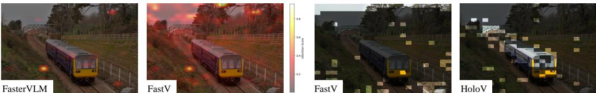
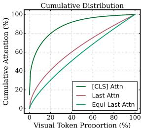
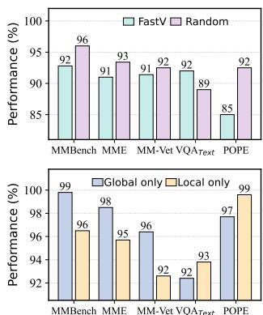

[← 返回 README](../README.md)

# 3 Preliminary and Motivation

## 📌 预览

这个 Section 是全文的理论基石。首先介绍 MLLM 架构和 attention 机制，然后通过三组实验揭示 attention-first 剪枝的致命缺陷：信息冗余、位置偏差、注意力弥散。最后通过 random mask 实验和 thumbnail vs. crops 实验，验证"全局上下文 > 局部重复"的核心假设。

---

## 3.1 Preliminary

**Architecture of MLLMs.** Given an MLLM $\mathcal{M}_{\theta}^{\mathrm{MLLM}}$ parameterized by $\theta$, with a general architecture consisting of a text embedding layer, a vision encoder, a vision-text interface module, a text decoder consisting of $L$ number of transformer layers, and an affine layer which predicts the distribution of the next token. For an image-grounded text generation task, given a textual query $x$ and an input image $v$, $\mathcal{M}_{\theta}^{\mathrm{MLLM}}$ first extracts vision features of $v$ by the vision encoder, and then converts them into visual tokens $z_v$ by MLP or Q-Former [74] modules. Aligned vision tokens $z_v$ are concatenated with the query $x$ as input to the text decoder, and finally decoded into a textual response $y$ autoregressive, which is formulated as: $y_t \sim p_\theta(\cdot | v, x, y_{<t}) \propto \mathrm{softmax}(f_\theta(\cdot | v, x, y_{<t}))$, where $y_t$ indicates the $t^{th}$ token, $y_{<t}$ is the token sequence generated up to the time step $t$, and $f_\theta$ is the logit distribution.

> 💡 **MLLM 架构总结**:
> ```
> Image v → Vision Encoder → MLP/Q-Former → Visual Tokens z_v
>                                                    ↓
> Text Query x → Text Embedding ─────────────→ Concat → LLM Decoder → Response y
> ```
> 标准的"编码器-投影器-解码器"三段式架构。HoloV 的剪枝点在 MLP/Q-Former 之后、LLM Decoder 之前。

---

**Attention mechanism.** Considering the computational burden associated with the length of visual tokens in MLLMs, many studies have followed the paradigm of using attention scores to evaluate the redundancy of visual tokens. Specifically, transformer-based MLLMs typically utilize causal self-attention [5] to perform computation as: Self-attention$(\mathbf{Q}, \mathbf{K}, \mathbf{V}) =$ softmax$\left(\mathbf{Q} \cdot \mathbf{K}^{\top} / \sqrt{d_k}\right) \cdot \mathbf{V}$, where $d_k$ is the dimension of $\mathbf{K}$, the result of softmax$\left(\mathbf{Q} \cdot \mathbf{K}^{\top} / \sqrt{d_k}\right)$ is known as the attention matrix. In this work, we focus on the attention received by visual tokens from the visual [CLS] token.

> 💡 **关键信息**: HoloV 使用的 attention 信号是 **[CLS] token 对各视觉 token 的 attention**（vision-centric），而非 text token 对视觉 token 的 attention（instruction-centric）。这避免了语言偏差问题。

---

## 3.2 Information Redundancy in Highlighted Tokens

When token selection is based exclusively on attention scores, the model tends to retain similar clusters, resulting in information redundancy. As shown in Fig. 4 left, adjacent tokens with similar visual features frequently receive comparable attention scores, especially in regions characterized by flat backgrounds or repetitive textures. Their spatial proximity leads these tokens to capture overlapping features, making it hard to distinguish those not highlighted yet informative tokens.

> 💡 **信息冗余问题**: attention score 高的 token 往往空间相邻、语义相似，保留它们等于保留重复信息。在纯色背景或重复纹理区域这个问题尤为突出。

---


*Figure 4: LEFT - Distribution map of visual token attention. RIGHT - Visualization cases of FastV and HoloV. HoloV retains contextual tokens with rich semantics, while FastV contains much redundancy.*

> 💡 **Figure 4 批读**:
> - **左图**: 视觉 token 的 attention 分布热力图，高 attention 区域呈现明显的空间聚集特征
> - **右图**: FastV vs HoloV 对比。FastV 保留的 token 集中在图像上下边缘（位置偏差），HoloV 的 token 分布更均匀，覆盖了更多语义区域

---

**Positional Bias.** To further investigate attention-based token pruning methods, we take FastV as an example and visualize the distribution of the retained visual tokens. As illustrated in Fig. 4 right, the attention scores for image tokens present a consistent pattern: tokens located at the beginning and end of the sequence tend to have higher attention and are thus more likely to be preserved during pruning, leading to a positional bias. We extend our analysis by conducting statistics on samples from the text-based VQA task using the VQA V2 [23] dataset. Notably, even though these samples originate from a different task, the attention distributions of image tokens at the same layer remain highly similar, revealing recurring patterns. While the overall shape of the distributions varies slightly across layers, the set of tokens receiving relatively high attention remains stable. We suggest that this phenomenon occurs because all visual tokens are processed with text tokens in the same manner during decoding, leading to positional bias of text shift to the visual modality, e.g., boundary positions of text usually imply important information, but for images, targets are mostly located in the center.

> 💡 **位置偏差深度分析**:
> - **现象**: 序列首尾 token 天然获得更高 attention → 图像上下边缘被过度保留
> - **原因**: LLM 的位置编码机制将文本的"首尾重要"先验迁移到了视觉模态
> - **跨任务一致性**: 即使在不同 VQA 任务上，位置偏差模式高度相似，说明这是架构级而非任务级的问题
> - **矛盾所在**: 文本中首尾位置通常是重要信息，但图像中目标大多在中心区域

---

**Attention Dispersion.** In addition to positional bias, we further analyze the phenomenon of attention dispersion, i.e., a small subset of similar tokens receives the majority of attention, while most tokens are assigned low attention scores [91]. Specifically, we compute the cumulative distribution of visual tokens sorted by their attention scores, as shown in Fig. 5. The curves of last-token attention [13] and equi last attn with identical position embedding are noticeably less steep than that for [CLS] attention. It is evident that compared to [CLS] attention, text-vision attention tends to be dispersed over more visual tokens, e.g., the top $20\%$ of visual tokens account for only $40\%$ of the total attention.

> 💡 **注意力弥散**: text-vision attention 比 [CLS] attention 更加分散——前 20% token 仅占总 attention 的 40%。这意味着用 text-vision attention 做排序区分度不够，容易误判。相比之下 [CLS] attention 更集中，更适合做 token 重要性排序。

---


*Figure 5: Cumulative distribution of different attentions.*

> 💡 **Figure 5 批读**: 三条曲线对比：
> - **[CLS] attention**: 最陡峭，说明少数 token 集中了大部分 attention → 区分度高
> - **last-token attention**: 较平缓，attention 分散在更多 token 上 → 区分度低
> - **equi last attn**: 去除位置编码后更平缓
>
> 这解释了为什么 HoloV 选择 [CLS] attention 而非 text-vision attention 作为 saliency 信号。

---

## 3.3 Holistic Context Trumps Local Duplicates

Based on our previous analysis, attention-first token pruning methods suffer from over-localization due to positional bias and attention dispersion, i.e., over-reliance on attention scores disrupts spatial-semantic relationships, e.g., breaking occlusion hierarchies in multi-object interactions. Thus, our key insight is that visual token importance should be evaluated through global contextual cohesion, i.e., jointly considers holistic context and local saliency rather than isolated attention magnitudes.

> 💡 **核心洞察**: token 重要性 = 全局上下文连贯性 + 局部显著性，而非仅靠 attention 大小。

---

To further validate our hypothesis, we devised a straightforward holistic context retention strategy, i.e., pruning visual tokens through random masks to retain visual information from different regions. As shown in Fig. 6 up, compared with FastV, this random strategy outperforms on more than half of the benchmarks, which demonstrates the significance of preserving holistic context for visual understanding. On the VQA text dataset, however, the random strategy failed, possibly because random pruning discards some salient fine-grained information. This result also suggests that local saliency is indispensable, especially for densely packed elements within small regions.

> 💡 **Random Mask 实验**: 这是一个非常有说服力的实验：
> - **随机剪枝 > FastV** 在多数 benchmark 上成立 → 说明保持空间覆盖比追逐高 attention 更重要
> - **随机剪枝 < FastV** 仅在 TextVQA 上 → 说明细粒度文本识别需要局部 saliency
> - **结论**: 最优策略应该**兼顾全局覆盖和局部显著性**，这正是 HoloV 的设计目标

---

In addition, we conducted an exploratory experiment to investigate how holistic context contributes to visual understanding in MLLMs. Specifically, we use the global thumbnail and multiple local crops as visual input separately [47], and evaluate performance on the two settings against various benchmarks. As shown in Fig. 6 down, with only the global thumbnail yields strong results on general visual perception benchmarks such as MMBench [51], MME [21], and MM-Vet [90], highlighting the inherent role of holistic context in guiding general visual understanding. On the contrary, using only local crops leads to poor performance in these general perception tasks but excels in fine-grained perception benchmarks such as TextVQA [65] and POPE [42], which suggests that local duplicated saliency can offer fine-grained visual information for semantic understanding.

> 💡 **Thumbnail vs. Local Crops 实验**:
> | 输入 | 通用感知 (MMB/MME/MM-Vet) | 细粒度感知 (TextVQA/POPE) |
> |------|--------------------------|-------------------------|
> | Global thumbnail only | ✅ 强 | ❌ 弱 |
> | Local crops only | ❌ 弱 | ✅ 强 |
>
> 这进一步验证了：全局上下文对通用理解至关重要，局部细节对细粒度任务不可或缺。两者缺一不可。

---


*Figure 6: UP - FastV v.s. Random strategy. DOWN - Performance comparison of the thumbnail and local crops as inputs.*

> 💡 **Figure 6 批读**:
> - **上图**: Random vs FastV 柱状图对比。Random 在 GQA、MMB、POPE 等多个 benchmark 上胜出，说明空间覆盖的重要性
> - **下图**: Thumbnail vs Crops 对比。两种输入各有所长，暗示最优方案需要兼顾全局和局部

---

## 🔖 Section 总结

### 关键数字速查
| 指标 | 数值 |
|------|------|
| LLaVA-1.5 视觉 token 数 | 576 |
| Text-vision attention top 20% token 占比 | 仅 40% 总 attention |
| Random > FastV 的 benchmark 比例 | >50% |

### 核心洞察
1. **位置偏差** 是 attention-first 方法的架构级缺陷，非任务相关
2. **[CLS] attention** 比 text-vision attention 区分度更高，更适合做 token 选择
3. **Random mask** 实验证明全局覆盖的重要性超过局部 attention 排序
4. **Thumbnail vs. Crops** 实验证明全局上下文和局部细节各有不可替代的作用
5. HoloV 的设计目标：**同时保留全局上下文连贯性和局部显著性信息**
