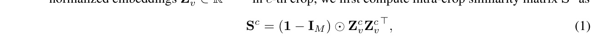
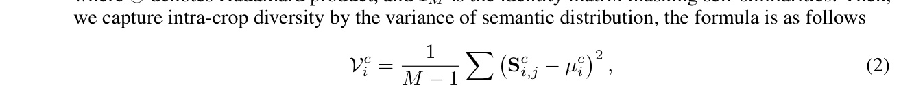
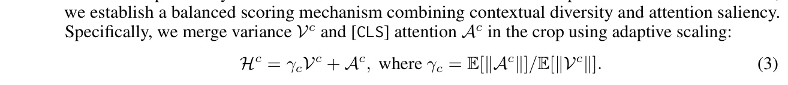
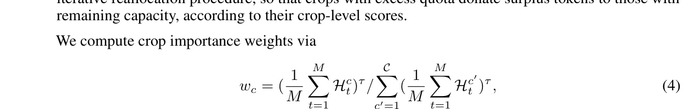
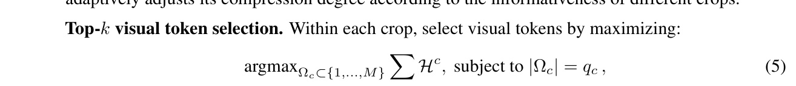
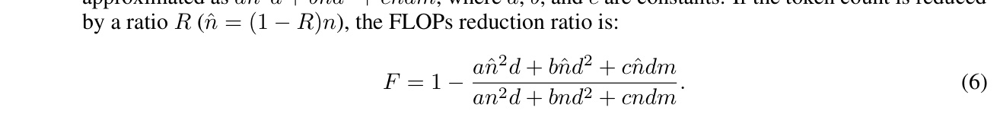

[← 返回 README](../README.md)

# 4 Methodology

## 📌 预览

HoloV 的方法论分三部分：(1) 核心框架——crop-wise 自适应分配 + 方差调制评分; (2) Fast Visual Context Refetching——对剪枝信息的补偿机制; (3) 理论分析和计算复杂度。

---

Building on the above analysis, we propose HoloV, which better preserves the holistic context of images for visual understanding. By removing redundant visual tokens before the LLM decoder, our approach could make MLLMs inference faster than methods that prune tokens within the LLM. An overview of our approach is depicted in Fig. 7. In what follows, we elaborate on how our HoloV guides overall visual token compression under a high pruning ratio to keep semantic completeness.

> 💡 **关键设计选择**: HoloV 在 **LLM decoder 之前**剪枝，而非在 LLM 内部剪枝（如 FastV）。这有两个优势：
> 1. 减少进入 LLM 的 token 数，从 prefill 阶段就省计算
> 2. 兼容 Flash-Attention 等硬件加速技术

---

## 4.1 HoloV Framework

To address the pivotal question raised in Sec. 1 for effective and efficient visual token pruning, we propose HoloV framework, which leverages crop-wise adaptive allocation to decentralize attention over those non-highlighted but heterogeneous tokens. Fig. 7 illustrates the core idea of HoloV.

> 💡 **核心思想**: 将视觉 token 分成多个 crop，在每个 crop 内独立评估 token 重要性，然后按 crop 重要性自适应分配剪枝配额。这样确保每个空间区域都有 token 被保留，避免信息集中在某一区域。

---


*Figure 7: Illustration of HoloV. We re-rank highlighted visual tokens for holistic context retention.*

> 💡 **Figure 7 批读**: HoloV 流程图：
> 1. **Crop 划分**: 将 $N_v$ 个视觉 token 均分为 $\mathcal{C}$ 个 crop
> 2. **Intra-crop 评分**: 在每个 crop 内计算 diversity variance + [CLS] attention → holistic score $\mathcal{H}^c$
> 3. **Cross-crop 分配**: 按 crop 重要性权重 $w_c$ 分配保留配额 $q_c$
> 4. **Top-k 选择**: 在每个 crop 内选取 top-$q_c$ token
> 5. 输出剪枝后的 token 序列送入 LLM decoder

---

Based on our findings about the positional bias, We first rearrange visual tokens into local crops. Let the total number of image tokens be $N_v$, which is evenly partitioned into $\mathcal{C}$ crops. This enables the model to maintain spatial granularity and gather statistics both locally and globally. Given the normalized embeddings $\mathbf{Z}_v^c \in \mathbb{R}^{M \times d}$ in $c$-th crop, we first compute intra-crop similarity matrix $\mathbf{S}^c$ as



where $\odot$ denotes Hadamard product, and $\mathbf{I}_M$ is the identity matrix masking self-similarities. Then, we capture intra-crop diversity by the variance of semantic distribution, the formula is as follows



where a high value of $\mathcal{V}_i^c$ indicates that $i$-th token has diverse connections with others, the visual semantics expressed by the informative token is essential within the crop. To obtain holistic attention, we establish a balanced scoring mechanism combining contextual diversity and attention saliency. Specifically, we merge variance $\mathcal{V}^c$ and [CLS] attention $\mathcal{A}^c$ in the crop using adaptive scaling:



> 💡 **HoloV 评分机制详解**:
>
> **Step 1 — Intra-crop 相似度矩阵** (Eq. 1): 对每个 crop 内的 token embeddings 做内积，得到 token 间的余弦相似度矩阵 $\mathbf{S}^c$。对角线用 $\mathbf{I}_M$ mask 掉（排除自相似）。
>
> **Step 2 — Diversity Variance** (Eq. 2): 对每个 token $i$，计算它与 crop 内其他 token 相似度的方差 $\mathcal{V}_i^c$。高方差 = 该 token 与不同 token 有不同程度的关联 = **语义多样性高**。
>
> **Step 3 — Holistic Score** (Eq. 3): 将 diversity variance $\mathcal{V}^c$ 和 [CLS] attention $\mathcal{A}^c$ 加权融合。自适应缩放因子 $\gamma_c = \mathbb{E}[\|\mathcal{A}^c\|] / \mathbb{E}[\|\mathcal{V}^c\|]$ 确保两个信号在同一量级。
>
> 直觉：**一个好的 token 应该既有高 attention（局部显著），又有高 diversity（与其他 token 语义不同）**。

---

**Adaptive holistic token allocation.** To preserve overall scene semantics and spatial diversity, we compute a crop-level priority score by averaging token scores within each crop. The total quota for selected image tokens $T'$ is dynamically allocated to crops according to their normalized crop-level importance. The allocation to each crop is discrete and capped, ensuring spatial coverage while preventing over-concentration on specific regions. We resolve rounding and overflow through an iterative reallocation procedure, so that crops with excess quota donate surplus tokens to those with remaining capacity, according to their crop-level scores.

> 💡 **自适应分配的精妙之处**: 不是简单均分！而是按 crop 的信息量动态分配配额。信息丰富的 crop 得到更多配额，但有上限（capped）防止某个 crop 垄断所有配额。

---

We compute crop importance weights via



where $\tau$ controls the sharpness of allocation. Thus, initial quota $q_c = \lfloor w_c \hat{N}_v \rfloor$, where $\hat{N}_v$ denotes the number of retained tokens. When the allocated tokens overflow or fall short, we redistribute residual tokens. For overflow, the quota is changed by $q_c = \min(q_c + \Delta_c, M), \Delta_c \propto w_c \cdot (M - q_c)$, while for fall short, we allocate the remaining quota to the crop with the highest weight. In this way, HoloV adaptively adjusts its compression degree according to the informativeness of different crops.

> 💡 **Crop 权重分配** (Eq. 4):
> - $w_c$: 第 $c$ 个 crop 的权重，由 crop 内 token 平均 holistic score 的 $\tau$ 次方归一化得到
> - $\tau$: 温度参数，控制分配的"尖锐度"。$\tau$ 大 → 权重差异大 → 信息密集的 crop 拿到更多配额
> - 初始配额: $q_c = \lfloor w_c \hat{N}_v \rfloor$
> - **Overflow 处理**: 多出的配额按 $w_c \cdot (M - q_c)$ 比例分给有容量的 crop
> - **Shortfall 处理**: 剩余配额给权重最高的 crop

---

**Top-$k$ visual token selection.** Within each crop, select visual tokens by maximizing:



which ensures both crop-wise local saliency and global relevance. We retain top-$k$ visual tokens in each crop, where $k$ is determined by the quota $q_c$ in the allocation. By performing token pruning before the LLM decoder, we dynamically adjust the number of visual tokens as input to the language model based on the actual computational budget, thus accelerating the MLLM inference.

> 💡 **Top-k 选择** (Eq. 5): 在每个 crop 内，按 holistic score $\mathcal{H}^c$ 排序，保留前 $q_c$ 个 token。约束 $|\Omega_c| = q_c$ 确保每个 crop 的保留数量严格遵循分配的配额。

---

### 4.1.1 Fast Visual Context Refetching

Motivated by the attention sinks [94], and information loss during visual token pruning, we further propose visual context refetching to fast supplement the visual holistic context. Specifically, we treat pruned tokens as supplementary evidence, re-injecting them into the MLLM through Feed Forward Network (FFN) as "key-value memory" at the middle trigger layer. This refetch mechanism occurs when the model exhibits high uncertainty during inference, achieving effective and efficient visual information replenishment. Limited by space, the details can be found in Appendix D.

> 💡 **Visual Context Refetching (VCR)**:
> - **动机**: 即使 HoloV 保留了全局上下文，高剪枝率下仍有信息损失
> - **机制**: 将被剪掉的 token 作为"key-value memory"，在 LLM 中间层通过 FFN 重新注入
> - **触发条件**: 模型推理时展现高不确定性时才触发（按需补偿，不增加无谓计算）
> - **原理**: FFN 本质上是 key-value memory（Geva et al. 2021），VCR 利用这个特性做信息重检索
> - 详见 Appendix D

---

## 4.2 Theoretical Analysis

To further justify the trustworthiness of our proposed HoloV, we provide a theoretical analysis of it. Under Assumption 1, for any pruned token, there exists a retained token that is sufficiently close in the embedding space, with bounded context variance. By leveraging the Lipschitz continuity [8] of the transformer layer, we can bound the semantic difference between the outputs on the original and pruned token sets. The residual error introduced by the scoring threshold is also controlled. Combining these components, we obtain the stated upper bound. More details are in Appendix C.

> 💡 **理论保证摘要**: HoloV 的剪枝引入的语义误差有理论上界：
> - 对任意被剪 token，存在保留的 token 在 embedding 空间中足够接近（Coverage Guarantee）
> - Transformer 层的 Lipschitz 连续性确保输入扰动不会导致输出剧变
> - Token 分配策略接近最优（子模函数的 $(1-1/e)$ 近似比）

---

## 4.3 Computational Complexity

As language instructions are much shorter than visual tokens, we focus on the FLOPs contributed by visual tokens. Let $n$ denote the number of visual tokens, $d$ the hidden size, and $m$ the FFN intermediate size (with SwiGLU). For the prefill stage, the FLOPs per transformer layer can be approximated as $an^2d + bnd^2 + cndm$, where $a, b$, and $c$ are constants. If the token count is reduced by a ratio $R$ $(\hat{n} = (1-R)n)$, the FLOPs reduction ratio is:



For large $n$, the quadratic term dominates, so $F \approx 1 - (1-R)^2 = 2R - R^2$. Thus, the reduction is slightly better than linear in $R$. In the decode stage (with KV cache), the complexity becomes linear in $n$, and the FLOPs per layer are $bd^2 + (bd + c\bar{d}m)n$, so the reduction is nearly proportional to $R$. HoloV speeds up inference by pruning ahead of the LLM to avoid KV cache inefficiency.

> 💡 **FLOPs 分析**:
> | 阶段 | 复杂度 | 剪枝效果 |
> |------|--------|---------|
> | Prefill | $O(n^2d)$ 为主 | $F \approx 2R - R^2$（超线性收益）|
> | Decode | $O(nd)$ | $F \approx R$（线性收益）|
>
> 例如 $R=0.889$ 时，prefill FLOPs 减少约 $2 \times 0.889 - 0.889^2 \approx 0.988$，即减少 98.8%！
> HoloV 在 LLM 之前剪枝，不仅减少 prefill 计算，还避免了冗余 KV cache 的存储和查询开销。

---

## 🔖 Section 总结

### HoloV 算法流程

```
输入: Visual tokens Z_v (N_v 个), 保留配额 N̂_v
  ↓
1. 划分为 C 个 crop, 每个 crop M = N_v/C 个 token
  ↓
2. 对每个 crop c:
   a. 计算 intra-crop similarity S^c (Eq. 1)
   b. 计算 diversity variance V^c (Eq. 2)
   c. 融合为 holistic score H^c = γ_c·V^c + A^c (Eq. 3)
  ↓
3. 计算 crop 权重 w_c 并分配配额 q_c (Eq. 4)
  ↓
4. 每个 crop 内 top-q_c 选择 (Eq. 5)
  ↓
5. 拼接所有保留 token → 送入 LLM decoder
  ↓
(可选) 6. VCR: 高不确定性时在中间层补回剪枝信息

输出: 剪枝后的 visual tokens (N̂_v 个)
```

### 核心洞察
1. **Diversity Variance** 是关键创新——衡量 token 的"语义独特性"而非仅靠 attention
2. **自适应缩放** $\gamma_c$ 使 variance 和 attention 在同一量级上融合
3. **Crop-wise 分配** 确保空间覆盖，防止 representational collapse
4. **在 LLM 之前剪枝** 带来超线性 FLOPs 收益
