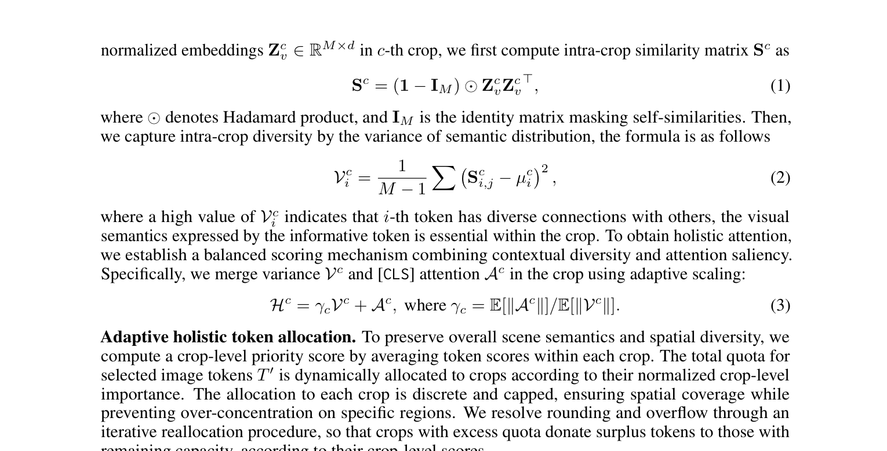
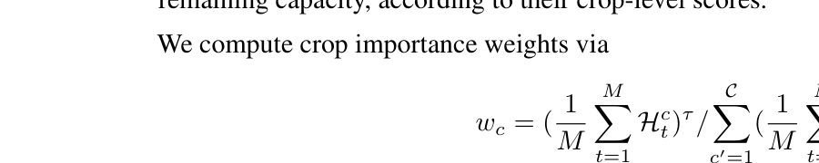
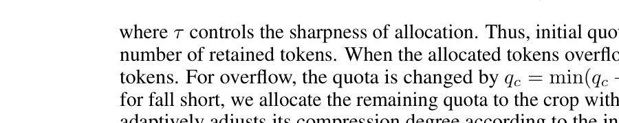
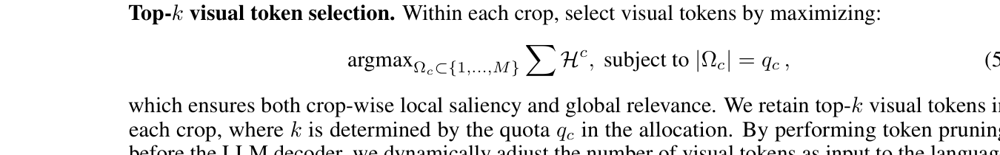
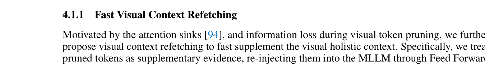
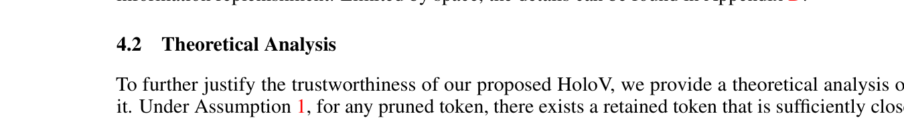
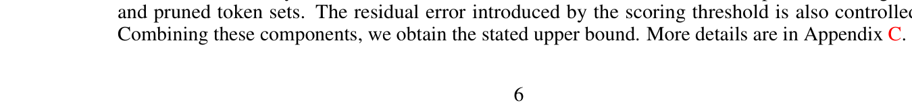

[← 返回 README](../README.md)

# 4 Methodology

## 📌 预览

HoloV 的核心方法：(1) 把视觉 token 划分成 crops；(2) 计算每个 crop 内 token 的语义多样性（variance）+ [CLS] attention 混合评分；(3) 按 crop 重要性自适应分配剪枝配额；(4) 在每个 crop 内 top-k 选择。额外：Visual Context Refetching 机制补偿信息损失。

---

Building on the above analysis, we propose HoloV, which better preserves the holistic context of images for visual understanding. By removing redundant visual tokens before the LLM decoder, our approach could make MLLMs inference faster than methods that prune tokens within the LLM. An overview of our approach is depicted in Fig. 7. In what follows, we elaborate on how our HoloV guides overall visual token compression under a high pruning ratio to keep semantic completeness.

> 💡 **关键设计选择**: HoloV 在 LLM decoder **之前**剪枝（不是像 FastV 那样在 LLM 内部剪枝）。好处：
> - 减少 KV cache 大小 → 更省显存
> - 减少 prefill 阶段的计算
> - 兼容 Flash-Attention（不需要 attention mask 修改）

---

## 4.1 HoloV Framework

To address the pivotal question raised in Sec. 1 for effective and efficient visual token pruning, we propose HoloV framework, which leverages crop-wise adaptive allocation to decentralize attention over those non-highlighted but heterogeneous tokens. Fig. 7 illustrates the core idea of HoloV.


*Figure 7: Illustration of HoloV. We re-rank highlighted visual tokens for holistic context retention.*

> 💡 **Figure 7 批读**: HoloV 的流程图：
> 1. ViT 输出 visual tokens + [CLS] token
> 2. 将 visual tokens 按空间位置划分为 C 个 crops
> 3. 每个 crop 内计算: intra-crop similarity → variance + [CLS] attention → holistic score
> 4. 按 crop 的平均 score 分配剪枝配额
> 5. 每个 crop 内 top-k 选择
> 6. 拼接保留的 tokens → 送入 LLM decoder

Based on our findings about the positional bias, We first rearrange visual tokens into local crops. Let the total number of image tokens be $N_v$, which is evenly partitioned into $\mathcal{C}$ crops. This enables the model to maintain spatial granularity and gather statistics both locally and globally.

> 💡 **Crop 划分**: 例如 576 tokens (24×24 grid)，分成 8 个 crops，每个 crop 72 tokens。这一步打破了全局 attention 的位置偏置——每个 crop 内部有自己的评分和配额。

Given the normalized embeddings $\mathbf{Z}_v^c \in \mathbb{R}^{M \times d}$ in $c$-th crop, we first compute intra-crop similarity matrix $\mathbf{S}^c$ as



where $\odot$ denotes Hadamard product, and $\mathbf{I}_M$ is the identity matrix masking self-similarities.

> 💡 **Eq.1 解读**: 计算 crop 内所有 token 两两之间的余弦相似度（归一化后的内积），用 identity matrix 去掉对角线（自相似度=1 没意义）。

Then, we capture intra-crop diversity by the variance of semantic distribution, the formula is as follows



where a high value of $\mathcal{V}_i^c$ indicates that $i$-th token has diverse connections with others, the visual semantics expressed by the informative token is essential within the crop.

> 💡 **Eq.2 解读**: 对每个 token $i$，计算它与 crop 内其他所有 token 的相似度的**方差**。
> - **高方差** = 与一些 token 很相似、与另一些很不相似 → 说明这个 token 有**独特的语义角色**（连接不同语义区域）
> - **低方差** = 与所有 token 的相似度差不多 → 说明这个 token 要么和大家都差不多（冗余），要么和大家都很不同（孤立噪声）
> - 这个设计非常精巧：它不是简单地看 attention 大小，而是看**语义多样性**

To obtain holistic attention, we establish a balanced scoring mechanism combining contextual diversity and attention saliency. Specifically, we merge variance $\mathcal{V}^c$ and [CLS] attention $\mathcal{A}^c$ in the crop using adaptive scaling:



> 💡 **Eq.3 解读**: Holistic Score = γ × Variance + [CLS] Attention
> - $\gamma_c$ 是自适应缩放因子，让 variance 和 attention 在数量级上对齐
> - 这就是 HoloV 的核心评分：**语义多样性 + 视觉显著性**
> - 和 CDPruner 的 DPP 相比，HoloV 的方法更简单直观：variance 捕获多样性，attention 捕获显著性

**Adaptive holistic token allocation.** To preserve overall scene semantics and spatial diversity, we compute a crop-level priority score by averaging token scores within each crop. The total quota for selected image tokens $T'$ is dynamically allocated to crops according to their normalized crop-level importance. The allocation to each crop is discrete and capped, ensuring spatial coverage while preventing over-concentration on specific regions. We resolve rounding and overflow through an iterative reallocation procedure, so that crops with excess quota donate surplus tokens to those with remaining capacity, according to their crop-level scores.

We compute crop importance weights via



where $\tau$ controls the sharpness of allocation. Thus, initial quota $q_c = \lfloor w_c \hat{N}_v \rfloor$, where $\hat{N}_v$ denotes the number of retained tokens. When the allocated tokens overflow or fall short, we redistribute residual tokens. For overflow, the quota is changed by $q_c = \min(q_c + \Delta_c, M), \Delta_c \propto w_c \cdot (M - q_c)$, while for fall short, we allocate the remaining quota to the crop with the highest weight. In this way, HoloV adaptively adjusts its compression degree according to the informativeness of different crops.

> 💡 **自适应配额分配**: 这是 HoloV 区别于简单均匀分配的关键：
> - 不是每个 crop 分配相同数量的 token
> - 而是按 crop 的平均 holistic score 加权分配
> - $\tau$ 控制分配的尖锐度：$\tau \to 0$ = 完全均匀，$\tau \to \infty$ = 赢者通吃
> - 额外有溢出/不足的重分配逻辑，确保总配额精确

**Top-$k$ visual token selection.** Within each crop, select visual tokens by maximizing:



which ensures both crop-wise local saliency and global relevance. We retain top-$k$ visual tokens in each crop, where $k$ is determined by the quota $q_c$ in the allocation. By performing token pruning before the LLM decoder, we dynamically adjust the number of visual tokens as input to the language model based on the actual computational budget, thus accelerating the MLLM inference.

> 💡 **最终选择**: 在每个 crop 内按 holistic score 做 top-k 选择。整个流程简洁：
> ```
> 576 tokens → 分成 8 crops (每 crop 72 tokens)
> → 每 crop 内计算 similarity variance + [CLS] attention
> → 按 crop 重要性分配配额 (e.g., crop1: 10, crop2: 6, ...)
> → 每 crop 内 top-k 选择
> → 拼接 64 tokens → 送入 LLM
> ```

---

### 4.1.1 Fast Visual Context Refetching

Motivated by the attention sinks [93], and information loss during visual token pruning, we further propose visual context refetching to fast supplement the visual holistic context. Specifically, we treat pruned tokens as supplementary evidence, re-injecting them into the MLLM through Feed Forward Network (FFN) as "key-value memory" at the middle trigger layer. This refetch mechanism occurs when the model exhibits high uncertainty during inference, achieving effective and efficient visual information replenishment. Limited by space, the details can be found in Appendix E.

> 💡 **Visual Context Refetching**: 这是一个有趣的补充机制：
> - 被剪掉的 token 不是直接丢弃，而是保存下来
> - 当 LLM 推理到中间层时，如果不确定性高，就把被剪的 token 重新注入
> - 类似 "attention sink" 的思想——保证模型总能 "回头看" 被忽略的信息
> - 细节在 Appendix E，主实验似乎没有默认启用

---

## 4.2 Theoretical Analysis

To further justify the trustworthiness of our proposed HoloV, we provide a theoretical analysis of it. Under Assumption 1, for any pruned token, there exists a retained token that is sufficiently close in the embedding space, with bounded context variance. By leveraging the Lipschitz continuity [8] of the transformer layer, we can bound the semantic difference between the outputs on the original and pruned token sets. The residual error introduced by the scoring threshold is also controlled. Combining these components, we obtain the stated upper bound. More details are in Appendix D.

> 💡 **理论保证**: 利用 Transformer 的 Lipschitz 连续性，证明 HoloV 剪枝后的输出与原始输出之间的语义差异有上界。核心假设是"每个被剪的 token 附近都有保留的 token"——crop-wise 分配确实在一定程度上保证了这一点。

---

## 4.3 Computational Complexity

As language instructions are much shorter than visual tokens, we focus on the FLOPs contributed by visual tokens. Let $n$ denote the number of visual tokens, $d$ the hidden size, and $m$ the FFN intermediate size (with SwiGLU). For the prefill stage, the FLOPs per transformer layer can be approximated as $an^2d + bnd^2 + cndm$, where $a$, $b$, and $c$ are constants. If the token count is reduced by a ratio $R$ ($\hat{n} = (1-R)n$), the FLOPs reduction ratio is:



For large $n$, the quadratic term dominates, so $F \approx 1 - (1-R)^2 = 2R - R^2$. Thus, the reduction is slightly better than linear in $R$. In the decode stage (with KV cache), the complexity becomes linear in $n$, and the FLOPs per layer are $bd^2 + (bd + cdm)n$, so the reduction is nearly proportional to $R$. HoloV speeds up inference by pruning ahead of the LLM to avoid KV cache inefficiency.

> 💡 **FLOPs 分析**:
> | 阶段 | 复杂度 | 剪枝 R 后的加速 |
> |------|--------|----------------|
> | Prefill | $O(n^2d)$ 主导 | $\approx 2R - R^2$（超线性）|
> | Decode (KV cache) | $O(nd)$ | $\approx R$（线性）|
> 
> 例如 R=88.9%：prefill 加速约 98.8%，decode 加速约 88.9%。
> 
> 关键优势：**在 LLM 前剪枝** → KV cache 更小 → decode 阶段也加速。这是相对于 FastV（在 LLM 内部剪枝）的结构性优势。

---

## 🔖 Section 总结

### 关键数字速查
| 组件 | 说明 |
|------|------|
| Crop 数 C | 默认 8（消融：4~16 差异不大）|
| 评分 = | γ × Variance + [CLS] Attention |
| 配额分配 | 按 crop 平均 score 的 τ 次幂加权 |
| 剪枝位置 | LLM decoder 之前 |

### 核心洞察
1. **HoloV 方法极其简洁**: 分 crop → 算 variance + attention → 分配配额 → top-k，没有复杂的训练或优化
2. **Variance 是关键创新**: 用相似度方差衡量 token 的语义多样性，而非简单的 attention 大小
3. **Crop-wise 分配解决位置偏置**: 每个 crop 独立评分和选择，打破全局位置偏置
4. **在 LLM 前剪枝的结构性优势**: 同时加速 prefill 和 decode，减少 KV cache
5. **Visual Context Refetching**: 被剪 token 不完全丢弃，可在需要时重新注入
