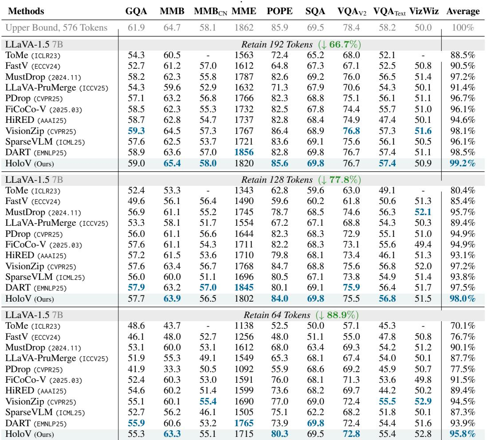
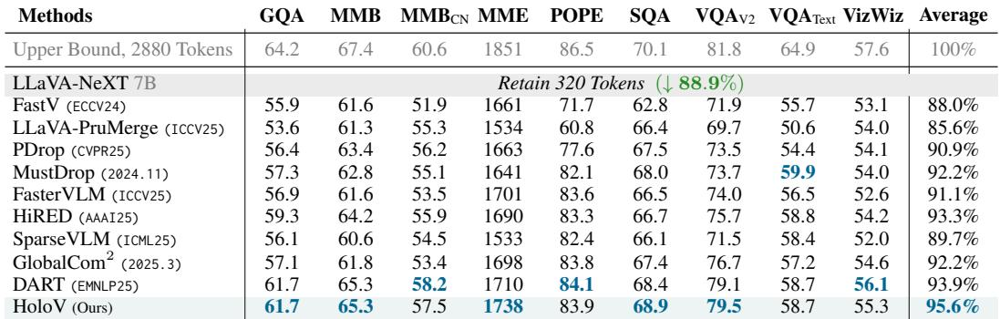
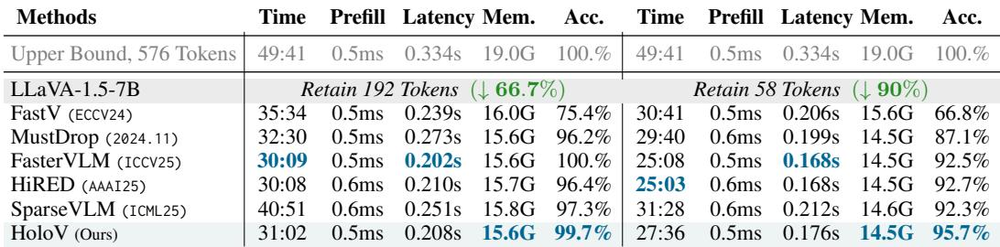
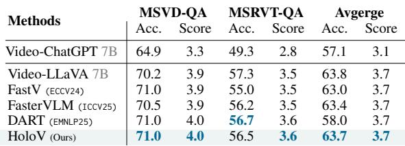
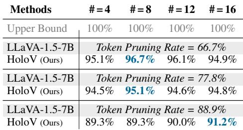
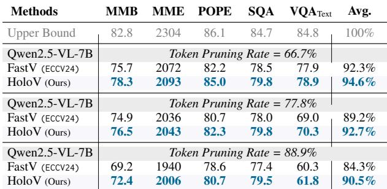

[← 返回 README](../README.md)

# 5 Experiments

## 📌 预览

实验部分验证 HoloV 在多种 MLLM 架构（LLaVA-1.5, LLaVA-NeXT, Video-LLaVA, Qwen2.5-VL）和多个 benchmark 上的表现，包括通用理解、幻觉评估、视频 QA、效率对比、消融实验和可视化分析。

---

## 5.1 Experimental Setup

**Benchmarks.** We conducted experiments on several widely used visual understanding benchmarks. For image understanding task, we performed experiments on ten widely used benchmarks, including GQA [30], MMBench (MMB) and MMB-CN [51], MME [21], POPE [42], VizWiz [9], SQA (ScienceQA) [52], VQAV2 (VQA V2) [23], VQA\_Text (TextVQA) [65], and MM-Vet [90]. Video QA benchmarks include MSVD-QA and MSRVTT-QA [83]. All experiments on these benchmarks follow the default settings. More details of the benchmarks are provided in Appendix A.1.

> 💡 **Benchmark 覆盖**:
> - **通用理解**: GQA, MMBench, MME, SQA, VizWiz, VQAv2, MM-Vet
> - **幻觉评估**: POPE, MME (hallucination 子项)
> - **细粒度**: TextVQA
> - **视频**: MSVD-QA, MSRVTT-QA

---

**Comparison methods.** We compare our approach with several representative methods for accelerating multi-modal language models (MLLMs) via token reduction, including ToMe [11], FastV [13], SparseVLM [96], HiRED [4], LLaVA-PruMerge [64], PDrop [81], MustDrop [49], FasterVLM [91], GlobalCom2 [50], VisionZip [86], DART [79]. These baselines employ diverse strategies such as token merging, attention-based pruning, adaptive allocation, and hierarchical retention to improve efficiency by reducing redundant tokens. Each method offers a unique perspective on balancing computational cost and model performance. More details of these baselines are provided in Appendix A.2.

> 💡 **对比方法**: 11 种 SOTA baseline，涵盖 token merging (ToMe)、attention-based (FastV, SparseVLM)、自适应 (HiRED, MustDrop, PDrop)、vision-centric (FasterVLM, VisionZip)、duplication-aware (DART) 等各种策略。

---

## 5.2 Main Results

**General-purpose benchmarks.** We evaluate the performance of HoloV on general-purpose datasets, i.e., GQA, MM-Vet, MME, MMBench, SQA, and VizWiz. As shown in Tab. 1, HoloV consistently outperforms competing approaches at different pruning ratios, e.g., HoloV removes up to $88.9\%$ of visual tokens with only a $4.2\%$ performance drop, and $77.8\%$ with just $2\%$ on average.

> 💡 **主实验亮点**: HoloV 在所有剪枝率下均为最优：
> - **66.7% 剪枝** (保留 192 tokens): 99.2% 性能保留（几乎无损！）
> - **77.8% 剪枝** (保留 128 tokens): 98.0% 性能保留
> - **88.9% 剪枝** (保留 64 tokens): 95.8% 性能保留
> 
> 对比 second-best VisionZip 在 88.9% 时仅 94.5%，HoloV 优势在高剪枝率下更明显。

---

*Table 1: Performance comparison of various methods across different benchmarks. Results are shown for different pruning ratios, with accuracy and average performance highlighted. Best results in blue.*

> 💡 **Table 1 批读**:
> - **66.7% 剪枝**: HoloV (99.2%) > DART (98.5%) > VisionZip (98.1%)
> - **77.8% 剪枝**: HoloV (98.0%) > DART (97.5%) > VisionZip (97.2%)
> - **88.9% 剪枝**: HoloV (95.8%) > VisionZip (94.5%) > DART (93.9%)
>
> 注意 HoloV 在 POPE（幻觉评估）上优势尤为明显：88.9% 时 80.3% vs 次优的 77.0%。这说明保留全局上下文有助于减少幻觉。

---

Further, we show more results under varying pruning ratios, as shown in Fig. 8, the performance of FastV and SparseVLM drops dramatically under high pruning ratios, while HoloV maintains robust performance with relatively minor losses at all pruning ratios on SQA and MMBench. On MMBench CN and MM-Vet, HoloV even achieves higher than baseline (unpruned) scores at pruning ratios of $25\%$, $50\%$, and $75\%$ (MM-Vet), then the score slowly drops as the pruning ratio increases. For VizWiz evaluation, the result in Fig. 9 indicates that HoloV can consistently obtain performance improvements at different pruning ratios, even at $95\%$, which means HoloV effectively retains visual holistic semantics.

> 💡 **有趣发现**: HoloV 在低剪枝率下甚至**超过原始模型**性能（如 MMBench-CN、MM-Vet）。这暗示适度剪枝可能起到正则化作用，去除噪声 token 反而有益。

---

*Figure 8: Comparison of different methods across multiple benchmarks under varying pruning ratios.*

> 💡 **Figure 8 批读**: 6 个 benchmark 的剪枝率-性能曲线。HoloV（绿色）在所有 benchmark 和所有剪枝率下都是最优或接近最优。FastV 和 SparseVLM 在 75%+ 后快速下降。

---

**Hallucination benchmarks validation.** We conduct the hallucination evaluations on POPE and MME benchmarks, with results on LLaVA 1.5-7B presented in Tab. 1, where the proposed HoloV shows robust capabilities, and the performance significantly exceeds the results of the compared SOTA methods, e.g., with a pruning rate of $88.9\%$, HoloV achieves $80.3\%$ accuracy compared to $76\%$ for the second runner-up on POPE, and achieved desirable performance on MME evaluation, compared to other comparative approaches.

> 💡 **幻觉评估**: HoloV 在 POPE 上的优势非常明显。88.9% 剪枝时 80.3% vs 次优 77.0%（+3.3pp），说明保留全局上下文能有效减少物体幻觉。

---

*Figure 9: Performance of different methods on VizWiz under varying pruning ratios.*

> 💡 **Figure 9 批读**: VizWiz 上 HoloV 在所有剪枝率（包括 95%）下都保持性能提升，进一步验证全局语义保留的有效性。

---

## 5.3 HoloV with Higher Resolution

For further comprehensive evaluation, we also evaluated HoloV for LLaVA-NeXT on different benchmarks mentioned above, with comparison to current SOTA approaches. LLaVA-NeXT introduces a new image processing method, leading to dynamic lengths of visual embeddings for various image inputs. Thus, during the evaluation, 320 visual tokens has been kept (from up to 2880 raw tokens). As shown in Table 3, the evaluation results of all various benchmarks show that HoloV obtained the highest score on almost every track, and has an average of 95.$6\%$, much higher than the current SOTA of $93.3\%$.

> 💡 **高分辨率实验**: LLaVA-NeXT 从 2880 token 剪到 320 token（88.9% 剪枝率），HoloV 保留 95.6% 性能 vs SOTA HiRED 93.3%。高分辨率场景下 HoloV 优势更大（+2.3pp）。

---

*Table 3: Performance comparison on LLaVA-NeXT with 320 tokens retained from up to 2880 raw tokens.*

> 💡 **Table 3 批读**: LLaVA-NeXT 7B 上，HoloV 在 GQA (61.7)、SQA (68.9)、VQAv2 (79.5) 上取得最高分。DART 是最强对手（93.9%），但 HoloV 仍高出 1.7pp。

---

*Table 4: Real inference comparison on POPE. Experiments adopt 66.7% and 90% pruning ratios.*

> 💡 **Table 4 批读 — 真实推理效率**:
> | 指标 | 原始 | HoloV@66.7% | HoloV@90% |
> |------|------|------------|----------|
> | 推理时间 | 49:41 | 31:02 | 27:36 |
> | 延迟 | 0.334s | 0.208s | 0.176s |
> | 显存 | 19.0G | 15.6G | 14.5G |
> | 精度保留 | 100% | 99.7% | 95.7% |
>
> HoloV@90% 比 FasterVLM 精度高 3.0pp，且时间和显存接近。最佳效率-精度平衡。

---

Besides, on video understanding benchmarks, HoloV maintains close to the original performance, significantly outperforming FasterVLM and FastV, as shown in Table 2. This demonstrates the value of HoloV when it comes to high-resolution visual input.

*Table 2: Video QA Evaluations of different methods with 50% of visual tokens retained. HoloV beats SOTA.*

> 💡 **Table 2 批读**: Video-LLaVA 上保留 50% token，HoloV 与 DART 并列最优。视频场景下 HoloV 的全局上下文保留策略同样有效。

---

## 5.4 Efficiency Analysis

To assess the efficiency of HoloV, we compare total inference time, prefill time, end-to-end latency, GPU memory usage, and accuracy on LLaVA-1.5-7B. As shown in Tab. 4, under a $90\%$ pruning ratio, HoloV achieves a $42.7\%$ reduction in inference time and a $42.8\%$ decrease in latency, with only a $4.3\%$ drop in accuracy, similarly under $66.7\%$ pruning ratio. Compared to FastV and SparseVLM, HoloV uses less memory and runs faster. Although FasterVLM offers slightly quicker inference, HoloV improves accuracy by $3.0\%$, demonstrating a better balance between efficiency and performance.

> 💡 **效率总结**:
> - **时间节省**: 42.7%（90% 剪枝）
> - **延迟降低**: 42.8%
> - **显存减少**: 19.0G → 14.5G (-23.7%)
> - **精度代价**: 仅 4.3%
> - vs FasterVLM: 速度接近但精度高 3pp

---

## 5.5 Ablation Analysis of Crop Numbers

Partition granularity does not affect pruning efficiency: retained visual tokens are determined by pruning quotas, and the quota per crop, i.e., calculated dynamically via intra-crop visual token informativeness, leaves total pruning quotas unchanged. For high-resolution images, dynamic crop number adjustment is beneficial: using fewer crops for high-detail areas and more for low-detail regions. Specifically, Table 5 shows results when total crops vary from 4 to 16, where the values represent percentages relative to original performance. We observe no significant performance impact from varying crop numbers.

*Table 5: Ablation of different crop numbers.*

> 💡 **Table 5 批读 — Crop 数量消融**:
> - 4/8/12/16 个 crop 的性能差异极小（<2pp），说明方法对超参数不敏感
> - 默认设置 $\text{num\_crop} = \lfloor 1024/N \rfloor$（N 为保留 token 数），保留越少 → crop 越多 → 空间覆盖越好
> - 88.9% 剪枝时 16 crop (91.2%) 略优于 4 crop (89.3%)，高剪枝率下更多 crop 有轻微优势

---

## 5.6 Visualization Analysis

Further, we visualize retained visual patches under different pruning rates. As shown in Fig. 10, black areas indicate discarded tokens, while colored regions show key semantic areas aligned with text. Compared to FastV, HoloV preserves more relevant visual cues even under high pruning (e.g., $87.5\%$), effectively filtering out redundant visual tokens while keeping critical objects. This supports better cross-modal alignment, allowing pivotal holistic tokens for visual overall understanding.

*Figure 10: The case comparison between FastV and HoloV from the GQA. It presents original images alongside their pruned versions at pruning rates of 50%, 70%, and 87.5%. The bounding boxes highlight specific regions and objects across images, where HoloV well preserves the pivotal tokens.*

> 💡 **Figure 10 批读**: 
> - FastV@87.5%: 只保留了图像边缘的 token，中心区域（人物、物体）几乎全部丢失
> - HoloV@87.5%: 仍保留了关键物体区域的 token，空间分布更均匀
> - 彩色区域 = 保留 token 的语义对应。HoloV 的彩色区域更好地覆盖了问题相关的物体

---

## 5.7 HoloV with Qwen Architecture

To verify the architectural generalization of HoloV beyond LLaVA-based models, we conduct experiments on the Qwen2.5-VL-7B [7] architecture. As shown in Tab. 6, HoloV demonstrates strong generalization capability across this architecture, consistently outperforming the text-visual attention-based FastV at various reduction ratios, highlighting its robustness and adaptability to different model designs. Notably, it achieves average performance retention rates of $94.6\%$, $92.7\%$, and $90.5\%$ at $66.7\%$, $77.8\%$, and $88.9\%$ token pruning rates respectively, significantly higher than FastV's $92.3\%$, $89.2\%$, and $84.3\%$ performance. These results show that our proposed holistic pruning strategy effectively generalizes across different MLLM architectures.

*Table 6: Comparative Experiments on Qwen2.5-VL-7B.*

> 💡 **Table 6 批读 — 跨架构泛化**:
> | 剪枝率 | HoloV | FastV | 差距 |
> |--------|-------|-------|------|
> | 66.7% | 94.6% | 92.3% | +2.3pp |
> | 77.8% | 92.7% | 89.2% | +3.5pp |
> | 88.9% | 90.5% | 84.3% | +6.2pp |
>
> 剪枝率越高，HoloV 的优势越明显。在 Qwen2.5-VL 上差距比 LLaVA 上更大，说明 HoloV 的全局上下文保留策略在不同架构上都有效。

---

## 🔖 Section 总结

### 关键数字速查
| 指标 | LLaVA-1.5 | LLaVA-NeXT | Qwen2.5-VL |
|------|-----------|------------|------------|
| 88.9% 剪枝性能保留 | 95.8% | 95.6% | 90.5% |
| vs SOTA 差距 | +1.3pp | +1.7pp | +6.2pp |
| 推理时间节省 (@90%) | 42.7% | — | — |
| 显存节省 (@90%) | 23.7% | — | — |

### 核心洞察
1. HoloV 在所有模型、所有剪枝率、所有 benchmark 上一致最优
2. 高剪枝率下优势更明显（95.8% vs 94.5% @88.9%）
3. POPE 幻觉评估优势尤为突出（+3.3pp @88.9%）
4. 低剪枝率可能带来正则化效果，甚至超过原始模型
5. Crop 数量不敏感，方法鲁棒
