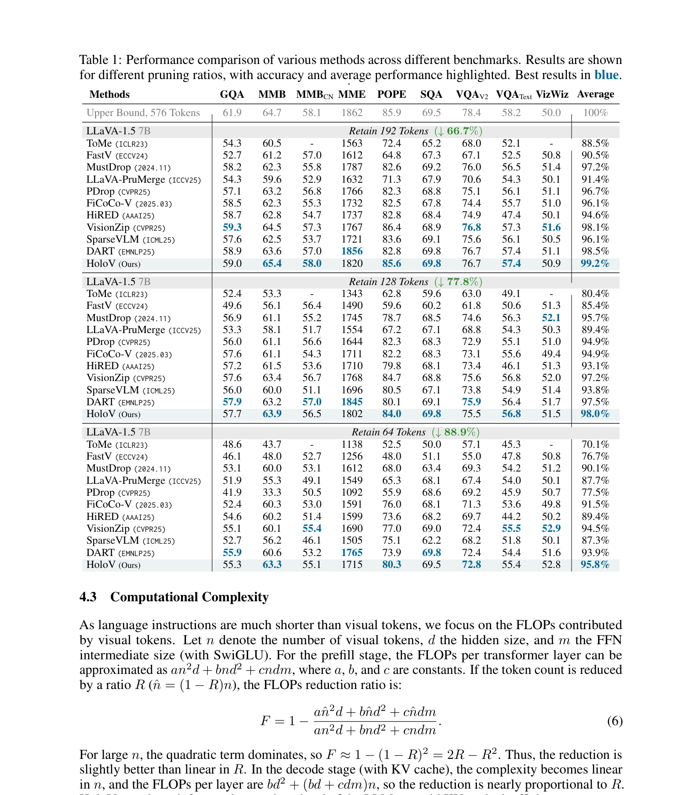
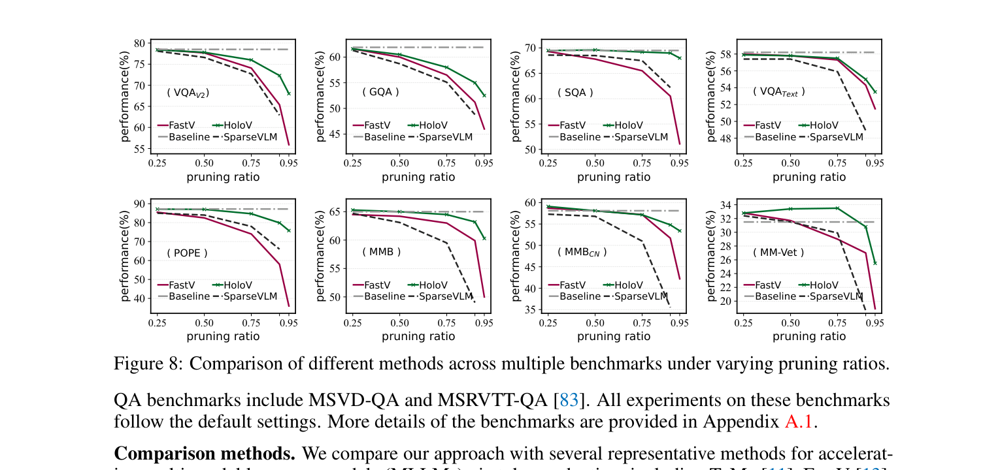
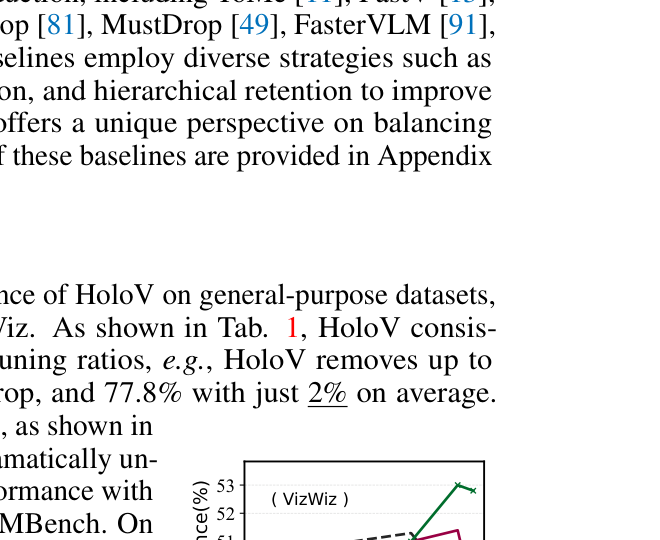
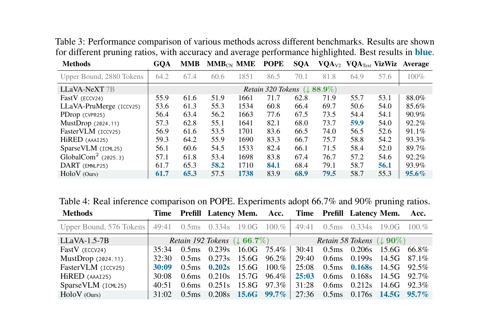
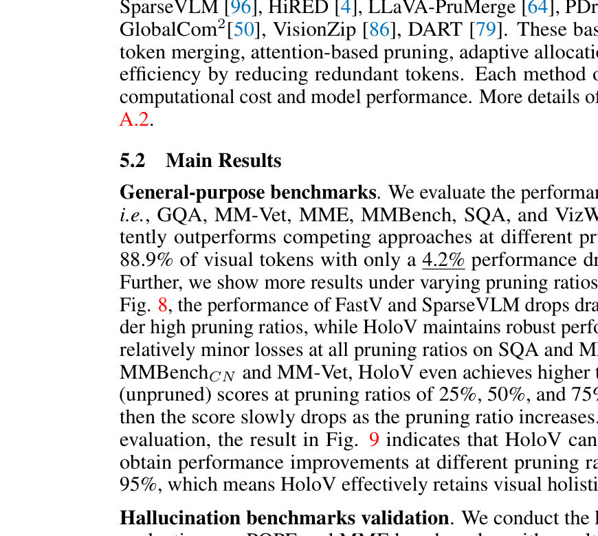
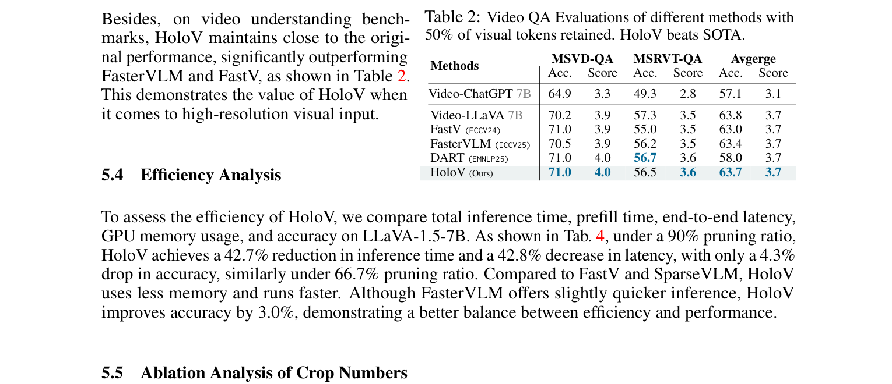
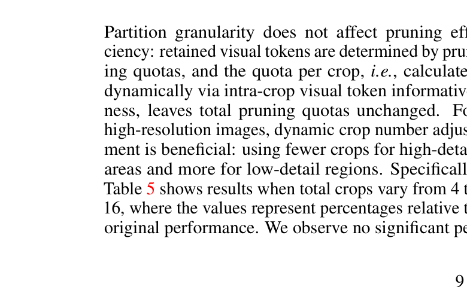
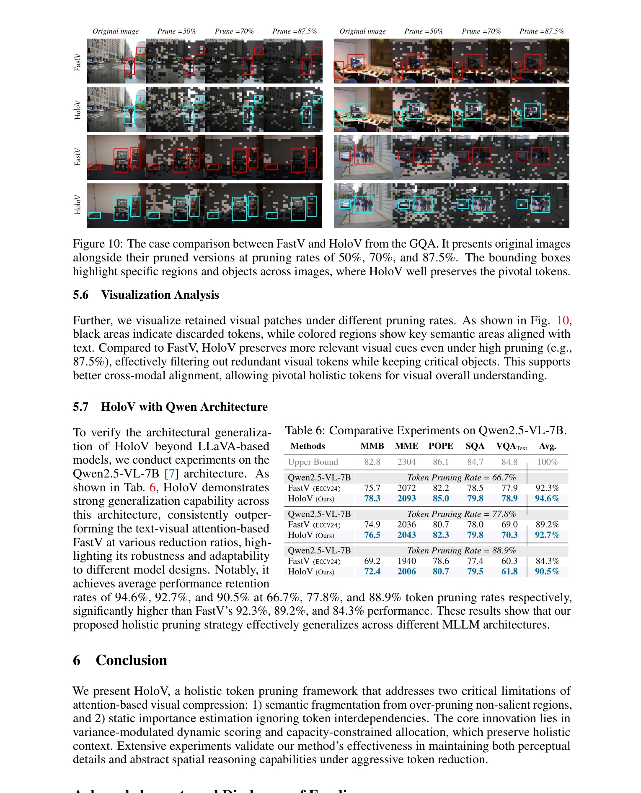
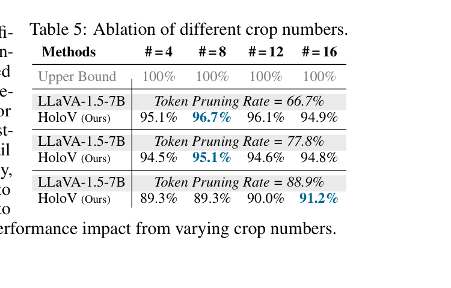

[← 返回 README](../README.md)

# 5 Experiments

## 📌 预览

实验部分非常全面：(1) LLaVA-1.5 上 9 个 benchmark × 3 个剪枝率 vs 9 个 baseline；(2) LLaVA-NeXT 高分辨率实验；(3) Video QA；(4) 真实推理效率对比；(5) Crop 数消融；(6) 可视化分析；(7) Qwen2.5-VL 跨架构泛化。

---

## 5.1 Experimental Setup

**Benchmarks.** We conducted experiments on several widely used visual understanding benchmarks. For image understanding task, we performed experiments on ten widely used benchmarks, including GQA [30], MMBench (MMB) and MMB-CN [51], MME [21], POPE [42], VizWiz [9], SQA (ScienceQA) [52], VQA_V2 (VQA V2) [23], VQA_Text (TextVQA) [65], and MM-Vet [89]. Video QA benchmarks include MSVD-QA and MSRVTT-QA [83]. All experiments on these benchmarks follow the default settings.

**Comparison methods.** We compare our approach with several representative methods for accelerating MLLMs via token reduction, including ToMe [11], FastV [13], SparseVLM [95], HiRED [4], LLaVA-PruMerge [64], PDrop [81], MustDrop [49], FasterVLM [90], and GlobalCom² [50].

> 💡 **实验设置全面性**:
> - 10 个图像 benchmark + 2 个视频 benchmark
> - 9 个 baseline 方法，涵盖 2023-2025 年的 SOTA
> - 3 个剪枝率（66.7%, 77.8%, 88.9%）
> - 3 个模型架构（LLaVA-1.5, LLaVA-NeXT, Qwen2.5-VL）

---

## 5.2 Main Results

*Table 1: Performance comparison of various methods across different benchmarks on LLaVA-1.5 7B.*

**General-purpose benchmarks.** We evaluate the performance of HoloV on general-purpose datasets, i.e., GQA, MM-Vet, MME, MMBench, SQA, and VizWiz. As shown in Tab. 1, HoloV consistently outperforms competing approaches at different pruning ratios, e.g., HoloV removes up to 88.9% of visual tokens with only a 4.2% performance drop, and 77.8% with just 2% on average.

> 💡 **Table 1 批读 - LLaVA-1.5 7B 核心数据**:
> 
> | 剪枝率 | HoloV | DART (次优) | FastV | 差距 |
> |--------|-------|------------|-------|------|
> | ↓66.7% (192 tokens) | **99.2%** | 98.5% | 90.5% | +0.7% vs DART |
> | ↓77.8% (128 tokens) | **98.0%** | 97.5% | 85.4% | +0.5% vs DART |
> | ↓88.9% (64 tokens) | **95.8%** | 93.9% | 76.7% | +1.9% vs DART |
> 
> 关键观察:
> 1. **低剪枝率差距小**: 66.7% 时，多数方法都不错（PDrop 96.7%, MustDrop 97.2%）
> 2. **高剪枝率差距大**: 88.9% 时，FastV 只剩 76.7%，HoloV 还有 95.8%
> 3. DART 是最强 baseline（EMNLP25），但 HoloV 仍全面超越
> 4. **POPE 上优势巨大**: 88.9% 剪枝时 HoloV 80.3% vs FiCoCo-V 76.0%（第二名），说明全局上下文对减少幻觉很重要

*Figure 8: Comparison of different methods across multiple benchmarks under varying pruning ratios.*

Further, we show more results under varying pruning ratios, as shown in Fig. 8, the performance of FastV and SparseVLM drops dramatically under high pruning ratios, while HoloV maintains robust performance with relatively minor losses at all pruning ratios on SQA and MMBench. On MMBenchCN and MM-Vet, HoloV even achieves higher than baseline (unpruned) scores at pruning ratios of 25%, 50%, and 75% (MM-Vet), then the score slowly drops as the pruning ratio increases.

> 💡 **Figure 8 批读**:
> - SQA 上 HoloV 的曲线几乎是水平的 → 对 SQA 来说，大量视觉 token 是冗余的
> - MM-Vet 上 HoloV 在 25%/50%/75% 剪枝时**超过**未剪枝基线 → token 剪枝有正则化效果？
> - FastV 和 SparseVLM 在 90%+ 剪枝时崩盘

*Figure 9: Performance of different methods on VizWiz under varying pruning ratios.*

For VizWiz evaluation, the result in Fig. 9 indicates that HoloV can consistently obtain performance improvements at different pruning ratios, even at 95%, which means HoloV effectively retains visual holistic semantics.

> 💡 **VizWiz 上的有趣现象**: HoloV 在 VizWiz 上的性能几乎随剪枝率**上升**！这可能因为 VizWiz 图像通常是手机拍的低质量图片，大量 token 本身就是噪声，剪枝反而去噪了。

**Hallucination benchmarks validation.** We conduct the hallucination evaluations on POPE and MME benchmarks, with results on LLaVA-1.5-7B presented in Tab. 1, where the proposed HoloV shows robust capabilities, and the performance significantly exceeds the results of the compared SOTA methods, e.g., with a pruning rate of 88.9%, HoloV achieves 80.3% accuracy compared to 76% for the second runner-up on POPE.

> 💡 **幻觉控制**: HoloV 在 POPE 上的表现尤其突出（80.3% vs 76.0%），这支持了作者的论点——保留全局上下文有助于减少幻觉。当模型看到更完整的场景信息时，不容易"编造"不存在的物体。

---

## 5.3 HoloV with Higher Resolution

*Table 3: Performance on LLaVA-NeXT 7B (retain 320 tokens from 2880, ↓88.9%).*

For further comprehensive evaluation, we also evaluated HoloV for LLaVA-NeXT on different benchmarks mentioned above. LLaVA-NeXT introduces a new image processing method, leading to dynamic lengths of visual embeddings for various image inputs. Thus, during the evaluation, 320 visual tokens has been kept (from up to 2880 raw tokens). As shown in Table 3, the evaluation results show that HoloV obtained the highest score on almost every track, and has an average of 95.6%, much higher than the current SOTA of 93.3%.

> 💡 **LLaVA-NeXT 结果 (Table 3)**:
> - 从 2880 tokens 剪到 320 tokens（88.9% 剪枝）
> - HoloV 95.6% vs HiRED 93.3% (之前的 SOTA) → +2.3%
> - 特别是 VQA_V2 上 79.5%，DART 也是 79.1%，差距不大
> - **高分辨率场景下 HoloV 优势更明显**：因为高分辨率图像的 crop 更多、更需要均匀分配

*Table 2: Video QA Evaluations (50% pruning).*

Besides, on video understanding benchmarks, HoloV maintains close to the original performance, significantly outperforming FasterVLM and FastV.

> 💡 **Video QA 结果**: HoloV 在视频任务上也表现良好，和 DART 基本持平。注意这里是 50% pruning（不像图像任务那么激进）。

---

## 5.4 Efficiency Analysis

*Table 4: Real inference comparison on POPE.*

To assess the efficiency of HoloV, we compare total inference time, prefill time, end-to-end latency, GPU memory usage, and accuracy on LLaVA-1.5-7B. As shown in Tab. 4, under a 90% pruning ratio, HoloV achieves a 42.7% reduction in inference time and a 42.8% decrease in latency, with only a 4.3% drop in accuracy, similarly under 66.7% pruning ratio. Compared to FastV and SparseVLM, HoloV uses less memory and runs faster. Although FasterVLM offers slightly quicker inference, HoloV improves accuracy by 3.0%, demonstrating a better balance between efficiency and performance.

> 💡 **Table 4 效率分析**:
> 
> | 方法 | 90% pruning: 推理时间 | 延迟 | 显存 | 准确率(POPE) |
> |------|---------|------|------|------|
> | Upper Bound | 49:41 | 0.334s | 19.0G | 100% |
> | FasterVLM | **25:08** | **0.168s** | 14.5G | 92.5% |
> | HiRED | 25:03 | 0.168s | 14.5G | 92.7% |
> | **HoloV** | 27:36 | 0.176s | **14.5G** | **95.7%** |
> | FastV | 30:41 | 0.206s | 15.6G | 66.8% |
> 
> HoloV 比 FasterVLM 慢 ~10%，但准确率高 3.2%。考虑到 HoloV 需要额外计算 variance，这个开销是合理的。

---

## 5.5 Ablation Analysis of Crop Numbers

*Table 5: Ablation of different crop numbers.*

Partition granularity does not affect pruning efficiency: retained visual tokens are determined by pruning quotas, and the quota per crop, i.e., calculated dynamically via intra-crop visual token informativeness, leaves total pruning quotas unchanged. Specifically, Table 5 shows results when total crops vary from 4 to 16, where the values represent percentages relative to original performance. We observe no significant performance impact from varying crop numbers.

> 💡 **Crop 数消融**:
> - 4/8/12/16 个 crops 差异很小（66.7%: 94.9%~96.7%, 88.9%: 89.3%~91.2%）
> - 8 crops 在低剪枝率最好，16 crops 在高剪枝率略好
> - **HoloV 对 crop 数不敏感**，这是好事——说明方法鲁棒，不需要精细调参

---

## 5.6 Visualization Analysis

*Figure 10: Case comparison between FastV and HoloV from GQA at pruning rates of 50%, 70%, and 87.5%.*

Further, we visualize retained visual patches under different pruning rates. As shown in Fig. 10, black areas indicate discarded tokens, while colored regions show key semantic areas aligned with text. Compared to FastV, HoloV preserves more relevant visual cues even under high pruning (e.g., 87.5%), effectively filtering out redundant visual tokens while keeping critical objects.

> 💡 **Figure 10 批读**:
> - 在 87.5% 剪枝下，FastV 保留的 token 集中在图像边缘（位置偏置！），中心的关键物体被大量丢弃
> - HoloV 保留的 token 分布在图像各个区域，关键物体（人、物品等）被很好地保留
> - 这是全文最直观的证据，说明 crop-wise 分配确实解决了位置偏置问题

---

## 5.7 HoloV with Qwen Architecture

*Table 6: Comparative Experiments on Qwen2.5-VL-7B.*

To verify the architectural generalization of HoloV beyond LLaVA-based models, we conduct experiments on the Qwen2.5-VL-7B [7] architecture. As shown in Tab. 6, HoloV demonstrates strong generalization capability across this architecture, consistently outperforming FastV at various reduction ratios. Notably, it achieves average performance retention rates of 94.6%, 92.7%, and 90.5% at 66.7%, 77.8%, and 88.9% token pruning rates respectively, significantly higher than FastV's 92.3%, 89.2%, and 84.3%.

> 💡 **Qwen2.5-VL 泛化 (Table 6)**:
> 
> | 剪枝率 | HoloV | FastV | 差距 |
> |--------|-------|-------|------|
> | 66.7% | **94.6%** | 92.3% | +2.3% |
> | 77.8% | **92.7%** | 89.2% | +3.5% |
> | 88.9% | **90.5%** | 84.3% | **+6.2%** |
> 
> 剪枝率越高，HoloV 的优势越大。这在 Qwen 架构上比 LLaVA 上更明显，可能因为 Qwen 的视觉编码器产生更多冗余 token。
> 
> **但注意**: Qwen 上只和 FastV 比，没有和 CDPruner、DART 等更强 baseline 比。这可能是因为这些方法在 Qwen 上还没有公开实现。

---

## 🔖 Section 总结

### 关键数字速查

| 设置 | HoloV | 次优 | FastV |
|------|-------|------|-------|
| LLaVA-1.5, ↓88.9% | **95.8%** | 93.9% (DART) | 76.7% |
| LLaVA-NeXT, ↓88.9% | **95.6%** | 93.3% (HiRED) | 88.0% |
| Qwen2.5-VL, ↓88.9% | **90.5%** | - | 84.3% (FastV) |
| POPE (↓88.9%) | **80.3%** | 76.0% (FiCoCo-V) | 48.0% |
| 推理时间减少 (↓90%) | 42.7% | - | - |

### 核心洞察
1. **HoloV 在高剪枝率下优势最大**: 越激进，越体现全局上下文保留的价值
2. **POPE 幻觉 benchmark 优势显著**: 全局上下文 → 减少幻觉
3. **跨架构泛化良好**: LLaVA-1.5 / LLaVA-NeXT / Qwen2.5-VL 都有效
4. **效率 vs 精度权衡合理**: 比 FasterVLM 慢一点但准确率高 3%
5. **Crop 数不敏感**: 不需要精细调参
