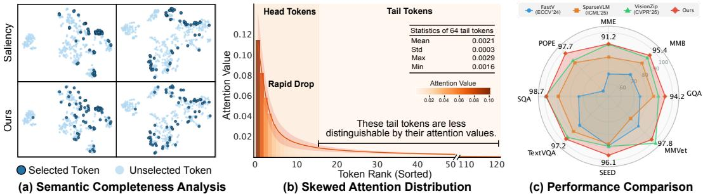

[← 返回 README](../README.md)

# 1 Introduction

## 📌 预览
Introduction 从 MLLM 的 visual token 开销切入，指出 saliency-based pruning 的两大缺陷（语义不完整 + 注意力分布偏斜），提出 SCOPE 并总结三点贡献。

---

Recent advances in Multimodal Large Language Models (MLLMs)[24, 25, 51, 20, 21] have significantly advanced open-ended visual understanding tasks[12, 27, 47, 8] by integrating powerful vision encoders [34] with autoregressive large language models [37, 1]. These systems typically tokenize visual inputs into sequences of patch-level embeddings (i.e., visual tokens), which are then fed into the language model via either projection modules [24] or attention-based fusion mechanisms [19]. Despite its effectiveness, this paradigm incurs substantial computational overhead, particularly when processing high-resolution images or temporally dense video inputs. For instance, a ViT encoder [11] applied to a 448×448 image can generate over 1,000 visual tokens. This number increases rapidly in high-resolution and video scenarios involving multiple frames. Since these tokens are jointly processed with textual tokens, the computational cost of self-attention grows quadratically with the number of visual tokens [30, 25], limiting their deployment in practical applications such as edge computing and robotics [17, 33, 44].

> 💡 **背景**: MLLM 的核心瓶颈——visual token 太多。448×448 → 1000+ tokens，高分辨率和视频场景更严重。Self-attention 的二次复杂度让部署变得困难。

---

*Figure 1: (a) Semantic Completeness Analysis. We visualize the selected tokens using a saliency-based rule (Top) and our method (Bottom). The saliency score corresponds to the visual attention assigned to the CLS token. Our method selects tokens that maximize coverage while preserving the most dominant visual information. (b) Skewed Attention Distribution. We show the averaged attention distribution of the top 128 tokens on the MME benchmark. The attention weights rapidly flatten, making tail tokens less distinguishable based on their attention values. (c) Performance comparison with prior methods across various benchmarks. The model is LLaVA-1.5 7B, and the number of retained tokens is 64.*

> 💡 **Figure 1 批读**:
> - **(a)** 核心可视化：Saliency-only 选的 token 全集中在猫身上，周围环境信息丢失；SCOPE 选的 token 既覆盖猫又覆盖背景
> - **(b)** 关键发现：attention 分布极度偏斜（skewed），top 几个 token 之后 attention 迅速变平 → 纯靠 attention score 区分 tail tokens 几乎不可能
> - **(c)** 性能对比：64 tokens 下 SCOPE 在所有 benchmark 全面领先，尤其比 FastV 和 SparseVLM 优势明显

---

However, not all visual tokens contribute equally to the final outputs of the language model [7]. Many background or repetitive patches carry redundant or less informative content [6, 11]. This motivates the need for efficient visual token pruning or compression, aiming to retain only the most relevant tokens while discarding those that are redundant. To this end, recent works [7, 41, 49] have proposed various pruning strategies that select salient visual tokens based on attention scores, i.e., visual attention from text prompts or from the CLS token in vision transformers. For instance, VisionZIP [43] selects visual tokens that receive the highest attention from the CLS token.

> 💡 **现有方法回顾**: 三类 saliency 来源——(1) text-to-vision attention (FastV), (2) CLS token attention (VisionZip), (3) textual word guided (SparseVLM)。都是 top-k 选最高 attention 的 token。

---

While effective, saliency-based visual token pruning methods exhibit notable limitations in complex vision-language tasks. First, they inevitably compromise semantic completeness by discarding key contextual information essential for comprehensive visual understanding. For example, in response to the question "Where is the cat?", attention may focus primarily on the object "cat" while neglecting its surrounding context. The saliency-based methods typically concentrate on a small subset of visual tokens (see Fig. 1(a)), resulting in significant semantic loss. Moreover, saliency-based approaches often suffer from highly skewed attention distribution, where only a few tokens receive substantial attention while the rest exhibit nearly uniform (i.e., flat) attention values as shown in Fig. 1(b). This hampers the discriminability among tokens, making it difficult to differentiate potentially informative ones from truly redundant ones.

> 💡 **两大缺陷精析**:
> 1. **语义不完整**: "Where is the cat?" → attention 聚焦 cat → 但回答需要周围环境信息 → saliency-only 丢了关键上下文
> 2. **注意力分布偏斜**: 只有极少数 token 有高 attention，剩下的几乎一样平 → top-k 在 tail 部分几乎是随机选择
> 
> 这两个问题互相加剧：偏斜分布让你分不清谁重要，而 top-k 又只挑最显著的 → 双重信息损失

---

To address the above challenges, we propose a novel visual token pruning strategy, named Saliency-Coverage Oriented token Pruning for Efficient MLLMs (SCOPE), which jointly models the saliency and coverage of selected visual tokens to preserve semantic completeness. Specifically, we first define a set-coverage score for a selected token set based on token relationships and introduce a token-coverage gain for each unselected token, measuring the additional coverage achieved by including that token. We then propose a SCOPE score to integrate the token saliency score into the token-coverage gain, and iteratively select the token with the highest SCOPE score. This enables our method to retain tokens that not only contribute the most salient information but also ensure broad semantic coverage (see Fig. 1(a)).

> 💡 **SCOPE 方法概述**:
> - Step 1: 定义 set-coverage（基于 token 间 cosine similarity）
> - Step 2: 计算每个候选 token 的 coverage gain（加入它能增加多少覆盖）
> - Step 3: 将 saliency score 乘以 coverage gain → SCOPE score
> - Step 4: 贪心迭代选最高 SCOPE score 的 token
> 
> 本质上是 **submodular function maximization + saliency weighting**

---

To evaluate the effectiveness of our SCOPE, we conduct extensive experiments on a variety of vision-language understanding benchmarks using popular MLLMs, including LLaVA-1.5 [24] and LLaVA-Next [25]. The results demonstrate that our method consistently outperforms prior approaches by a significant margin (see Fig. 1(c)). For instance, SCOPE achieves a 9× reduction in the number of visual tokens while retaining 96.0% of the original performance on LLaVA-1.5 7B [24].

> 💡 **关键数字**: 9× token 压缩（576→64），保留 96.0% 性能。这是非常激进的压缩比。

---

Our main contributions are summarized as follows:

• We reveal the limitation of the saliency-based visual token pruning methods, which unfortunately ignore the semantic completeness of the selected visual tokens and suffer from a highly skewed attention distribution problem.

• We propose a novel visual token pruning strategy, named Saliency-Coverage Oriented token Pruning for Efficient MLLMs (SCOPE), which jointly models saliency and coverage of the retained visual tokens to preserve semantic completeness.

• We integrate SCOPE into representative MLLMs such as LLaVA-1.5 and LLaVA-Next without training, and demonstrate its effectiveness on multiple vision-language benchmarks, achieving a favorable trade-off between computational efficiency and task performance.

> 💡 **三点贡献**:
> 1. 揭示问题（saliency-only 的缺陷）
> 2. 提出方法（SCOPE = saliency + coverage）
> 3. 验证有效（training-free，多模型多 benchmark）

---

## 🔖 Section 总结

### 关键数字速查
| 指标 | 数值 |
|------|------|
| 448×448 图像 token 数 | 1,000+ |
| SCOPE 压缩比 | 9× (576→64) |
| 性能保留 (LLaVA-1.5 7B) | 96.0% |

### 核心洞察
1. Saliency-only pruning 有两个根本问题：语义不完整 + 注意力偏斜
2. SCOPE 的核心 insight：token 选择不仅要看"谁最重要"，还要看"选的 token 能覆盖多少语义空间"
3. 方法论上借鉴了 submodular optimization 的贪心思想
