[← 返回 README](../README.md)

# 3 Method

## 📌 预览
Method 分三部分：(1) Preliminary——visual token pruning 形式化定义和 saliency-based 方法；(2) Coverage Analysis——θ-coverage 定义及实验验证 saliency-only 方法覆盖率低；(3) SCOPE——联合 saliency 和 coverage 的贪心迭代选择算法。

---

In this section, we first introduce the preliminaries of visual token pruning and discuss the instantiation of saliency-based pruning methods in Sec. 3.1. In Sec.3.2, we provide a coverage analysis and show that saliency-based methods often suffer from low coverage. Finally, we present our proposed Saliency-Coverage Oriented token Pruning for Efficient MLLMs (SCOPE) in Sec.3.3.

> 💡 **Section 路线图**: Preliminary → Coverage Analysis（揭示问题）→ SCOPE（解决问题）。经典的"问题定义→问题分析→提出方案"三段式。

---

## 3.1 Preliminary

> 💡 **3.1 要点预览**: 形式化 visual token pruning 问题，介绍 saliency-based 方法如何用 attention score 做 top-k 选择。

**Visual Token Pruning.** The core architecture of LLMs consists of stacked self-attention layers and feed-forward networks (FFNs)[38], where the computational complexity grows quadratically with the input sequence length. In MLLMs, input images are typically high-resolution, resulting in long sequences of visual tokens. For instance, LLaVA[26] produces 576 visual tokens for a single image, which is often significantly longer than the corresponding text input in many visual understanding tasks. Furthermore, visual tokens often exhibit substantial redundancy [7, 41] due to repeated patterns and limited informational content in background regions.

> 💡 **关键数字**: LLaVA 单张图 576 tokens，通常远超文本 token 数量。背景区域大量冗余。

Therefore, reducing the number of visual tokens is essential for enhancing the computational efficiency of MLLMs. In particular, $\mathcal{V} = \{v_1, \ldots, v_N\}$ denotes the full set of $N$ visual tokens extracted from the image, where each token $v_i \in \mathbb{R}^d$ represents a local region of the image. The goal of visual token pruning algorithm $\mathcal{A}$ is to select a small subset of visual tokens $\mathcal{S} = \{\bar{v}_1, ..., \bar{v}_K\} = \mathcal{A}(\mathcal{V})$, where $K \ll N$. The objective of visual token pruning is to ensure that the model's output based on $\mathcal{S}$ closely approximates the output based on the full set $\mathcal{V}$. Formally, the pruning objective can be formulated as:

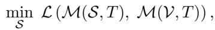

> 💡 **Eq.1 批读**: 标准的 token pruning 目标函数。$\mathcal{L}$ 衡量用子集 $\mathcal{S}$ 和全集 $\mathcal{V}$ 分别输入 LLM 后输出的差异。目标是找到使差异最小的子集。

where $\mathcal{M}(\cdot, T)$ denotes the output of the vision-language model given visual input (either $\mathcal{V}$ or $\mathcal{S}$) and text input $T$, and $\mathcal{L}$ is a function to measure the output difference of LLM.

---

**Saliency-based Visual Token Pruning.** The saliency-based visual token pruning methods aim to reduce token redundancy by retaining the most salient visual tokens while discarding the less informative ones. The core challenge lies in how to effectively measure the saliency of each visual token. Several prior works [7, 41, 49, 43] estimate saliency by leveraging attention scores. Specifically, the attention matrix $\mathbf{A}$ is calculated as:

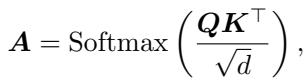

> 💡 **Eq.2 批读**: 标准 self-attention 公式。这里关键的是 **CLS token 对其他 visual token 的 attention weight** 被用作 saliency score。

where $d$ is the embedding dimension, $Q$ and $K$ is the query and key matrices in the standard attention mechanism. These attention scores indicate the interaction strength between tokens, guiding the identification of highly salient tokens. In practice, in the vision encoder of CLIP [34], the [CLS] token is used to aggregate global information from the entire image. Therefore, the attention scores from the [CLS] token to the visual tokens serve as a reasonable proxy for token saliency. Based on these saliency scores, token pruning methods typically adopt a top-k selection strategy to retain only the most salient visual tokens. This approach effectively reduces visual token redundancy and significantly accelerates MLLM inference across various tasks.

> 💡 **Saliency-based 方法总结**: CLS→visual tokens 的 attention weight 作为 saliency proxy → top-k 选择。简单有效但有局限。

---

## 3.2 Coverage Analysis

> 💡 **3.2 要点预览**: 引入 θ-coverage 度量来量化 token 子集的语义覆盖程度，实验证明 saliency-only 的覆盖率甚至不如随机选择。

Although saliency-based pruning methods can effectively identify important tokens based on attention scores, they inevitably discard certain semantically critical tokens that are essential for comprehensive visual understanding. Semantic completeness, however, is crucial for accurately responding to a wide range of instruction prompts in MLLMs. Furthermore, saliency-based approaches often suffer from highly skewed attention distributions, where a small subset of tokens receives disproportionately high attention, while the remaining tokens exhibit nearly uniform (i.e., flat) attention values. This skewness undermines token discriminability, making it challenging to distinguish between potentially informative tokens and truly redundant ones. To quantitatively assess the representational completeness of the selected tokens, we introduce the notion of the θ-coverage (see Definition 1), which measures the degree to which the retained tokens cover the semantic space of the full token set.

> 💡 **问题再强调**: Saliency-based 方法有两个根本问题——(1) 丢语义 (2) 偏斜分布导致 tail tokens 不可区分。需要一个量化指标来衡量覆盖度。

---

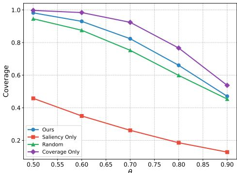
*Figure 2: Comparison of θ-coverage across different token pruning criteria. The experiments are conducted on the MME benchmark, with 64 tokens selected out of the original 576 in LLaVA 1.5 7B.*

> 💡 **Figure 2 批读**:
> - **关键发现**: Saliency Only 的 θ-coverage 在所有 θ 值下都**低于 Random**！这说明纯 saliency 选择不仅不能保证覆盖，反而因为 token 集中而降低了覆盖
> - Coverage Only 覆盖最高但不考虑重要性
> - **SCOPE 在 saliency 和 coverage 之间取得平衡**，覆盖率接近 Coverage Only 同时保留了 saliency 信息

---

**Definition 1 (θ-Coverage).** Let $\mathcal{V} = \{v_i \in \mathbb{R}^d \mid i = 1, ..., n\}$ denote the full set of tokens extracted from an input image, and let $\mathcal{V}' \subseteq \mathcal{V}$ be a subset of selected tokens. For a given similarity threshold $\theta \in [0, 1]$, we say that a token $v \in \mathcal{V}$ is covered by $\mathcal{V}'$ if there exists at least one token $v' \in \mathcal{V}'$ such that their cosine similarity satisfies:

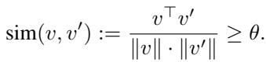

The θ-coverage of $\mathcal{V}'$ over $\mathcal{V}$ is then defined as the proportion of tokens in $\mathcal{V}$ that are covered by $\mathcal{V}'$:

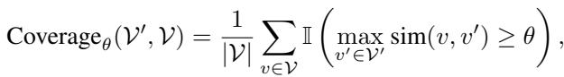

where $\mathbb{I}(\cdot)$ is the indicator function, which equals 1 if the condition holds and 0 otherwise.

> 💡 **θ-Coverage 定义批读**:
> - 核心思想：一个 token $v$ 被"覆盖"当且仅当选中的子集里有至少一个 token 跟它的 cosine similarity ≥ θ
> - θ-coverage = 被覆盖的 token 占全部 token 的比例
> - θ 越大，要求越严（需要更相似才算覆盖），覆盖率越低
> - 这是一个 **hard threshold 指标**，简洁但可能有些粗糙

---

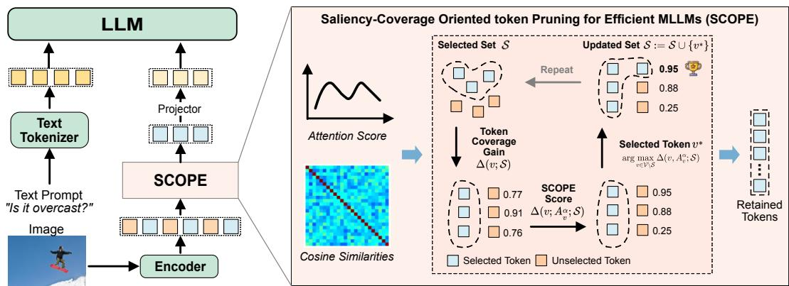
*Figure 3: An overview of the proposed visual token pruning framework. The left part illustrates how our method reduces the number of visual tokens before feeding them into the LLM, thereby accelerating inference in MLLMs without requiring additional model training. The right part provides a detailed view of our SCOPE method, which jointly optimizes saliency and coverage to select a compact yet semantically representative subset of visual tokens.*

> 💡 **Figure 3 批读**:
> - **左半部分**: 整体流程——Image → Vision Encoder → SCOPE pruning → LLM。Pruning 在 vision encoder 之后、LLM 之前
> - **右半部分**: SCOPE 的核心——迭代选择过程，每步选 SCOPE score = coverage gain × saliency 最高的 token
> - 注意：pruning 位置在 vision encoder 之后，这样能利用 CLS attention 做 saliency，同时用 token embedding 算 coverage

---

This definition provides a semantic-aware metric to quantify how well the selected tokens set $\mathcal{V}'$ represents the full set. A higher value of θ imposes a stricter similarity criterion, typically leading to lower coverage but ensuring that the retained tokens are more semantically representative.

In particular, we present the θ-coverage results on the MME benchmark in Fig. 2. The Saliency Only method selects dominant tokens solely based on the attention scores from the CLS token. However, it consistently exhibits low coverage across different values of θ, even performing worse than the random selection baseline. This observation suggests that although the saliency-based method captures dominant information, it tends to overlook a substantial amount of semantic content. In contrast, our method (detailed in Sec.3.3) incorporates saliency scores into a coverage-aware selection framework, striking a better balance between saliency and semantic coverage. As a result, it achieves significantly higher coverage compared to the Saliency Only method.

> 💡 **Coverage Analysis 小结**: Saliency Only 覆盖率 < Random，这是本文最有力的 motivation 之一。说明高 attention token 高度集中在小区域，选了一堆"近邻"而非"代表"。

---

## 3.3 Saliency-Coverage Oriented Token Pruning

> 💡 **3.3 要点预览**: SCOPE 的完整公式推导——从 set-coverage → token-coverage gain → SCOPE score → 贪心迭代算法。

In contrast to saliency-based pruning methods, our goal is to jointly optimize saliency and coverage in the visual token selection process. This enables the pruning algorithm to not only preserve the most informative tokens but also maximize the semantic coverage of the selected subset. As a result, the retained tokens are both highly informative and semantically diverse, thereby maintaining semantic completeness under a constrained token budget, which is an essential property for comprehensive visual understanding across a wide range of multimodal tasks.

In the following, we first define the notion of coverage for selected tokens. Next, we introduce the concept of token-coverage gain, i.e., the additional coverage obtained by including a new token in the selected set [14]. Finally, we incorporate the saliency score into the token-coverage gain formulation to balance both selection criteria. The overview of the proposed method is presented in Fig. 3.

> 💡 **方法路线图**: Set-coverage → Token-coverage gain → SCOPE score。三步走。

---

**Set-coverage for selected tokens.** To quantify semantic coverage, we measure the similarity between token vectors using cosine similarity. We first define the individual coverage score $C(\bar{u}, \mathcal{S})$ for a token $u \in \mathcal{V}$ by a set of selected tokens $\mathcal{S} \subseteq \mathcal{V}$ as:

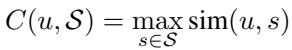

where sim$(u, s)$ is the cosine similarity metric between token $u$ and token $s$. The overall coverage of the selected subset $\mathcal{S}$ is defined as the sum of the maximum similarities between each token in the full set $\mathcal{V}$ and its most similar token in $\mathcal{S}$:

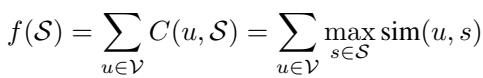

> 💡 **Eq.5-6 批读**:
> - $C(u, \mathcal{S})$: token $u$ 被子集 $\mathcal{S}$ 覆盖的程度 = 与 $\mathcal{S}$ 中最相似 token 的 cosine similarity
> - $f(\mathcal{S})$: 子集 $\mathcal{S}$ 的总覆盖 = 所有 token 的个体覆盖之和
> - 注意这里用的是 **soft coverage**（cosine similarity 值），不是 Sec 3.2 的 hard θ-coverage（0/1 指标）
> - $f(\mathcal{S})$ 是 **submodular function**（最大值之和），这保证了贪心算法有理论近似保证

This formulation encourages the selection of tokens that are semantically diverse and broadly representative of the input space. Intuitively, it ensures that each token in the full set has at least one similar counterpart in the selected subset, thus preserving information while reducing the token count.

---

**Token-coverage Gain.** To quantify the contribution of each candidate token $v \in \mathcal{V} \setminus \mathcal{S}$, we evaluate its marginal gain with respect to the current subset $\mathcal{S}$ [14]. The marginal gain is defined as the increase in total coverage achieved by including $v$, and can be formally expressed as follows:

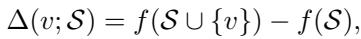

Expanding this definition using Eq. (6), we can express the marginal gain as the sum of the new coverage provided by $v$ to each token $u$ that was not already fully covered by $\mathcal{S}$:

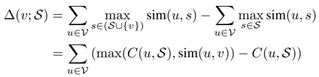

> 💡 **Eq.7-8 批读**:
> - Marginal gain Δ(v; S) = 加入 token v 后总覆盖的增量
> - 展开后：对每个 token u，计算 max(当前覆盖, 与 v 的相似度) - 当前覆盖
> - 只有当 sim(u,v) > C(u,S) 时才有正增益 → v 能"覆盖"那些还没被很好代表的 token
> - 这就是经典的 **submodular marginal gain**，与 facility location / k-medoids 问题密切相关

This quantifies how much additional coverage is achieved by selecting token $v$, taking into account its ability to represent other tokens $u \in \mathcal{V}$ that are not yet well-represented by the current subset $\mathcal{S}$.

---

**SCOPE score.** While the token-coverage gain considers only the geometric coverage in semantic space, it overlooks the intrinsic information carried by individual tokens. To address this limitation, we propose the SCOPE gain, which incorporates token saliency into the coverage gain to better preserve visual token information. Specifically, we integrate the visual attention score into the coverage gain function as follows:

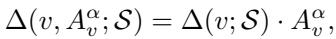

where $A_v^\alpha$ denotes the attention score of the visual token $v$, and $\alpha$ is a scaling factor. The token $v^*$ with the highest SCOPE gain is selected and added to the subset $\mathcal{S}$:

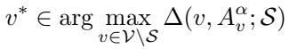

> 💡 **Eq.9-10 批读（SCOPE 核心）**:
> - **SCOPE score = Coverage Gain × Saliency^α**
> - 这是一个乘法组合：coverage gain 高但 saliency 低的 token 会被降权，反之亦然
> - α 控制 saliency 的影响强度：α=0 → 纯 coverage；α→∞ → 纯 saliency
> - 默认 α=1.0
> - 贪心迭代：每步选 SCOPE score 最高的 token，更新覆盖状态，重复直到选够 K 个

This process is iteratively repeated until the desired subset size is reached. The pseudocode of the proposed pruning method is presented in Algorithm 1.

---

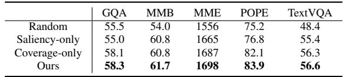
*Algorithm 1: SCOPE*

> 💡 **Algorithm 1 批读**:
> - 初始化空集 S，coverage scores $c_u = 0$
> - 每轮迭代：
>   1. 对每个候选 v，计算 marginal gain Δ(v; S) = Σ_u [max(S_uv, c_u) - c_u]
>   2. 选 Δ(v; S) · A_v^α 最大的 v*
>   3. 更新 S 和 coverage scores
> - **时间复杂度**: O(K·N²)——K 轮迭代，每轮扫 N 个候选，每个候选算 N 个 token 的增益
> - **实际开销**: 对 N=576, K=64，约 576²×64 ≈ 21M 次运算，很轻量

---

**Integration into MLLMs.** The proposed method is applicable to a wide range of MLLMs. In this work, we apply it to the widely adopted LLaVA[26] and LLaVA-Next [25] models, following prior studies [7, 49, 41]. Our method is integrated after the vision encoder to maximize information retention post token pruning. This enables the language model to receive more complete visual signals, thereby supporting comprehensive visual understanding without compromising performance. Our method is train-free and significantly accelerates the inference of MLLMs with minimal performance degradation. For example, our approach preserves over 96% of the original model's performance while reducing the number of visual tokens by a factor of 8 in LLaVA 1.5 7B.

> 💡 **集成位置**: Vision Encoder 之后、LLM 之前。这是最自然的位置——(1) 可用 CLS attention 做 saliency (2) token embedding 已经充分编码语义信息 (3) 不需要改 LLM 任何东西。

---

## 🔖 Section 总结

### 关键公式速查
| 公式 | 含义 |
|------|------|
| $C(u, \mathcal{S})$ | Token u 被子集 S 覆盖的程度（max cosine sim） |
| $f(\mathcal{S})$ | 子集 S 的总覆盖分数 |
| Δ(v; S) | Token v 的 coverage marginal gain |
| **SCOPE = Δ(v; S) · A_v^α** | **核心：coverage gain × saliency** |

### 核心洞察
1. **θ-coverage 揭示问题**: Saliency-only 覆盖率甚至低于 random，因为高 attention token 聚集在小区域
2. **Submodular optimization**: Coverage function f(S) 是 submodular 的，保证贪心算法有 (1-1/e) 近似比
3. **乘法组合**: SCOPE score 用乘法而非加法组合 saliency 和 coverage，这让两者都能发挥 veto power
4. **α 超参数**: 控制 saliency vs coverage 的平衡，默认 1.0，实验证明是最优
