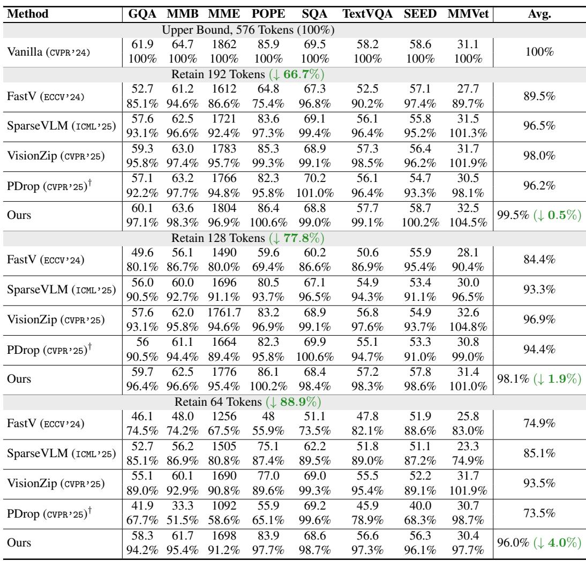
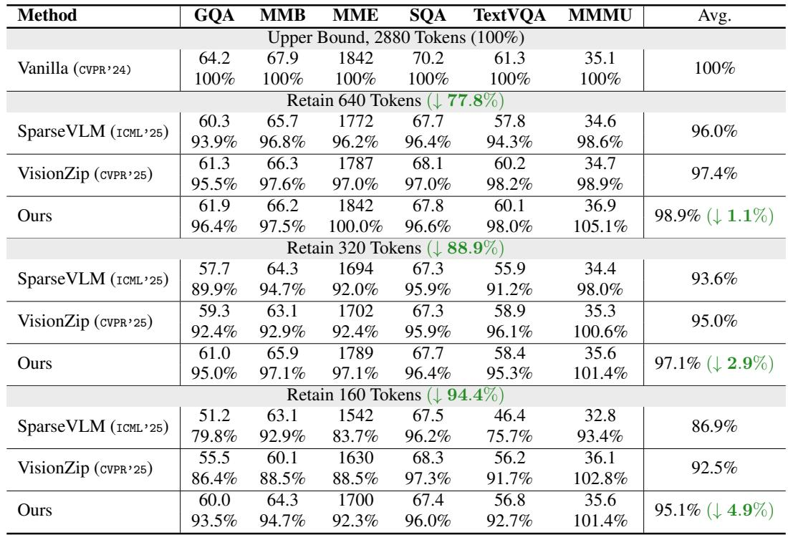
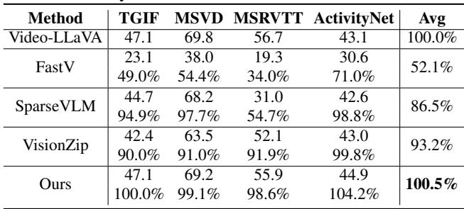
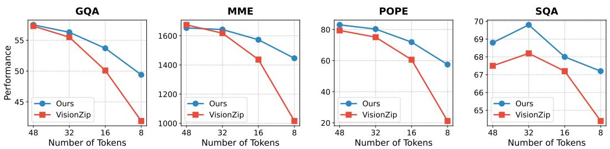
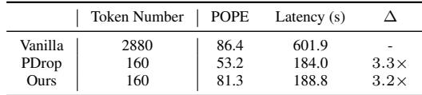
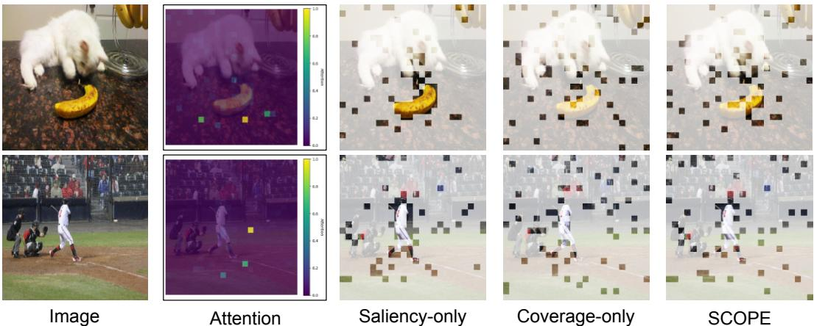

[← 返回 README](../README.md)

# 4 Experiment

## 📌 预览
实验部分涵盖：(1) LLaVA-1.5 和 LLaVA-Next 上的主实验；(2) 视频 benchmark；(3) 极端压缩、消融实验、效率分析和可视化。

---

## 4.1 Experiments Setup

**Evaluation Benchmarks and Baselines.** Following prior work[49], we evaluate the effectiveness of the proposed method using a set of widely adopted multimodal benchmarks. Specifically, these include GQA [13], MMBench[27], POPE [22], ScienceQA[29], TextVQA [36], SEEDBench[18], and MMVet [45]. We also compare against several state-of-the-art baselines, including FastV[7], SparseVLM [49], VisionZip[43], and PDrop [41]. For the video benchmarks, we evaluate the MLLMs on the benchmarks TGIF [15], MSVD [5], MSRVTT [42], and ActivityNet [46]. For further details on evaluation benchmarks and metrics, we refer the reader to the Appendix B.

> 💡 **实验设置总结**:
> - **图像 Benchmarks**: GQA, MMBench, MME, POPE, SQA, TextVQA, SEED, MMVet（8个）
> - **视频 Benchmarks**: TGIF, MSVD, MSRVTT, ActivityNet（4个）
> - **Baselines**: FastV, SparseVLM, VisionZip, PDrop
> - **模型**: LLaVA-1.5 (7B/13B), LLaVA-Next (7B/13B), Video-LLaVA

**Implementation Details.** We integrate the proposed method into LLaVA 1.5 [26] and LLaVA-Next [25] for image understanding and Video-LLaVA [23] for video understanding. The pruning module is inserted after the vision encoder. The saliency score is derived from the attention weights of visual tokens with respect to the CLS token at the second-to-last layer (layer -2) of the vision encoder. The scaling factor α is set to 1.0 by default. Our implementation is based on the lmms-evals [48] package. We conduct the experiments on 4×A100 GPUs. The inference batch size is set to 1 for all the evaluation results.

> 💡 **关键实现细节**:
> - Saliency 来自 ViT **倒数第二层** (layer -2) 的 CLS attention
> - α = 1.0
> - 基于 lmms-eval 评测框架
> - 4×A100 GPUs, batch size = 1

---

## 4.2 Main Results

### Results on LLaVA 1.5

*Table 1: Performance comparison under different vision token configurations. We evaluate the LLaVA 1.5 7B model, where the default number of visual tokens is 576. The first row for each method reports the raw accuracy across benchmarks, and the second row indicates the performance relative to the upper bound. † denotes the results adapted from [49].*

> 💡 **Table 1 批读（核心实验表）**:
> - **192 tokens (↓66.7%)**: SCOPE 99.5% vs VisionZip 98.0% vs SparseVLM 96.5% → SCOPE 几乎无损
> - **128 tokens (↓77.8%)**: SCOPE 98.1% vs VisionZip 96.9% → 差距拉开
> - **64 tokens (↓88.9%)**: SCOPE **96.0%** vs VisionZip 93.5% vs SparseVLM 85.1% → 极端压缩下优势巨大
> - **亮点**: 192 tokens 时 POPE 100.2%, MMVet 104.5% → 超过原模型！说明剪掉冗余 token 反而减少干扰
> - FastV 在极端压缩下崩溃（64 tokens 仅 74.9%），说明 LLM 内部 attention 做 pruning 不如 ViT CLS attention

LLaVA 1.5 is one of the most representative MLLMs. We therefore apply the proposed pruning method to LLaVA 1.5 and evaluate its performance on a variety of image understanding tasks, following prior works [41, 49, 43]. Due to the diverse evaluation metrics used across different benchmarks, which result in inconsistent numerical scales, we report performance as a percentage of the original model's accuracy. We show the results of LLaVA 1.5 7B in Table 1. In particular, we follow previous work [49, 43] and evaluate the performance under three visual token pruning budgets (i.e., 192, 128, and 64) to evaluate the effectiveness of the proposed method. The vanilla model (i.e., LLaVA 1.5 7B with full visual tokens) serves as the upper bound (100%), representing the performance ceiling of any visual token pruning approach. Our method consistently outperforms existing approaches across all token configurations, particularly under aggressive compression settings. As shown in Table1, when retaining only 192 tokens (a 66.7% reduction from the baseline), our method achieves an average accuracy of 99.5% relative to the upper bound. This surpasses state-of-the-art baselines including FastV [7] (+6.0%), SparseVLM[49] (+3.0%), and VisionZip [43] (+1.5%). Under extreme compression (e.g., 64 tokens, 88.9% reduction), our method maintains 96.0% of the original performance, significantly outperforming baselines such as VisionZip [43] (93.5%) and SparseVLM [49] (85.1%).

Surprisingly, our method preserves or even surpasses the upper bound in performance on several benchmarks. For instance, we observe relative accuracies of 100.2% and 104.5% on POPE [22] and MMVet [45], respectively, when using 192 tokens. These results suggest that visual tokens in MLLMs contain redundancy, and our method not only reduces this redundancy but also improves performance by eliminating interference from redundant information. We further evaluate our method on the larger LLaVA 1.5 13B model to validate its generalization capability in Appendix C.1.

> 💡 **超过 upper bound 的解释**: 冗余 token 不仅浪费计算，还可能产生干扰（noise）。剪掉它们相当于去噪，所以性能反而提升。这是 token pruning 领域常见的现象。

---

### Results on LLaVA-Next

*Table 2: Performance comparison under different vision token configurations. The evaluated model is LLaVA-Next 7B. The vanilla number of vision tokens is 2,880. The first line of each method is the raw accuracy of benchmarks, and the second line is the proportion relative to the upper bound.*

> 💡 **Table 2 批读（LLaVA-Next）**:
> - LLaVA-Next 原始 2880 tokens（5×576），压缩空间更大
> - **640 tokens (↓77.8%)**: SCOPE 98.9% → 几乎无损
> - **320 tokens (↓88.9%)**: SCOPE 97.1% vs VisionZip 95.0% vs SparseVLM 93.6%
> - **160 tokens (↓94.4%)**: SCOPE **95.1%** vs VisionZip 92.5% vs SparseVLM 86.9%
> - 极端压缩下 SCOPE 领先 VisionZip 2.6%，领先 SparseVLM 8.2%

Compared to LLaVA 1.5, LLaVA-Next is a more advanced MLLM that supports high-resolution image processing, thereby significantly improving vision-language understanding. LLaVA-Next partitions an input image into multiple regions based on its original size. Usually, the image is divided into 4 sub-images. Both the original and partitioned images are then encoded into visual tokens, resulting in a total of 2,880 tokens (576×5). While effective in capturing fine-grained visual details, this strategy substantially increases the number of visual tokens and reduces inference efficiency. Therefore, our objective is to minimize the number of visual tokens while maintaining performance as much as possible. To evaluate the proposed method on LLaVA-Next, we follow previous works [49, 43] and adopt three visual token budget settings (i.e., 640, 320, and 160). The results are presented in Table 2. As shown, our method consistently outperforms state-of-the-art approaches under all configurations. Specifically, when retaining only 640 tokens, our approach achieves an average accuracy of 98.9% relative to the upper bound. Under extreme compression (e.g., 160 tokens, 94.4% reduction), our method maintains 95.1% performance, significantly surpassing baselines such as SparseVLM (86.9%) and VisionZip (92.5%). These results further validate the effectiveness of the proposed method across different MLLM architectures. We also evaluate our method on the LLaVA-Next 13B model in Appendix C.1.

---

### Results on Video benchmarks

*Table 3: Performance comparison on Video-LLaVA. The original Video-LLaVA's video token number is 2048, while our method only retains the 136 tokens.*

> 💡 **Table 3 批读（视频）**:
> - Video-LLaVA 原始 2048 tokens → 136 tokens（15× 压缩）
> - SCOPE 平均 **100.5%** → 超过原模型！
> - FastV 崩溃到 52.1%，SparseVLM 86.5%，VisionZip 93.2%
> - **视频的冗余性远超图像**（相邻帧大量重复），这正是 coverage-based 方法的优势场景

*Figure 4: The performance comparison under extreme token number.*

> 💡 **Figure 4 批读**:
> - 随着 token 数从 64 降到 8，SCOPE 和 VisionZip 的差距越来越大
> - 在 8 tokens 的极端情况下，SCOPE 仍然维持相当性能，VisionZip 急剧下降
> - 说明 coverage 机制在极低 budget 下的价值更突出

Results on Video benchmarks. We further evaluate the effectiveness of the proposed method, and we implement our SCOPE based on VideoLLaVA following VisionZIP [43]. The results are reported in Table 3. As shown, our method achieves the best performance among all compared methods. Surprisingly, even with aggressive pruning, our method almost fully preserves the original performance. This demonstrates the strong effectiveness of our method on video-language tasks. These findings also suggest that video benchmarks contain substantial redundancy, and token pruning has great potential for accelerating video LLMs without sacrificing performance.

---

## 4.3 Analysis

### Ablation Studies

*Table 4: Ablation studies of the proposed method.*

> 💡 **Table 4 批读（消融实验）**:
> - **Random**: 基线（55.5, 54.0, 1556, 75.2, 48.4）
> - **Saliency-only**: 在 MME 上比 Random 好不少（1665 vs 1556），但 GQA 反而略差（55.0 vs 55.5）
> - **Coverage-only**: 全面优于 Saliency-only，尤其 POPE（82.1 vs 76.8）→ coverage 单独的价值就很大
> - **SCOPE (full)**: 进一步提升，说明 saliency 和 coverage 是互补的
> - **洞察**: Coverage > Saliency > Random，但 Saliency + Coverage > Coverage alone

---

### Efficiency Analysis

*Table 5: Efficiency analysis of our method on LLaVA-Next 7B. The experiments are conducted on a system equipped with 4×A100. Δ denotes the reduction ratio.*

> 💡 **Table 5 批读（效率分析）**:
> - 2880→160 tokens: SCOPE 延迟 188.8s vs Vanilla 601.9s → **3.2× 加速**
> - PDrop 延迟 184.0s（3.3×），但 POPE 仅 53.2%（崩溃）
> - SCOPE 延迟只比 PDrop 多 4.8s（2.6%），但性能差 28.1 个百分点
> - **结论**: SCOPE 的 coverage 计算开销几乎可忽略

As shown in Table 4, our method, which jointly considers token saliency and coverage, consistently outperforms its ablated variants (saliency-only and coverage-only) across all benchmarks. Both ablated models still perform better than the random baseline, indicating the individual effectiveness of each component. For instance, the coverage-only variant achieves moderate performance. However, our full method further improves these results, demonstrating that combining saliency and coverage provides complementary benefits. Explicit modeling of both saliency and coverage leads to superior performance compared to using either criterion alone or selecting tokens randomly.

Efficiency Analysis. Table 5 compares the efficiency of our method with that of a baseline pruning approach (PDrop) on LLaVA-Next 7B. Despite reducing the number of visual tokens from 2,880 to 160, a compression ratio exceeding 18×, our method maintains strong performance on the POPE metric (81.3% vs. 86.4%), demonstrating that our token selection strategy effectively preserves semantic completeness. In contrast, PDrop [41] exhibits a substantial performance drop (53.2%), likely due to its reliance on saliency-based pruning, which may overlook less attended yet semantically important regions. Although our method incurs slightly higher latency than PDrop, it still achieves a 3.2× speedup over the full-token baseline. This indicates that our saliency-coverage oriented pruning strategy is not only effective in preserving performance but also computationally efficient in practice.

---

### Token Pruning Visualization

*Figure 5: Visualization of token pruning among different pruning strategies.*

> 💡 **Figure 5 批读**:
> - **Saliency-only**: Token 全集中在显著物体上（猫、香蕉）→ 背景完全丢失
> - **Coverage-only**: Token 均匀分布 → 覆盖好但可能错过重要物体的细节
> - **SCOPE**: 物体区域 token 密度高 + 背景稀疏分布 → 兼顾重要性和覆盖度
> - 这种"物体密 + 背景疏"的分布模式非常直观合理

Token Pruning Visualization. In Fig. 5, we provide a visualization of token pruning to illustrate the difference of selected tokens among different strategies. Saliency-only mainly concentrates on the most salient patch such as the cat and banana in 1st row, demonstrating object-level focus by pruning the background. Coverage-only selects the tokens that are spread across the image, preserving global context but potentially missing important object details. Our SCOPE maintains the high token density on salient patches (e.g., cat and banana in 1st row), while a sparse set of tokens is strategically kept for the background. This captures critical object features without discarding essential scene context.

---

## 🔖 Section 总结

### 关键数字速查
| 配置 | 模型 | Tokens | SCOPE 性能保留 | 最佳 baseline |
|------|------|--------|---------------|--------------|
| Image | LLaVA-1.5 7B | 64 (↓88.9%) | **96.0%** | VisionZip 93.5% |
| Image | LLaVA-1.5 7B | 192 (↓66.7%) | **99.5%** | VisionZip 98.0% |
| Image | LLaVA-Next 7B | 160 (↓94.4%) | **95.1%** | VisionZip 92.5% |
| Video | Video-LLaVA | 136 (↓93.4%) | **100.5%** | VisionZip 93.2% |
| 加速 | LLaVA-Next 7B | 160 | **3.2×** | - |

### 核心洞察
1. SCOPE 在所有配置下都优于 baselines，极端压缩时优势更明显
2. Coverage-only > Saliency-only > Random，两者结合互补
3. 视频场景冗余更大，SCOPE 甚至能超过原模型
4. SCOPE 的额外计算开销几乎可忽略（vs PDrop 仅多 2.6% 延迟）
