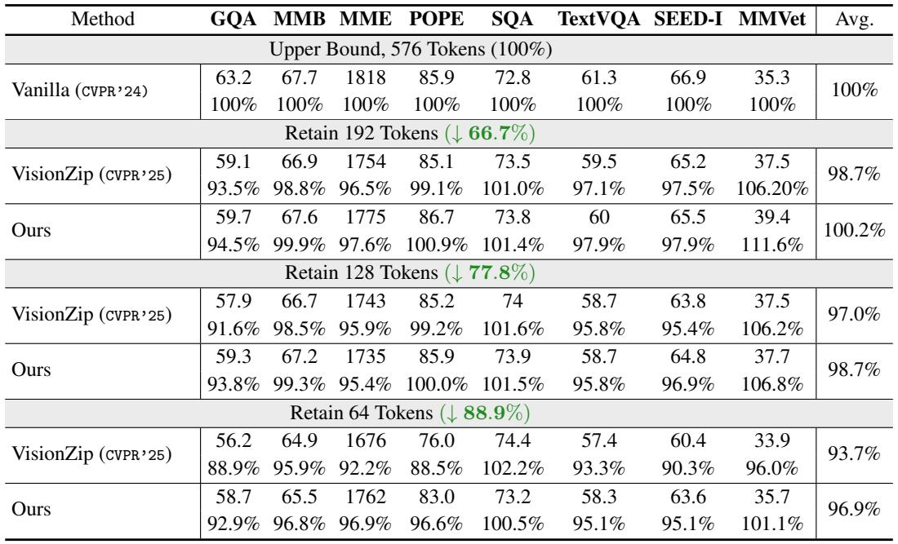
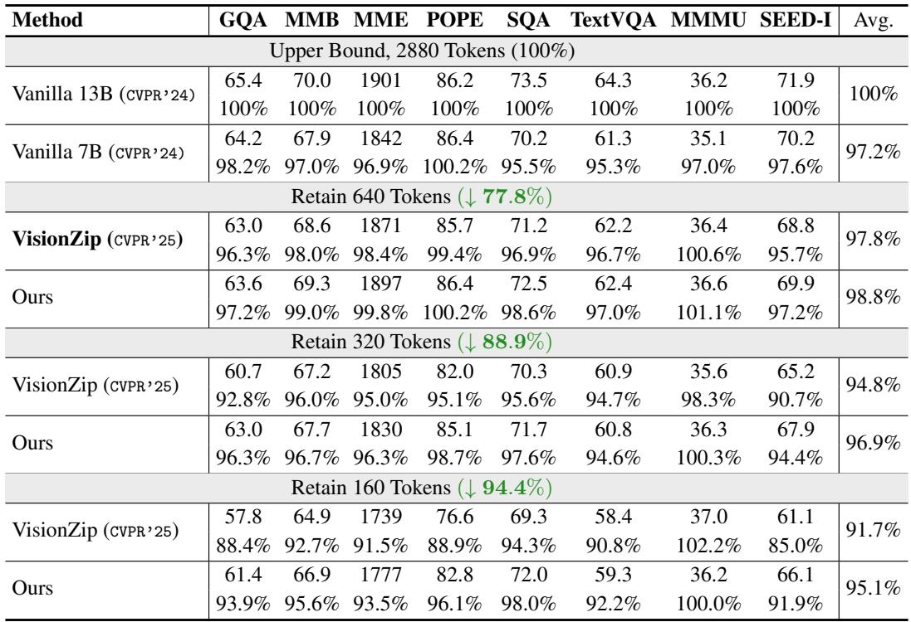
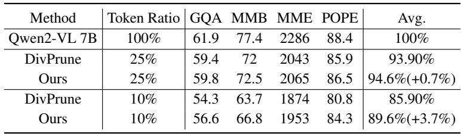
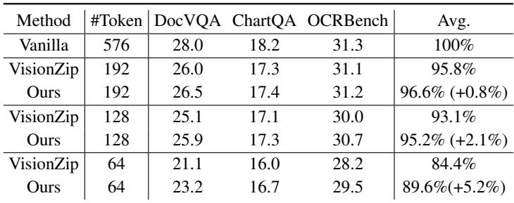
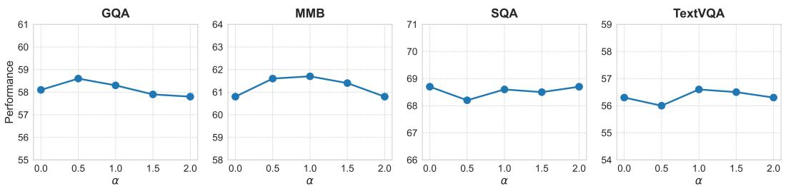
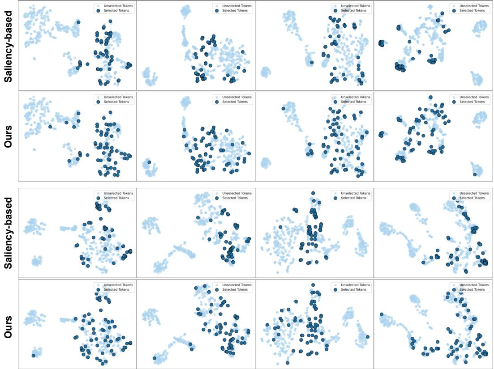
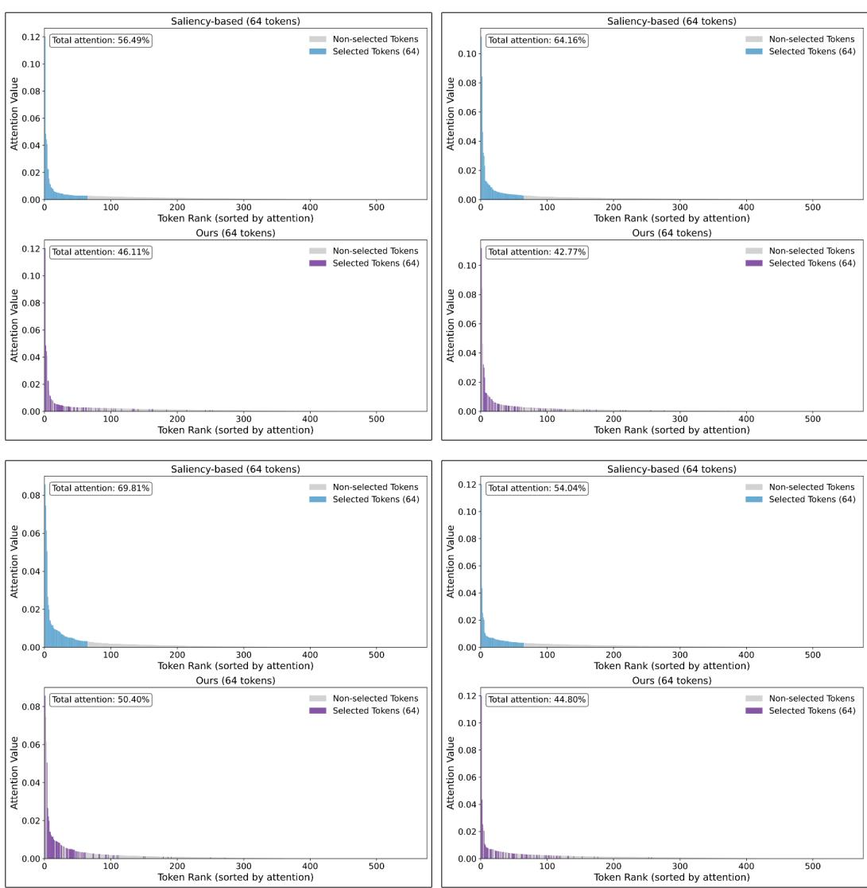

[← 返回 README](../README.md)

# Appendix

## 📌 预览
附录包含：Benchmark 详细描述、13B 模型结果、Qwen2-VL 结果、OCR benchmark 结果、超参数分析、可视化、Broader Impact 和 Limitations。

---

## A Overview

This appendix provides detailed information on the experimental benchmarks, additional qualitative results, and visualizations that support the main claims of the paper. In Section B, we present comprehensive descriptions of the benchmark datasets. Section C includes supplementary experiments, such as results on larger models (LLaVA 1.5 13B and LLaVA-Next 13B), as well as a hyperparameter analysis. In Section D, we provide additional visualization studies to further illustrate the behavior of our method. Finally, we discuss the broader impact and limitations of our work.

---

## B Benchmarks

> 💡 **Benchmark 概览**: 8 个图像 benchmark + 4 个视频 benchmark，覆盖 VQA、推理、幻觉检测、OCR 等多个维度。

**GQA** [13]. The GQA benchmark consists of three components: scene graphs, questions, and images. The questions in GQA are crafted to evaluate visual scene understanding and reasoning about various aspects of an image. Our method is evaluated on the subset of "testdev_balanced_instructions", which includes 12,578 samples.

**MMBench** [27]. MMBench is a comprehensive benchmark designed to evaluate the multi-modal capabilities of large language models, covering a wide range of tasks. It provides a fine-grained assessment from perception to cognition, containing approximately 3,000 multiple-choice questions.

**MME** [12]. The MME benchmark comprises 14 distinct subtasks targeting both perceptual and cognitive capabilities. We evaluate the performance on the dev split including 4,377 samples.

**POPE** [22]. The POPE benchmark focuses on assessing object hallucination in models by presenting targeted yes/no questions about object existence within images. We evaluate on the test split including 9,000 samples. The evaluation metric is the F1 score.

**ScienceQA (SQA)** [29]. Encompassing a wide array of scientific fields, SQA structures its questions through a hierarchical framework consisting of 26 topics, 127 categories, and 379 distinct skills.

**TextVQA** [36]. TextVQA is designed to assess a model's capability to interpret and reason over textual content embedded in images. We evaluate on the test split including 5,000 samples.

**SEEDBench** [18]. SEEDBench features 19,000 multiple-choice questions covering 12 evaluation dimensions for both images and videos.

**MMVet** [45]. MMVet identifies six essential vision-language capabilities and evaluates sixteen specific combinations. We evaluate on the test split including 218 samples, scored by GPT.

---

## C Additional Experiments

### C.1 Results on LLaVA 1.5 13B

*Table 6: Performance comparison under different vision token configurations. The evaluated model is LLaVA 1.5 13B, where the default number of visual tokens is 576.*

> 💡 **Table 6 批读（13B 模型）**:
> - 192 tokens: SCOPE 100.2% vs VisionZip 98.7% → 13B 上同样超过原模型
> - 64 tokens: SCOPE **96.9%** vs VisionZip 93.7% → 差距 3.2%
> - 13B 模型的鲁棒性比 7B 更好（64 tokens 下 96.9% vs 96.0%）

As shown in Table 6, our method consistently outperforms VisionZip [43] across all token budgets. With 192 tokens, our approach achieves 100.2% of the upper bound's average performance. The advantage becomes more evident as the token count decreases: at 64 tokens, our method retains 96.9% performance, compared to VisionZip's 93.7%. Notably, on benchmarks like MMVet [45] and POPE [22], our method even surpasses the original model's performance.

---

### C.2 Results on LLaVA-Next 13B

*Table 7: Performance comparison under different vision token configurations. The evaluated model is LLaVA-Next 13B. The vanilla number of vision tokens is 2,880.*

> 💡 **Table 7 批读（LLaVA-Next 13B）**:
> - 640 tokens: SCOPE 98.8% vs VisionZip 97.8%
> - 160 tokens: SCOPE **95.1%** vs VisionZip 91.7% → 差距 3.4%
> - 有趣：LLaVA-Next 7B 用 SCOPE 160 tokens (97.2%) 已经接近 13B vanilla (100%)
> - 说明 token pruning 能让小模型逼近大模型性能

We present the results on LLaVA-Next 13B in Table 7. Our method consistently outperforms VisionZip [43] under all token budgets. For example, with 640 tokens, our approach achieves 98.8% of the upper bound's average performance. As the token count decreases to 160, our method still retains 95.1% performance, while VisionZip drops to 91.7%.

---

### C.3 Results on Qwen2-VL

*Table 8: Results on Qwen2-VL. The token ratio means the ratio of retained tokens.*

> 💡 **Table 8 批读（Qwen2-VL 泛化性）**:
> - 25% token ratio: SCOPE 94.6% vs DivPrune 93.9% → +0.7%
> - 10% token ratio: SCOPE **89.6%** vs DivPrune 85.9% → **+3.7%**
> - 证明 SCOPE 不仅适用于 LLaVA 系列，也适用于完全不同架构的 Qwen2-VL
> - 极端压缩（10%）下优势更大，与之前结论一致

---

### C.4 Results on more OCR Benchmarks

*Table 9: Results on more OCR Benchmarks. The model is LLaVA 1.5 7B.*

> 💡 **Table 9 批读（OCR 任务）**:
> - 64 tokens: SCOPE 89.6% vs VisionZip 84.4% → **+5.2%**
> - OCR 任务对 token 信息密度要求更高，SCOPE 的 coverage 机制能保留更多分散的文字区域
> - 这证明 coverage 对 OCR 类任务特别重要（文字通常分布在图像各处）

---

### C.5 Hyper-parameter Analysis

*Figure 6: The hyperparameter α analysis on LLaVA 1.5 7B with 64 visual tokens.*

> 💡 **Figure 6 批读**:
> - α=1.0 在大多数 benchmark 上最优
> - α=0（纯 coverage）和 α 很大（偏向 saliency）都不如 1.0
> - α 对性能的影响相对平缓（0.5-2.0 范围内变化不大），说明方法对超参数不太敏感

---

## D Visualization Results

*Figure 7: The selected token comparison between the saliency-based method and our saliency-coverage oriented method. The total visual token number is 576, and the selected token number is 64.*

> 💡 **Figure 7 批读**: 更多可视化例子。Saliency-based 选的 token 总是聚集在少数显著区域（人脸、标志性物体），而 SCOPE 选的 token 同时覆盖了前景和背景。

---

*Figure 8: Attention distribution visualization for selected token. The total visual token number is 576, and the selected token number is 64. Our method retained most of the high attention tokens and some low attention tokens to maximize the coverage.*

> 💡 **Figure 8 批读**:
> - 上方：attention distribution（蓝色=saliency-only，橙色=SCOPE）
> - SCOPE 保留了大部分高 attention token（与 saliency-only 的 top 部分重叠）
> - 同时额外选了一些低 attention 但 coverage gain 高的 token
> - 这证实了 SCOPE 的设计意图：在保持显著性的同时补充覆盖度

---

## E Broader Impact

Our proposed method aims to improve both the efficiency and effectiveness of multimodal large language models (MLLMs) by reducing the number of visual tokens while preserving semantic completeness. This advancement has the potential to significantly reduce the computational cost and memory footprint of MLLMs, thereby enhancing their feasibility for deployment in resource-constrained environments such as edge devices, mobile platforms, and real-time applications.

However, as with any technology that enhances the scalability and accessibility of AI systems, there are potential societal risks. For example, more efficient MLLMs could be misused to generate or disseminate misinformation, enable invasive surveillance, or support other malicious activities, particularly when deployed at scale.

---

## F Limitations

While SCOPE demonstrates strong performance and efficiency gains across multiple benchmarks and model architectures, several limitations remain. (1) Despite our efforts to balance saliency and coverage, aggressive token pruning may still result in the loss of fine-grained or rare semantic information, potentially affecting tasks that require detailed visual understanding. (2) Our experiments are primarily based on widely used vision-language benchmarks and two representative MLLMs, LLaVA 1.5 and LLaVA-Next. Therefore, the generalizability of SCOPE to other tasks or model architectures has yet to be fully validated.

> 💡 **Limitations 批读**:
> 1. 极端压缩仍可能丢失细粒度信息 → 对需要精确细节的任务（如 fine-grained VQA）可能不够
> 2. 主要在 LLaVA 系列验证 → 虽然 C.3 补充了 Qwen2-VL，但更多架构（如 InternVL）还未测试
> 3. **我的补充**: 缺少与 training-based 方法的对比；没有分析 SCOPE 在不同图像类型（简单/复杂/文本密集）上的表现差异

---

## 🔖 Appendix 总结

### 核心发现
1. SCOPE 在 7B 和 13B 模型上都有效，13B 更鲁棒
2. 泛化到 Qwen2-VL 架构同样有效
3. OCR 任务上优势更明显（+5.2%），因为文字分布广泛需要 coverage
4. α=1.0 是最优超参数，且方法对 α 不敏感
