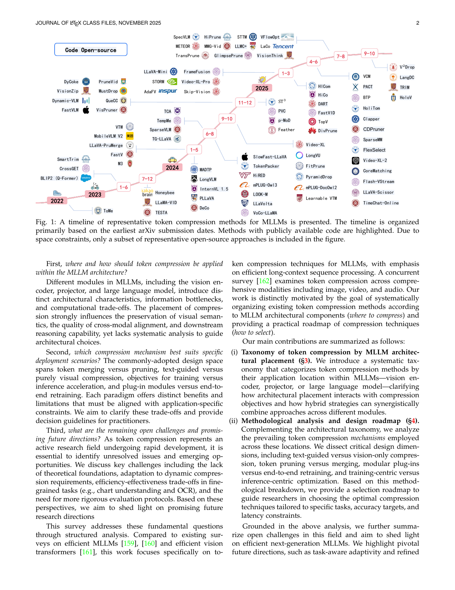

[← 返回 README](../README.md)

# 1. Introduction

## 📌 预览
Introduction 阐述了 MLLM token 压缩的动机（三个核心问题）、与已有 survey 的区别、以及本文三大贡献。

---

Multimodal Large Language Models (MLLMs) [1]–[11] rapidly advanced the frontier of vision-language joint perception, alignment, reasoning, and generation [12]–[17]. By integrating the remarkable language understanding capabilities of Large Language Models (LLMs) [18]–[22] with comprehensive visual perception abilities from vision encoders [23], contemporary systems such as LLaVA [24], Qwen-VL [25] and GPT-4o [26] exhibit strong performance on diverse tasks spanning open-ended visual question answering, document understanding, and multi-step visual reasoning, among others.

> 💡 **背景**: MLLM 整合了 LLM 的语言能力和 Vision Encoder 的视觉感知，LLaVA、Qwen-VL、GPT-4o 是代表。

However, these advanced cross-modal capabilities incur substantial computational costs. High-resolution images and long videos can generate hundreds to thousands of visual tokens, while multi-turn dialogue and chain-of-thought reasoning further extend the historical context [27]–[29]. As sequence lengths increase, the quadratic complexity of attention in Transformer-based MLLMs results in prohibitive memory consumption and latency, limiting both scalability and deployment. This tension between multimodal effectiveness and computational efficiency has made compressing multimodal token sequences an urgent research focus.

> 💡 **痛点量化**: 高分辨率图像 → 数百~数千 visual tokens；多轮对话 + CoT → 上下文更长。Transformer 的 O(n²) 注意力复杂度成为瓶颈。

To build more efficient MLLMs, token compressing multimodal token sequences refers to methods that reduce the number of tokens processed by MLLMs while preserving critical cross-modal semantics. Conceptually, compression targets redundancy in spatial structure (e.g., repetitive background regions), temporal continuity (e.g., frame-to-frame similarities), and modality alignment (e.g., text-conditioned visual irrelevance), yielding shorter sequences with minimal essential information degradation. Historically, token compression originated in unimodal vision through patch dropping, token merging, and dynamic sparsification in Vision Transformers [30]–[36]. These approaches have since been extended to multimodal settings, where compression can operate on visual streams, textual streams, or their fusion. As depicted in Figure 1, multimodal token compression techniques [37]–[54] have evolved rapidly since 2022 and experienced significant growth from 2024 onward. Recent works [55]–[64] extend this research direction from spatial images to long-horizon video understanding with extreme compression ratios, where aggressive token compression must be balanced against fine-grained localization, temporal coherence, and temporal grounding performance.

> 💡 **三类冗余**: (1) 空间冗余（重复背景）；(2) 时间冗余（相邻帧相似）；(3) 跨模态冗余（与文本无关的视觉区域）。Token compression 源自 ViT 领域（ToMe 等），2024 年后在 MLLM 领域爆发增长。

*Figure 1: A timeline of representative token compression methods for MLLMs. Methods with publicly available code are highlighted.*

> 💡 **Figure 1 批读**: 这张时间线图展示了 2022-2025 年间 token compression 方法的演进。可以看到 2024 年后方法数量爆发式增长，且越来越多方法开源。早期以 ToMe、BLIP-2 为代表，后来出现 FastV、VisionZip、PyramidDrop 等大量工作。

Despite steady progress in token compression, practitioners still face critical challenges in selecting or designing token compression strategies for MLLMs. This survey systematically examines the fundamental issues of token compression from three perspectives.

First, where and how should token compression be applied within the MLLM architecture?

Different modules in MLLMs, including the vision encoder, projector, and large language model, introduce distinct architectural characteristics, information bottlenecks, and computational trade-offs. The placement of compression strongly influences the preservation of visual semantics, the quality of cross-modal alignment, and downstream reasoning capability, yet lacks systematic analysis to guide architectural choices.

> 💡 **问题 1 — Where**: 压缩放在哪个模块？不同位置（VE / Projector / LLM）各有不同的信息瓶颈和计算权衡。

Second, which compression mechanism best suits specific deployment scenarios? The commonly-adopted design space spans token merging versus pruning, text-guided versus purely visual compression, objectives for training versus inference acceleration, and plug-in modules versus end-to-end retraining. Each paradigm offers distinct benefits and limitations that must be aligned with application-specific constraints. We aim to clarify these trade-offs and provide decision guidelines for practitioners.

> 💡 **问题 2 — How**: 选哪种压缩机制？涉及 merging vs. pruning、text-guided vs. vision-only、plug-in vs. retrain 等多个决策维度。

Third, what are the remaining open challenges and promising future directions? As token compression represents an active research field undergoing rapid development, it is essential to identify unresolved issues and emerging opportunities. We discuss key challenges including the lack of theoretical foundations, adaptation to dynamic compression requirements, efficiency-effectiveness trade-offs in fine-grained tasks (e.g., chart understanding and OCR), and the need for more rigorous evaluation protocols. Based on these perspectives, we aim to shed light on promising future research directions.

> 💡 **问题 3 — What's Next**: 理论基础缺失、动态压缩、细粒度任务的效率-效果权衡、评估标准不统一。

This survey addresses these fundamental questions through structured analysis. Compared to existing surveys on efficient MLLMs [159], [160] and efficient vision transformers [161], this work focuses specifically on token compression techniques for MLLMs, with emphasis on efficient long-context sequence processing. A concurrent survey [162] examines token compression across comprehensive modalities including image, video, and audio. Our work is distinctly motivated by the goal of systematically organizing existing token compression methods according to MLLM architectural components (where to compress) and providing a practical roadmap of compression techniques (how to select).

> 💡 **与已有 survey 的区别**: 不同于泛泛的 efficient MLLM survey，本文专注 token compression，按架构位置系统分类，并提供实用选择路线图。

Our main contributions are summarized as follows:

(i) Taxonomy of token compression by MLLM architectural placement (§3). We introduce a systematic taxonomy that categorizes token compression methods by their application location within MLLMs—vision encoder, projector, or large language model—clarifying how architectural placement interacts with compression objectives and how hybrid strategies can synergistically combine approaches across different modules.

(ii) Methodological analysis and design roadmap (§4). Complementing the architectural taxonomy, we analyze the prevailing token compression mechanisms employed across these locations. We dissect critical design dimensions, including text-guided versus vision-only compression, token pruning versus merging, modular plug-ins versus end-to-end retraining, and training-centric versus inference-centric optimization. Based on this methodological breakdown, we provide a selection roadmap to guide researchers in choosing the optimal compression techniques tailored to specific tasks, accuracy targets, and latency constraints.

> 💡 **两大贡献**: (1) 按 MLLM 架构位置的分类体系；(2) 方法论分析 + 选择路线图（涵盖 5 个关键决策维度）。

Grounded in the above analysis, we further summarize open challenges in this field and aim to shed light on efficient next-generation MLLMs. We highlight pivotal future directions, such as task-aware adaptivity and refined evaluation protocols, with the ultimate goal of making multimodal intelligence both powerful and affordable at scale.

---

## 🔖 Section 总结

### 核心洞察
1. **三个核心问题**: Where to compress? → How to select? → What's next?
2. **三类冗余**: 空间冗余、时间冗余、跨模态冗余
3. **领域爆发**: 2024 年后 token compression 方法数量急剧增长
4. **本文定位**: 按架构位置分类 + 提供实用选择路线图，区别于泛泛的 efficiency survey
