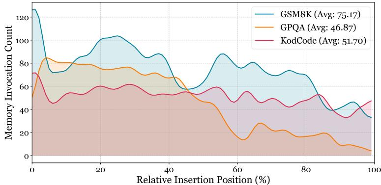
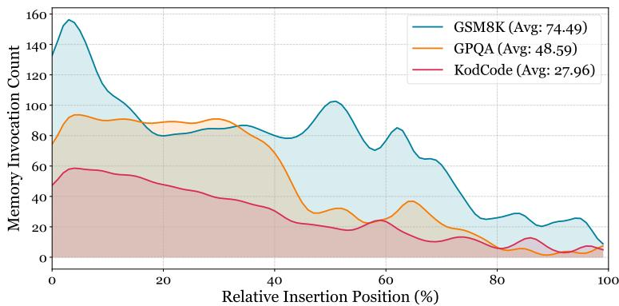
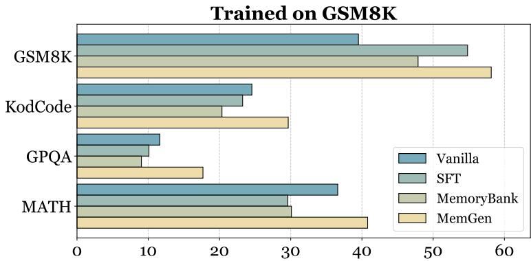
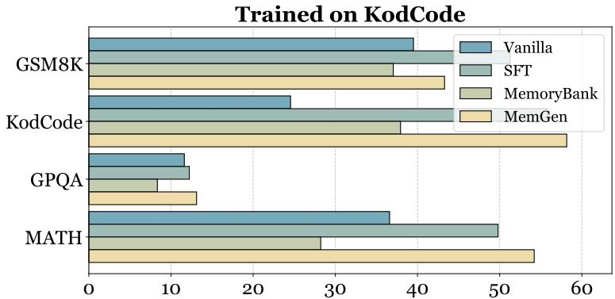
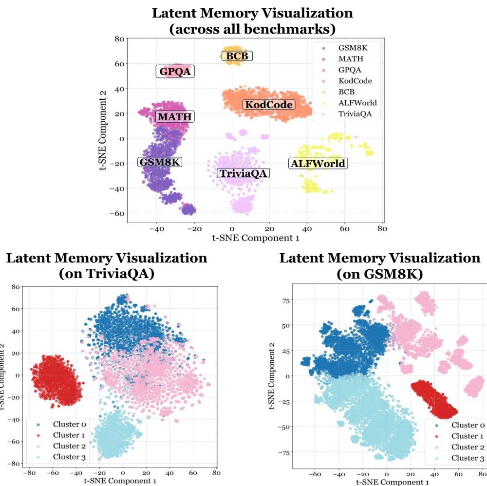

[← 返回 README](../README.md)

# Appendix

## A. Additional Related Works

（略，与 Section 2 内容重复。）

---

## B. Optimization Algorithm on Memory Weaver

The core principle is to update only the weaver's parameters θ' while keeping the reasoner π_θ frozen.

### B.1 Combining MemGen with SFT

The objective of SFT is to train the memory weaver to generate latent memories that guide the frozen reasoner π_θ to replicate the behavior observed in high-quality demonstration trajectories. The SFT loss:

$$\mathcal{L}_{\mathrm{SFT}}(\theta') = -\mathbb{E}_{(x_i, \tau_i^*) \sim \mathcal{H}} \left[ \sum_{t=0}^{T_i-1} \sum_{j=1}^{L_t} \log \pi_\theta(\mathbf{z}_{i,t,j}^* \mid s_{i,t}, \mathbf{z}_{i,t,<j}^*, \mathbf{M}_{i,t,j}) \right]$$

where **M_{i,t,j}** = W_{θ'}(**H_{i,t,<j}**). Gradients are computed exclusively w.r.t. θ'.

> 💡 **批注**：SFT 版本的训练目标很直观：给定 expert trajectory，让 Weaver 生成的 latent memory 帮助 frozen reasoner 更好地复现 expert 的 token 输出。本质上是通过 Weaver 的 latent memory 来"搭桥"，让 frozen LLM 能做到 fine-tuned LLM 才能做到的事。

### B.2 Combining MemGen with GRPO

For each task x_i, generate a group of K distinct trajectories G_i = {τ_{i,1}, …, τ_{i,K}}. The advantage is computed as:

$$A(\tau_{i,k}) = R(\tau_{i,k}) - \bar{R}(\mathcal{G}_i), \quad \bar{R}(\mathcal{G}_i) = \frac{1}{K}\sum_{k=1}^{K} R(\tau_{i,k})$$

The GRPO objective:

$$\mathcal{J}(\theta') = \mathbb{E} \left[ \frac{1}{K} \sum_{k=1}^{K} A(\tau_{i,k}) \log \Pi_\theta^{\mathcal{W}_{\theta'}, \mathcal{T}}(\tau_{i,k} \mid x_i) - \beta \mathrm{KL}(\Pi_\theta^{\mathcal{W}_{\theta'}, \mathcal{T}} \| \Pi_{\mathrm{ref}}) \right]$$

> 💡 **批注**：GRPO 版本更强大——不需要 expert trajectory，直接从 reward signal 学习。Group-relative baseline 避免了 value function 的估计误差。KL 正则化防止 Weaver 偏离初始状态太远。实验表明 GRPO 变体几乎在所有场景都优于 SFT 变体。

---

## C. Experimental Details

### C.1 Training Dataset Setup

- All evaluated datasets use official training splits, except PopQA (no training set; use TriviaQA-trained model)
- Weaver trained first without trigger; two insertion strategies explored (every punctuation / random subset)
- Trigger trained after weaver is fixed

### C.2 Hyperparameters

**Table 2** Hyperparameters used in MemGen training.

| Setting | Hyperparameters |
|---|---|
| **SFT** | batch=4, lr=1e-5, epochs=2, warmup=0.1, cosine schedule |
| **GRPO** | batch=8, epochs=2, β=0.0, lr=1e-5, warmup=0.1 |
| **LoRA** | r=16, α=32, target=[q_proj, v_proj], dropout=0.1 |

> 💡 **批注**：LoRA 配置很标准（r=16, α=32, 只改 q_proj/v_proj）。注意 GRPO 中 β=0.0 意味着**没有 KL 惩罚**——这可能是因为 Weaver 本身就是 LoRA，参数空间有限，不容易偏离太远。

---

## D. Extra Results

### D.1 Continual Learning (详见 §5 Table 4)

Three key findings: (1) stronger knowledge retention and forward transfer; (2) more balanced cross-task generalization; (3) effective forgetting mitigation.

### D.2 Trigger Frequency Visualization

**Figure 7** Memory invocation frequency (MemGen SFT + Qwen2.5-1.5B + GSM8K).

**Figure 8** Memory invocation frequency (MemGen SFT + SmolLM3-3B + GSM8K).

**Figure 9** Generalization study: train on GSM8K, evaluate on all four datasets.

**Figure 10** Generalization study: train on KodCode, evaluate on all four datasets.

> 💡 **批注**：跨 backbone 的 trigger 频率可视化一致性很好——都是 in-domain 高频、out-of-domain 低频，说明 trigger 的"自我评估"能力是 robust 的。Figure 9-10 的泛化实验进一步确认了主实验的结论。

### D.3 Framework Analysis Details

**D.3.1 Ablation Study** (详见 §5 Table 5)

**D.3.2 Memory Weaver Analysis** (详见 §5 Table 6)

**D.3.3 Efficiency Analysis** (详见 §5 Table 7)

---

## E. Integration with Retrieval-based Memory

When triggered, external retrieval system provides textual snippets C_t, which are encoded as E_t and concatenated with H_{t,<j}:

$$\mathbf{M}_t = \mathcal{W}_{\mathrm{weaver}}\big([\mathbf{H}_{t,<j}; \mathbf{E}_t]\big)$$

**Table 8** Integration with ExpeL (backbone: SmolLM3-3B).

| Method | ALFWorld | TriviaQA | PopQA |
|---|---|---|---|
| Vanilla LLM | 18.96 | 10.47 | 8.23 |
| ExpeL | 36.18 | 46.20 | 28.16 |
| MemGen + ExpeL (w/o parametric memory) | 45.60 | 53.20 | 39.50 |
| **MemGen + ExpeL (w/ parametric memory)** | **75.90** | **76.40** | **60.23** |

> 💡 **批注**：Table 8 是非常重要的消融实验。(1) 仅用 ExpeL 检索 + Weaver 转化（无参数记忆）：ALFWorld 36.18→45.60，说明 Weaver 的"生成式重建"本身就有价值——它能把粗糙的检索文本转化为更有效的 latent representation；(2) 加上参数记忆后飙升到 75.90%，说明参数记忆和检索记忆是互补的。这为 **Retrieval-Augmented Generation + Latent Memory** 的混合范式提供了强有力的证据。

---

## F. Latent Memory Token Demonstration

附录 F 展示了大量 latent memory token 的强制解码结果（如 TriviaQA 和 GSM8K 的 case study）。这些 token 序列虽然不可读，但在同一 cluster 内呈现明显的模式规律。

> 💡 **批注**：Case study 展示了 latent token 在实际推理中的样子——方括号内的不可读字符串（如 `[UPPORT...',eniable certif]`）。虽然人类无法理解，但 LLM 在这些 token 的引导下能正确回答问题。这类似于人类大脑中的"直觉"——你说不出来它是什么，但它确实在起作用。

---

## G. Memory Functional Study

### G.1 Visualization Process
- Mean embedding of K-length latent sequence → t-SNE for 2D visualization → K-means (N=4) for clustering

### G.2 Failure Taxonomy (8 categories)
- Planning Failure, Compositional Reasoning, Tool Parsing Error, Tool Response Error, Answer Formatting Failure, Demand Misunderstanding, Think-Act Inconsistency, False Belief

### G.3 Inference-time Filtering
For ablation: compute mean embedding of new memory → find top-k (k=10) nearest neighbors in vocab+centroids → if target cluster centroid μ_j is in top-k, discard entire sequence M_t.

> 💡 **批注**：Memory functional study 的方法论值得学习：(1) 用 mean pooling 将变长 memory sequence 压缩为固定维度向量；(2) t-SNE + K-means 发现 cluster 结构；(3) inference-time 按 cluster 过滤进行 ablation。不过 k=10 和 N=4 都是超参数，对结果可能有影响——作者未做这方面的 sensitivity analysis。

**Figure 11** (Up) t-SNE visualization of latent memories generated by MemGen+SmolLM3-3B across datasets; (Down) Latent memory visualization within the TriviaQA and GSM8K datasets, clustered using K-means.
