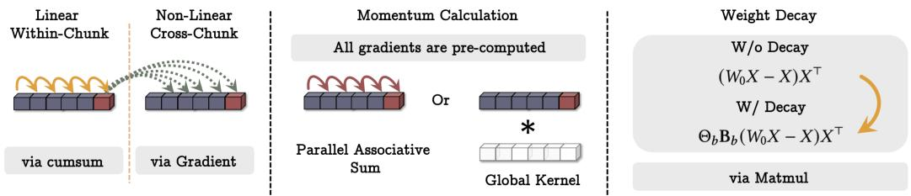

[← 返回 README](../README.md)

# 3 Neural Memory

## 📌 预览
本节是全文核心。设计长期记忆模块：surprise metric（梯度）+ momentum + weight decay → 等价于 SGD 优化器，然后展示如何并行化训练，最后加入 persistent memory。

---

To overcome the lack of long-term memory and to enable the model to learn, forget, and retrieve information, in this section, we present a neural long-term memory module, which is a meta model that learns to memorize at test time. In Section 3.1, we first discuss the motivation and the design of the neural memory. In Section 3.2, we discuss how our architecture design can benefit from a fast and parallelizable training. Finally, in Section 3.3, we augment our architecture using persistent memory module.

---

## 3.1 Long-term Memory

> 💡 **3.1 要点预览**: 如何设计一个在测试时也能学习记忆的模块？关键 idea: surprise = 梯度，记忆更新 = 梯度下降。

To design a neural long-term memory module, we need a model that can encode the abstraction of the past history into its parameters. A simple idea is to train a neural network and expect it to memorize its training data. Memorization, however, has almost always been known as an undesirable phenomena as it limits generalization, causes privacy concerns, and results in poor performance at test time. Moreover, memorization of training data might not be helpful at test time when data might be out-of-distribution. We argue that, we need an online meta-model that learns how to memorize/forget the data at test time.

> 💡 **批注**: 关键区分——传统的记忆（overfitting）是不好的，但 Titans 要的是**学习如何记忆的能力**（meta-learning）。模型在训练时学会一个"记忆函数"，在测试时用这个函数来记忆新数据。这就是 meta in-context learning。

### Learning Process and Surprise Metric

The key idea is to treat training as an online learning problem, compressing past information $x_1, \ldots, x_{t-1}$ into the parameters of our long-term neural memory module $\mathcal{M}_t$. An event that violates expectations (i.e., is surprising) is more memorable for humans. A simple definition of surprise: the gradient with respect to the input. The larger the gradient, the more different the input from past data:

$$
\mathcal{M}_t = \mathcal{M}_{t-1} - \theta_t \underbrace{\nabla \ell(\mathcal{M}_{t-1}; x_t)}_{\mathrm{Surprise}}
$$

This surprise metric can miss information after a big surprising moment (gradient becomes small, stuck in local minima). From the human perspective, the initial surprising moment is enough to get our attention through a long time frame. So we break surprise into **past surprise** and **momentary surprise**:

$$
M_t = M_{t-1} + S_t, \quad S_t = \eta_t \underbrace{S_{t-1}}_{\mathrm{Past\ Surprise}} - \theta_t \underbrace{\nabla \ell(M_{t-1}; x_t)}_{\mathrm{Momentary\ Surprise}}
$$

> 💡 **批注**: 这是全文最核心的公式！
> - $S_t$ = momentum，记忆了过去的 surprise 历史
> - $\eta_t$ = surprise decay，**数据相关**，控制是否沿用上一步的 surprise
>   - $\eta_t \to 0$: 忽略过去（上下文切换了）
>   - $\eta_t \to 1$: 完全沿用（当前 token 与之前高度相关）
> - $\theta_t$ = 学习率，控制当前 surprise 的权重
> - 这就是 **SGD with momentum**！Titans 把优化器变成了记忆系统。

### Objective (Associative Memory Loss)

We focus on associative memory: store past data as key-value pairs. Given $x_t$, we project it into key and value:

$$
\mathbf{k}_t = x_t W_K, \quad \mathbf{v}_t = x_t W_V
$$

The memory learns to associate keys with values:

$$
\ell(M_{t-1}; x_t) = \| M_{t-1}(\mathbf{k}_t) - \mathbf{v}_t \|_2^2
$$

> 💡 **批注**: 损失函数的含义：给记忆一个 key，它应该输出对应的 value。如果输出差距大（loss 大），说明这个 key-value 对是"surprising"的，需要重点记住。这就把"surprise"和具体的数学目标连接起来了。

### Forgetting Mechanism

For very large sequences, we need to manage which past information should be forgotten. Adaptive forgetting:

$$
M_t = (1 - \alpha_t) M_{t-1} + S_t, \quad S_t = \eta_t S_{t-1} - \theta_t \nabla \ell(M_{t-1}; x_t)
$$

where $\alpha_t \in [0, 1]$ is the gating mechanism: $\alpha_t \to 0$ (keep all memory), $\alpha_t \to 1$ (clear memory). This weight decay mechanism is closely related to the gating mechanism in modern RNNs (Mamba2, LRU).

> 💡 **批注**: 完整的记忆更新公式 = **SGD with momentum and weight decay**：
> | 优化器术语 | 记忆含义 |
> |-----------|---------|
> | Weight decay $\alpha_t$ | 遗忘门 |
> | Momentum $\eta_t$ | 过去 surprise 的衰减 |
> | Learning rate $\theta_t$ | 当前 surprise 的权重 |
> | Gradient $\nabla \ell$ | Surprise metric |

### Memory Architecture

We use simple MLPs with $L_\mathcal{M} \ge 1$ layers as the architecture of our long-term memory. When using vector-valued or matrix-valued memory (linear), the memory module is fitting a line — equivalent to online linear regression. Deep memory modules ($L_\mathcal{M} \ge 2$) are strictly more expressive than linear models, confirmed in experiments (§5.5).

> 💡 **批注**: 这是对 Q5 的回答——是的，需要深层记忆。线性记忆 = 线性回归，深层记忆 = 非线性回归。后面实验表明深度从 1→4 能持续提升性能。

### Retrieving a Memory

Simply use the forward pass without weight update:

$$
y_t = \mathcal{M}^*(\mathbf{q}_t)
$$

where $\mathbf{q}_t = x_t W_Q$.

> 💡 **批注**: 记忆检索 = 不更新权重的前向传播。$M(x)$ 更新权重（写入/学习），$M^*(x)$ 不更新（读取/检索）。

*Figure 1: The illustration of how the training of neural memory can be done in parallel and using matmuls.*

> 💡 **Figure 1 批读**: 展示了 chunk-wise 并行训练。序列被分成 chunks，每个 chunk 内的梯度计算可以用 matmul 并行化，chunk 间通过 parallel scan 传递 momentum 状态。

---

## 3.2 How to Parallelize the Long-term Memory Training

> 💡 **3.2 要点预览**: 把 SGD+momentum+weight decay 的逐步更新重写为矩阵运算，实现 chunk-wise 并行训练。

The design is equivalent to training a meta model by optimizing associative memory loss using gradient descent with momentum and weight decay. In practice, we need to parallelize and tensorize the process. We split the sequence into chunks of size $b \ge 1$ and write mini-batch gradient descent as:

$$
\mathcal{M}_t = \beta_t \mathcal{M}_0 - \sum_{i=1}^{t} \theta_i \frac{\beta_t}{\beta_i} \nabla \ell(\mathcal{M}_{t'}; x_i)
$$

where $t' = t - \text{mod}(t, b)$ and $\beta_i = \prod_{j=1}^{i} (1-\alpha_j)$.

For linear memory, the gradient sum can be rewritten as matmuls:

$$
\sum_{i=1}^{b} \theta_i \frac{\beta_b}{\beta_i} \nabla \ell(W_0; x_i) = \Theta_b \mathbf{B}_b (W_0 X - X) X^\top
$$

For the momentum term, we have a linear recurrence $S_t = \eta_t S_{t-1} - \theta_t u_t$, which can be computed using **parallel associative scan**.

> 💡 **批注**: 并行化的关键技巧：
> 1. **Chunk 内**: 梯度计算可以 batch 成 matmul
> 2. **Chunk 间**: momentum 是线性递推，用 parallel scan $O(\log N)$ 并行
> 3. 不需要存所有 chunk 的 $\Theta, \mathbf{B}$，每个 chunk 只存自己的，节省内存

---

## 3.3 Persistent Memory

> 💡 **3.3 要点预览**: 除了上下文相关的长期记忆，还需要数据无关的任务知识存储。

Our long-term memory is a contextual memory (output fully depends on context). We also use learnable but input-independent parameters as task-related memory:

$$
x_{\mathrm{new}} = [p_1 \quad p_2 \quad \ldots \quad p_{N_p}] \| x
$$

**Three perspectives on persistent memory**:

1. **Memory Perspective**: Input-independent parameters store task knowledge abstraction (how to do the task)
2. **FFN Perspective**: Replacing ReLU with Softmax in FFN gives attention-like weights with data-independent K, V — persistent memory serves the same role
3. **Technical Perspective**: Mitigates attention's bias toward initial tokens (attention sink problem)

> 💡 **批注**: Persistent memory 的三重动机非常巧妙：
> - 认知科学上：任务知识 ≠ 经验记忆，需要独立存储
> - 架构上：替代 FFN 的功能
> - 工程上：解决 attention sink 问题（StreamingLLM 也发现了这个问题）

---

## 🔖 Section 总结

### 关键数字速查
| 设计选择 | 值 |
|---------|-----|
| 记忆架构 | MLP, $L_\mathcal{M} \ge 1$ 层 |
| 损失函数 | Associative memory loss $\|\mathcal{M}(k) - v\|_2^2$ |
| 并行方式 | Chunk-wise matmul + parallel scan |
| Persistent memory | $N_p$ 个可学习 token 前缀 |

### 核心洞察
1. **Surprise = 梯度**: 简洁而有力的定义，将人类记忆的直觉转化为数学
2. **优化器即记忆系统**: SGD+momentum+weight decay ↔ 记忆更新+surprise历史+遗忘
3. **深层记忆 > 线性记忆**: 因为后者等价于在线线性回归，表达能力有限
4. **三种记忆分工**: Contextual (长期) + Persistent (任务) + Attention (短期)
