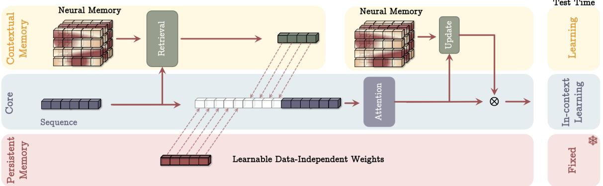
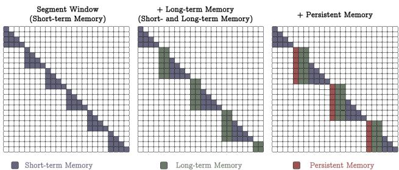
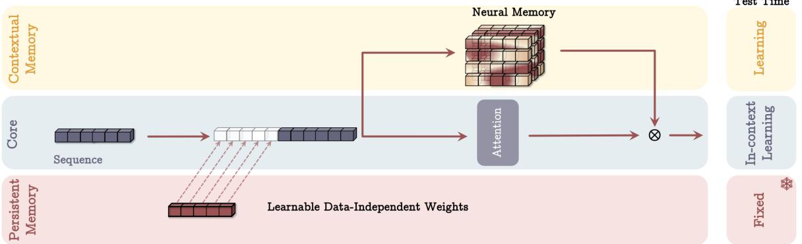
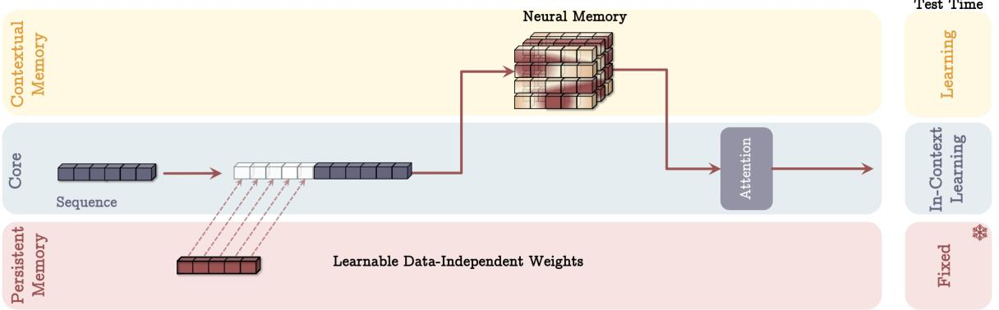

[← 返回 README](../README.md)

# 4 How to Incorporate Memory?

## 📌 预览
设计好长期记忆后，如何嵌入架构？提出三种变体：MAC（记忆作上下文）、MAG（记忆门控）、MAL（记忆作层）。

---

An important question: How one can effectively and efficiently incorporate the designed neural memory into a deep learning architecture? From a memory perspective, the pair of K and V matrices in transformers can be interpreted as an associative memory block — short-term memory attending to the current context window. Our neural memory with the ability to continuously learn from data can play the role of long-term memory.

> 💡 **批注**: 架构设计的核心思路——注意力 = 精确但短期，神经记忆 = 持久但模糊。关键是如何让它们互补。

---

## 4.1 Memory as a Context (MAC)

> 💡 **4.1 要点预览**: 最强变体。将记忆检索结果作为 attention 的额外上下文输入。

*Figure 2: Memory as a Context (MAC) Architecture. Three branches: (1) core, (2) contextual (long-term) memory, (3) persistent memory.*

> 💡 **Figure 2 批读**:
> - 输入序列被分成 segments
> - 每个 segment 先从长期记忆 $\mathcal{M}$ 检索相关信息 $h_t$
> - 将 persistent memory + $h_t$ + 当前 segment 拼接，送入 full causal attention
> - Attention 的输出同时用于：(1) 更新长期记忆，(2) 产生最终输出
> - **关键**: Attention 决定什么信息值得存入长期记忆（自动过滤无用 token）

Given a long sequence, we chunk it into fixed-size segments $\mathsf{S}^{(i)}$. Given incoming segment $\mathsf{S}^{(t)}$, we retrieve past information from long-term memory:

$$
h_t = \mathcal{M}_{t-1}^*(\mathbf{q}_t)
$$

Then concatenate with persistent memory and current segment for attention:

$$
\tilde{\mathsf{S}}^{(t)} = [p_1 \quad \ldots \quad p_{N_p}] \| h_t \| \mathsf{S}^{(t)}, \quad y_t = \mathsf{Attn}(\tilde{\mathsf{S}}^{(t)})
$$

Then update memory and produce output:

$$
M_t = M_{t-1}(y_t), \quad o_t = y_t \otimes M_t^*(y_t)
$$

*Figure 3: Attention masks for different variants of Titans.*

**Three key advantages**:
1. Attention can decide whether long-term memory is needed given current data
2. Attention helps memory store only useful information (memory capacity management)
3. At test time: persistent memory fixed, attention weights for in-context learning, long-term memory still learning

> 💡 **MAC 批注**: MAC 是三种变体中最强的（尤其在长上下文任务），因为 attention 同时扮演了"记忆管理员"的角色——它看到当前数据和历史记忆，决定存什么、取什么。

---

## 4.2 Gated Memory (MAG)

> 💡 **4.2 要点预览**: 更简单的设计——滑窗注意力和神经记忆并行处理，用门控融合。

*Figure 4: Memory as a Gate (MAG) Architecture.*

> 💡 **Figure 4 批读**: 两条并行分支——SWA（短期）和 Neural Memory（长期），通过 learnable gating 融合。比 MAC 简单，不需要分段。

$$
\tilde{x} = [p_1 \quad \ldots \quad p_{N_p}] \| x, \quad y = \mathsf{SW\text{-}Attn}^*(\tilde{x}), \quad o = y \otimes \mathsf{M}(\tilde{x})
$$

where SW-Attn* is sliding window attention with prefix. Note that we are NOT segmenting the input data. The gating $\otimes$ combines normalized outputs with a non-linearity $\sigma(.)$.

> 💡 **批注**: MAG 可以看作多头架构，只不过不同头的结构不同（有的是 attention，有的是 neural memory）。类似 Hymba 的设计。

---

## 4.3 Memory as a Layer (MAL)

> 💡 **4.3 要点预览**: 最传统的 hybrid 设计——记忆层和注意力层串联堆叠。

*Figure 5: Memory as a Layer (MAL) Architecture.*

$$
\tilde{x} = [p_1 \quad \ldots \quad p_{N_p}] \| x, \quad y = M(\tilde{x}), \quad o = \mathsf{SW\text{-}Attn}(y)
$$

Main drawback: model power is limited by each layer — cannot take advantage of complementary data processing.

**Memory Without Attention (LMM)**: A variant using LMM as standalone sequence model without attention. From the memory perspective, long-term memory should work independently even without short-term memory.

> 💡 **批注**: MAL 就是现在 hybrid 模型的主流设计（Mamba+Attention 交替堆叠）。但 Titans 的实验表明 MAC 和 MAG 比 MAL 更好，说明并行融合优于串行堆叠。

---

## 4.4 Architectural Details

- **Residual connections** in all blocks
- **SiLU activation** for computing Q, K, V
- **$\ell_2$-norm** for normalizing Q and K
- **1D depthwise-separable convolution** after Q, K, V projections (following Mamba/Gated DeltaNet)
- **Normalization + gating** with linear layer before output projection

**Theorem 4.1**: Contrary to Transformers, diagonal linear recurrent models, and DeltaNet (all limited to TC⁰), Titans are capable of solving problems beyond TC⁰.

> 💡 **批注**: TC⁰ 是电路复杂度类，代表常数深度电路能计算的问题。Transformer 困在 TC⁰ 意味着它无法做真正的 state tracking。Titans 突破了这个限制，理论上更强。

---

## 🔖 Section 总结

### 三种变体对比
| 变体 | 记忆融合方式 | 优势 | 劣势 |
|------|------------|------|------|
| **MAC** | 记忆作为 attention 的上下文 | 长上下文最强，attention 管理记忆 | 需要分段 |
| **MAG** | 记忆与 SWA 门控并行 | 简单，不需分段 | 长上下文稍弱于 MAC |
| **MAL** | 记忆和 SWA 串联 | 训练最快（Flash-Attention） | 表达能力受限于各层独立能力 |
| **LMM** | 仅记忆，无 attention | 验证记忆独立能力 | 缺少短期精确记忆 |

### 核心洞察
1. **并行融合 > 串行堆叠**: MAC/MAG > MAL，这对 hybrid 模型设计有重要启示
2. MAC 中 attention 扮演"记忆管理员"角色是其最强的原因
3. LMM 单独也很强，证明 neural memory 本身就是有效的序列模型
