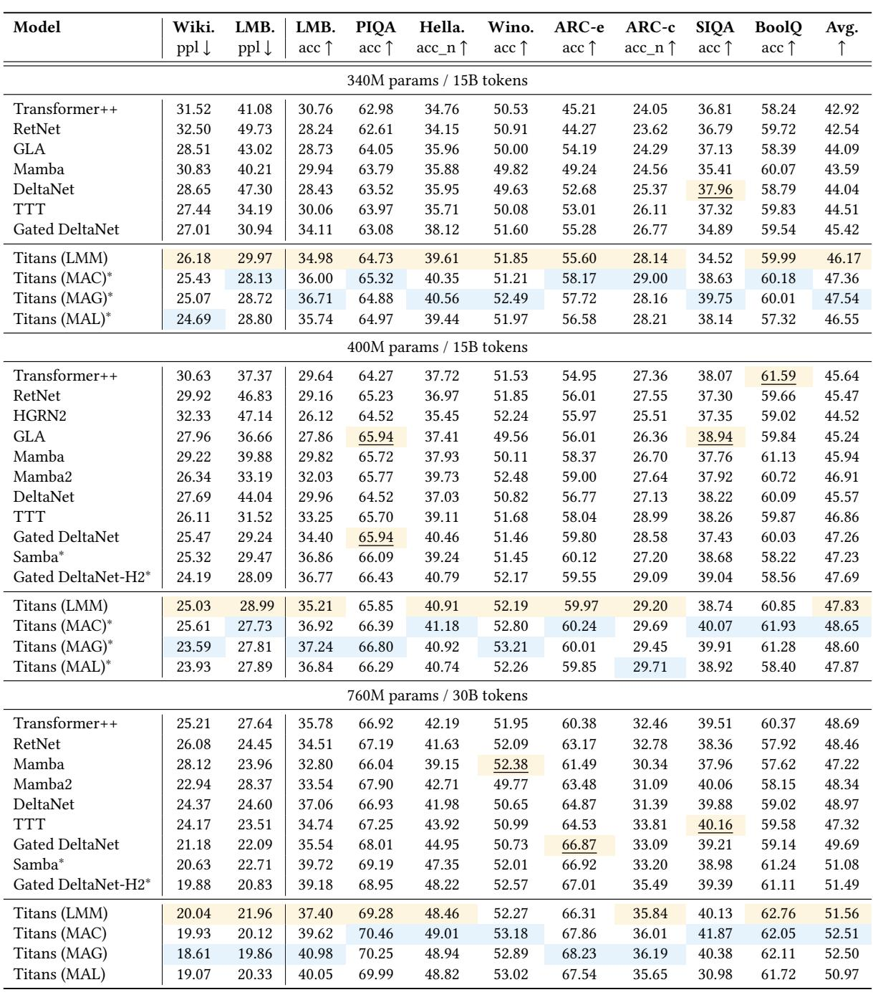
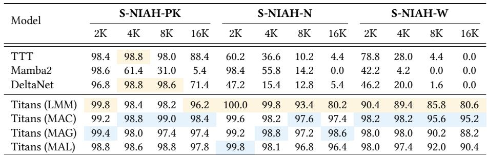
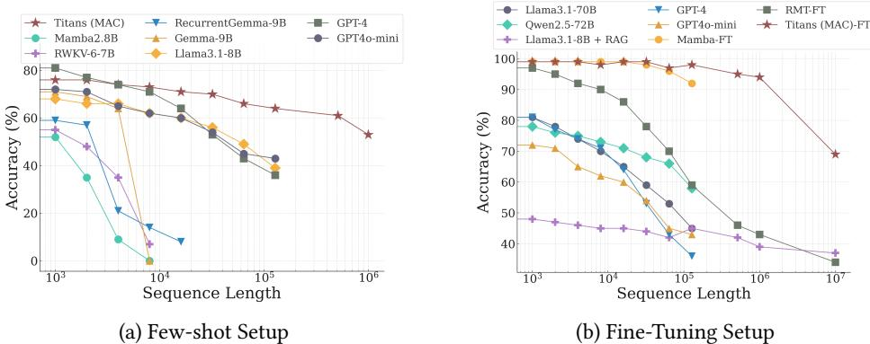
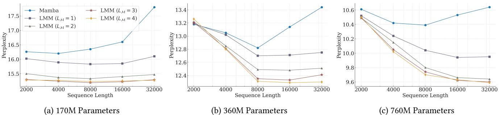
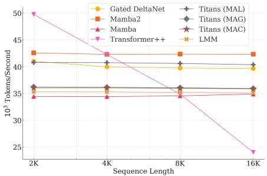
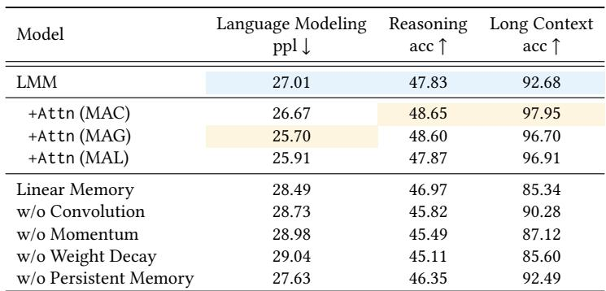

[← 返回 README](../README.md)

# 5 Experiments

## 📌 预览
全面评估 Titans 在语言建模、常识推理、NIAH、BABILong、时间序列、DNA 建模上的表现，以及深层记忆、效率和消融实验。

---

## 5.1 Experimental Setup

**Models**: Titans (MAC), Titans (MAG), Titans (MAL), LMM alone. Four scales: 170M, 340M, 400M, 760M.

**Training**: FineWeb-Edu dataset, 15B tokens (170M-400M) / 30B tokens (760M). LLama 2 tokenizer (32K vocab), training length 4K, AdamW lr=4e-4, cosine annealing, batch size 0.5M tokens, weight decay 0.1.

**Baselines**: Transformer++, RetNet, GLA, Mamba, Mamba2, DeltaNet, TTT, Gated DeltaNet, Samba, Gated DeltaNet-H2.

---

## 5.2 Language Modeling

*Table 1: Performance on language modeling and common-sense reasoning tasks.*

> 💡 **Table 1 批读**:
> - **非 hybrid 模型中**: LMM 最强（比 Gated DeltaNet 好），证明深层非线性记忆的价值
> - **Hybrid 模型中**: MAC ≈ MAG > MAL > Samba ≈ Gated DeltaNet-H2
> - **400M 规模**: Titans (MAG) perplexity 23.59 vs Transformer++ 30.63，avg accuracy 48.60 vs 45.64
> - **关键发现**: MAC/MAG 并行融合设计优于 MAL 串行堆叠，也优于 Samba 和 Gated DeltaNet-H2

---

## 5.3 Needle in a Haystack

*Table 2: Performance on S-NIAH task from RULER benchmark.*

> 💡 **Table 2 批读**:
> - **LMM vs TTT**: 两者都是梯度更新记忆，但 LMM 在 16K 上远超 TTT（96.2 vs 88.4 on PK, 80.2 vs 4.4 on N），证明 momentum + weight decay 的重要性
> - **LMM vs Mamba2**: Mamba2 在 16K 急剧下降（5.4 on PK），因为它无法擦除记忆（只能遗忘），而 LMM 保持 96.2
> - **MAC 最强**: 16K 上 PK=98.4, N=97.4, W=95.2，几乎不降

---

## 5.4 BABILong Benchmark

*Figure 6: Performance on BABILong benchmark. Titans (MAC) outperforms all baselines including GPT4.*

> 💡 **Figure 6 批读**:
> - **Few-shot setting (a)**: Titans 超越所有基线（Mamba 2.8B, RWKV-6-7B, RecurrentGemma-9B, Gemma-9B, Llama3.1-8B, GPT-4, GPT4o-mini），且参数量远小于这些模型
> - **Fine-tuning setting (b)**: 小模型 Titans (MAC) 超越 GPT-4 和 Qwen2.5-72B，甚至超越 Llama3.1-8B+RAG（参数量少 ~70x）
> - RMT 压缩历史到 16 维向量 → 信息丢失严重；Titans 用 neural memory 参数编码历史 → 容量大得多

---

## 5.5 The Effect of Deep Memory

*Figure 7: Effect of memory depth on perplexity. Deeper memory → better scaling on longer sequences.*

> 💡 **Figure 7 批读**:
> - $L_\mathcal{M} = 1 \to 4$，perplexity 持续下降
> - 深层记忆对长序列更鲁棒：浅层记忆在小模型+长序列时退化，深层不会
> - 这回答了 Q5：是的，深层记忆是必要的

---

## 5.6 Time Series Forecasting

Neural Memory 在 ETTm1, ETTm2, ETTh1, ETTh2, ECL, Traffic, Weather 全部 7 个数据集上取得 SOTA，超越 Simba (Mamba), iTransformer, PatchTST 等。

> 💡 **批注**: 说明 neural memory 不仅适用于 NLP，在时间序列的长期依赖建模上也有效。

---

## 5.7 DNA Modeling

Neural Memory 在 GenomicsBenchmarks 上与 HyenaDNA, Mamba, Based 等 competitive，在 Enhancer Cohn 上最优 (75.2%)。

---

## 5.8 Efficiency

*Figure 9: Training throughput comparison.*

> 💡 **Figure 9 批读**:
> - Neural Memory 略慢于 Mamba2 和 Gated DeltaNet（因为深层记忆+更复杂的更新）
> - 但 Titans (MAL) 反而更快（因为 Flash-Attention 的高度优化 kernel）
> - 所有模型吞吐量与序列长度线性缩放（tokens/sec 基本恒定）

---

## 5.9 Ablation Study

*Table 5: Ablation Study on Titans.*

> 💡 **Table 5 批读**:
> 各组件贡献排序（从大到小）：
> 1. **Weight Decay** (遗忘门): ppl 27.01→29.04, 影响最大
> 2. **Momentum**: ppl→28.98
> 3. **Convolution**: ppl→28.73
> 4. **Deep Memory** (vs linear): ppl→28.49
> 5. **Persistent Memory**: ppl→27.63
>
> 架构对比: MAC (48.65 avg) ≈ MAG (48.60) > MAL (47.87)，但 MAC 在长上下文任务遥遥领先 (97.95 vs 96.70 vs 96.91)

---

## 🔖 Section 总结

### 关键数字速查
| 任务 | Titans 最佳 | 最强基线 | 提升 |
|------|------------|---------|------|
| Wiki ppl (400M) | 23.59 (MAG) | 24.19 (Gated DeltaNet-H2) | -0.6 |
| S-NIAH 16K (PK) | 98.4 (MAC) | 71.4 (DeltaNet) | +27.0 |
| BABILong | 超越 GPT-4 | GPT-4 | 参数少 70x |
| 时间序列 | 7/7 SOTA | Simba/iTransformer | - |

### 核心洞察
1. Titans 在所有任务上超越或持平 SOTA，尤其在长上下文任务上优势明显
2. Weight decay（遗忘门）是最重要的组件，没有它性能下降最多
3. MAC 在长上下文上最强，MAG 在效率-效果 trade-off 上最优
4. 深层记忆持续提升性能但降低训练速度——需要根据场景选择深度
