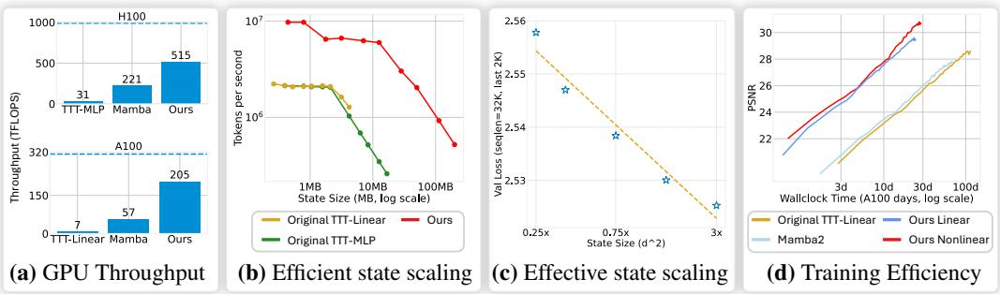
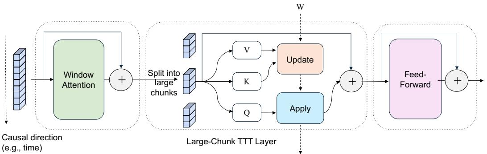
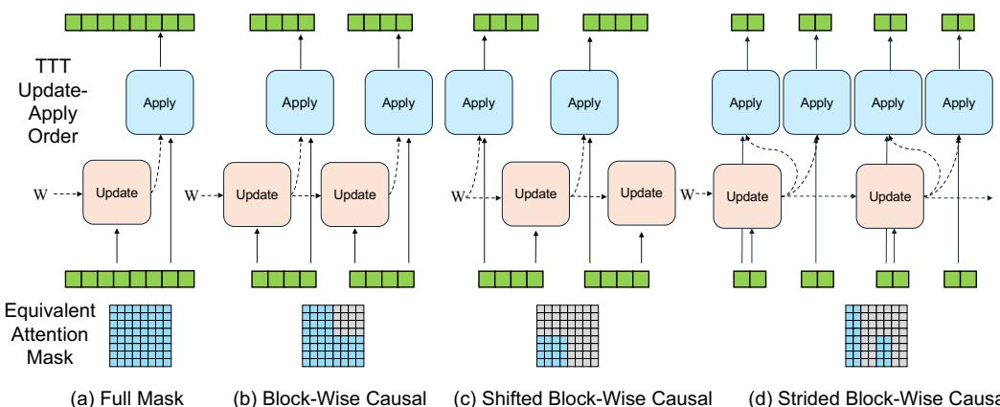
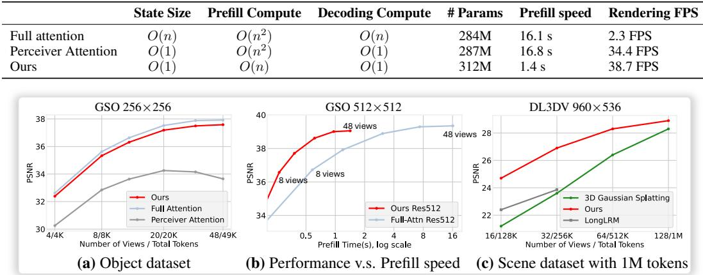
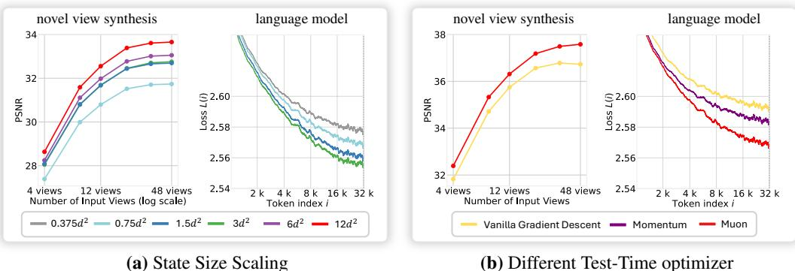
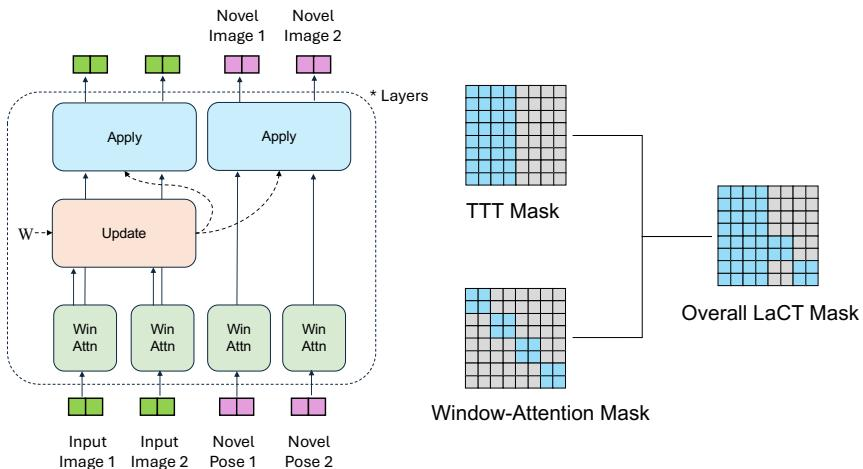
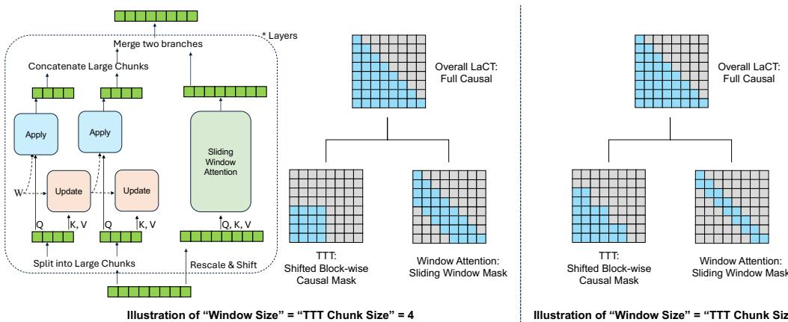
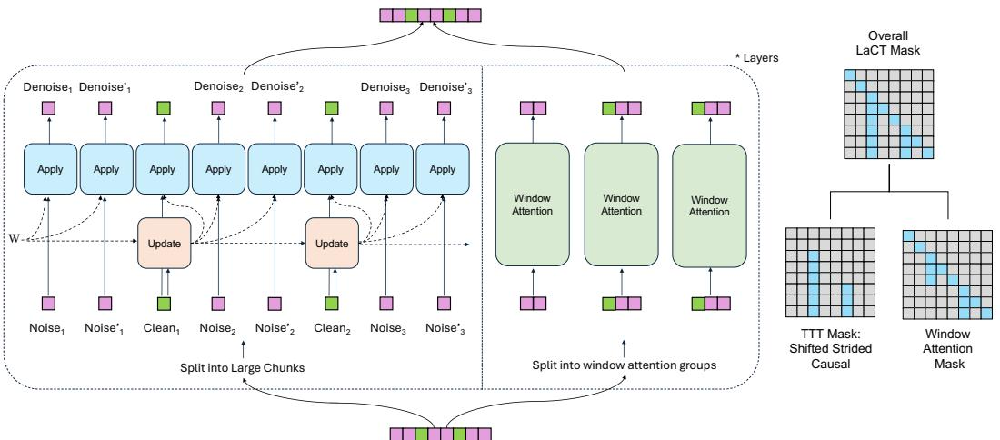

# Test-Time Training Done Right

Tianyuan Zhang1 Sai Bi2 Yicong Hong2 Kai Zhang2 Fujun Luan2   
Songlin Yang1 Kalyan Sunkavalli2 William T. Freeman1 Hao Tan2

1Massachusetts Institute of Technology 2Adobe Research

# Abstract

Test-Time Training (TTT) models context dependencies by adapting part of the model’s weights (often referred to as fast weights) at inference time. This adapted fast weight, similar to recurrent states in RNNs, stores temporary memories of past tokens in the current sequence. Existing TTT methods have struggled to demonstrate effectiveness in handling long-sequence data, due to their computational inefficiency on modern GPUs. The TTT layers in many of these approaches operate with extremely low FLOPs utilization (often below $5 \%$ ) because they deliberately apply small online mini-batch sizes (e.g., updating fast weights every 16 or 64 tokens). Moreover, a small mini-batch implies fine-grained block-wise causal dependencies in the data, making them unsuitable for data beyond 1D ordered sequences, like sets or N-dimensional grids such as images or videos. In contrast, we pursue the opposite direction by proposing an extremely large chunk update, ranging from 2K to 1M tokens across tasks of varying modalities, which we refer to as Large Chunk Test-Time Training (LaCT). This approach improves hardware utilization by orders of magnitude, and more importantly, facilitates scaling of nonlinear state size (up to $40 \%$ of model parameter size), hence substantially improving state capacity, all without requiring cumbersome and error-prone custom kernel implementations. It also allows easy integration of sophisticated optimizers like Muon for online memory updates. We validate our approach across diverse data modalities and tasks, including novel view synthesis from image sets, language models, and auto-regressive video diffusion models. Our approach can scale up to 14-billion-parameter auto-regressive video diffusion models handling sequences of up to 56K tokens. In our longest sequence experiment, we perform novel view synthesis with more than one million context length. Our results highlight the computational and performance benefits of large-chunk test-time training, paving the way for more efficient and scalable long-context sequence modeling. We hope that this work will inspire and accelerate new research in the field of long-context modeling and test-time training. See visual results on project website https://tianyuanzhang.com/projects/ttt-done-right/.

# 1 Introduction

The demand for handling long contexts is rapidly growing. While softmax attention [1] has become the de facto solution for modeling various types of data, its computational cost grows quadratically with sequence length, motivating extensive research into more efficient long-context modeling.

Recently, Test-Time Training (TTT) [2] has emerged as a promising approach for efficient subquadratic sequence modeling. TTT extends the concept of recurrent states in RNNs to a small, onlineadapted sub-network. The parameters of this sub-network also referred to as fast weight [3], as they are rapidly adapted online via self-supervised objectives to memorize in-context information. Numerous recent studies [4, 5, 6, 7] have explored various online objectives, optimizers, and architectures for fast weight networks.

Despite these efforts, existing TTT methods struggle to scale effectively to long contexts, primarily due to extremely low hardware utilization in their TTT layers (often below $5 \%$ peak FLOPS on modern GPUs). This inefficiency is because of the usage of small mini-batch sizes, i.e. updating fast weights every token or every 16 to 64 tokens, which is conventionally assumed to be more effective for in-context learning. Such small mini-batch results in poor parallelism and low compute intensity, and presents significant challenges for hardware-efficient implementation, especially when using large, nonlinear fast weights, making it difficult to achieve non-trivial (above $10 \%$ ) FLOPs utilization.

In this paper, we adopt the opposite strategy and introduce Large Chunk Test-Time Training (LaCT). LaCT leverages extremely large chunk (from 2048 to 1M tokens) as the basic unit to update the fast weight. Since the tokens within each large chunk are treated as an unordered set, we further integrate window attention into LaCT to capture local dependencies within the chunk. LaCT significantly enhances parallelism, leading to substantially improved GPU utilization (up to $70 \%$ on NVIDIA A100s) with just a few dozen lines of pure PyTorch code (see Appendix A.1). This efficiency enables the scaling of non-linear fast weights to enhance the memory capacity. And simple implementation allows easy integration of more effective test-time optimizers, such as Muon [8].

Furthermore, LaCT’s large-chunk design is also natural to model diverse N-dimensional data as we can align chunk-size with the internal structure of the data (e.g., grouping tokens within an image or consecutive video frames as a chunk).

We extensively validate LaCT on three tasks spanning different modalities and data structures:

• Novel View Synthesis. Our model is capable of processing up to 128 input images at a resolution of $9 6 0 \times 5 3 6$ leading to a maximum of 1M tokens, and outperforms 3D Gaussian Splatting [9] in terms of rendering quality under such input scale.   
• Language Modeling. Our model achieves competitive performance compared to SoTA methods such as DeltaNet [10], even though a chunk structure is not explicitly present in language data.   
• Autoregressive Video Diffusion. We adapt a 14-billion-parameter bidirectional video diffusion transformer into an autoregressive model by incorporating LaCT with sliding window attention. This adapted model generates consistent videos up to 56,000 visual tokens.

To summarize, our approach establishes an efficient, scalable, and highly performant framework for long sequence modeling across diverse modalities. By removing the dependency on low-level, hardware-specific implementations, LaCT enables broader exploration of the architectural design space. We believe this can democratize research in efficient long-context modeling and inspire the development of more novel and effective designs.

# 2 Preliminary

# 2.1 Test-Time Training

Consider a one-dimensional sequence of $N$ tokens $\mathbf { x } = [ x _ { 1 } , x _ { 2 } , \ldots , x _ { N } ]$ , where each token $x _ { i } \in \mathbb { R } ^ { d }$ Following attention formulation, each input tokens $x _ { i }$ is projected into query $( q _ { i } )$ , key $( k _ { i } )$ , and value $( v _ { i } )$ vectors. For clarity, we assume all these vectors $q _ { i } , \dot { k } _ { i } , \dot { v } _ { i } \in \mathbb { R } ^ { d }$ .

Test-Time Training (TTT) [2] introduces a neural network with rapidly adaptable weights—called fast weights [3]—that are updated during both training and inference to dynamically store context information. This contrasts with the slow weights (i.e., model parameters) that are frozen during inference. Formally, TTT defines fast weights in the form of a neural network: $f _ { W } ( \cdot ) : \mathbb { R } ^ { d } \to \mathbb { R } ^ { \breve { d } }$ parameterized by the fast weights $W$ , and it involves two primary operations:

$$
W \gets W - \eta \nabla _ { W } \mathcal { L } \big ( f _ { W } ( k ) , v \big )
$$

where $\mathcal L ( \cdot , \cdot )$ is a loss function between the transformed key $f _ { W } ( k )$ and the value $v$ , commonly Mean Squared Error, designed to encourage the network to associate keys with corresponding values. $\eta$ is the learning rate. Intuitively, this learning objective is to encode the KV cache into a neural memory with fixed state size as accurate as possible [4].

# Apply operation:

$$
o = f _ { W } ( q ) ,
$$

where the updated fast weights $W$ are used to compute the output vector $o$ given the query $q$ . The per-token TTT layer iteratively perform the update and apply operations on each token $x _ { i }$ in sequence.

  
Figure 1: Using larger chunk sizes significantly improves GPU utilization compared to the original test-time training (TTT) method that even uses customized kernels (a). This enhanced utilization enables efficient and effective scaling to larger state sizes (b), (c), leading to better overall performance in less wall-clock time (d). The dotted line in (a) is the theoretical peak BF16 throughput of the GPU. Panel (c) measure average validation loss of the last 2K tokens in sequences processed by a LaCT language model across varying state sizes, demonstrating benefits of larger state size. Panel (d) compares performance versus training time across different baselines on the novel view synthesis benchmark. Further experimental details can be found in Sec. C.4.

# 2.2 Challenges in Efficient Implementation

Frequent online update of fast weights is inefficient due to memory bandwidth limitations. Consequently, previous works [11, 12, 13, 14, 15] often employ customized kernels that keep fast weights in SRAM across updates to reduce memory load. However, this strategy typically requires fast weights to evolve mostly independently within SMs to reduce communications, which is not valid for large nonlinear states (e.g., the nonlinear SwiGLU fast weight in Sect. 3.1 and the Muon update in Sec. 3.2). Moreover, developing such kernel code is cumbersome, with far longer development cycles than native PyTorch code, hindering rapid research exploration.

On the other hand, a PyTorch-based implementation, while simpler, is typically bounded by memory speed. As an illustration, consider a PyTorch implementation of simple MLP fast weight, the core of which is a matrix multiplication between fast weight (e.g., $h \times h$ matrix) and the mini-batch input $b \times h$ where $\mathbf { b }$ is the chunk size). The ideal compute-to-memory ratio is:

$$
r = { \frac { 2 h ^ { 2 } b } { 2 h ^ { 2 } + 4 h b } } = { \frac { h / 2 } { 1 + { \frac { h } { 2 b } } } } = { \frac { b } { 1 + { \frac { 2 b } { h } } } } \leq \operatorname* { m i n } ( h / 2 , b ) .
$$

Here, $2 h ^ { 2 } b$ is the FLOPs to for matrix multiplication, the denominator $2 h ^ { 2 } + 4 h b$ is the memory workload for two input matrices and the output in BF16 (2 bytes). Small fast weight size (e.g., $h = 6 4$ ) or small chunk size (e.g., $b = 1 6$ ) will bound the ratio $r$ far below the theoretical peak (e.g., 290 FLOPs per byte on H100), making the operation memory-bound and limiting compute usage.

In light of this, we advocate for using large chunk sizes (from 2048 to 1M). This allows us to achieve higher throughput (Fig. 1a) leading to better performance in less training wall-clock time(Fig. 1d). Our design also allows the state size to be scaled up efficiently(Fig. 1b), leading to significant results improvement with such scaling (Fig 1c, Fig. 7a). Our architecture achieves a state-to-parameter size ratio $\geq 4 0 \%$ , which is an order of magnitude larger than previous methods’ ratio of $0 . 1 \%$ to $5 \%$ . Detailed pseudocode is provided in Appendix 1.

Parallelism over the sequence length dimension, in addition to the batch and head dimensions, is crucial to achieve high occupancy when handling long sequences (where the batch size is often small). Linear Attention variants like Mamba [12], Gated Linear Attention [13] and DeltaNet [15] enable such parallelism by utilizing the associative property of linear recurrence. Attention [1, 16] can be parallelized along the sequence length dimension using online softmax [17], a key improvement in FlashAttention-2 [16] over FlashAttention-1 [18]. For test-time training with non-linear updates, sequence dimension parallelism can only be implemented within online chunks, further motivating the use of extremely large chunk sizes. When implementing large-chunk TTT with PyTorch, this sequence dimension parallelism within a device across multiple thread blocks is automatically handled by PyTorch and low-level compilers. An example of such sequence parallelism across multiple devices is provided in Section 3.4, with pseudocode in Appendix 3.

  
Figure 2: The basic diagram for a LaCT block. The large-chunk TTT layer updates the fast weight $W$ to store historical context information, while the window attention handles the locality and internal structures within the chunk. The solid line denotes the information flow over model depth and the dashed line denotes the information flow over time (i.e., the fast weight $W$ passing through chunks). Various instantiations in Sec. 4 use different chunk sizes and window attention types according to the specific data structure. Additionally, window attention and large-chunk TTT layers can be combined within the same layer by sharing the QKV and summing their outputs; this in-layer mixing is used in our language modeling and video generation experiments (see Appendix 2 for such pseudocode).

# 3 LaCT Model Architecture

As shown in Fig. 2, LaCT block consists of three types of layers: a window attention layer, a largechunk TTT layer, and a feed-forward layer. Each layer is equipped with residual connections [19] following the practice in Transformer [1]. The window attention layer performs local self-attention to capture the local dependency. In the TTT layer, we split the sequence into large chunks. The history context is gradually compressed into the fast weights through an ‘update’ operation (regarding key vectors $K$ and value $V$ ), and latest weight is ‘applied’ to the current query vector (Q) for computing its corresponding output. The feed-forward layer performs channel mixing as in Transformer. We omit several linear and normalization layers in Fig. 2 for clarity and details are in Appendix A.1. Our framework offer great flexibility in handling diverse data types. In this section, we present the general designs in our approach and later describe data-specific variations in Sec. 4.

# 3.1 Large-Chunk TTT Layer

Different from the per-token update in Eqn. 1, the chunk-wise update computes the gradient of the summed loss over all keys $\left\{ k _ { i } \right\}$ and values $\{ v _ { i } \}$ within the chunk. As the chunk size is large, weight updates are performed infrequently. This enables more sophisticated weight-update rule designs (discussed in Sec. 3.2) and amortizes the update cost. The ‘update’ operation for the fast weight is:

$$
\begin{array} { c } { { \displaystyle g = \nabla _ { W } \sum _ { i = 1 } ^ { b } \eta _ { i } \mathcal { L } \big ( f _ { W } \big ( k _ { i } \big ) , v _ { i } \big ) } } \\ { { \displaystyle W \gets \mathrm { w e i g h t - u p d a t e } ( W , g ) , } } \end{array}
$$

where $b$ is the chunk size, $g$ is the gradient of the fast-weight loss function, and $\eta _ { i }$ is the learning rate of each token (usually predicted from input tokens). The ‘apply’ operation $o _ { i } = f _ { W } ( q _ { i } )$ is the same as Eqn. 2 and all query vectors $\left\{ q _ { i } \right\}$ in the chunk share the same updated fast weight $W$ .

Motivated by recent LLMs [20], we adopt SwiGLU-MLP [21] without bias terms as the fast-weight network. Our fast weights consists of three weight matrix $W = \{ W _ { 1 } , W _ { 2 } , W _ { 3 } \}$ , and the network is:

$$
f _ { W } ( x ) = W _ { 2 } \left[ \mathrm { S i L U } ( W _ { 1 } x ) \circ ( W _ { 3 } x ) \right]
$$

where $\circ$ is an elementwise multiplication. We apply a simple dot product loss as our loss function:

$$
\mathcal { L } \big ( f _ { W } ( k _ { i } ) , v _ { i } \big ) = - f _ { W } ( k _ { i } ) ^ { \top } v _ { i }
$$

Execution orders for ‘apply’ and ‘update’. Note that the ‘update’ operation and ‘apply’ operation of TTT are decoupled, and we can set the chunk size adaptively and apply these operation in different orders; this allows us to model diverse kinds of data dependencies, similar to different attention masks in self-attention. Figure 3 illustrates this concept. In Figure 3a, when the chunk size equals the full sequence length, performing the apply followed by the update operation is conceptually similar to full attention. Using update and apply alternately leads to a block-wise causal mask (Fig. 3b), where the block size corresponds to the chunk size. Switching the order between the two operations results in the a shift in the mask (Fig. 3c). This shifted mask does not leak future information within the chunk and is important when building the full causal mask in Language Modeling (Sec. 4.2). Moreover, only updating on a subset of chunks and applying to all (Figure 3d) is analogous to strided block-wise causal mask.

  
Figure 3: Different ‘Update’ and ‘Apply’ orders and their equivalent attention mask. A blue mask in i-th row and j-th column means the i-th token’s output depends on the j-th token.

# 3.2 Non-Linear Update of Fast-Weight

Fast-weight updates in TTT repeatedly accumulate gradients, and thus suffer from magnitude explosion or decayed memory. Large-chunk TTT allows non-linear updates to improve stability and effectiveness while preserving efficiency. For the ‘weight-update’ operation in Eqn. 5, our vanilla implementation involves gradient descent followed by weight normalization:

$$
\operatorname { w e i g h t - u p d a t e } ( W , g ) = \operatorname { L 2 - N o r m a l i z e } ( W - g ) .
$$

We have also explored a more robust nonlinear Muon [8] update rule 1 with weight normalization:

$$
\operatorname { a t e } ( W , g ) = \operatorname { L 2 - N o r m a l i z e } ( W - \operatorname { M u o n } ( g ) )
$$

Fast-weight normalization. We apply L2 weight normalization [22] to the updated fast weights along the input dimension. We do not use explicit weight-decay term as in previous methods [5, 23, 13, 11]. When the network is conceptually rotated 90 degrees, treating the sequence dimension as the depth of a virtual model, the test-time training updates act as residuals over time [19]. In this view, our fast-weight normalization is analogous to the post-layer norm in Transformer architectures, which constrains activation scales within the residual path.

Muon-update rule. Essentially, Muon normalizes the spectral norm of matrix gradient using Newton-Schulz iterations. In short, let $\begin{array} { r } { { \dot { g } } = U S V ^ { T } } \end{array}$ be the Singular Value Decomposition(SVD) of the gradient $g$ , then Muon operator approximately converts the gradient as:

$$
\mathrm { M u o n } ( g ) \simeq U V ^ { T }
$$

Muon also improves the numerical stability in our setup. For example, the learning rate $\textcircled { \eta _ { i } }$ in Eqn. 4) now only reflects the relative importance of tokens within a chunk as Muon normalizes the absolute scale. See [8] and Appendix A for analysis of its computational cost.

# 3.3 Window Attention

The large-chunk TTT layer treats data as sequences of sets because its fast weight updates inherently disregard token order and spatial locality within each chunk. However, many data modalities—such as videos (sequences of grids), image collections (sets of grids), or text (1D sequences)—do not fully align with this set-based perspective . For these modalities, intra-chunk structure and locality are vital for capturing the overall data structure. We therefore integrate local window attention (either causal or bidirectional) alongside TTT layers to handle data structure within a chunk. Moreover, window attention efficiently handles localities in the data, enabling the TTT layer to focus its fixed-size fast weight capacity on modeling non-local dependencies. This hybrid strategy is also employed in other notable works like BASED [24], GAU [25] and InifinitAttention [26]. In summary, LaCT is a hybrid architecture with the quadratic-compute attention for local structure and linear-compute TTT for non-local context.

# 3.4 Context Parallelism

Context Parallelism (CP) partitions the sequence along the context length dimension and distributes the shards across multiple devices for parallel computing. The feed-forward layer and window attention are local operators thus natively support CP. For TTT layer, small chunks hardly support CP thus tensor parallelism (i.e., parallel over the heads) is preferred. Our large-chunk TTT layer allows CP by sharding the tokens within a chunk. Suppose each shard contains $s$ tokens, the fast weight gradient of the chunk is the sum over all shard’s gradients given the linearity of the gradients:

$$
g = \nabla _ { W } \sum _ { j = 1 } ^ { \mathrm { s h a r d s } } \sum _ { i = 1 } ^ { \mathrm { s } } \eta _ { i } \mathcal { L } _ { i } = \sum _ { j = 1 } ^ { \mathrm { s h a r d s } } \nabla _ { W } \sum _ { i = 1 } ^ { \mathrm { s } } \eta _ { i } \mathcal { L } _ { i }
$$

This can be implemented through distributed all-reduce-sum and is logically the same as Distributed Data Parallelism (DDP), except that the parameters are the fast weights and input data are the tokens in the chunk. We adopt such parallelism in training the novel view synthesis task (see Sec. 4.1) and observe minimal throughput overheads ( $1 \%$ to $3 \%$ ). LaCT architecture is compatible with other parallelism strategies (e.g., data parallelism, pipeline parallelism, and tensor parallelism). See Appendix for pseudocode on implementing context parallelism(Alg. 3) and tensor parallelism(Alg. 4) for LaCT.

# 4 LaCT for N-Dimensional Data

In this section, we introduce the three tasks we address using LaCT—novel view synthesis, language modeling, and autoregressive video generation. These tasks have different inherent data structures and we address them with corresponding design choices. The full model architecture details for these data types are provided in Appendix B.

# 4.1 Novel View Synthesis - Image Set

Novel view synthesis (NVS)[27, 28] aims to render images of a static scene from previously unseen viewpoints. Formally, given a set of $N$ input posed images $\{ ( I _ { i } , P _ { i } ) \} _ { i = 1 } ^ { N }$ of a static scene, where $I _ { i } \in \mathbb { R } ^ { H \times W \times 3 }$ is an RGB image and $P _ { i }$ is its corresponding camera pose, the model needs to synthesize new images from novel camera poses that typically do not overlap with the input views.

We find that NVS is an effective test bench for evaluating a model’s online memory and compression capabilities. Firstly, NVS is challenging as it requires spatial compression, dense retrieval, and basic physical reasoning. Secondly, NVS can be formulated as a non-generative task, significantly reducing training computation and the need for extensive model parameters to store world knowledge, thereby enabling rapid experimentation. Thirdly, the substantial redundant information in dense input views incentivizes the model to learn effective compressions. Given these observations, we use NVS for our initial research iterations. We find that some of the insights gained are transferrable to other tasks.

Our NVS model follows the basic LaCT diagram in Sec. 3. Both the posed input images and poses of the target novel views are tokenized by patchify and linear layers, following LVSM [29]. The window attention exactly covers the tokens from a single image. The LaCT layer adapts a single-round of strided block-wise causal mask (Fig. 3d), which updates the fast weight using all input image tokens, and applies to both the input and target tokens. The update step resembles a prefill stage, while the apply operation resembles parallel decoding. During rendering of novel views, each test-time training layer functions as a static weight layer, making the entire model a static vision transformer [30]. We illustrate this design in Figure 9.

Table 1: Summary of our experiments on three different data structures. ‘d’ denotes model dimension. The state size denotes the size of the fast weight per model block.   

<table><tr><td>Task name</td><td>Data Structure</td><td>Chunk Size</td><td>State Size</td><td>Model Size</td><td>Max Length</td><td>Context Parallelism</td></tr><tr><td>Novel View Synthesis</td><td>Image set</td><td>Full sequence</td><td>6d2</td><td>0.3B</td><td>1M</td><td>Within-chunk parallel</td></tr><tr><td>AR Video Diffusion</td><td>Image sequence</td><td>Three frames</td><td>3d2, 0.75d2</td><td>1.3B, 14B</td><td>56160</td><td>Head-dim parallel</td></tr><tr><td>Language Models</td><td>1D Sequence</td><td>2K, 4K tokens</td><td>0.75d2</td><td>0.7B, 3B</td><td>32768</td><td>N/A</td></tr></table>

# 4.2 Language Modeling - Text Sequence

Autoregressive language models predict the probability distribution of the next token given preceding tokens, $p _ { \theta } ( x _ { n } | x _ { 1 } , \dots , x _ { n - 1 } )$ . Text sequences lack inherent chunk structures, so for LaCT, we define chunk size as a hyperparameter (e.g., 2048 or 4096 tokens). We utilize the shifted block-wise causal mask as in Fig. 3(c) for the TTT apply-update sequence to avoid seeing future tokens in a chunk. Since LaCT lacks per-token causality within each chunk, we employ sliding window attention—with window size equal to the chunk size—to efficiently model per-token causal dependencies. The sliding window is integrated into the same TTT layer with shared QKV similar to GAU [25]. We illustrate the detailed architecture in Fig. 10 and pseudocode 2.

# 4.3 Autoregressive Video Diffusion $^ -$ Image Sequences

Chunkwise autoregressive video diffusion iteratively denoises a number of subsequent video frames, conditioned on the previously generated clean frames, where each chunk can contain thousands of visual tokens. We use teacher-forcing training by interleaving noisy and clean frame chunks. Specifically, a video of $\mathbf { N }$ frame chunks is structured as:

$$
S = [ X _ { 1 } ^ { \mathrm { n o i s e } } , X _ { 1 } , X _ { 2 } ^ { \mathrm { n o i s e } } , X _ { 2 } , \dots , X _ { N } ^ { \mathrm { n o i s e } } ]
$$

where each noisy chunk $X _ { i } ^ { \mathrm { n o i s e } }$ is produced by adding unit Gaussian noise $\epsilon$ to the $i$ -th clean video chunk as $X _ { i } ^ { \mathrm { n o i s e } } = X _ { i } ( 1 - t _ { i } ) + \epsilon t _ { i }$ and $t _ { i } \in [ 0 , 1 ]$ denotes the strength of chunk-independent noise.

To handle such a data structure, we employ the strided block-wise causal mask in Fig. 3d for LaCT. Specifically, it applies fast weights to each chunk sequentially while only updating fast weights on clean chunks. This simple strategy ensures that each denoising operation only accesses previously cleaned frames. The windowed attention uses a non-overlapping window with 2 consecutive chunks (i.e., $[ X _ { i } , X _ { i + 1 } ^ { \mathrm { n o i s e } } ] )$ to build temporal and spatial locality. Within each window, the attention from $X _ { i }$ to $X _ { i + 1 } ^ { \mathrm { n o i s e } }$ is excluded. We incorporate the first noisy chunk by shifting all attention and TTT masking patterns similar to Fig. 3c. The details of this hybrid architecture and more efficient trainings are in the Appendix B.3.

# 5 Experiments

In this section, we present our experiment results on novel view synthesis (Sec. 5.1), language modeling (Sec.5.2), and autoregressive video generationo (Sec. 5.3), and an in-depth analysis (Sec. 5.4) of different design choices. Tab. 1 summarizes key factors in each experiment. When comparing with linear-cost baselines, we augmented them with the same window attention for fair comparisons. The full experimental details for all tasks are provided in Appendix C.

# 5.1 Novel View Synthesis

Datasets $\pmb { \& }$ metric. We evaluate our approach on both object-level and scene-level datasets. We use Objaverse dataset [31] for object-level training, following the setup from LVSM [29] and GS-LRM [32]. After training, we perform evaluations on the Google Scanned Objects (GSO) dataset [33], at resolutions of $2 5 6 \times 2 5 6$ and $5 1 2 \times 5 1 2$ . Each evaluation involves 4–48 input views and 8 novel views per object. For scene-level evaluations, we adopt the challenging DL3DV scene dataset [34], with over 11K training scenes and 140 testing scenes, each with approximately 300 views. Evaluations are at a resolution of $9 6 0 \times 5 3 6$ . Performance is measured by Peak Signal-to-Noise Ratio (PSNR) at novel views, with additional metrics provided in the Appendix C.1.

Model details. Each block of model has a per-image window attention layer, a SwiGLU-MLP largechunk TTT layer, and a feed-forward layer. The default model totals 312M parameters, including 84M fast weights $6 d ^ { 2 }$ per block).

Table 2: Complexities of methods on novel view synthesis w/ $n$ input. Prefill and rendering speed are measured on A100 with $4 8 5 1 2 \times 5 1 2$ input images (196K input tokens, 4K decoding tokens).

  
Figure 4: (a, b) our method achieves quality comparable to full-attention models with significantly lower prefill latency, and it clearly outperforms perceiver-attention baselines. (c) On the high resolution scene dataset, our approach surpasses LongLRM, limited to 32 views, and outperforms 3D Gaussian Splatting with sparse views, remaining competitive up to 128 input views (1M total tokens).

Baselines. For object-level evaluation, we use two baselines: a full-attention model and a Perceiverstyle register-attention model [35]. The full-attention baseline replaces TTT layers with block-wise causal attention layers, enabling bidirectional interaction among input tokens and cross-attention from novel views. The Perceiver-style baseline compresses input tokens into 4096 registers, decoding novel views via cross-attention to these registers. For scene-level evaluation, we compare with LongLRM [36], a state-of-the-art model combining Mamba [12] and full attention for 3D Gaussian splat predictions, as well as pure optimization-based 3D Gaussian splatting methods. Table 2 summarizes the computational complexities of all models.

Training details. For object dataset, we train all models with 1.25 trillion tokens with progressive resolutions. For scene dataset, we train our model with 1.8 trillion tokens with progressively higher resolutions and more views, at a maximal sequence length of 1 million tokens. High-resolution models are trained with inner-chunk context parallelism (Sec. 3.4). See more details in Sec. C.1.

Results. Experimental results and analysis are presented in Figure 4.

# 5.2 Language Modeling

Datasets & Metrics. We train our models on the Long-Data-Collections dataset [37], using approximately 60B tokens from its total 68.8B tokens. For evaluation, we employ the per-token loss metric from [38], assessing models’ ability to effectively use the full context. A monotonically decreasing loss indicates successful context utilization, whereas plateauing suggests limited context usage. Additionally, we report retrieval accuracy [39] at various sequence lengths.

Model details. We remove the window-attention layer from the original the LaCT block, integrating a sliding window-attention(SWA) layer directly into the Large-Chunk TTT layer. Following GAU [25], SWA shares Q, K, and V vectors with the fast-weight network, with additional per-channel scaling and shifting on Q and K. The pseudocode for this design is in Algorithm 2.

Baselines. We compare against full attention, Gated Linear Attention (GLA) [13], DeltaNet [3, 15].   
To ensure fairness, we enhance both GLA and DeltaNet with the same sliding window attention.   
Based on prior work [38, 40, 41] highlighting the importance of a large RoPE [42] base for longcontext transformer training, we adopt a RoPE base of 1 million for training with 32K token contexts.   
Tab. 3 summarize the mechanism and training throughput of all methods.

Training details. We trained models at two scales using a 32768-token sequence length: a 760Mparameter model trained for 40B tokens with a 2048-token sliding window, and a 3B-parameter model trained for 60B tokens with a 4096-token sliding window. See more details in Sec. C.2.

Table 3: Comparison of baseline methods in terms of state size, training throughput (measured in tokens per second, TPS), update rules, and memory read-out mechanisms. Training throughput is evaluated using a 3B-parameter model with 32K-sequence length on A100-40GB GPUs.   

<table><tr><td></td><td>State size</td><td>Train TPS</td><td>Update Rule</td><td>Memory read-out</td></tr><tr><td>Transformer</td><td></td><td>4.1K</td><td></td><td></td></tr><tr><td>Transformer SWA</td><td></td><td>6.4K</td><td></td><td></td></tr><tr><td colspan="5">Per-token recurrence</td></tr><tr><td>GLA SWA</td><td>384d</td><td>5.0K</td><td>St ← St−1Diag(αt) + vtkT</td><td>0 = Sqt</td></tr><tr><td>DeltaNet SWA</td><td>128d</td><td>5.1K</td><td>St ← St−1(I − βtktkT ) + βtvtkT</td><td>0t = Stqt</td></tr><tr><td colspan="5">Large-chunk recurrence</td></tr><tr><td>Ours GD</td><td>2304d</td><td>5.0K</td><td>W ← L2norm(W − ∑b ηiW Li)</td><td>0t = fW (qt)</td></tr><tr><td>Ours Momentum</td><td>2304d</td><td>4.9K</td><td></td><td>0t = fW (qt)</td></tr><tr><td>Ours Muon</td><td>2304d</td><td>4.3K</td><td>M ← βM + Σb ηiW Li; W ← L2norm(W − Muon(M))</td><td>0t = fw (qt)</td></tr></table>

  
Figure 5: Language Model results. (a, c) Our model achieves lower per-position loss at larger token indices compared to GLA and DeltaNet at both 760M and 3B scale, indicating stronger long-context modeling capability. (b, d) Our model consistently outperforms GLA and DeltaNet in retrieval accuracy. Furthermore, our Muon variant consistently outperforms our Momentum variant.

Results. Please refer to Fig. 5 for experiment results and analysis. See more results in Sec. C.2.

# 5.3 Autoregressive Video Diffusion

We fine-tune the pretrained Wan 2.1 [43] text-to-video diffusion model into an autoregressive video diffusion model. Specifically, we replace all bidirectional attention layers with our LaCT layers combined with sliding window attention. The sliding window attention uses a window size spanning two autoregressive chunks.

Datasets. We fine-tune the model using an internal, filtered proprietary collection of videos, each accompanied by a short text prompt generated by a visual language model.

Training details. Following [44, 43], we employ time-step shifting and denoising loss weighting using a logit-normal distribution. we train on 5-second videos at 16 FPS and $4 8 0 \times 8 3 2$ resolution, autoregressively denoising in 3 latent-frame chunks. Later we fine-tune the 1.3 billion parameter model with 10 second videos and 14 billion parameter model with 8.8 second videos. Each 8.8-second clip contains 56,160 visual tokens, resulting in interleaved noisy-clean chunks totaling 107K tokens under teacher-forcing training. We use sequence parallelism for MLP layers and tensor parallelism (sharding heads across devices) for TTT and window attention layers. Full details are listed in Sec. C.3.

Baselines. We compare our method against three baselines: sliding window attention (SWA) alone, Mamba2 [23] combined with SWA (using a similar parallel combination strategy as our method), and full block-wise causal attention.

Evaluation. We evaluate all models on a collection of 2,000 videos after 5,000 training iterations by computing the denoising loss at five timesteps (550, 650, 750, 850, 950). Figure 6 plots the chunk-wise denoising loss across evaluated video frames. We only measure validation loss up to training sequence length. See project website for our autoregressively generated videos 2.

  
Figure 6: (a) We achieve comparable validation loss to the full-attention baseline and outperform both Mamba with sliding window and sliding window attention baselines. This improvement over SWA is consistent across different window sizes (b) and when evaluating on longer videos (c).

# 5.4 Analysis on Design Choices

In this section, we analyze several key design choices in our model, focusing on both the novel view synthesis and language modeling tasks, where good metrics exist. Specifically, we evaluate the impact of state size (Fig. 7a), test-time optimizers (Fig. 7b), linear versus nonlinear fast weights (Fig. 8a), and per-token recurrence versus chunk-wise recurrence (Fig. 8b). Overall, we find that a large state size, advanced optimizers such as Muon, and nonlinear fast weights significantly improve our model’s performance. For comparing chunk recurrence with per-token recurrence, in a controlled NVS experiment, our linear large-chunk recurrence strategy outperforms linear per-token recurrence with the same state size. For language modeling, where chunk structures are not inherent, our linear large-chunk recurrence variant—while initially underperforming per-token methods like GLA and DeltaNet—surpasses them when combined with a large nonlinear state and the Muon optimizer. We refer the readers to each figure and its caption for more detailed analysis.

  
Figure 7: (a) Scaling up the state size consistently improves performance in both novel view synthesis and language modeling tasks. Note, the largest version has state size of $1 2 d ^ { 2 }$ per block, totaling $40 \%$ of model weights as fast weights. (b) Comparison of test-time optimizers demonstrates Muon’s surprising effectiveness over Vanilla Gradient Descent and Momentum.

State size scaling. These controlled experiments utilize a SwiGLU MLP for fast weights and the Muon as the test-time optimizer. For NVS, experiments were conducted on the object dataset. All models were trained for 167B tokens, using 14 stacked blocks and a model dimension $d = 7 6 8$ To change the state size, we keep the head dimension fixed as model dimension. i.e. single head, and vary the intermediate dimension of SwiGLU MLP, such that the intermediate dimension ranges from 192 to 3072. The largest configuration results in a state size per model block as $1 2 d ^ { 2 }$ , totaling

  
(a) Linear v.s. NonLinear Fast weight   
Figure 8: (a) Nonlinear fast weights consistently outperform linear fast weights despite using smaller state sizes. (b) Our linear large-chunk recurrence approach significantly outperforms linear per-token recurrence (bidirectional Mamba2) for view synthesis tasks at the same state sizes. In language tasks, linear large-chunk recurrence of the same state size underperforms the GLA baseline, but when combined with larger nonlinear states and Muon test-time optimizer, it surpasses all per-token recurrence methods.

  
(b) Large-Chunk v.s. Per-token Recurrence

$4 0 \%$ of model weights as fast weights. For the language model experiments, we use the 760 milion parameter setup, where the chunk size and sliding window attention (SWA) window size were set to 2048 tokens. We keep the intermediate dimension of the fast weight SwiGLU MLP the same as the head dimension. We increase the state size while proportionally decreasing the number of heads to maintain a fixed model dimension. Figure 7(a) demonstrates that larger state sizes consistently improve performance. Notably, the performance gap between small and large state sizes widens with increasing sequence length.

Test-Time optimizer comparison. We compare Muon with vanilla Gradient Descent (GD) and GD with momentum. Details on momentum implementation are in Appendix A. For NVS, we train all compared approaches for 671 tokens using model specs of 24 stacked blocks with model dimension of 768. Language modeling experiments used the 760M parameter setup. Figure 7(b) shows Muon consistently outperforming other optimizers.

Linear v.s. NonLinear fast weight. Our default fast weight function is a SwiGLU MLP without bias terms (nonlinear). We compare this against a simple linear fast weight, $f _ { W } ( x ) = W x$ . Both are updated using the same online dot product loss for key-value association. Figure 8 (a) presents this comparison for NVS and language modeling. Although the linear fast weights were configured with a larger state size than the nonlinear SwiGLU, they achieved lower performance. NVS models were trained for 671B tokens with 24 blocks and $d = 7 6 8 .$ . Language modeling used the 760M parameter setup.

Large-chunk v.s. Per-token recurrence. Figure 8(b) presents controlled experiments comparing our large-chunk recurrence with per-token recurrence. In the novel view synthesis (NVS) task, “Our Linear" variant employs a linear fast weight: $f _ { W } ( x ) = W x$ and is benchmarked against a Mamba-2 baseline (a linear per-token recurrence model) with an identical state size. To accommodate the bidirectional context required by NVS over input image tokens, the Mamba-2 baseline uses two Mamba-2 layers applied in opposite directions within each model block. Both our linear variant and this bidirectional Mamba-2 have state size of $d ^ { 2 }$ per block. Both of these two approaches employs a per-image window attention within each model block. Under this fair comparison, our linear large-chunk recurrence achieves significantly better view synthesis performance.

For the language modeling experiments also shown in Figure 8(b), the blue line “Our Linear" variant uses the same state size $\bar { ( 0 . 2 5 d ^ { 2 } ) }$ as the GLA SWA baseline. It initially underperforms GLA SWA (blue line underperforms yellow line), likely because language data lacks the inherent chunk structures that benefit our basic linear chunk recurrence. However, when LaCT is equipped with a larger non-linear state $( 1 . 5 d ^ { 2 } )$ and Muon updates, we significantly outperform these per-token recurrence baselines.

# 6 Related Work

Test-time training. Test-Time Training (TTT) [2] is an emerging concept in sequence modeling that extends the concept of recurrent states in RNNs to online-adapted neural network components. In TTT models, a subset of weights, termed "fast weights," are updated to learn in-context. Existing methods typically employ a self-supervised loss that encourages these fast weights to memorize key-value associations from in-context tokens, using variants of gradient descent for online adaptation. TTT [2, 4] has opened a vast design space for new recurrent model architectures. For instance, many recent works have developed novel test-time optimizers [5, 7] and online training objectives [45]. However, current TTT approaches often suffer from low hardware utilization and limited state sizes, and consequently have not yet demonstrated their full potential. Our work primarily addresses these challenges by advocating for a new paradigm of using extremely large online minibatch (chunk) sizes for updating the fast weights. This paradigm can achieve orders-of-magnitude higher hardware utilization without relying on error-prone custom kernel implementations. Furthermore, it enables efficient scaling of nonlinear state sizes and offers the flexibility to use diverse fast weight neural networks and optimizers, thereby accelerating research progress in this area.

Combining chunk attention with recurrence. Several recent models combine local chunk attention with linear recurrence, such as Gated Attention Unit (GAU) [46], MEGA [47], MEGALODON [48], and InfiniAttention [26]. Among these, InfiniAttention is conceptually closest to our work, as it incorporates recurrence at the chunk level using the delta rule—interpreted as an online linear regression objective from the perspective of Test-Time Training (TTT). However, this update rule is limited in expressivity. In contrast, we employ a significantly more expressive update mechanism derived from a more general TTT framework, and demonstrate the substantial gains this brings.

Block-Recurrent Transformer [49] also explores large chunk memory updates, where memory tokens act as recurrent states that can self-attend and cross-attend with input tokens during each chunk update via attention mechanisms. The Perceiver-style register-token attention baseline used in our novel view synthesis experiments (Sec. 5.1, Table 2) is conceptually similar to the Block-Recurrent Transformer in its use of register tokens for context compression. As shown in Figure 4, our method significantly outperforms this approach in both speed and quality, with a comparable state size.

Novel view synthesis. Novel view synthesis (NVS) is a long-standing task at the intersection of computer vision, graphics, and computational photography, requiring algorithms to render images of a static scene from previously unobserved viewpoints. Optimization-based approaches, such as NeRF [50] and 3D Gaussian Splatting [9], have achieved significant breakthroughs. These methods optimize a set of parameterized graphics primitives (i.e., explicit or implicit representations of radiance fields) through differentiable volumetric rendering to minimize reconstruction loss on input images. After an optimization process typically lasting tens of minutes, these approaches can render novel views photorealistically, and the optimized parameters form a 3D representation of the input scene.

Recently, data-driven approaches [32, 29, 36, 51] have also shown promising results. These methods can either directly render novel views or predict 3D representations given input images. Although successful on simpler object datasets, these methods often struggle with densely sampled scenes (e.g., scenes with over 100 input images). Our experiments demonstrate that our large-chunk test-time training approach outperforms or achieves comparable performance to 3D Gaussian Splatting on challenging scene datasets with up to 128 input images with $9 6 0 \times 5 3 6$ resolution at challenging scene datasets.We hope our method will inspire further research into effectively scaling data-driven NVS methods to longer and more complex input sequences.

Autoregressive video diffusion. Current state-of-the-art video generation is dominated by bidirectional diffusion transformers operating in latent space [52, 53, 54, 43]. These methods factorize the video distribution into a sequence of conditional distributions based on noise levels, following diffusion processes [55, 56] or flow matching [57], then use a diffusion transformer to jointly learn all the conditional distribution. Autoregressive video diffusion [58, 59, 60, 61, 62, 63] introduces an additional temporal dimension to this factorization, where the neural networks learns to model the conditional probability of the next chunks of videos at different noise levels, conditional on previous videos and noisier version of current video frames.

During training, some autoregressive methods employ teacher forcing, supervising the model on noisy video frames given previous clean context frames as condition [58, 59, 60], though this can lead to low token utilization, i.e. only a small portion of tokens get supervision. To improve token efficiency, other techniques such as progressive noise injection [61] or the use of frame-independent noises (sometimes in a diffusion-forcing style) [62, 64, 65] have been proposed. When applying our large-chunk design to autoregressive video generation, we format the input sequence with interleaved clean and noisy chunks (see Equation 12). This strategy achieves over $50 \%$ token utilization and integrates effectively with our large-chunk TTT implementation, by only changing a few lines to constrain fast-weights are only updated on clean frame chunks.

# 7 Limitation

One limitation of our method is the absence of rotation invariance. Unlike softmax attention and linear attention, which remain invariant under uniform rotations of queries and keys (a property leveraged by relative positional encodings such as RoPE [42]), our SwiGLU and Linear Fast Weight components do not exhibit this property. The practical implications of this absence remain underexplored.

We conduct our experiments on three tasks. Although the tasks are diverse and cover different modalities, the effectiveness of our method would request of more tasks. For example, the novel-view synthesis task is essentially a 3D reconstruction with input pose information. The task of unposed reconstruction is more challenging and is not explored in this paper.

On the language modeling task, some key aspects are not explored due to computation limitation. These aspects include the reasoning capacity of our LaCT model and also the scalability regarding the parameter size. Previous papers showed that a main weakness of the state-based model (where LaCT belongs to) is its reasoning ability. However, the reasoning ability is only gained with certain amount of training compute thus it is beyond our budget.

Lastly, for the autoregressive video diffusion, it is hard to find a reliable and distinguishable metric to measure the model’s scalability. It is in contrast to the language modeling with perplexity (i.e., log likelihood loss) and the novel-view synthesis with PSNR. We show the validation loss in our paper and it is a common choice in evaluating the scalability of video generation. This is a general problem for the video generation evaluation and is not specific to our paper.

# 8 Conclusion

We presented LaCT, a novel model architecture that integrates large-chunk test-time training for capturing long context with window attention for modeling local structure. We validated LaCT across three diverse tasks spanning different modalities—novel view synthesis, language modeling, and autoregressive video diffusion—and demonstrate its effectiveness by achieving superior or competitive performance when compared to state-of-the-art baselines. LaCT achieves high GPU efficiency even with native PyTorch implementation with dozens of lines of code and supports efficient scaling up of the state size and more flexible designs in test-time training models and optimizers. By open-sourcing the code and weights, we hope that LaCT can advocate future research explorations into more performant architectures for long-context modeling.

# Acknowledgment

We thank Ziwen Chen for processing the DL3DV dataset and providing the K-means clustering. We thank Nathan Carr, Feng Liu, Jianming Zhang, and Hailin Jin for their generous support on this project. We thank Haian Jin and Zexiang Xu for leading the LVSM project. We thank Baqiao Liu and Haoran Cai for the video data loader. We thank Guo Han for details on the language dataset. We thank Jeremy Bernstein for discussions on Muon.

# References

[1] Ashish Vaswani, Noam Shazeer, Niki Parmar, Jakob Uszkoreit, Llion Jones, Aidan N Gomez, Łukasz Kaiser, and Illia Polosukhin. Attention is all you need. Advances in neural information processing systems, 30, 2017.

[2] Yu Sun, Xinhao Li, Karan Dalal, Jiarui Xu, Arjun Vikram, Genghan Zhang, Yann Dubois, Xinlei Chen, Xiaolong Wang, Sanmi Koyejo, et al. Learning to (learn at test time): Rnns with expressive hidden states. arXiv preprint arXiv:2407.04620, 2024.   
[3] Imanol Schlag, Kazuki Irie, and Jürgen Schmidhuber. Linear transformers are secretly fast weight programmers. In International Conference on Machine Learning, pages 9355–9366. PMLR, 2021.   
[4] Ke Alexander Wang, Jiaxin Shi, and Emily B. Fox. Test-time regression: a unifying framework for designing sequence models with associative memory, 2025.   
[5] Ali Behrouz, Peilin Zhong, and Vahab Mirrokni. Titans: Learning to memorize at test time. arXiv preprint arXiv:2501.00663, 2024.   
[6] Ali Behrouz, Meisam Razaviyayn, Peilin Zhong, and Vahab Mirrokni. It’s all connected: A journey through test-time memorization, attentional bias, retention, and online optimization, 2025.   
[7] Mahdi Karami and Vahab Mirrokni. Lattice: Learning to efficiently compress the memory. arXiv preprint arXiv:2504.05646, 2025.   
[8] Keller Jordan, Yuchen Jin, Vlado Boza, Jiacheng You, Franz Cesista, Laker Newhouse, and Jeremy Bernstein. Muon: An optimizer for hidden layers in neural networks, 2024.   
[9] Bernhard Kerbl, Georgios Kopanas, Thomas Leimkühler, and George Drettakis. 3d gaussian splatting for real-time radiance field rendering. ACM Trans. Graph., 42(4):139–1, 2023.   
[10] Songlin Yang, Bailin Wang, Yu Zhang, Yikang Shen, and Yoon Kim. Parallelizing linear transformers with the delta rule over sequence length. arXiv preprint arXiv:2406.06484, 2024.   
[11] Yutao Sun, Li Dong, Shaohan Huang, Shuming Ma, Yuqing Xia, Jilong Xue, Jianyong Wang, and Furu Wei. Retentive network: A successor to transformer for large language models. arXiv preprint arXiv:2307.08621, 2023.   
[12] Albert Gu and Tri Dao. Mamba: Linear-time sequence modeling with selective state spaces. arXiv preprint arXiv:2312.00752, 2023.   
[13] Songlin Yang, Bailin Wang, Yikang Shen, Rameswar Panda, and Yoon Kim. Gated linear attention transformers with hardware-efficient training. In International Conference on Machine Learning, pages 56501–56523. PMLR, 2024.   
[14] Zhen Qin, Weigao Sun, Dong Li, Xuyang Shen, Weixuan Sun, and Yiran Zhong. Various lengths, constant speed: Efficient language modeling with lightning attention. In Forty-first International Conference on Machine Learning, 2024.   
[15] Songlin Yang, Bailin Wang, Yu Zhang, Yikang Shen, and Yoon Kim. Parallelizing linear transformers with the delta rule over sequence length. In The Thirty-eighth Annual Conference on Neural Information Processing Systems, 2024.   
[16] Tri Dao. Flashattention-2: Faster attention with better parallelism and work partitioning. arXiv preprint arXiv:2307.08691, 2023.   
[17] Maxim Milakov and Natalia Gimelshein. Online normalizer calculation for softmax. arXiv preprint arXiv:1805.02867, 2018.   
[18] Tri Dao, Dan Fu, Stefano Ermon, Atri Rudra, and Christopher Ré. Flashattention: Fast and memory-efficient exact attention with io-awareness. Advances in neural information processing systems, 35:16344–16359, 2022.   
[19] Kaiming He, Xiangyu Zhang, Shaoqing Ren, and Jian Sun. Deep residual learning for image recognition. arxiv e-prints. arXiv preprint arXiv:1512.03385, 10:9, 2015.   
[20] Hugo Touvron, Louis Martin, Kevin Stone, Peter Albert, Amjad Almahairi, Yasmine Babaei, Nikolay Bashlykov, Soumya Batra, Prajjwal Bhargava, Shruti Bhosale, Dan Bikel, Lukas Blecher, Cristian Canton Ferrer, Moya Chen, Guillem Cucurull, David Esiobu, Jude Fernandes, Jeremy Fu, Wenyin Fu, Brian Fuller, Cynthia Gao, Vedanuj Goswami, Naman Goyal, Anthony Hartshorn, Saghar Hosseini, Rui Hou, Hakan Inan, Marcin Kardas, Viktor Kerkez, Madian Khabsa, Isabel Kloumann, Artem Korenev, Punit Singh Koura, Marie-Anne Lachaux, Thibaut Lavril, Jenya Lee, Diana Liskovich, Yinghai Lu, Yuning Mao, Xavier Martinet, Todor Mihaylov, Pushkar Mishra, Igor Molybog, Yixin Nie, Andrew Poulton, Jeremy Reizenstein, Rashi Rungta, Kalyan Saladi, Alan Schelten, Ruan Silva, Eric Michael Smith, Ranjan Subramanian, Xiaoqing Ellen Tan, Binh Tang, Ross Taylor, Adina Williams, Jian Xiang Kuan, Puxin

Xu, Zheng Yan, Iliyan Zarov, Yuchen Zhang, Angela Fan, Melanie Kambadur, Sharan Narang, Aurelien Rodriguez, Robert Stojnic, Sergey Edunov, and Thomas Scialom. Llama 2: Open foundation and fine-tuned chat models, 2023.

[21] Noam Shazeer. Glu variants improve transformer, 2020.

[22] Tim Salimans and Durk P Kingma. Weight normalization: A simple reparameterization to accelerate training of deep neural networks. Advances in neural information processing systems, 29, 2016.

[23] Tri Dao and Albert Gu. Transformers are ssms: Generalized models and efficient algorithms through structured state space duality. arXiv preprint arXiv:2405.21060, 2024.

[24] Simran Arora, Sabri Eyuboglu, Michael Zhang, Aman Timalsina, Silas Alberti, Dylan Zinsley, James Zou, Atri Rudra, and Christopher Ré. Simple linear attention language models balance the recall-throughput tradeoff. arXiv preprint arXiv:2402.18668, 2024.

[25] Weizhe Hua, Zihang Dai, Hanxiao Liu, and Quoc Le. Transformer quality in linear time. In International conference on machine learning, pages 9099–9117. PMLR, 2022.

[26] Tsendsuren Munkhdalai, Manaal Faruqui, and Siddharth Gopal. Leave no context behind: Efficient infinite context transformers with infini-attention, 2024.

[27] Leonard McMillan and Gary Bishop. Plenoptic modeling: An image-based rendering system. In Seminal Graphics Papers: Pushing the Boundaries, Volume 2, pages 433–440. 2023.

[28] Marc Levoy and Pat Hanrahan. Light field rendering. In Seminal Graphics Papers: Pushing the Boundaries, Volume 2, pages 441–452. 2023.

[29] Haian Jin, Hanwen Jiang, Hao Tan, Kai Zhang, Sai Bi, Tianyuan Zhang, Fujun Luan, Noah Snavely, and Zexiang Xu. Lvsm: A large view synthesis model with minimal 3d inductive bias. arXiv preprint arXiv:2410.17242, 2024.

[30] Alexey Dosovitskiy, Lucas Beyer, Alexander Kolesnikov, Dirk Weissenborn, Xiaohua Zhai, Thomas Unterthiner, Mostafa Dehghani, Matthias Minderer, Georg Heigold, Sylvain Gelly, et al. An image is worth 16x16 words: Transformers for image recognition at scale. arXiv preprint arXiv:2010.11929, 2020.

[31] Matt Deitke, Dustin Schwenk, Jordi Salvador, Luca Weihs, Oscar Michel, Eli VanderBilt, Ludwig Schmidt, Kiana Ehsani, Aniruddha Kembhavi, and Ali Farhadi. Objaverse: A universe of annotated 3d objects. In Proceedings of the IEEE/CVF conference on computer vision and pattern recognition, pages 13142–13153, 2023.

[32] Kai Zhang, Sai Bi, Hao Tan, Yuanbo Xiangli, Nanxuan Zhao, Kalyan Sunkavalli, and Zexiang Xu. Gs-lrm: Large reconstruction model for 3d gaussian splatting. In European Conference on Computer Vision, pages 1–19. Springer, 2024.

[33] Laura Downs, Anthony Francis, Nate Koenig, Brandon Kinman, Ryan Hickman, Krista Reymann, Thomas B McHugh, and Vincent Vanhoucke. Google scanned objects: A high-quality dataset of 3d scanned household items. In 2022 International Conference on Robotics and Automation (ICRA), pages 2553–2560. IEEE, 2022.

[34] Lu Ling, Yichen Sheng, Zhi Tu, Wentian Zhao, Cheng Xin, Kun Wan, Lantao Yu, Qianyu Guo, Zixun Yu, Yawen Lu, et al. Dl3dv-10k: A large-scale scene dataset for deep learning-based 3d vision. In Proceedings of the IEEE/CVF Conference on Computer Vision and Pattern Recognition, pages 22160–22169, 2024.

[35] Andrew Jaegle, Felix Gimeno, Andy Brock, Oriol Vinyals, Andrew Zisserman, and Joao Carreira. Perceiver: General perception with iterative attention. In International conference on machine learning, pages 4651– 4664. PMLR, 2021.

[36] Chen Ziwen, Hao Tan, Kai Zhang, Sai Bi, Fujun Luan, Yicong Hong, Li Fuxin, and Zexiang Xu. Long-lrm: Long-sequence large reconstruction model for wide-coverage gaussian splats. arXiv preprint arXiv:2410.12781, 2024.

[37] Together AI. Long data collections database, 2024.

[38] Zhixuan Lin, Evgenii Nikishin, Xu He, and Aaron Courville. Forgetting transformer: Softmax attention with a forget gate. In The Thirteenth International Conference on Learning Representations, 2025.

[39] Cheng-Ping Hsieh, Simeng Sun, Samuel Kriman, Shantanu Acharya, Dima Rekesh, Fei Jia, and Boris Ginsburg. Ruler: What’s the real context size of your long-context language models? In First Conference on Language Modeling, 2024.

[40] Wenhan Xiong, Jingyu Liu, Igor Molybog, Hejia Zhang, Prajjwal Bhargava, Rui Hou, Louis Martin, Rashi Rungta, Karthik Abinav Sankararaman, Barlas Oguz, Madian Khabsa, Han Fang, Yashar Mehdad, Sharan Narang, Kshitiz Malik, Angela Fan, Shruti Bhosale, Sergey Edunov, Mike Lewis, Sinong Wang, and Hao Ma. Effective long-context scaling of foundation models, 2023.   
[41] Xin Men, Mingyu Xu, Bingning Wang, Qingyu Zhang, Hongyu Lin, Xianpei Han, and Weipeng Chen. Base of rope bounds context length. arXiv preprint arXiv:2405.14591, 2024.   
[42] Jianlin Su, Yu Lu, Shengfeng Pan, Ahmed Murtadha, Bo Wen, and Yunfeng Liu. Roformer: Enhanced transformer with rotary position embedding, 2023.   
[43] Ang Wang, Baole Ai, Bin Wen, Chaojie Mao, Chen-Wei Xie, Di Chen, Feiwu Yu, Haiming Zhao, Jianxiao Yang, Jianyuan Zeng, et al. Wan: Open and advanced large-scale video generative models. arXiv preprint arXiv:2503.20314, 2025.   
[44] Patrick Esser, Sumith Kulal, Andreas Blattmann, Rahim Entezari, Jonas Müller, Harry Saini, Yam Levi, Dominik Lorenz, Axel Sauer, Frederic Boesel, et al. Scaling rectified flow transformers for high-resolution image synthesis, 2024. URL https://arxiv. org/abs/2403.03206, 2, 2024.   
[45] Ali Behrouz, Meisam Razaviyayn, Peilin Zhong, and Vahab Mirrokni. It’s all connected: A journey through test-time memorization, attentional bias, retention, and online optimization. arXiv preprint arXiv:2504.13173, 2025.   
[46] Weizhe Hua, Zihang Dai, Hanxiao Liu, and Quoc V. Le. Transformer quality in linear time, 2022.   
[47] Xuezhe Ma, Chunting Zhou, Xiang Kong, Junxian He, Liangke Gui, Graham Neubig, Jonathan May, and Luke Zettlemoyer. Mega: Moving average equipped gated attention. In The Eleventh International Conference on Learning Representations, 2023.   
[48] Xuezhe Ma, Xiaomeng Yang, Wenhan Xiong, Beidi Chen, LILI YU, Hao Zhang, Jonathan May, Luke Zettlemoyer, Omer Levy, and Chunting Zhou. Megalodon: Efficient LLM pretraining and inference with unlimited context length. In The Thirty-eighth Annual Conference on Neural Information Processing Systems, 2024.   
[49] DeLesley Hutchins, Imanol Schlag, Yuhuai Wu, Ethan Dyer, and Behnam Neyshabur. Block-recurrent transformers. In Alice H. Oh, Alekh Agarwal, Danielle Belgrave, and Kyunghyun Cho, editors, Advances in Neural Information Processing Systems, 2022.   
[50] Ben Mildenhall, Pratul P Srinivasan, Matthew Tancik, Jonathan T Barron, Ravi Ramamoorthi, and Ren Ng. Nerf: Representing scenes as neural radiance fields for view synthesis. Communications of the ACM, 65(1):99–106, 2021.   
[51] Ruoshi Liu, Rundi Wu, Basile Van Hoorick, Pavel Tokmakov, Sergey Zakharov, and Carl Vondrick. Zero-1-to-3: Zero-shot one image to 3d object. In Proceedings of the IEEE/CVF international conference on computer vision, pages 9298–9309, 2023.   
[52] Tim Brooks, Bill Peebles, Connor Holmes, Will DePue, Yufei Guo, Li Jing, David Schnurr, Joe Taylor, Troy Luhman, Eric Luhman, Clarence Ng, Ricky Wang, and Aditya Ramesh. Video generation models as world simulators. 2024.   
[53] Zhuoyi Yang, Jiayan Teng, Wendi Zheng, Ming Ding, Shiyu Huang, Jiazheng Xu, Yuanming Yang, Wenyi Hong, Xiaohan Zhang, Guanyu Feng, et al. Cogvideox: Text-to-video diffusion models with an expert transformer. arXiv preprint arXiv:2408.06072, 2024.   
[54] A Polyak, A Zohar, A Brown, A Tjandra, A Sinha, A Lee, A Vyas, B Shi, CY Ma, CY Chuang, et al. Movie gen: A cast of media foundation models, 2025. URL https://arxiv. org/abs/2410.13720, page 51, 2024.   
[55] Jascha Sohl-Dickstein, Eric Weiss, Niru Maheswaranathan, and Surya Ganguli. Deep unsupervised learning using nonequilibrium thermodynamics. In International conference on machine learning, pages 2256–2265. pmlr, 2015.   
[56] Yang Song, Jascha Sohl-Dickstein, Diederik P Kingma, Abhishek Kumar, Stefano Ermon, and Ben Poole. Score-based generative modeling through stochastic differential equations. arXiv preprint arXiv:2011.13456, 2020.   
[57] Yaron Lipman, Ricky TQ Chen, Heli Ben-Hamu, Maximilian Nickel, and Matt Le. Flow matching for generative modeling. arXiv preprint arXiv:2210.02747, 2022.   
[58] Eloi Alonso, Adam Jelley, Vincent Micheli, Anssi Kanervisto, Amos J Storkey, Tim Pearce, and François Fleuret. Diffusion for world modeling: Visual details matter in atari. Advances in Neural Information Processing Systems, 37:58757–58791, 2024.   
[59] Yang Jin, Zhicheng Sun, Ningyuan Li, Kun Xu, Hao Jiang, Nan Zhuang, Quzhe Huang, Yang Song, Yadong Mu, and Zhouchen Lin. Pyramidal flow matching for efficient video generative modeling. arXiv preprint arXiv:2410.05954, 2024.   
[60] Dani Valevski, Yaniv Leviathan, Moab Arar, and Shlomi Fruchter. Diffusion models are real-time game engines. arXiv preprint arXiv:2408.14837, 2024.   
[61] David Ruhe, Jonathan Heek, Tim Salimans, and Emiel Hoogeboom. Rolling diffusion models. In International Conference on Machine Learning, pages 42818–42835. PMLR, 2024.   
[62] Tianwei Yin, Qiang Zhang, Richard Zhang, William T Freeman, Fredo Durand, Eli Shechtman, and Xun Huang. From slow bidirectional to fast causal video generators. arXiv preprint arXiv:2412.07772, 2024.   
[63] Kiwhan Song, Boyuan Chen, Max Simchowitz, Yilun Du, Russ Tedrake, and Vincent Sitzmann. Historyguided video diffusion. arXiv preprint arXiv:2502.06764, 2025.   
[64] Boyuan Chen, Diego Martí Monsó, Yilun Du, Max Simchowitz, Russ Tedrake, and Vincent Sitzmann. Diffusion forcing: Next-token prediction meets full-sequence diffusion. Advances in Neural Information Processing Systems, 37:24081–24125, 2024.   
[65] Sand-AI. Magi-1: Autoregressive video generation at scale, 2025.   
[66] Richard Zhang, Phillip Isola, Alexei A Efros, Eli Shechtman, and Oliver Wang. The unreasonable effectiveness of deep features as a perceptual metric. In Proceedings of the IEEE conference on computer vision and pattern recognition, pages 586–595, 2018.   
[67] Alex Henry, Prudhvi Raj Dachapally, Shubham Shantaram Pawar, and Yuxuan Chen. Query-key normalization for transformers. In Findings of the Association for Computational Linguistics: EMNLP 2020, pages 4246–4253, 2020.   
[68] Leo Gao, Stella Biderman, Sid Black, Laurence Golding, Travis Hoppe, Charles Foster, Jason Phang, Horace He, Anish Thite, Noa Nabeshima, Shawn Presser, and Connor Leahy. The pile: An 800gb dataset of diverse text for language modeling. arXiv preprint arXiv:2101.00027, 2020.   
[69] Zhe Chen, Jiannan Wu, Wenhai Wang, Weijie Su, Guo Chen, Sen Xing, Muyan Zhong, Qinglong Zhang, Xizhou Zhu, Lewei Lu, et al. Internvl: Scaling up vision foundation models and aligning for generic visual-linguistic tasks. In Proceedings of the IEEE/CVF conference on computer vision and pattern recognition, pages 24185–24198, 2024.   
[70] Junxiong Wang, Daniele Paliotta, Avner May, Alexander Rush, and Tri Dao. The mamba in the llama: Distilling and accelerating hybrid models. Advances in Neural Information Processing Systems, 37:62432– 62457, 2024.   
[71] Horace He, Driss Guessous, Yanbo Liang, and Joy Dong. Flexattention: The flexibility of pytorch with the performance of flashattention. PyTorch Blog, 8, 2024.   
[72] Wenliang Zhao, Lujia Bai, Yongming Rao, Jie Zhou, and Jiwen Lu. Unipc: A unified predictor-corrector framework for fast sampling of diffusion models. Advances in Neural Information Processing Systems, 36:49842–49869, 2023.   
[73] Sam Ade Jacobs, Masahiro Tanaka, Chengming Zhang, Minjia Zhang, Shuaiwen Leon Song, Samyam Rajbhandari, and Yuxiong He. Deepspeed ulysses: System optimizations for enabling training of extreme long sequence transformer models. arXiv preprint arXiv:2309.14509, 2023.   
[74] Jiarui Fang and Shangchun Zhao. Usp: A unified sequence parallelism approach for long context generative ai. arXiv preprint arXiv:2405.07719, 2024.

# A LaCT Model Implementation Details

State Size calculation. Motivated by recent progress in LLM, we adopt SwiGLU-MLP [21] without bias terms as the fast-weight network. Our fast weights consists of three weight matrix $W = \{ W _ { 1 } , W _ { 2 } , W _ { 3 } \}$ , and the forward pass of the fast weight model is:

$$
f _ { W } ( x ) = W _ { 2 } \left[ \mathrm { S i L U } ( W _ { 1 } x ) \circ ( W _ { 3 } x ) \right]
$$

where $\circ$ is an elementwise multiplication. We define $h d$ as the head dimension, nh as the number of heads, and the intermediate dimension of the SwiGLU-MLP as $h d \times r$ , where $r$ is a scaling multiplier.When $r > 1$ , the intermediate dimension surpasses the input head dimension, which is the current common practice in LLMs. TThus, matrices $W _ { 1 } , W _ { 2 } \in \dot { \mathbb { R } } ^ { h d \times h d }$ and $W _ { 3 } \in \mathbb { R } ^ { h d \times h d \times r }$ . Consequently, the total state size becomes $n h \times h d \times h d \ast r$ . Given that typically the total head dimension across all heads equals the model dimension $d$ (i.e., $n h \times h d = d )$ , the total state size simplifies to:

$$
{ \mathrm { S t a t e ~ S i z e } } = { \frac { d ^ { 2 } } { n h } } * r .
$$

Therefore, we can increase the state size either by reducing the number of heads or by increasing the intermediate dimension multiplier.

FLOPs calculation. When using then negative dot product loss as the online test-time training objectives, we don’t need to compute the final results of $f _ { W } ( v )$ . We only need to compute $W _ { 1 } v , W _ { 3 } v$ when running forward pass with keys $k$ , thus there are two matmuls in the forward pass with keys. When computing the gradients, there are four matmuls. And in the final forward pass the queries, there would be three matmuls. So the total FLOPs with $n$ tokens would be:

$$
\mathrm { F L O P s } = 4 n { \frac { d ^ { 2 } } { n h } } r + 8 n { \frac { d ^ { 2 } } { n h } } r + 6 n { \frac { d ^ { 2 } } { n h } } r = 1 8 n { \frac { d ^ { 2 } } { n h } } r = 6 * { \mathrm { S t a t e ~ S i z e } }
$$

Model initializations. We randomly initialize the linear layers using a standard deviation of 0.02. For the learnable initial fast weights, we initialize them with a standard deviation of $1 . 0 / \sqrt { \mathrm { f a n - i n } }$ . Specifically, in the SwiGLU FFN fast weights, the matrices $w _ { 1 }$ and $w _ { 3 }$ have their fan-in set as the head dimension, while the fan-in of $w _ { 2 }$ is the intermediate dimension of the SwiGLU FFN fast weights. Additionally, when local window attention is incorporated within the LaCT layer, we introduce four extra learnable embeddings: two scales and two reshifts for queries and values. We initialize the scale embeddings as ones and the reshift embeddings as zeros.

Details of Muon. Muon [8] is a recently proposed optimizer that orthogonalizes the matrix gradients during updates of matrix weights. It utilizes Newton-Schulz iterations to achieve orthogonalization. Given a matrix gradient $G$ , Muon first normalizes it as $G _ { 0 } = G / | G | F$ , then iteratively applies:

$$
\begin{array} { r } { { \bf G } _ { k } = a { \bf G } _ { k - 1 } + b ( { \bf G } _ { k - 1 } { \bf G } _ { k - 1 } ^ { \mathrm { T } } ) { \bf G } _ { k - 1 } + c ( { \bf G } _ { k - 1 } { \bf G } _ { k - 1 } ^ { \mathrm { T } } ) ^ { 2 } { \bf G } _ { k - 1 } , } \end{array}
$$

where the constants $a , b , c$ are carefully chosen for optimal convergence. Following the original implementation, we set $a = 3 . 4 4 4 5$ , $b = - 4 . 7 7 5 0$ , $c = 2 . 0 3 1 5$ , and perform five iterations.

Each Muon iteration requires three matrix multiplications, resulting in a computational cost per fast weight head of $2 h d ^ { 3 } r + 2 h d ^ { 3 } + 2 h d ^ { 3 } r = h d ^ { 3 } ( 4 \bar { r } + 2 )$ FLOPS. Hence, the total computation for five iterations across all fast weights is:

$$
5 \times n h \times h d ^ { 3 } \times ( 4 r + 2 ) .
$$

For the case where $r = 1$ (head and intermediate dimensions are equal), the total computational cost simplifies to:

$$
3 0 \times n h \times h d ^ { 3 } = 3 0 \times h d \times \mathrm { S t a t e } \mathrm { S i z e } .
$$

This indicates that the computational overhead of Muon becomes less significant than computing token outputs only if the online chunk size exceeds ${ \frac { 5 } { 3 } } h d$ .

Rotation invariance. Softmax attention and linear attention exhibit rotation invariance: rotating the queries and keys by the same rotation matrix does not alter the output. This property is also used in developing relative positional encodings, like RoPE [42]. In contrast, our SwiGLU and Linear Fast Weight components do not possess this property.

def apply_fw(fast_weight, q): w1, w2, w3 $=$ fast_weight hidden $=$ silu(matmul(q, w1)) $^ *$ matmul(q, w3) # [b, l, dh] $=$ [b, l, d] $_ \textrm { x }$ [b, d, dh] return matmul(hidden, w2)

def update(fast_weight, k, v, lr, use_muon=True):

Fast-weight update for a SwiGLU MLP using chunk of tensors.   
Args: fast_weight : tuple(w1, w2, w3) with shapes: w1, w3: [b, d, dh]; w2: [b, dh, d] k, v : key / value tensor of shape [b, l, d] lr: : per-token learaning rates of shape [b, l, 3] $^ { - > }$ (lr1, lr2, lr3) use_muon $:$ weather to apply Muon to orthogonalize the update   
Note: The head dimension for input tensors k, v, lr are assumed to be merged into the batch dimension. This is not necessary, but simplifies shape annotation in this pseudocode.

# Forward with k:

gate_before_act $=$ matmul(k, w1) # [b, l, dh] $= [ b$ , l, d] $_ \texttt { x }$ [b, d, dh] hidden_before_gate $=$ matmul(k, w3) # [b, l, dh] $=$ [b, l, d] $_ \textrm { x }$ [b, d, dh] hidden $=$ silu(gate_before_act) $^ *$ hidden_before_gate

# # Backward:

dhidden $=$ matmul(v, $\mathtt { w 2 }$ .transpose(-1, -2)) # [b, l, dh] $=$ [b, l, d] $_ \textrm { x }$ [b, d, dh] dhidden_before_gate $=$ dhidden $^ *$ silu(gate_before_act) dgate $=$ dhidden $^ *$ hidden_before_gate dgate_before_act $=$ silu_backprop(dgate, gate_before_act)

# Compute gradients:   
w2.grad $=$ -matmul(hidden.transpose(-1, -2), ${ \texttt { v * } } 1 { \boldsymbol { \mathbf { r } } } 2 ^ { \prime }$ ) # [b, dh, d] $=$ [b, dh, l] x [b, l, d]   
# [b, d, dh] $=$ [b, d, l] $_ \textrm { x }$ [b, l, dh]   
w1.grad $=$ -matmul( $( \mathbf { k } * \mathbf { \lambda } \mathbf { 1 } \mathbf { r } 1 \dot { \mathbf { \xi } } _ { \mathrm { ~ } }$ ).transpose(-1, -2), dgate_before_act)   
w3.grad $=$ -matmul( $( \textbf { k } * \textbf { 1 r } 3 )$ ).transpose(-1, -2), dhidden_before_gate)

# Weight update

if use_muon: for $\mathtt { w }$ in fast_weight: w.grad $=$ zeropower_via_newtonschulz5(w.grad)   
for $\mathtt { w }$ in fast_weight: $\begin{array} { r l } { \mathtt { F } \tau } & { { } = } \end{array}$ (w - w.grad) / (w - w.grad).norm(dim=1) \* w.norm(dim=1)   
return fast_weight

def silu_backprop(dy, x): sigma $=$ sigmoid $\mathbf { \Psi } ( \mathbf { x } )$ return dy \* sigma $^ *$ (1 + x \* (1 - sigma))

#################################### MultiHead LaCT layer ####################################   
# x: input sequence [b, l, d], b is the batch dim, l is length, d is model dimension   
# fast_weight: tuple of initial fast weights-(w1, w2, w3); w1, w3 of shape [nh, d, dh], w2: [nh, dh, d]   
# ttt_config: list of (operation, begin, end) tuples   
qkv $=$ silu(LinearQKV(x)) # [b, l, d $^ *$ 3]   
qkv $=$ rearrange(qkv, \`b l (nh hd) $^ { - > }$ (b nh) l hd\`, nh=num_heads).split(3) # merge heads into batch dim   
q, $\texttt { k } = \texttt { q }$ / q.norm(-1), k / k.norm(-1)   
lr $=$ softplus(LinearLR(x) $^ +$ const_lr_bias) # [b, l, $^ \mathrm { ~ 3 ~ * ~ }$ num_heads]   
$\begin{array} { r l } { { 1 } \mathbf { r } } & { { } = } \end{array}$ rearrange(lr, \`b l (nh 3) $^ { - > }$ (b nh) l $\mathfrak { z } ^ { \cdot }$ , nh=num_heads)   
fast_weight $=$ repeat(fast_weight, $\mathtt { d i m } { = } 0$ , repeat $= \mathtt { b }$ ) # [nh, ...] $^ { - > }$ [b $^ *$ nh, ...]   
o $=$ zeros_like(v) # [b $^ *$ nh, l, hd]   
for mode, begin, end in ttt_config: qi, ki, vi, lri $=$ q[:, begin:end], k[:, begin:end], v[:, begin:end], lr[:, begin:end]

if mode $= =$ "update_then_apply": # figure-3(a, b) bidirectional attention fast_weight $=$ update(fast_weight, ki, vi, lri, use_muon) o[:, begin: end] $=$ apply_fw(fast_weight, qi)

elif mode $= =$ "apply_then_update": # figure-3(b) shifted block-wise causal o[:, begin: end] $=$ apply_fw(fast_weight, qi) fast_weight $=$ update(fast_weight, ki, vi, lri, use_muon)

elif mode $= =$ "update_only": fast_weight $=$ update(fast_weight, ki, vi, lri, use_muon)

elif mode $= =$ "apply_only": o[:, begin: end] $=$ apply_fw(fast_weight, qi)

o $=$ RMSNorm(o) # per-head norm o $=$ LinearOutput(rearrange(o, \`(b nh) l hd -> b l (nh hd)\`, nh=num_heads))

return o

# Algorithm 2 LaCT Layer with In-Layer Hybrid Window Attention Pseudocode

# Input:   
# x: input sequence [b, l, d], b is the batch dim, l is length, d is model dimension   
# fast_weight: tuple of initial fast weights-(w1, w2, w3); w1, w3 of shape [d, dh], w2 of shape [dh, d]   
# ttt_config: list of (operation, begin, end) tuples

q, k, $\tau =$ LinearQKV(x).split(3)

#### Local quadratic-cost window attention attn_q $= \textsf { q * }$ learnable_q_scale $^ +$ learnable_q_offset # per-channel rescale and shift attn_k $\mathbf { \mu } = \textbf { k } \mathbf { \Lambda } *$ learnable_k_scale $^ +$ learnable_k_offset # per-channel rescale and shift attn_o $=$ local_softmax_multihead_attn(attn_q, attn_k, v, attn_mask)

#### large chunk test-time training for long memory   
q, $\texttt { k } =$ rearrange(q, k, \`b l (nh hd) $^ { - > }$ (b nh) l hd\`, nh=num_heads)   
q, k $=$ silu(q), silu(k)   
q, k = q / q.norm(-1), k / k.norm(-1)   
lr $=$ softplus(LinearLR(x)) # [b, l, 3 \* num_heads]   
lr $=$ rearrange(lr, \`b l (nh 3) -> (b nh) l 3\`, nh=num_heads)

# Perform update and apply_fw operations iteratively over chunks of tokens. lact_o $=$ lact(fast_weight, q, k, v, lr, ttt_config) lact_o $=$ RMSNorm(lact_o)

scale_per_head $=$ rearrange(silu(Linear $\mathbf { \Psi } ( \mathbf { x } )$ ), \`b l nh -> (b nh) l 1\`, nh=num_heads) lact_o $=$ lact_o $^ *$ scale_per_head lact_o $=$ rearrange(lact_o, \`(b nh) l hd -> b l (nh hd)\`, nh=num_heads)

#### Merge attention results (shape: [b, l, d])   
$\circ \scriptscriptstyle =$ attn_o $^ +$ lact_o   
o $=$ LinearOutput(o)

return o

Implementing momentum for test-time optimizers. Muon uses momentum by default. Following Titans [5], we implement momentum in the test-time optimizer by predicting a scalar momentum $\beta _ { i }$ from each token:

$$
\beta _ { i } = \sigma ( { \mathrm { L i n e a r } } ( \mathbf { x } _ { i } ) ) ,
$$

where $\sigma$ is the sigmoid function. This $\beta _ { i }$ is then averaged over all tokens in the chunk, and the average momentum is applied as follows:

$$
\begin{array} { l } { { \displaystyle g  \sum _ { i } ^ { b } \eta _ { i } \nabla _ { W } \mathcal { L } \big ( f _ { W } ( k _ { i } ) , v _ { i } \big ) } , } \\ { ~ } \\ { { \displaystyle M  M ( \sum _ { i } ^ { b } \beta _ { i } / b ) + g } , } \\ { { \displaystyle W  \mathrm { w e i g h t } \mathrm { - u p d a t e } ( W , M ) } , } \end{array}
$$

where the weight-update can be simple subtraction followed by L2 normalization normalization (as in Equation 8). or Muon update before subtraction (as in Equation 9).

# A.1 Pseudocode

See Algorithm 1 for pseudocode of a full LaCT layer. For details on how to mix local window attention inside each layer with shared query, value, embedding, see Algorithm 2 for pseudocode.

# B LaCT Architecture Details for N-Dimensional Data

# B.1 LaCT Architecture for Novel View Synthesis

Novel view synthesis (NVS) renders images of a static scene from novel viewpoints. Formally, given a set of $N$ input posed images $\{ ( I _ { i } , P _ { i } ) \} _ { i = 1 } ^ { N }$ of a static scene, where $I _ { i } \in \mathbb { R } ^ { H \times W \times 3 }$ is an RGB image and $P _ { i }$ is its corresponding camera pose, the model needs to synthesize new images from novel camera poses $P _ { \mathrm { n o v e l } }$ that typically do not overlap with the input views.

  
Figure 9: Detailed LaCT model for our Novel-View Synthesis. Dashed line indicates flow of fast weight. Solid line indicates flow of tokens. Window attention is bidirectional within a single image, either the input image or the novel target image. TTT updates over all input tokens and apply to all tokens.

Traditional methods in 3D vision usually solved the NVS task by reconstruction and rendering. The reconstruction compresses the posed input into a compact representation and then the render renders the novel view from it. Our method mimics such pipeline, where we first compress the posed input images into fast weights by the ‘Update Operation’ (Sec 3.1) in LaCT. Then we render the novel view images from the information in the compressed weights with the ‘Applying Operation’.

In details, we first convert the input and output into tokens. The camera pose $P$ for each view is represented in dense ray information for each pixel (usually from the camera intrinsics and extrinsic), i.e., $P = ( \mathrm { r a y s } _ { o } , \mathrm { r a y s } _ { d } )$ . $\mathbf { r a y s } _ { o } \in \mathbb { R } ^ { H \times W \times 3 }$ is the 3D coordinate for the origins of the ray, and $\mathrm { r a y s } _ { d } \in \mathbb { R } ^ { H \times W \times 3 }$ is the direction of the ray. We follow GS-LRM [32] to use the Plücker ray embedding for the rays. Plücker ray embedding computes the cross product between the ray origin and ray direction for a normalization. The final positional embedding is a concatenation of the ray’s origin, the ray’s direction, and the cross product of the above two: $[ \mathrm { r a y s } _ { o }$ , $\mathrm { r a y s } _ { d }$ , $\mathrm { r a y s } _ { o } \times \mathrm { r a y s } _ { d } ]$ . We add ray’s origin into the embedding since different origins in the same ray can results in different colors due to the occlusions. We then use patchifying and two different Linear layers to convert the RGB map and ray map (i.e., the positional embedding) into tokens. For the posed RGB input images, we simply the sum the RGB embedding and pose embedding as model input. For the novel view cameras, we only use the pose embedding.

We illustrate the design of NVS’s LaCT block in Fig. 9. We first apply the attention for each image (either input or the novel target). The attention is bidirectional for the tokens belonging to the same image, and is independent among different images. Then, the TTT update operation is applied to all input tokens, i.e., all tokens that belonging to all input images. The updated weight then is applied to all tokens. The two updates blocks in Fig. 9 take the same updated fast weight thus can be combined, and we left two ‘Apply’ block for clearance. Note that the original NVS task definition renders novel views independently. We here supervise multiple novel image poses and their corresponding images in a single data point for better training efficiency. Given the design, the novel images are independent to each other, which is illustrated in the ‘Overall LaCT Mask’ in the right of Fig. 9. The layer normalization layer, the residual connections, and the feed-forward network is omitted for clarity. The block is repeated by number of layers times to formulate the full model. The general model largely follow the design of the encoder-decoder model in LVSM [29], except we use TTT in replace of transformer for long-context modeling.

For actually using this model for NVS task during inference, we first get the updated fast weight with all input images. Then, we would not change the fast weight during the rendering process (i.e., the process to convert novel camera poses to the novel images). The LaCT during rendering would be similar to a ViT (Vision transformer) architecture despite having two feed-forward networks: the feed-forward network from the fast weight stores the scene information, and the feed-forward network from the slow weight (i.e., the FFN in Fig. 2) stored the world knowledge like physical rendering rules.

  
Figure 10: Detailed LaCT model for language models. Dashed line indicates flow of fast weight. Solid line indicates flow of tokens. We illustrate with TTT chunk size 4 or 2, and the actual chunk size is over 2048 in LaCT. We take the parallel design for the window attention and TTT block with shared QKV. The overall mask is the causal mask.

# B.2 LaCT Architecture for Language Models

Autoregressive Language Models (LM) predicts the distribution of the next tokens $p _ { \theta } ( x _ { n } | x _ { 1 } , \dots , x _ { n - 1 } )$ from its history context. It is a factorization of the full sequence distribution $p _ { \theta } ( x _ { 1 } , \ldots , x _ { n } )$ through chain rule $p _ { \theta } ( x _ { 1 } , \ldots , x _ { n } ) = p _ { \theta } ( x _ { 1 } ) p _ { \theta } ( x _ { 2 } | x _ { 1 } ) \ldots p _ { \theta } ( x _ { n } | x _ { 1 } , \ldots , x _ { n - 1 } )$ . Thus it requires a token-level causal mask (demonstrated in the topright of Fig. 10) and this is the main difficulty for the large-chunk design in LaCT. We use a combination of TTT layer with ‘Shifted Causal Block Mask’ (introduced before in Fig. 3c) and a sliding window attention to facilitate it. By shifting the mask of TTT, it excludes the information leakage from future tokens. As shown in the right part of Fig. 10, the overall dependency mask is the union of the TTT mask and the sliding window attention mask. To achieve a token-level causal mask without bubbles, the only requirement is that the window size of the sliding window attention is greater or equal to the chunk size from the TTT. We illustrate two example of such mask with ‘Window Size’ $=$ ‘TTT Chunk $\mathrm { S i z e } ^ { \mathrm { 3 } } = 2$ or 4. The actual chunk size and attention window size is above 2048 in our implementation for better utilization and state size scaling (discussed in Sec. 2.2).

As illustrated in the left most of Fig. 10, we employ a parallel design of the TTT layer and sliding window attention to save the number of model parameters and computation FLOPs. In details, the query (Q), key (K) and value (V) are shared between the TTT layer and window attention. Sliding window attention is an attention with constant window size over the past history, starting from the target tokens. For the TTT layer, we start with an apply operation over the first chunk using the initialized fast weight (i.e., unupdated yet). The ‘apply’ operation is followed by the ‘update’ operation over the first chunk. In this way, the ‘apply’ operation would not see information inside the current chunk to avoid leaking future token information inside the chunk. Alternatively using ‘apply’ followed by ‘update’ over subsequent blocks completes the desired ‘shifted block-wise causal mask’ illustrated in Fig. 10. For details of the parallel design, please refer to the Pseudocode Algorithm 2.

We use the multi-head design for both TTT layer and window attention, although their number of heads are different. We empirically take less number of heads for TTT layer (i.e., larger head dimension) to enable larger state size, as state size is propotional to the head dimension in our design (Sec. A, and Equation 14). By default, we use four heads in langugae model experiments. For positional encoding, we use the same RoPE as the window attention branch.

# B.3 LaCT Architecture for Autoregressive Video Diffusion

Chunkwise autoregressive video diffusion generates videos by iteratively denoising sequential chunks of video frames, conditioned on previously generated clean frames. Each chunk can contain several video frames and span thousands of visual tokens. We use teacher-forcing training by interleaving

  
Figure 11: Detailed LaCT model for autoregressive video generation by diffusion model. The purple tokens are noisy frame chunk for training the diffusion model. The green tokens are clean frame chunk. Each token is a large chunk in TTT, e.g., 3 consecutive frames with 4680 tokens in total. Noise and Noise’ are two noisy frames with independent Gaussian noise and time stamps over the same clean frame. We denoise them simultaneously to improve the utilization. Dashed line indicates flow of fast weight. Solid line indicates flow of tokens. We take the parallel design for the window attention and TTT block with shared QKV. The TTT mask is shifted (i.e., started with apply) strided causal. The window attention excludes the attention from clean frame to future noisy frame, and also excludes the attention between the independent noisy frames.

noisy and clean frame chunks. Specifically, a video of $_ \mathrm { N }$ frame chunks is structured as:

$$
S = [ X _ { 1 } ^ { \mathrm { n o i s e } } , X _ { 1 } , X _ { 2 } ^ { \mathrm { n o i s e } } , X _ { 2 } , \dots , X _ { N } ^ { \mathrm { n o i s e } } ]
$$

where each noisy chunk $X _ { i } ^ { \mathrm { n o i s e } }$ is produced by adding unit Gaussian noise $\epsilon$ to the $i$ -th clean video chunk as $X _ { i } ^ { \mathrm { n o i s e } } = X _ { i } ( 1 - t _ { i } ) + \epsilon t _ { i }$ and $t _ { i } \in [ 0 , 1 ]$ denotes the strength of chunk-independent noise. However, compared to previous methods that employs progressive [61] or frame-independent noise strategies [62] like diffusion forcing [64], our teacher-forcing formulation in Equation 21 only uses around $5 0 \%$ of the tokens of the entire sequence to compute the denoising loss. To improve token utilization, we consider an alternate approach by repeating each video chunk with two noise levels in the training sequence as:

$$
S = [ X _ { 1 } ^ { \mathrm { n o i s e } } , X _ { 1 } ^ { \mathrm { n o i s e } _ { * } } , X _ { 1 } , X _ { 2 } ^ { \mathrm { n o i s e } } , X _ { 2 } ^ { \mathrm { n o i s e } _ { * } } , X _ { 2 } , \ldots , X _ { N } ^ { \mathrm { n o i s e } } , X _ { N } ^ { \mathrm { n o i s e } _ { * } } ] ,
$$

where $X _ { i } ^ { \mathrm { n o i s e } }$ and $X _ { i } ^ { \mathrm { n o i s e } _ { * } }$ represent two different noise levels applied to each clean video chunk $X _ { i }$ . This increases token utilization from $5 0 \%$ to about $6 7 \%$ . While more repetition could further increase token utilization, it would also reduce training sample diversity; thus, we limit the repetition to twice. We use such repeating strategy when training the 1.3 billion parameter video diffusion model on five seconds videos.

To process these interleaved noisy and clean chunks, LaCT fast weights are updated exclusively using the clean video chunks. These updated weights are then applied to the current clean chunk and subsequent noisy chunks. The integrated local window attention uses a window size of two frame chunks and employs a block-wise causal mask. This mask allows noisy chunks to attend only to themselves and the immediately preceding clean chunk. By doing this, we main bidirectional dependies within each chunk and causal dependency across chunks.

Similarly to our language model experiments, we integrate the TTT and local window attention into the same layer. Figure 11 illustrates this design for autoregressive video generation. The input sequence depicted in the figure follows Equation 22 with each video chunk repeated twice with different noise levels. The pink color in the figure indicates noisy chunks and the green color indicates clean chunks.

# C Experimental Details

# C.1 Novel View Synthesis

Datasets & metric. We evaluate our approach on both object-level and scene-level datasets. We use Objaverse dataset [31] for object-level training, and render 32 random views per object, following the setup from LVSM [29] and GS-LRM [32]. After training, we perform evaluations on the Google Scanned Objects (GSO) dataset [33], at resolutions of $2 5 6 \times 2 5 6$ and $5 1 2 \times 5 1 2$ . To ensure stablized evaluation results, we render at fixed view points instead of random view points as in training. Each evaluation involves 4–48 input views and 8 novel views per object. For scene-level evaluations, we adopt the challenging DL3DV scene dataset [34], which contains over 11K training scenes and 140 testing scenes, each with approximately 300 views. Evaluations are performed at a resolution of $9 6 0 \times 5 3 6 ^ { 3 }$ . We report Peak Signal-to-Noise Ratio (PSNR) in the paper’s main figures, and other metrics Structural Similarity Index Measure (SSIM) and LPIPS [66] can be found in Tables below. For DL3DV evaluation, we follow the original paper [34] and LongLRM [36] to use one frame from every 8 frame in the full video sequence as the target frames. The input frames are from the K-means clustering of all frames as in [36].

Model details. Our models consist of 24 stacked LaCT blocks, each with a model dimension of 768. The detail of such block is illustrated in Sec. C.1: Unless otherwise specified, we use a single-headed fast-weight SwiGLU-MLP with a hidden dimension of 1536. The window attention has 12 heads with head dimension 64, and is equipped with QK-normalization [67]. The Feed-forward Network has 3072 as its intermediate hidden dimension. The model has a total of 312M parameters, of which 84M are fast weights (i.e., $6 d ^ { 2 }$ per block). We use an fast-weight lr initialization of 0.01 by setting ‘const_lr_bias’ in Algorithm 1 to softplus(const_lr_bias) $= 0 . 0 1$ . As we used Muon in fast weight update for NVS, LaCT is not sensitive to lr scale as discussed in Sec. 3.2.

Baselines. For object-level evaluations, we compare against two baselines, including a full-attention model, and a register-attention model in a Perceiver style [35], In the full-attention baseline, we replace the TTT layer in our model with a block-wise causal attention layer, where the input tokens interact bidirectionally and the novel view tokens cross-attend to the input tokens. Such a design resembles our method’s prefill and parallel decoding strategy described in Section 4.1, and the key-value caches of the input tokens server as scene representations for novel view renderings. In the Perceiver-style model, we replace half of the TTT layers with input-to-register full-attention layers and the remaining half with register-to-novel-view cross-attention layers. Such a model first compresses the input tokens into a constant set of register tokens and then decoding the novel view tokens by attending to the registers. For scene-level evaluations, we compare against a state-of-the-art long-sequence 3D reconstruction work LongLRM [36] that applies Mamba [12] hybrid with full attention to predict 3D Gaussian splats [9]. We also include comparisons with pure optimizationbased 3D Gaussian splatting methods. Tab. 2 compares the computational complexity of the baseline models and our models.

Training details. For object-level experiments, we first train all the model with 671B tokens at 8 input view and 8 novel view setting at a resolution of $2 5 6 \times 2 5 6$ . We then finetune them with $5 1 2 \times 5 1 2$ resolution for an additional 587B tokens. For scene dataset, we first pre-train our model first with 32 input views and 32 novel views at $1 2 8 \times 1 2 8$ resolution for $1 . 5 \mathrm { T }$ tokens, then progressively finetune at larger resolutions, larger field-of-views, and more input views. The finetuning is always go with a non-squared FoV to match the raw data. Non-squared FoV has larger view range than the squared FoV, thus is harder. The input and novel views in fine-tuning are both 64 to support better view coverage. The curriculum of the fine-tuning resolution is set as $1 2 8 \times 7 2$ , $2 5 6 \times 1 4 4$ , $5 1 2 \times 2 8 8$ , and $9 6 0 \times 5 3 6$ . The training tokens for each stage is around 100B. High-resolution models (starting from $5 1 2 \times 2 8 8 )$ are trained with inner-chunk context parallelism (Sec. 3.4).

At each training stage, we always use AdamW with linear learning rate warmup and weight decay of 0.05. The peak learning rate of the pre-training is $4 e - 4$ . During fine-tuning, we use smaller learning rate (usually $1 e - 5$ to $5 e - 5$ ).

The training is completed with 64 A100 GPUs. The pre-training takes 8 days, and each fine-tuning stage is about 12hours (thus 2 days in total).

Detailed Result Numbers We here provided the detailed number for object-level results on the GSO dataset (at resolution $2 5 6 \times 2 5 6$ in Table 4, $5 1 2 \times 5 1 2$ in Table 5) and DL3DV evaluations (at resolution $9 6 0 \times 5 3 6$ in Table 6).

Table 4: 256-Res object-level novel view synthesis results on GSO. Both the input and output are with resolution $2 5 6 \times 2 5 6 . \uparrow$ : higher is better, $\downarrow$ : lower is better.   

<table><tr><td rowspan="2">Input Views</td><td rowspan="2"># Input Tokens</td><td colspan="3">LaCT</td><td colspan="3">Full Attention</td><td colspan="3">Perceiver Attention</td></tr><tr><td>PSNR(↑)</td><td>LPIPS (↓)</td><td>SSIM (↑)</td><td>PSNR (↑)</td><td>LPIPS (↓)</td><td>SSIM (↑)</td><td>PSNR(↑)</td><td>LPIPS (↓</td><td>SSIM (↑)</td></tr><tr><td>4</td><td>4,096</td><td>32.4</td><td>0.030</td><td>0.962</td><td>32.6</td><td>0.029</td><td>0.964</td><td>30.3</td><td>0.039</td><td>0.950</td></tr><tr><td>8</td><td>8,192</td><td>35.3</td><td>0.019</td><td>0.976</td><td>35.6</td><td>0.018</td><td>0.978</td><td>32.8</td><td>0.026</td><td>0.967</td></tr><tr><td>12</td><td>12,288</td><td>36.3</td><td>0.017</td><td>0.980</td><td>36.6</td><td>0.015</td><td>0.982</td><td>33.6</td><td>0.023</td><td>0.971</td></tr><tr><td>20</td><td>20,480</td><td>37.2</td><td>0.015</td><td>0.982</td><td>37.5</td><td>0.014</td><td>0.984</td><td>34.3</td><td>0.021</td><td>0.974</td></tr><tr><td>32</td><td>32,768</td><td>37.5</td><td>0.014</td><td>0.982</td><td>37.9</td><td>0.013</td><td>0.985</td><td>34.2</td><td>0.021</td><td>0.974</td></tr><tr><td>48</td><td>49,152</td><td>37.6</td><td>0.014</td><td>0.983</td><td>37.9</td><td>0.013</td><td>0.985</td><td>33.7</td><td>0.022</td><td>0.972</td></tr></table>

Table 5: 512-Res object-level novel view synthesis results on GSO. Both the input and output are with resolution $5 1 2 \times 5 1 2$ comparison across methods. ↑: higher is better, ↓: lower is better.   

<table><tr><td rowspan="2">Input Views</td><td rowspan="2"># Input Tokens</td><td colspan="3">LaCT</td><td colspan="3">Full Attention</td></tr><tr><td>PSNR (↑)</td><td>LPIPS (↓)</td><td>SSIM (↑)</td><td>PSNR(↑)</td><td>LPIPS ()</td><td>SSIM (↑)</td></tr><tr><td>4</td><td>16,384</td><td>33.4</td><td>0.029</td><td>0.969</td><td>33.6</td><td>0.027</td><td>0.971</td></tr><tr><td>8</td><td>32,768</td><td>36.6</td><td>0.020</td><td>0.979</td><td>36.7</td><td>0.017</td><td>0.982</td></tr><tr><td>12</td><td>49,152</td><td>37.7</td><td>0.017</td><td>0.983</td><td>37.9</td><td>0.015</td><td>0.985</td></tr><tr><td>20</td><td>81,920</td><td>38.6</td><td>0.016</td><td>0.984</td><td>38.9</td><td>0.013</td><td>0.987</td></tr><tr><td>32</td><td>131,072</td><td>39.0</td><td>0.015</td><td>0.985</td><td>39.3</td><td>0.013</td><td>0.988</td></tr><tr><td>48</td><td>196,608</td><td>39.1</td><td>0.015</td><td>0.985</td><td>39.3</td><td>0.012</td><td>0.988</td></tr></table>

Table 6: 960P scene-level novel view synthesis results for LaCT on DL3DV. Both the input and output are with resolution $9 6 0 \times 5 3 6$ (width x height). ↑: higher is better, $\downarrow$ : lower is better.   

<table><tr><td>Input Views</td><td># Input Tokens</td><td>PSNR (↑)</td><td>LPIPS (↓)</td><td>SSIM(↑)</td></tr><tr><td>16</td><td>128,640</td><td>24.7</td><td>0.224</td><td>0.793</td></tr><tr><td>32</td><td>257,280</td><td>26.9</td><td>0.185</td><td>0.837</td></tr><tr><td>64</td><td>515,520</td><td>28.3</td><td>0.169</td><td>0.857</td></tr><tr><td>128</td><td>1,031,520</td><td>28.9</td><td>0.166</td><td>0.861</td></tr></table>

# C.2 Language Modeling

Datasets & Metrics. We train our models on the Long-Data-Collections dataset [37], containing approximately 68.8B tokens tokenized using Mixstra tokenizer (32,000 codebook size). The dataset is a mix of $4 1 . 4 \%$ General Data (e.g., RedPajama-Book, RedPajama-ArXiv, 1B tokens from RedPajama, and a Pile subsample) and $5 8 . 6 \%$ Instruction Data (e.g., UL2 Oscar, NI, and P3). To evaluate long-context capabilities, we utilized the per-token loss metric from [38]. A consistently decreasing per-token loss across the input sequence indicates effective use of the entire context, while a plateau suggests an inability to leverage information beyond that point. Specifically, we evaluated next-token prediction loss on 2.5B tokens from the Book-3 dataset [68] for our 760M-parameter model, and on 5B tokens for our 3B-parameter model. Additionally, we measured retrieval accuracy using the RULER benchmark [39] across various sequence lengths to assess context memorization and information retrieval, evaluating up to the trained sequence length.

Model details. We modified the original LaCT block by removing its window-attention layer. Instead, we incorporate a causal sliding window-attention(SWA) layer directly into the Large-Chunk TTT layer. The SWA layer shares the same Q, K, and V vectors as the fast-weight network, except that a per-channel leranable scale and shift is applied to Q and K before they are fed to the SWA layer (as done in GAU [25]). We sum up the output of the SWA layer and that of the TTT layer, where the output of the TTT layer is scaled by another per-head learnable scalar. We use an fast-weight lr initialization of 0.001 by setting ‘const_lr_bias’ in Algorithm 1 to softplus(const_lr_bias) $= 0 . 0 0 1$ We illustrate this archtecture in Figure 10.

To ensure a fair comparison with baselines in terms of trainable parameters.we adjusted the LaCT block’s extra learnable initial fast weights $W = [ W _ { 1 } , W _ { 2 } , W _ { 3 } ]$ . o reduce parameters, we employed a low-rank version for $W _ { 1 } , W 3$ with a rank of 32. For instance, if $W _ { 1 } \in \overline { { \mathcal { R } } } ^ { d \times d }$ , its low-rank initial fast weight is $W _ { 1 } = L \cdot R + 0 . 5 * I _ { d }$ , where $L \in \mathcal { R } ^ { d \times 3 2 } , R \in \mathcal { R } ^ { 3 2 \times d }$ , and $I _ { d }$ is identity matrix. This reduces the extra trainable parameters for the fast weights in each block to $^ { 1 2 8 * }$ model-dim $^ +$ $\scriptstyle { \frac { 1 } { \mathrm { n u m } \mathrm { - h e a d s } } } \left( { \mathrm { m o d e l - d i m } } ^ { 2 } \right)$ . Additional minor parameters for learning rate projection, per-head scalers, an extra RMSNorm, and the SWA’s learnable scale and shift are of order $O ( { \mathrm { m o d e l - d i m } } )$ . Standard blocks typically have extra paramet $1 2 \cdot { \mathrm { m o d e l } } { \mathrm { - d i m } } ^ { 2 }$ para than rs. Our approach adds approximately  of total trainable weights with four h $\frac { 1 } { \mathrm { n u m } \mathrm { - h e a d s } } ( \mathrm { m o d e l } \mathrm { - d i m } ^ { 2 } )$ $3 \%$ $4 . 5 \%$ with two heads. By default, LaCT use four heads in the experiments, unless noted otherwise, which means that the default state size per block is $\scriptstyle { \frac { 3 } { 4 } } ( { \mathrm { m o d e l - d i m } } ^ { \widehat { 2 } } )$ .

Baselines. We compare our approach with full attention, Gated Linear Attention (GLA) [13], DeltaNet [3, 15]. To ensure fairness, we enhance both GLA and DeltaNet with the same sliding window attention. As pointed out in previous work [38, 40, 41], a large RoPE [42] base is critical for transformers in long-context training, thus we adopt a large RoPE base of 1 million for training with 32K token contexts whenever softmax attention is used. Tab. 7 compares the mechanism and computing complexity of the baseline methods and our method. Training throughput (tokens per second per GPU, TPS) was using a 3B-parameter model on eight A100-40GB SXM4 GPUs with activation checkpointing and FSDP. At the 3 billion parameter scale, all models use 24 softmax attention heads. The GLA baseline has eight linear attention heads with heads dimension as 384, resulting in a total state size of $3 8 4 d$ , with $d = 3 0 7 2$ representing the model dimension. DeltaNet employs 24 linear attention heads, each with a dimension of 128, leading to a total state size of $1 2 8 d$ . Our approach uses four TTT heads with head dimension as 768, and since each block has three fast weights, the total state size is $2 3 0 4 d$ .

Table 7: Comparison of baseline methods in terms of state size, training throughput (measured in tokens per second, TPS), update rules, and memory read-out mechanisms. Training throughput is evaluated using a 3B-parameter model with 32K-sequence length on A100-40GB GPUs.   

<table><tr><td></td><td>State size</td><td>Train TPS</td><td>Update Rule</td><td>Memory read-out</td></tr><tr><td>Transformer</td><td></td><td>4.1K</td><td></td><td></td></tr><tr><td>Transformer SWA</td><td></td><td>6.4K</td><td></td><td></td></tr><tr><td colspan="5">Per-token recurrence</td></tr><tr><td>GLA SWA</td><td>384d</td><td>5.0K</td><td>St ← St−1Diag(αt) + vtkτ</td><td>0 = Stqt</td></tr><tr><td>DeltaNet SWA</td><td>128d</td><td>5.1K</td><td>St ← St−1(I − βtktkT ) + βtvkτ</td><td>0 = Stqt</td></tr><tr><td colspan="5">Large-chunk recurrence</td></tr><tr><td>Ours GD</td><td>2304d</td><td>5.0K</td><td>W ← L2norm(W − ∑ b ηiW Li)</td><td>0t = fw (qt)</td></tr><tr><td>Ours Momentum</td><td>2304d</td><td>4.9K</td><td></td><td>0t = fW (qt)</td></tr><tr><td>Ours Muon</td><td>2304d</td><td>4.3K</td><td>M ← βM + Σb ηiW Li; W ← L2norm(W − Muon(M))</td><td>0t = fw (qt)</td></tr></table>

Training Details. We trained models at two scales using a sequence length of 32,768 tokens:

• 760M parameters: We use 24 stack blocks, with model dimension as 1536. All models are trained for 40B tokens (40,960 steps) with a sliding window of 2048 tokens and a batch size of 1 million tokens. Each experiment ran on 32 A100-40GB SXM GPUs for approximately 20 hours.

• 3B parameters: We use 25 stack blocks, with model dimension as 3072. All models are trained for 60B tokens (30,000 steps) with a sliding window of 4096 tokens and a batch size of 2 million tokens. Each experiment ran on 64 A100-40GB SXM GPUs for approximately 50-60 hours.

For both scales, we used a base learning rate of $1 \times 1 0 ^ { - 3 }$ with a cosine decay scheduler and 1024 warmup steps. All models were randomly initialized with a standard deviation of 0.02.

Results. Detailed results on the RULER benchmark [39] are presented in Tables 8 and 9. We evaluated models on S-NIAH-1, S-NIAH-2, and S-NIAH-3 tasks, which represent varying difficulties of the single "needle in a haystack" retrieval. We also report performance on NIAH-MultiKey-1, NIAH-MultiQuery, and NIAH-MultiValue. Other RULER tasks are not reported as the full attention baseline also achieved trivial results beyond a 16K sequence length.

Table 8: RULER benchmark results for Single Needle in a Haystack (S-NIAH) tasks. \* Our method with two heads (default is four).   

<table><tr><td></td><td colspan="4">S-NIAH-1</td><td colspan="4">S-NIAH-2</td><td colspan="4">S-NIAH-3</td><td colspan="4">Average</td></tr><tr><td>Model</td><td>4K</td><td>8K</td><td>16K</td><td>32K</td><td>4K</td><td>8K</td><td>16K</td><td>32K</td><td>4K</td><td>8K</td><td>16K</td><td>32K</td><td>4K</td><td>8K</td><td>16K</td><td>32K</td></tr><tr><td>760M parameters</td><td></td><td></td><td></td><td></td><td></td><td></td><td></td><td></td><td></td><td></td><td></td><td></td><td></td><td></td><td></td><td></td></tr><tr><td>Transformer</td><td>99.2</td><td>96.6</td><td>85.2</td><td>68.0</td><td>100</td><td>100</td><td>85.8</td><td>82.2</td><td>81.0</td><td>73.8</td><td>74.8</td><td>36.8</td><td>93.4</td><td>90.1</td><td>81.9</td><td>62.3</td></tr><tr><td>DeltaNet + SWA</td><td>84.0</td><td>85.2</td><td>87.8</td><td>86.8</td><td>62.8</td><td>29.4</td><td>14.2</td><td>7.8</td><td>53.8</td><td>21.8</td><td>11.2</td><td>5.8</td><td>66.9</td><td>45.5</td><td>37.7</td><td>33.5</td></tr><tr><td>GLA + SWA</td><td>51.8</td><td>26.2</td><td>14.4</td><td>8.6</td><td>55.8</td><td>26.4</td><td>15.8</td><td>7.8</td><td>58.0</td><td>23.8</td><td>16.2</td><td>5.0</td><td>55.2</td><td>25.5</td><td>15.5</td><td>7.1</td></tr><tr><td>Ours</td><td>94.8</td><td>53.2</td><td>26.0</td><td>14.8</td><td>74.0</td><td>28.0</td><td>14.2</td><td>7.8</td><td>42.8</td><td>26.6</td><td>14.4</td><td>6.8</td><td>70.5</td><td>35.9</td><td>18.2</td><td>9.8</td></tr><tr><td>Ours Momentum</td><td>95.6</td><td>84.8</td><td>83.4</td><td>84.8</td><td>91.4</td><td>73.4</td><td>22.8</td><td>7.8</td><td>82.6</td><td>34.8</td><td>16.6</td><td>6.6</td><td>89.9</td><td>64.3</td><td>40.9</td><td>33.1</td></tr><tr><td>Ours Momentum*</td><td>59.0</td><td>30.0</td><td>12.4</td><td>8.4</td><td>93.4</td><td>50.0</td><td>18.2</td><td>7.8</td><td>60.2</td><td>25.6</td><td>14.2</td><td>6.8</td><td>70.9</td><td>35.2</td><td>14.9</td><td>7.7</td></tr><tr><td>Ours Muon</td><td>98.0</td><td>95.0</td><td>92.2</td><td>92.4</td><td>86.6</td><td>60.2</td><td>17.0</td><td>7.8</td><td>49.2</td><td>26.2</td><td>10.9</td><td>5.2</td><td>77.9</td><td>60.5</td><td>40.0</td><td>35.1</td></tr><tr><td>3B parameters</td><td></td><td></td><td></td><td></td><td></td><td></td><td></td><td></td><td></td><td></td><td></td><td></td><td></td><td></td><td></td><td></td></tr><tr><td>Transformer</td><td>100</td><td>100</td><td>100</td><td>100</td><td>100</td><td>99.8</td><td>100</td><td>98.6</td><td>98.6</td><td>95.8</td><td>90.8</td><td>75.0</td><td>99.5</td><td>98.5</td><td>96.9</td><td>91.2</td></tr><tr><td>GLA SWA</td><td>100</td><td>52.8</td><td>26.0</td><td>13.2</td><td>100</td><td>51.8</td><td>29.6</td><td>14.4</td><td>98.0</td><td>54.4</td><td>27.6</td><td>12.4</td><td>99.3</td><td>53.0</td><td>27.7</td><td>13.3</td></tr><tr><td>DeltaNet SWA</td><td>100</td><td>89.6</td><td>76.2</td><td>54.8</td><td>100</td><td>76.4</td><td>42.2</td><td>17.0</td><td>90.6</td><td>57.6</td><td>27.4</td><td>13.4</td><td>96.9</td><td>74.5</td><td>48.6</td><td>28.4</td></tr><tr><td>Ours Momentum</td><td>99.4</td><td>97.0</td><td>98.6</td><td>93.4</td><td>100</td><td>75.6</td><td>39.6</td><td>15.0</td><td>91.8</td><td>63.0</td><td>27.8</td><td>13.4</td><td>97.1</td><td>78.5</td><td>55.3</td><td>40.6</td></tr><tr><td>Ours Muon</td><td>98.8</td><td>99.2</td><td>98.6</td><td>93.4</td><td>100</td><td>99.0</td><td>83.2</td><td>30.8</td><td>95.4</td><td>90.8</td><td>55.6</td><td>19.8</td><td>98.1</td><td>96.3</td><td>79.1</td><td>48.0</td></tr></table>

Table 9: Performance on Multi-Key (MK-NIAH), Multi-Query (MQ-NIAH), and Multi-Value (MV-NIAH) Needle in a Haystack tasks from the RULER benchmark. \* Our method with two heads (default is four).   

<table><tr><td rowspan="2">Model</td><td colspan="4">MK-NIAH</td><td colspan="4">MQ-NIAH</td><td colspan="4">MV-NIAH</td><td colspan="4">Average</td></tr><tr><td>4K</td><td>8K</td><td>16K</td><td>32K</td><td>4K</td><td>8K</td><td>16K</td><td>32K</td><td>4K</td><td>8K</td><td>16K</td><td>32K</td><td>4K</td><td>8K</td><td>16K</td><td>32K</td></tr><tr><td>760M parameters</td><td></td><td></td><td></td><td></td><td></td><td></td><td></td><td></td><td></td><td></td><td></td><td></td><td></td><td></td><td></td><td></td></tr><tr><td>Transformer</td><td>63.8</td><td>72</td><td>71.4</td><td>54</td><td>33.4</td><td>28.9</td><td>24</td><td>23.1</td><td>27.95</td><td>24</td><td>20.5</td><td>27.35</td><td>41.7</td><td>41.6</td><td>38.6</td><td>34.8</td></tr><tr><td>DeltaNet+SWA</td><td>41.2</td><td>30</td><td>14.6</td><td>8.2</td><td>33</td><td>22.45</td><td>7.5</td><td>4.3</td><td>32.4</td><td>22.8</td><td>9.15</td><td>6.6</td><td>35.5</td><td>25.1</td><td>10.4</td><td>6.4</td></tr><tr><td>GLA + SWA</td><td>45.4</td><td>28.4</td><td>15.8</td><td>6.6</td><td>26.1</td><td>17.75</td><td>10.2</td><td>5.85</td><td>25.4</td><td>16.85</td><td>10.1</td><td>6.6</td><td>32.3</td><td>21.0</td><td>12.0</td><td>6.3</td></tr><tr><td>Ours</td><td>60.8</td><td>34.6</td><td>16.8</td><td>7</td><td>35</td><td>23.65</td><td>14.1</td><td>7.45</td><td>20.7</td><td>22.05</td><td>12.7</td><td>6.85</td><td>38.8</td><td>26.8</td><td>14.5</td><td>7.1</td></tr><tr><td>Ours Momentum</td><td>62</td><td>41</td><td>21.2</td><td>10.4</td><td>35.3</td><td>24.95</td><td>17.7</td><td>8.6</td><td>27.9</td><td>23.15</td><td>16.65</td><td>8.2</td><td>41.7</td><td>29.7</td><td>18.5</td><td>9.1</td></tr><tr><td>Ours Momentum*</td><td>59.8</td><td>37.8</td><td>19.2</td><td>8.8</td><td>36.65</td><td>20.45</td><td>12.5</td><td>7.4</td><td>24.45</td><td>16.95</td><td>11.6</td><td>6.8</td><td>40.3</td><td>25.1</td><td>14.4</td><td>7.7</td></tr><tr><td>Ours Muon</td><td>62.8</td><td>46.6</td><td>22</td><td>8.6</td><td>37.7</td><td>26.55</td><td>15.7</td><td>7.1</td><td>28.35</td><td>23.15</td><td>13.6</td><td>6.85</td><td>42.9</td><td>32.1</td><td>17.1</td><td>7.5</td></tr><tr><td>3B parameters</td><td></td><td></td><td></td><td></td><td></td><td></td><td></td><td></td><td></td><td></td><td></td><td></td><td></td><td></td><td></td><td></td></tr><tr><td>Transformer</td><td>95</td><td>90.4</td><td>81.6</td><td>65.2</td><td>86.45</td><td>81.55</td><td>71.70</td><td>40.85</td><td>61.8</td><td>42.8</td><td>30.75</td><td>22.9</td><td>81.1</td><td>71.6</td><td>61.4</td><td>43.0</td></tr><tr><td>GLA 3B</td><td>78</td><td>45.8</td><td>28.6</td><td>14.4</td><td>50.05</td><td>28.05</td><td>19</td><td>10.7</td><td>29.4</td><td>21.4</td><td>16.5</td><td>9.9</td><td>52.5</td><td>31.8</td><td>21.4</td><td>11.7</td></tr><tr><td>DeltaNet SWA</td><td>75.8</td><td>57.4</td><td>34.2</td><td>17.8</td><td>66.25</td><td>33.05</td><td>21.45</td><td>13.45</td><td>43.7</td><td>23.2</td><td>18.85</td><td>13.2</td><td>61.9</td><td>37.9</td><td>24.8</td><td>14.8</td></tr><tr><td>Ours Momentum</td><td>96.2</td><td>59.6</td><td>35</td><td>17.2</td><td>87.05</td><td>40.25</td><td>25.6</td><td>13.2</td><td>88.08</td><td>30.65</td><td>21.9</td><td>12.3</td><td>90.4</td><td>43.5</td><td>27.5</td><td>14.2</td></tr><tr><td>Ours Muon</td><td>75.2</td><td>69.2</td><td>46.2</td><td>25.2</td><td>44.75</td><td>39.1</td><td>24.9</td><td>19</td><td>26.55</td><td>29.1</td><td>25.05</td><td>19.3</td><td>48.8</td><td>45.8</td><td>32.0</td><td>21.2</td></tr></table>

# C.3 Autoregressive Video Diffusion

We fine-tune the pretrained Wan 2.1 [43] text-to-video diffusion model into an autoregressive video diffusion model, that generates videos by iteratively denoising successive chunks of video frames.

Model details. The original Wan 2.1 is a bidirectional diffusion transformer operating on the latent space of a causal video VAE, which performs ${ 8 } \mathbf { { x } }$ spatial and 4x temporal downsampling. The diffusion transformer uses a $2 \times 2 \times 1$ patchification layer to convert VAE video latents to tokens. Each block of the diffusion transformer comprises an MLP layer, a bidirectional self-attention layer for visual tokens, and a cross-attention layer for visual and text tokens.

Our primary modification is to the bidirectional self-attention. We first replace it with block-causal sliding window attention (SWA), using a window size of two chunks of video frames. We then integrate our LaCT into the same layer. We initialize learnable fast weights for LaCT. Consistent with our language modeling experiments, SWA and our test-time training mechanism are combined within each layer: Q and K vectors are rescaled and shifted before input to the test-time training operation. The outputs of SWA and the test-time training layer are summed, with a per-head learnable scalar (from a zero-initialized linear projection) applied to the latter. We do not use Muon in the fast-weight update, as it showed no significant difference in validation loss empirically. We use an fast-weight lr initialization of 0.001 by setting ‘const_lr_bias’ in Algorithm 1 to softplus(const_lr_bias) $= 0 . 0 0 1$ . This allows small update to the fast weight in the beginning of the fine-tuning. To maintain minimal changes to the original Wan architecture, LaCT layers utilize the original RoPE from the Wan model, and we remove the SiLU activation function previously applied to queries and values.

Datasets. We fine-tune the model using an internal, filtered proprietary collection of videos, each accompanied by a short text prompt generated by a visual language model[69].

Training details. Following [44, 43], we use time-step shifting (scale factor 3.0) and logit-normal denoising loss weighting (mean $_ { = 0 . 5 }$ , $\mathrm { s t d } { = } 1 . 0$ ). We also apply an exponential moving average with a decay rate of 0.995 to the model weights. Each 5-second video (16 FPS, $4 8 0 \times 8 3 2$ resolution) is encoded by the Wan VAE into a [21,60,104] latent representation. Denoising is performed autoregressively in chunks of three latent frames (4680 visual tokens each). We employ teacherforcing with an interleaved noisy-clean chunk sequence (see Section 4.3).

• 1.3B Parameter Model: For initial training on 5-second videos, noisy chunks are repeated twice. This results in sequences of 60 latent frames (14 noisy, 6 clean chunks), totaling 93,600 tokens. We finetune the model with a batch size of 64 for 5000 iterations. The base learning rate is set to $2 \times 1 0 ^ { - 5 }$ with a linear warm-up of 1000 iterations and linear decay. Subsequently, the model is fine-tuned on 10-second video clips for 1,000 iterations. These clips correspond to 42 latent frames for the clean video portion, forming an interleaved sequence of 81 latent frames (approximately 126K tokens including noisy chunks). Training for 5-second videos takes ${ \sim } 2 0 $ seconds per iteration on 64 A100 80GB SXM GPUs (or ${ \sim } 1 0$ seconds on 64 H100 80GB SXM GPUs).

• 14B Parameter Model:. To manage GPU memory usage, noisy chunks are not repeated in this setting. We train the model on five-second videos with a batch size of 64 for 5000 iterations with a base learning rate of $5 \times 1 0 ^ { - 6 }$ , and use a sequence parallel size of 2 GPUs. This phase takes ${ \sim } 8 0$ seconds per iteration on 64 A100 GPUs. The model is then fine-tuned on 8.8-second video clips (36 latent frames for the clean portion) for an additional 600 iterations, using sequence parallelism (4 GPUs). This fine-tuning takes ${ \sim } 8 0$ seconds per iteration on 64 H100 GPUs.

Baselines. We compare our method with three baselines: sliding window attention, Mamba2 [23] with sliding window attention, and full block-wise causal attention, where the window attention in the baselines is implemented the same as in our model. For the Mamba2 layer, we follow [70] to apply the original projected $k , q ,$ , and $v$ as $B$ , $C$ , and $x$ , respectively. The Mamba2’s state is updated token-by-token, we revert the state after processing a noise chunk of frames to ensure only clean chunk state updates propagate. The full block-wise causal attention baseline is implemented with FlexAttention [71].

Evaluation. We validate all models on a collection of 2,000 videos after 5,000 training iterations by computing the denoising loss at five timesteps (550, 650, 750, 850, 950). The denoising losses are measured with respect to each video frame chunk and plotted in Figure 6. Figure 6(a) compares validation loss (up to 5s videos) of LaCT against SWA, Mamba2 with SWA, and full block-wise causal attention. Our LaCT is comparable to full attention and outperforms other baselines. Figure 6(b) shows comparisons with the SWA baseline using different window sizes for both our method and the baseline (up to 5s videos). The default window covers six latent frames (two chunks). An additional experiment used a four-frame window. Results indicate that increasing window size from four to six frames improves validation loss, but this improvement is smaller than that achieved by incorporating LaCT. Figure 6(c) presents validation loss (up to 10s videos) after fine-tuning LaCT and the SWA baseline on 10-second videos for 1,000 iterations.

Generated video samples from our model are provided in an appended folder. Each video chunk is sampled following the original Wan method, using a UniPC [72] sampler with 50 steps, classifier-free guidance of 5.0, and a timestep shift of 3.0.

# C.4 Experiment details in Figure 1

Fig. 1(c) shows results for training a 760M-parameter LaCT language model. We employ a SwiGLU MLP fast weight with the Muon test-time optimizer. To scale the fast weight size, we fix the intermediate dimension of the fast-weight MLP to match the head dimension, then increase the head dimension from 128 to 1536 while proportionally decreasing the number of heads to maintain a constant total model dimension. Validation loss is computed on the last 2,048 tokens of each 32,768-token sequence, averaged over 76K sequences from the Book3 dataset.

Fig. 1(d) uses the object-level novel view synthesis experiment. All models consist of 14 stacked blocks with a fixed model dimension of 768 and were trained for 167 billion tokens. Training time (wall-clock) is measured on an A100-40GB SXM GPU.

# D Details for Mamba Baselines

Mamba is an efficient model architecture, it is logically similar to a linear TTT taking per-token linear update rule of the fast weight (i.e., state in Mamba’s context). Thus it serves as a baseline to understand the gap between the chunk-wise update and per-wise update in Fig. 8 and Fig. 6. In this section, we detailed the experimental setup.

We take the official Mamba-2 implementation4 in all our experiment. The original Mamba-2 has multiple components, and we largely simplify its implementation to keep a measurable architecture while still maintaining the performance. In detail, our Mamba-2’s formulation in experiment is:

$$
\begin{array} { r l } & { X , B , C , \delta = \mathrm { L i n e a r } ( u ) } \\ & { ~ \delta = \mathrm { s o f t p l u s } ( \delta + \delta _ { i n i t } ) } \\ & { ~ H _ { t } = \exp ( - \delta _ { t } ) H _ { t - 1 } + \delta _ { t } B _ { t } ^ { T } X _ { t } } \\ & { ~ y _ { t } = C _ { t } H _ { t } } \end{array}
$$

where $X , B , C$ is of shape $( L , d )$ , and $\delta$ is of shape $( L , 1 )$ . $H _ { t }$ is a matrix state of shape $( d , d )$

Transferring the above formula to a standard linear-attention $/$ TTT $/$ DeltaNet notations, it is equivalent to:

$$
\begin{array} { c } { V , K , Q , l r = \mathrm { L i n e a r } ( i n p u t ) } \\ { l r = \mathrm { s o f t p l u s } ( l r + l r _ { i n i t } ) } \\ { W _ { t } = \exp ( - l r _ { t } ) W _ { t - 1 } + l r _ { t } K _ { t } ^ { T } V _ { t } } \\ { O _ { t } = Q _ { t } W _ { t } } \end{array}
$$

We will denote the above equations as $O = \mathrm { M a m b a } ( i n p u t ) .$ .

We use the multi-head design as in Transformer’s multi-head attention. Multiple independent Mamba-2 layer are run in parallel and their outputs are concatenated. Suppose the number of heads is $n h$ , the formula is:

$$
\begin{array} { c } { { O ^ { k } = \mathrm { M a m b a } ^ { \mathrm { k } } ( i n p u t ) } } \\ { { O = [ O ^ { 1 } , \ldots , O ^ { n h } ] } } \end{array}
$$

where each Mambak is a Mamba with its own parameters. In Mamba-2’s terminology, this design is equivalent to setting the number of ‘groups’ to be the same as the number of heads.

For the novel view synthesis task, we take a bidirectional Mamba over the input image tokens. In detail, we take two independent multi-head Mamba with one reading from left to right and the other reading from right to left. The bidirectional model builds a better connection among input tokens and also doubles the state size. We use a similar ‘apply’ operation as in LaCT that only updates the state for input tokens, and the state is static for the target tokens. We also tested with ‘update’ for the target image tokens, but it empirically leads to worse results. We use a head dimension of 192 and 8 heads. The overall state size, 8 (num heads) $\times \ 1 9 2 ^ { 2 }$ (head $\mathrm { { d i m } ) \times 2 }$ (bidir), matches LaCT with a standard large-chunk large-weight linear attention of dimension 768 (768 input $\mathrm { d i m } \times$ 768 intermediate dim in Fig. 8. We take $l r _ { i n i t } { = } - 4 . 6$ , which corresponds to a 0.01 initialized learning rate (i.e., softplus $( - 4 . 6 ) = 0 . 0 1 $ ).

For the autoregressive video diffusion task, we apply a unidirectional Mamba over the flattened video tokens. As mentioned in Sec 5.3, we follow [70] to inherit the Wan’s self-attention projected $k$ , $q$ , and $v$ as $B , C$ , and $x$ in the Mamba layer, respectively. Unlike in the NVS task, each token will ‘update’ the state, which will be ‘applied’ to the current output and future tokens. Our Mamba uses 12 heads, each of dimension 128, matching the original multi-head self-attention in Wan. The overall state size is 12 (num heads) $\times \ 1 2 8 ^ { 2 }$ (head dim). $. 8 ^ { * } 1 9$ We take $l r _ { i n i t } { = } - 4 . 6$ , which corresponds to a 0.01 initialized learning rate.

# E Details of LaCT Context Parallelism Implementation

Context Parallelism(CP) partitions the input sequence along its sequence length dimension and distributed the shards across multiple devices for parallel computing. The feed-forward layer and

def update(fast_weight, k, v, lr, cp_group, use_muon=True):

Fast-weight update for a SwiGLU MLP using a context-parallel chunk.

# Args:

fast_weight : tuple(w1, w2, w3) with shapes: w1, w3: [b, d, dh]; w2: [b, dh, d] k, v : key / value tensor of shape [b, l, d] lr: : per-token learaning rates of shape [b, l, 3] $^ { - > }$ (lr1, lr2, lr3) cp_group : process group metadata for context parallelism use_muon : weather to apply Muon to orthogonalize the update

# Note:

The input tensors k, v, lr are assumed to be already partitioned (sharded) along the sequence dimension over multiple devices. l represents the local sharded sequence length on each device. The total effective chunk size processed is l \* cp_group.size.

# # Forward with k:

gate_before_act $=$ matmul(k, w1) # [b, l, dh] $=$ [b, l, d] $_ \textrm { x }$ [b, d, dh] hidden_before_gate $=$ matmul(k, w3) $\#$ [b, l, dh] $=$ [b, l, d] $_ \textrm { x }$ [b, d, dh] hidden $=$ silu(gate_before_act) $^ *$ hidden_before_gate

# # Backward:

dhidden $=$ matmul(v, $\mathtt { w 2 }$ .transpose(-1, -2)) # [b, l, dh] $=$ [b, l, d] $_ \textrm { x }$ [b, d, dh] dhidden_before_gate $=$ dhidden $^ *$ silu(gate_before_act) dgate $=$ dhidden $^ *$ hidden_before_gate dgate_before_act $=$ silu_backprop(dgate, gate_before_act)

# # Compute gradients:

w2.grad $=$ -matmul(hidden.transpose(-1, -2), ${ \texttt { v * } } 1 { \boldsymbol { \mathbf { r } } } 2 ,$ ) # [b, dh, d] $=$ [b, dh, l] x [b, l, d]   
# [b, d, dh] $= [ b$ , d, l] $_ \textrm { x }$ [b, l, dh]   
w1.grad $=$ -matmul( $( \mathbf { k } * \mathbf { \lambda } \mathbf { 1 } \mathbf { r } 1 \dot { \mathbf { \xi } } _ { \mathrm { ~ } }$ ).transpose(-1, -2), dgate_before_act)   
w3.grad $=$ -matmul( $( \textbf { k } * \textbf { 1 r } 3 )$ ).transpose(-1, -2), dhidden_before_gate)

# [Standard forward pass and local backward gradient computations are performed above, # resulting in local w.grad for each device.]

#################################################################################

BEGIN CONTEXT PARALLELISM SPECIFIC MODIFICATION: Global Gradient Aggregation

The following AllReduce operation is the key step introduced for context

# after this point use the globally aggregated gradients.

#################################################################################### for $\mathtt { w }$ in fast_weight:

w.grad $=$ distributed_all_reduce(w.grad, cp_group, op="SUM")

#################################################################################### # END CONTEXT PARALLELISM SPECIFIC MODIFICATION.

# Subsequent operations (Muon, weight updates) now use the globally summed w.grad. # The formulas for these subsequent operations remain the same as in a

on-parallel version, but they act upon these aggregated gradients.

####################################################################################

# # Weight update

for $\mathtt { w }$ in fast_weight: $\mathtt { w }$ .grad $=$ zeropower_via_newtonschulz5(w.grad) for $\mathtt { w }$ in fast_weight: w = (w - w.grad) / (w - w.grad).norm(dim=1) \* w.norm(dim=1)

return fast_weight

window attentions are local operations thus support CP naively. Our large-chunk Test-Time Training (TTT) approach facilitates CP by sharding tokens within each large chunk.

Within our large-chunk TTT mechanism, the per-token apply operation naively supports CP due to its independent nature. The update allows CP by shading tokens within a chunk over multiple devices. This CP can be easily implemented by adding a few lines of distributed all-reduce-sum after computing the local fast weight gradients on each device, logically the same as the Distributed Data Parallellism. Note that the distributed all-reduce-sum is a differentiable operator and its backward is all-reduce-sum over the gradient, thus the network can be trained end-to-end. Algorithm 3 presents the pseudocode detailing this intra-chunk context parallelism specifically for the large-chunk TTT update operation. We employed this parallelism in our view synthesis experiments, handling maximum chunk sizes exceeding half a million tokens and maximum sequence lengths over one million tokens during training.

# F Details of LaCT Tensor Parallelism Implementation

Beyond Context Parallelism, our large-chunk Test-Time Training (TTT) mechanism also supports Tensor Parallelism (TP). This is primarily achieved by sharding the TTT heads across multiple devices, a strategy similar to that employed in methods like DeepSpeed Ulysses [73].

Specifically, while static feed-forward layers in the model might process inputs sharded along the sequence dimension (Context Parallelism), for the TTT operations within our LaCT layer, the data undergoes a gather-then-scatter transformation. Input tensors (Q, K, V, and learning rates for TTT) that are initially sharded by sequence length are first gathered along the sequence dimension to reconstruct the full sequence context on each device within the tensor-parallel group. Then, these full-sequence tensors are scattered along the head dimension. As a result, each device processes the complete sequence but operates on only its assigned subset of TTT heads during the TTT update and apply iterations. The reverse transformation (gather heads, scatter sequence) is applied to the output of TTT operation. Algorithm 4 provides pseudocode detailing this tensor parallelism implementation, omitting minor details like padding. While this gather-then-scatter method effectively enables headsharded tensor parallelism, more sophisticated communication strategies [74, 73] could potentially be employed to further optimize communication overhead.

We utilized this tensor parallelism strategy in our autoregressive video generation experiments, sharding, for example, four TTT heads across four local GPUs. This enabled us to train 14-billionparameter diffusion models with sequence lengths exceeding 100K tokens.

# Algorithm 4 Large Chunk Test-Time Training Layer with Tensor Parallelism by sharding heads Pseudocode

def gather_scatter(x, gather_dim, scatter_dim, process_group=cp_group): """ Gathers tensor $_ \textrm { x }$ along gather_dim across process_group, then scatters the result along scatter_dim to each device locally. Example: Transform [B, N_full, L_local, D] with gather_dim=2, scatter_dim=1 to [B, N_local, L_full, D] on each device.

$\texttt { x } =$ all_gather(x, gather_dim, process_group)

# Calculate slicing indices for the scatter operation local_rank, group_size $=$ process_group.rank, process_group.size scatter_stride $\qquad = \qquad \mathbf { x }$ .size(scatter_dim) // group_size start_idx $=$ local_rank $^ *$ scatter_stride end_idx $=$ (local_rank $^ { + } 1 ^ { \cdot }$ ) $^ *$ scatter_stride

# Slice the tensor to get the local shard for the current device $\texttt { x } =$ slice_tensor(x, scatter_dim, start_idx, end_idx)

return $\mathbf { x }$

############### MultiHead LaCT Layer with Tensor Parallelism (sharding TTT heads) ###############   
# Input:   
# x: input sequence sharded by sequeunce length (CP). Shape [b, l, d], b is the batch dim, l is local sequence length, d is model dimension.   
# fast_weight: tuple of sharded initial fast weights, sharede among heads. (w1, w2, w3); w1, w3 of shape [nh, d, dh], w2 of shape [nh, dh, d]. nh: number of local heads.   
qkv $=$ silu(LinearQKV $\mathbf { \Psi } ( \mathbf { x } )$ ) $\#$ [b, l, d \* 3]   
qkv $=$ rearrange(qkv, \`b l (nh hd) $^ { - > }$ b nh l hd\`, nh=num_heads).split(3, dim=-1)   
q, $\texttt { k } =$ q / q.norm(-1), k / k.norm(-1)   
lr $=$ softplus(LinearLR(x) $^ +$ const_lr_bias) # [b, l, 3 \* num_heads]   
$\begin{array} { r l } { { 1 } \mathbf { r } } & { { } = } \end{array}$ rearrange(lr, \`b l (nh 3) -> b nh l 3\`, nh=num_heads)

#################################################################################### # BEGIN TENSOR PARALLELISM SPECIFIC TRANSFORMATION # Gather along Sequence Length (dim 2), then Scatter along Head Dimension (dim 1). # Transforms [b, nh_full, l_local, X] $^ { - > }$ [b, nh_local, l_full, X] # Each device now has the full sequence for a subset of heads.

q, k, v, lr $=$ map(lambda x: gather_scatter(x, gather_dim=2, scatter_dim $^ { = 1 }$ ), (q, k, v, lr)) # END TENSOR PARALLELISM SPECIFIC TRANSFORMATION

####################################################################################

# [b, nh_local, l_full, X]

o_local_heads $=$ ... # Placeholder for actual TTT computation on sharded heads o_local_heads $=$ RMSNorm(o_local_heads) # per-head norm

################################################################################### # BEGIN TENSOR PARALLELISM SPECIFIC REVERSE TRANSFORMATION # Gather along Head Dimension (dim 1), then Scatter along Sequence Dimensio # Transforms [b, nh_local, l_full, X] $^ { - > }$ [b, nh_full, l_local, X] # This reconstructs the full head dimension but shards sequence back. o $=$ gather_scatter(o_local_heads, gather_dim=1, scatter_dim $^ { = 2 }$ )

# END TENSOR PARallelism SPECIFIC REVERSE TRANSFORMATION

####################################################################################   
o $=$ rearrange(o, \`b nh l hd $^ { - > }$ b l (nh hd)\`, nh=num_heads)   
o $=$ LinearOutput(o)

return o