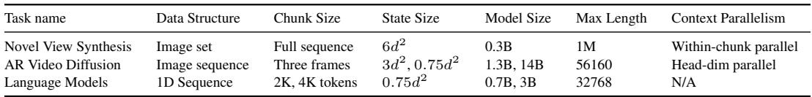

[← 返回 README](../README.md)

# 3. LaCT Model Architecture

## 📌 预览

本节详细介绍 LaCT 的模型架构，包含四个子节：3.1 节定义大 chunk TTT 层的数学形式，引入 SwiGLU MLP 作为 fast weight 网络和点积损失；3.2 节介绍非线性 fast weight 更新规则，包括 L2 归一化和 Muon 优化器；3.3 节解释为何以及如何集成 Window Attention；3.4 节介绍 Context Parallelism 策略，使模型可扩展到超长序列。

---

As shown in Fig. 2, LaCT block consists of three types of layers: a window attention layer, a largechunk TTT layer, and a feed-forward layer. Each layer is equipped with residual connections [19] following the practice in Transformer [1]. The window attention layer performs local self-attention to capture the local dependency. In the TTT layer, we split the sequence into large chunks. The history context is gradually compressed into the fast weights through an 'update' operation (regarding key vectors $K$ and value $V$ ), and latest weight is 'applied' to the current query vector (Q) for computing its corresponding output. The feed-forward layer performs channel mixing as in Transformer. We omit several linear and normalization layers in Fig. 2 for clarity and details are in Appendix A.1. Our framework offer great flexibility in handling diverse data types. In this section, we present the general designs in our approach and later describe data-specific variations in Sec. 4.

> 💡 **批注：LaCT Block 整体架构**
>
> LaCT block 的设计体现了"关注点分离"原则：
> - **TTT 层**（时间维度）：压缩长程历史上下文到固定大小的 fast weights $W$，通过 (K, V) 更新，通过 Q 读取
> - **Window Attention 层**（空间/局部维度）：精确建模 chunk 内部的局部结构，无信息损失
> - **FFN 层**（通道维度）：标准的逐位置通道混合，与 Transformer 相同
>
> 与标准 Transformer 的区别在于：用 TTT 层替换了全局 self-attention，将 O(N²) 的长程注意力降为 O(N/chunk_size) 的 fast weight 更新次数，实现了次二次复杂度。

---

# 3.1 Large-Chunk TTT Layer

Different from the per-token update in Eqn. 1, the chunk-wise update computes the gradient of the summed loss over all keys $\left\{ k _ { i } \right\}$ and values $\{ v _ { i } \}$ within the chunk. As the chunk size is large, weight updates are performed infrequently. This enables more sophisticated weight-update rule designs (discussed in Sec. 3.2) and amortizes the update cost. The 'update' operation for the fast weight is:

$$
\begin{array} { c } { { \displaystyle g = \nabla _ { W } \sum _ { i = 1 } ^ { b } \eta _ { i } \mathcal { L } \big ( f _ { W } \big ( k _ { i } \big ) , v _ { i } \big ) } } \\ { { \displaystyle W \gets \mathrm { w e i g h t - u p d a t e } ( W , g ) , } } \end{array}
$$

where $b$ is the chunk size, $g$ is the gradient of the fast-weight loss function, and $\eta _ { i }$ is the learning rate of each token (usually predicted from input tokens). The 'apply' operation $o _ { i } = f _ { W } ( q _ { i } )$ is the same as Eqn. 2 and all query vectors $\left\{ q _ { i } \right\}$ in the chunk share the same updated fast weight $W$ .

> 💡 **批注：Chunk-wise Update 的数学细节**
>
> 关键点：
> 1. **梯度是 chunk 内所有 token 损失的加权和**：$g = \nabla_W \sum_{i=1}^b \eta_i \mathcal{L}(f_W(k_i), v_i)$，这允许并行计算所有 token 的损失和梯度，然后一次性做梯度下降。
> 2. **每个 token 有独立的学习率 $\eta_i$**：通常由输入 token 预测得到，类似线性 attention 中的门控机制，允许模型自适应地控制不同 token 对 fast weight 的贡献。
> 3. **chunk 内所有 query 共享同一个更新后的 $W$**：这意味着 chunk 内部的 apply 操作是并行的（所有 token 同时查询同一个 $W$），实现了真正的批处理。
> 4. **与 per-token TTT 的区别**：per-token TTT 每个 token 都有不同的 $W$（因为每个 token 都会更新），而 LaCT 一个 chunk 内只更新一次，chunk 内所有 token 看到的是同一个 $W$。

---

Motivated by recent LLMs [20], we adopt SwiGLU-MLP [21] without bias terms as the fast-weight network. Our fast weights consists of three weight matrix $W = \{ W _ { 1 } , W _ { 2 } , W _ { 3 } \}$ , and the network is:

$$
f _ { W } ( x ) = W _ { 2 } \left[ \mathrm { S i L U } ( W _ { 1 } x ) \circ ( W _ { 3 } x ) \right]
$$

where $\circ$ is an elementwise multiplication. We apply a simple dot product loss as our loss function:

$$
\mathcal { L } \big ( f _ { W } ( k _ { i } ) , v _ { i } \big ) = - f _ { W } ( k _ { i } ) ^ { \top } v _ { i }
$$

> 💡 **批注：SwiGLU Fast Weight 的设计选择**
>
> **为什么选 SwiGLU MLP 作为 fast weight 网络？**
>
> 1. **非线性容量**：相比线性 fast weight（$f_W(x) = Wx$），SwiGLU 通过门控非线性激活（SiLU + element-wise product）提供更强的记忆表达能力，实验证明性能显著更好（Figure 8a）。
>
> 2. **无偏置项**：偏置项会存储序列无关的"全局统计量"，而 fast weight 应该专注于序列特定的"临时记忆"。去掉偏置强制模型只通过权重矩阵存储信息。
>
> 3. **与现代 LLM 对齐**：LLaMA、GPT-4 等模型都用 SwiGLU FFN，说明这是一个表达能力强且训练稳定的架构选择。
>
> **点积损失的设计**：$\mathcal{L} = -f_W(k_i)^\top v_i$（负点积）鼓励 $f_W(k)$ 和 $v$ 方向一致，比 MSE 损失更简洁，且等价于在 L2 归一化后最小化 key-value 的余弦距离。
>
> **Fast weight 参数量**：三个矩阵 $W_1, W_2, W_3$，若 fast weight 的中间维度为 $m$，输入维度为 $d$，则：
> - $W_1, W_3 \in \mathbb{R}^{m \times d}$：各 $md$ 个参数
> - $W_2 \in \mathbb{R}^{d \times m}$：$md$ 个参数
> - 总共 $3md$ 个参数，state size $= 3md$

---

Execution orders for 'apply' and 'update'. Note that the 'update' operation and 'apply' operation of TTT are decoupled, and we can set the chunk size adaptively and apply these operation in different orders; this allows us to model diverse kinds of data dependencies, similar to different attention masks in self-attention. Figure 3 illustrates this concept. In Figure 3a, when the chunk size equals the full sequence length, performing the apply followed by the update operation is conceptually similar to full attention. Using update and apply alternately leads to a block-wise causal mask (Fig. 3b), where the block size corresponds to the chunk size. Switching the order between the two operations results in the a shift in the mask (Fig. 3c). This shifted mask does not leak future information within the chunk and is important when building the full causal mask in Language Modeling (Sec. 4.2). Moreover, only updating on a subset of chunks and applying to all (Figure 3d) is analogous to strided block-wise causal mask.

> 💡 **批注：Update/Apply 顺序对应的注意力掩码**
>
> 这是一个非常优雅的设计空间分析：TTT 的 update/apply 顺序可以等价于不同的 attention mask 模式：
>
> | 配置 | 等价 Attention Mask | 应用场景 |
> |-----|-------------------|---------|
> | chunk = full sequence，先 apply 后 update | 全注意力（Full Attention）| - |
> | 交替 update-apply | Block-wise Causal Mask | 标准自回归 |
> | 先 update 后 apply（shifted）| Shifted Block-wise Causal | 语言模型（Fig. 3c）|
> | 只在子集 chunk 上 update，全部 apply | Strided Block-wise Causal | NVS、视频扩散（Fig. 3d）|
>
> 这种分析证明了 LaCT 不是一个专用于特定数据的架构，而是一个可以通过调整 update/apply 顺序来适配任意数据结构的通用框架。

---

*Figure 3: Different 'Update' and 'Apply' orders and their equivalent attention mask. A blue mask in i-th row and j-th column means the i-th token's output depends on the j-th token.*

> 💡 **Figure 3 批读**：
> - **(a) Full Attention 等价**：先对全序列 apply，再 update。每个 token 的输出取决于所有其他 token，等价于双向全注意力。适合需要全局双向上下文的任务（如图像理解）。
> - **(b) Block-wise Causal Mask**：交替 update-apply。每个 chunk 的 tokens 只能看到之前 chunk 的信息。是最自然的自回归 block 处理方式。
> - **(c) Shifted Block-wise Causal**：在 (b) 的基础上移位，使当前 chunk 的 tokens 能看到前一个 chunk 的全部和当前 chunk 自己（但不看未来）。语言模型用这个保持严格的因果性。
> - **(d) Strided Block-wise Causal**：只在部分 chunk 上 update（如只在 clean 帧 chunk 上 update），其他 chunk 只 apply。视频扩散和 NVS 使用这个模式，允许模型"prefill"历史信息再"decode"所有查询。
> - **核心洞察**：TTT 的 update/apply 解耦使其比固定因果掩码的 attention 更灵活，可以用统一的框架表达多种数据依赖结构。

---

# 3.2 Non-Linear Update of Fast-Weight

Fast-weight updates in TTT repeatedly accumulate gradients, and thus suffer from magnitude explosion or decayed memory. Large-chunk TTT allows non-linear updates to improve stability and effectiveness while preserving efficiency. For the 'weight-update' operation in Eqn. 5, our vanilla implementation involves gradient descent followed by weight normalization:

$$
\operatorname { w e i g h t - u p d a t e } ( W , g ) = \operatorname { L 2 - N o r m a l i z e } ( W - g ) .
$$

We have also explored a more robust nonlinear Muon [8] update rule 1 with weight normalization:

$$
\operatorname { w e i g h t - u p d a t e } ( W , g ) = \operatorname { L 2 - N o r m a l i z e } ( W - \operatorname { M u o n } ( g ) )
$$

Fast-weight normalization. We apply L2 weight normalization [22] to the updated fast weights along the input dimension. We do not use explicit weight-decay term as in previous methods [5, 23, 13, 11]. When the network is conceptually rotated 90 degrees, treating the sequence dimension as the depth of a virtual model, the test-time training updates act as residuals over time [19]. In this view, our fast-weight normalization is analogous to the post-layer norm in Transformer architectures, which constrains activation scales within the residual path.

> 💡 **批注：Fast Weight 归一化的几何直觉**
>
> 作者提供了一个精妙的类比：把序列方向看作"虚拟深度"，TTT 的每次 chunk 更新就像是一个 Transformer 的 residual block。在这个视角下：
> - **Fast weight 归一化** ≈ **Post-layer norm**：约束每次"虚拟层"之后的权重幅度，防止梯度累积导致的爆炸或消失。
> - **不需要显式 weight decay**：L2 归一化本身就将权重约束在单位超球面上，自然地防止权重幅度无限增长。
>
> 这个类比也解释了为什么不需要显式的遗忘机制（如 GLA 中的 $\alpha_t$ 衰减因子）：L2 归一化通过约束权重范数隐式地实现了"旧信息的相对衰减"。

---

Muon-update rule. Essentially, Muon normalizes the spectral norm of matrix gradient using Newton-Schulz iterations. In short, let $\begin{array} { r } { { \dot { g } } = U S V ^ { T } } \end{array}$ be the Singular Value Decomposition(SVD) of the gradient $g$ , then Muon operator approximately converts the gradient as:

$$
\mathrm { M u o n } ( g ) \simeq U V ^ { T }
$$

Muon also improves the numerical stability in our setup. For example, the learning rate $\eta _ { i }$ in Eqn. 4 now only reflects the relative importance of tokens within a chunk as Muon normalizes the absolute scale. See [8] and Appendix A for analysis of its computational cost.

> 💡 **批注：Muon 优化器——为什么在 fast weight 更新中有效？**
>
> **Muon 的核心操作**：通过 Newton-Schulz 迭代近似计算梯度矩阵的 SVD，然后用 $UV^T$（去除奇异值，只保留奇异向量方向）替换原始梯度。本质是将梯度的谱范数（最大奇异值）归一化为 1。
>
> **为什么适合 fast weight 更新？**
> 1. **学习率解耦**：$\eta_i$ 只需要控制 token 的相对重要性，不需要处理梯度的绝对量级（Muon 已经归一化了量级）。
> 2. **数值稳定性**：防止某些 token 的梯度主导更新方向，使 fast weight 的更新更均匀。
> 3. **对比实验效果**：Figure 7b 中 Muon 在 NVS 和语言模型上都优于 Vanilla GD 和 Momentum，说明谱归一化对 fast weight 这种特殊的在线学习场景特别有益。
>
> **计算成本**：Newton-Schulz 迭代是纯矩阵运算，可以高效地在 GPU 上执行，不会显著增加训练成本（参见 Appendix A）。

---

# 3.3 Window Attention

The large-chunk TTT layer treats data as sequences of sets because its fast weight updates inherently disregard token order and spatial locality within each chunk. However, many data modalities—such as videos (sequences of grids), image collections (sets of grids), or text (1D sequences)—do not fully align with this set-based perspective . For these modalities, intra-chunk structure and locality are vital for capturing the overall data structure. We therefore integrate local window attention (either causal or bidirectional) alongside TTT layers to handle data structure within a chunk. Moreover, window attention efficiently handles localities in the data, enabling the TTT layer to focus its fixed-size fast weight capacity on modeling non-local dependencies. This hybrid strategy is also employed in other notable works like BASED [24], GAU [25] and InifinitAttention [26]. In summary, LaCT is a hybrid architecture with the quadratic-compute attention for local structure and linear-compute TTT for non-local context.

> 💡 **批注：Window Attention 的功能定位**
>
> Window Attention 在 LaCT 中扮演"局部精确感知"的角色，与 TTT 层形成明确的职责分工：
>
> | | TTT 层 | Window Attention |
> |--|--------|-----------------|
> | **处理范围** | 跨 chunk 的长程依赖 | chunk 内部的局部结构 |
> | **计算复杂度** | O(N/chunk_size)（每个 chunk 一次更新） | O(window_size²)（固定小窗口）|
> | **存储方式** | fast weights $W$（固定大小，有损压缩）| attention matrix（精确但有限范围）|
> | **顺序敏感性** | 否（视 tokens 为无序集合）| 是（保持位置信息）|
>
> 这种混合设计的关键洞察是：**fast weight 的容量应该专注于非局部信息**，因为局部信息可以通过更高效的窗口注意力来处理。如果 fast weight 也要存储局部信息，会浪费有限的状态容量。

---

# 3.4 Context Parallelism

Context Parallelism (CP) partitions the sequence along the context length dimension and distributes the shards across multiple devices for parallel computing. The feed-forward layer and window attention are local operators thus natively support CP. For TTT layer, small chunks hardly support CP thus tensor parallelism (i.e., parallel over the heads) is preferred. Our large-chunk TTT layer allows CP by sharding the tokens within a chunk. Suppose each shard contains $s$ tokens, the fast weight gradient of the chunk is the sum over all shard's gradients given the linearity of the gradients:

$$
g = \nabla _ { W } \sum _ { j = 1 } ^ { \mathrm { s h a r d s } } \sum _ { i = 1 } ^ { \mathrm { s } } \eta _ { i } \mathcal { L } _ { i } = \sum _ { j = 1 } ^ { \mathrm { s h a r d s } } \nabla _ { W } \sum _ { i = 1 } ^ { \mathrm { s } } \eta _ { i } \mathcal { L } _ { i }
$$

This can be implemented through distributed all-reduce-sum and is logically the same as Distributed Data Parallelism (DDP), except that the parameters are the fast weights and input data are the tokens in the chunk. We adopt such parallelism in training the novel view synthesis task (see Sec. 4.1) and observe minimal throughput overheads ( $1 \%$ to $3 \%$ ). LaCT architecture is compatible with other parallelism strategies (e.g., data parallelism, pipeline parallelism, and tensor parallelism). See Appendix for pseudocode on implementing context parallelism(Alg. 3) and tensor parallelism(Alg. 4) for LaCT.

> 💡 **批注：Context Parallelism 的数学基础**
>
> LaCT 的 Context Parallelism 之所以可行，依赖于**梯度的可加性**：chunk 内所有 token 对 fast weight 梯度的贡献是独立可加的，因此可以：
> 1. 将 chunk 内 tokens 切分到不同设备（每个设备处理 $s$ 个 tokens）
> 2. 各设备独立计算局部梯度 $g_j = \nabla_W \sum_{i=1}^s \eta_i \mathcal{L}_i$
> 3. All-reduce 求和得到全局梯度 $g = \sum_j g_j$
> 4. 各设备用相同的 $g$ 更新相同的 fast weights（类似 DDP）
>
> **这与小 chunk TTT 的本质区别**：小 chunk（如 per-token）的 fast weight 状态在每个 token 后都不同，无法在 token 层面并行化（必须串行）。大 chunk 将并行度锁定在 chunk 内，使得分布式计算成为可能。
>
> **1%~3% 的通信开销**：All-reduce 的通信量是 fast weight 梯度大小（约 $3md$ 个 float），相比 token 特征（$s \times d$）小很多（$m \ll s$），因此通信开销极小。这说明 LaCT 的 CP 是一个高效的实现。

---

*Table 1: Summary of our experiments on three different data structures. 'd' denotes model dimension. The state size denotes the size of the fast weight per model block.*

> 💡 **Table 1 批读**：
>
> | 任务 | 数据结构 | Chunk Size | State Size | 模型大小 | 最大序列长 | CP 策略 |
> |-----|---------|-----------|-----------|---------|---------|--------|
> | Novel View Synthesis | 图像集合 | 全序列 | 6d² | 0.3B | 1M tokens | Chunk 内并行 |
> | AR Video Diffusion | 图像序列 | 三帧 | 3d²/0.75d² | 1.3B/14B | 56160 tokens | Head 维度并行 |
> | Language Models | 1D 序列 | 2K/4K tokens | 0.75d² | 0.7B/3B | 32768 tokens | 无 |
>
> **关键观察**：
> - NVS 的 state size 最大（6d²），因为它需要压缩大量无序图像信息；语言模型 state size 相对较小（0.75d²），因为文本本身信息密度更高
> - NVS 使用全序列作为一个 chunk（1M tokens 是一个超大 batch），而语言模型用 2K/4K tokens 的滑动窗口——反映了不同数据结构的适配策略
> - 视频扩散使用 3 帧为一个 chunk，自然对齐了视频的时间结构

---

## 🔖 Section 总结

### 关键数字速查
| 指标 | 数值 |
|------|------|
| NVS fast weight state size | 6d² per block（占模型参数 ~40%）|
| LM fast weight state size | 0.75d² per block |
| 视频扩散 chunk size | 3 帧 |
| LM chunk size | 2K 或 4K tokens |
| Context Parallelism 通信开销 | 1% ~ 3% 额外延迟 |

### 核心洞察
1. **SwiGLU Fast Weight**：非线性门控激活显著提升记忆容量，实验证明优于同等大小的线性 fast weight（Figure 8a）。
2. **Muon 优化器的妙处**：通过谱范数归一化，使 token 学习率 $\eta_i$ 只需控制相对重要性而非绝对量级，提升数值稳定性和性能（Figure 7b）。
3. **Fast Weight 归一化 = 虚拟 Post-LayerNorm**：将序列维度视为"深度"后，weight normalization 类比于 Transformer 的 post-layer norm，提供理论支撑。
4. **Context Parallelism 的可行性**：梯度可加性使得 chunk 内 tokens 可以分布在多个设备上，通信开销极小（1%~3%），是扩展到 1M tokens 的关键工程支撑。
5. **Update/Apply 顺序 = 注意力掩码设计空间**：四种基本配置（全注意力等价、block-wise causal、shifted causal、strided causal）覆盖了大多数数据依赖模式。
