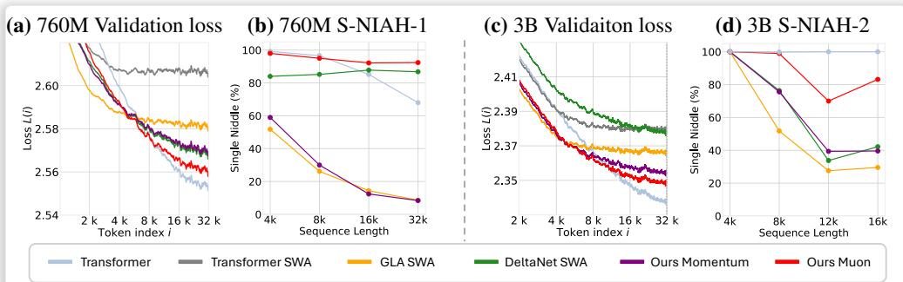
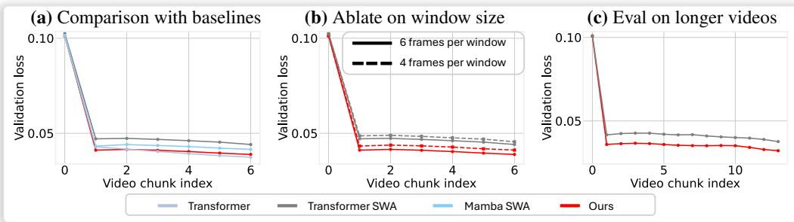
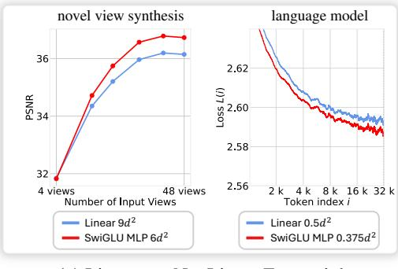
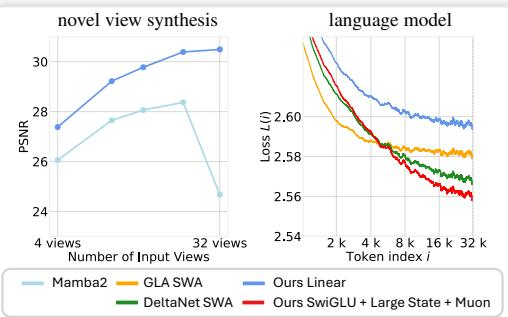

[← 返回 README](../README.md)

# 5. Experiments

## 📌 预览

本节报告三项任务的实验结果与深度分析：5.1 节 NVS 实验展示 LaCT 在物体级和场景级达到与全注意力基线相当的渲染质量，同时推理速度更快；5.2 节语言模型实验中，LaCT（Muon 变体）在长上下文 loss 和检索精度上超越 DeltaNet 和 GLA；5.3 节自回归视频扩散实验验证了 14B 参数模型的有效性；5.4 节通过消融实验量化了状态大小、优化器选择、线性 vs 非线性 fast weight、chunk 大小 vs per-token 的各自贡献。

---

In this section, we present our experiment results on novel view synthesis (Sec. 5.1), language modeling (Sec.5.2), and autoregressive video generationo (Sec. 5.3), and an in-depth analysis (Sec. 5.4) of different design choices. Tab. 1 summarizes key factors in each experiment. When comparing with linear-cost baselines, we augmented them with the same window attention for fair comparisons. The full experimental details for all tasks are provided in Appendix C.

> 💡 **批注：公平比较的设计**
>
> 作者在与线性方法（GLA、DeltaNet）比较时，给所有 baseline 都加上了相同的 window attention，确保性能差异来自 TTT/记忆机制本身，而非 window attention 的额外信息。这是一个重要的实验设计决策，避免了"因为加了额外组件而性能更好"的混淆。

---

# 5.1 Novel View Synthesis

Datasets $\pmb { \& }$ metric. We evaluate our approach on both object-level and scene-level datasets. We use Objaverse dataset [31] for object-level training, following the setup from LVSM [29] and GS-LRM [32]. After training, we perform evaluations on the Google Scanned Objects (GSO) dataset [33], at resolutions of $256 \times 256$ and $512 \times 512$ . Each evaluation involves 4–48 input views and 8 novel views per object. For scene-level evaluations, we adopt the challenging DL3DV scene dataset [34], with over 11K training scenes and 140 testing scenes, each with approximately 300 views. Evaluations are at a resolution of $960 \times 536$ . Performance is measured by Peak Signal-to-Noise Ratio (PSNR) at novel views, with additional metrics provided in the Appendix C.1.

Model details. Each block of model has a per-image window attention layer, a SwiGLU-MLP largechunk TTT layer, and a feed-forward layer. The default model totals 312M parameters, including 84M fast weights $6 d ^ { 2 }$ per block).

Table 2: Complexities of methods on novel view synthesis w/ $n$ input. Prefill and rendering speed are measured on A100 with $48$ $512 \times 512$ input images (196K input tokens, 4K decoding tokens).

> 💡 **批注：NVS 实验设置说明**
>
> - **物体级（GSO）**：标准 benchmark，4~48 视角输入，测试基本的多视角理解能力
> - **场景级（DL3DV）**：更有挑战性，960×536 高分辨率，~300 视角训练，测试大规模场景理解
> - **Fast weight 大小**：6d² 每 block，对于 d=768，约 84M 参数（占总模型参数 312M 的 27%）
> - **为什么用 PSNR**：NVS 是确定性重建任务，PSNR 是衡量像素级重建质量的标准指标

---

Baselines. For object-level evaluation, we use two baselines: a full-attention model and a Perceiverstyle register-attention model [35]. The full-attention baseline replaces TTT layers with block-wise causal attention layers, enabling bidirectional interaction among input tokens and cross-attention from novel views. The Perceiver-style baseline compresses input tokens into 4096 registers, decoding novel views via cross-attention to these registers. For scene-level evaluation, we compare with LongLRM [36], a state-of-the-art model combining Mamba [12] and full attention for 3D Gaussian splat predictions, as well as pure optimization-based 3D Gaussian splatting methods. Table 2 summarizes the computational complexities of all models.

Training details. For object dataset, we train all models with 1.25 trillion tokens with progressive resolutions. For scene dataset, we train our model with 1.8 trillion tokens with progressively higher resolutions and more views, at a maximal sequence length of 1 million tokens. High-resolution models are trained with inner-chunk context parallelism (Sec. 3.4). See more details in Sec. C.1.

Results. Experimental results and analysis are presented in Figure 4.

*Figure 4: (a, b) our method achieves quality comparable to full-attention models with significantly lower prefill latency, and it clearly outperforms perceiver-attention baselines. (c) On the high resolution scene dataset, our approach surpasses LongLRM, limited to 32 views, and outperforms 3D Gaussian Splatting with sparse views, remaining competitive up to 128 input views (1M total tokens).*

> 💡 **Figure 4 批读**：
> - **(a, b) 物体级（GSO）**：LaCT 在 256×256 和 512×512 分辨率下的 PSNR 与全注意力 baseline 相当，同时前置处理延迟（prefill latency）显著更低（因为 TTT 的 prefill 是一次大矩阵乘法，而全注意力是 O(N²) 的注意力计算）。Perceiver-style baseline 由于信息压缩有损，性能明显更差，说明 4096 个 register tokens 的压缩不如 LaCT 的 fast weights 有效。
> - **(c) 场景级（DL3DV）**：LaCT 在 128 视角（1M tokens）下超越 LongLRM（被限制在 32 视角）和稀疏视角的 3DGS（3D Gaussian Splatting）。这证明了 LaCT 在超长序列下的有效性。
> - **关键数字**：在 48 张 512×512 图像（196K tokens）的推理中，LaCT 的 prefill 速度比全注意力 baseline 快得多（参见 Table 2），体现了 O(1) 更新次数 vs O(N²) 的复杂度优势。

---

# 5.2 Language Modeling

Datasets & Metrics. We train our models on the Long-Data-Collections dataset [37], using approximately 60B tokens from its total 68.8B tokens. For evaluation, we employ the per-token loss metric from [38], assessing models' ability to effectively use the full context. A monotonically decreasing loss indicates successful context utilization, whereas plateauing suggests limited context usage. Additionally, we report retrieval accuracy [39] at various sequence lengths.

Model details. We remove the window-attention layer from the original the LaCT block, integrating a sliding window-attention(SWA) layer directly into the Large-Chunk TTT layer. Following GAU [25], SWA shares Q, K, and V vectors with the fast-weight network, with additional per-channel scaling and shifting on Q and K. The pseudocode for this design is in Algorithm 2.

Baselines. We compare against full attention, Gated Linear Attention (GLA) [13], DeltaNet [3, 15].   
To ensure fairness, we enhance both GLA and DeltaNet with the same sliding window attention.   
Based on prior work [38, 40, 41] highlighting the importance of a large RoPE [42] base for longcontext transformer training, we adopt a RoPE base of 1 million for training with 32K token contexts.   
Tab. 3 summarize the mechanism and training throughput of all methods.

Training details. We trained models at two scales using a 32768-token sequence length: a 760Mparameter model trained for 40B tokens with a 2048-token sliding window, and a 3B-parameter model trained for 60B tokens with a 4096-token sliding window. See more details in Sec. C.2.

Table 3: Comparison of baseline methods in terms of state size, training throughput (measured in tokens per second, TPS), update rules, and memory read-out mechanisms. Training throughput is evaluated using a 3B-parameter model with 32K-sequence length on A100-40GB GPUs.

| Method | State Size | Train TPS | Update Rule | Memory Read-out |
|--------|-----------|-----------|-------------|-----------------|
| Transformer | - | 4.1K | - | - |
| Transformer SWA | - | 6.4K | - | - |
| GLA SWA | 384d | 5.0K | $S_t \leftarrow S_{t-1}\text{Diag}(\alpha_t) + v_t k_t^T$ | $o = S q_t$ |
| DeltaNet SWA | 128d | 5.1K | $S_t \leftarrow S_{t-1}(I - \beta_t k_t k_t^T) + \beta_t v_t k_t^T$ | $o_t = S_t q_t$ |
| Ours GD | 2304d | 5.0K | $W \leftarrow \text{L2norm}(W - \sum_b \eta_i \nabla_W \mathcal{L}_i)$ | $o_t = f_W(q_t)$ |
| Ours Momentum | 2304d | 4.9K | (with momentum) | $o_t = f_W(q_t)$ |
| Ours Muon | 2304d | 4.3K | $M \leftarrow \beta M + \sum_b \eta_i \nabla_W \mathcal{L}_i; W \leftarrow \text{L2norm}(W - \text{Muon}(M))$ | $o_t = f_W(q_t)$ |

> 💡 **批注：Table 3 深度解读——三种方法的本质区别**
>
> Table 3 提供了各方法的统一视角比较，揭示了关键差异：
>
> **状态大小的巨大差异**：
> - GLA: 384d（低秩矩阵状态，约 0.05d² for d=768）
> - DeltaNet: 128d（更低秩）
> - LaCT: 2304d（= 0.75d² for d=768，比 GLA/DeltaNet 大 6~18 倍）
>
> **Update Rule 的表达能力**：
> - GLA: 指数遗忘 + 外积累加（线性，低表达能力）
> - DeltaNet: Delta rule（线性，有错误修正机制）
> - LaCT: 梯度下降在 SwiGLU MLP 上（非线性，高表达能力）+ Muon 谱归一化
>
> **Memory Read-out 的非线性**：
> - GLA/DeltaNet: $o_t = Sq_t$（线性读取）
> - LaCT: $o_t = f_W(q_t)$（非线性读取，$f_W$ 是 SwiGLU MLP）
>
> **训练吞吐量**：LaCT Muon 的 4.3K TPS vs 其他方法的 4.9K~6.4K TPS，Muon 的额外计算开销约 15%，是可接受的代价（换来显著的性能提升）。

---

*Figure 5: Language Model results. (a, c) Our model achieves lower per-position loss at larger token indices compared to GLA and DeltaNet at both 760M and 3B scale, indicating stronger long-context modeling capability. (b, d) Our model consistently outperforms GLA and DeltaNet in retrieval accuracy. Furthermore, our Muon variant consistently outperforms our Momentum variant.*

> 💡 **Figure 5 批读**：
> - **(a, c) Per-position Loss**：LaCT（尤其是 Muon 变体）在序列后半段（较大 token index）的 loss 更低，说明其对长程上下文的利用能力更强。理想的长上下文模型应该随着 token index 增加而 loss 单调下降（表示利用了更多上下文），LaCT 在 760M 和 3B 两个规模上都展现出比 GLA 和 DeltaNet 更好的这一特性。
> - **(b, d) Retrieval Accuracy**：LaCT 在不同序列长度下的检索准确率都高于竞争方法，说明 fast weight 确实更好地存储了远程 token 信息。Muon 变体始终优于 Momentum 变体。
> - **760M vs 3B 的一致性**：两个规模的结果趋势一致，表明 LaCT 的优势不依赖于特定模型大小，具有较好的扩展性。

---

# 5.3 Autoregressive Video Diffusion

We fine-tune the pretrained Wan 2.1 [43] text-to-video diffusion model into an autoregressive video diffusion model. Specifically, we replace all bidirectional attention layers with our LaCT layers combined with sliding window attention. The sliding window attention uses a window size spanning two autoregressive chunks.

Datasets. We fine-tune the model using an internal, filtered proprietary collection of videos, each accompanied by a short text prompt generated by a visual language model.

Training details. Following [44, 43], we employ time-step shifting and denoising loss weighting using a logit-normal distribution. we train on 5-second videos at 16 FPS and $480 \times 832$ resolution, autoregressively denoising in 3 latent-frame chunks. Later we fine-tune the 1.3 billion parameter model with 10 second videos and 14 billion parameter model with 8.8 second videos. Each 8.8-second clip contains 56,160 visual tokens, resulting in interleaved noisy-clean chunks totaling 107K tokens under teacher-forcing training. We use sequence parallelism for MLP layers and tensor parallelism (sharding heads across devices) for TTT and window attention layers. Full details are listed in Sec. C.3.

Baselines. We compare our method against three baselines: sliding window attention (SWA) alone, Mamba2 [23] combined with SWA (using a similar parallel combination strategy as our method), and full block-wise causal attention.

Evaluation. We evaluate all models on a collection of 2,000 videos after 5,000 training iterations by computing the denoising loss at five timesteps (550, 650, 750, 850, 950). Figure 6 plots the chunk-wise denoising loss across evaluated video frames. We only measure validation loss up to training sequence length. See project website for our autoregressively generated videos 2.

> 💡 **批注：视频扩散实验的规模与挑战**
>
> 视频扩散实验是全文规模最大的实验，有几个值得注意的工程细节：
>
> 1. **从预训练模型微调**：在 Wan 2.1（一个高质量的文生视频模型）的基础上微调，而非从头训练。将所有双向 attention 替换为 LaCT + SWA，保持其他参数不变。
>
> 2. **Token 规模**：8.8 秒视频 × 16FPS = ~141 帧，经过 VAE 压缩后有 56,160 visual tokens。加上 interleaved noisy chunks，teacher-forcing 序列达 107K tokens，远超大多数长上下文模型。
>
> 3. **并行策略**：FFN 层用序列并行，TTT 和 window attention 用张量并行（head-wise）。注意这里没有使用 context parallelism（与 NVS 的 within-chunk CP 不同），因为视频任务的 chunk size（3 帧）相对较小。
>
> 4. **评估指标的困难性**：视频生成没有像 PSNR 或 perplexity 那样可靠的定量指标。作者使用去噪 loss 作为代理指标，这在视频生成领域是常见做法。

---

*Figure 6: (a) We achieve comparable validation loss to the full-attention baseline and outperform both Mamba with sliding window and sliding window attention baselines. This improvement over SWA is consistent across different window sizes (b) and when evaluating on longer videos (c).*

> 💡 **Figure 6 批读**：
> - **(a) 主结果**：LaCT 的验证去噪 loss 与全 block-wise causal attention baseline 相当，同时显著优于 Mamba2+SWA 和纯 SWA。这说明 LaCT 的 fast weight 记忆机制（使用非线性 SwiGLU）比 Mamba 的线性状态更有效。
> - **(b) 窗口大小鲁棒性**：跨不同 window size（单帧 vs 多帧）LaCT 都优于 SWA baseline，说明 LaCT 的优势来自 fast weight 而非 window 设置。
> - **(c) 泛化到更长视频**：在训练长度以外评估时，LaCT 相对于 SWA 的优势依然保持，说明 fast weight 携带的历史信息在更长视频中更有价值（SWA 无法看到训练窗口以外的历史）。
> - **与全注意力的对比**：LaCT 仅通过线性复杂度的 fast weight 就达到了二次复杂度全注意力的效果，且可以处理比全注意力更长的序列（全注意力在 56K tokens 下计算量过大）。

---

# 5.4 Analysis on Design Choices

In this section, we analyze several key design choices in our model, focusing on both the novel view synthesis and language modeling tasks, where good metrics exist. Specifically, we evaluate the impact of state size (Fig. 7a), test-time optimizers (Fig. 7b), linear versus nonlinear fast weights (Fig. 8a), and per-token recurrence versus chunk-wise recurrence (Fig. 8b). Overall, we find that a large state size, advanced optimizers such as Muon, and nonlinear fast weights significantly improve our model's performance. For comparing chunk recurrence with per-token recurrence, in a controlled NVS experiment, our linear large-chunk recurrence strategy outperforms linear per-token recurrence with the same state size. For language modeling, where chunk structures are not inherent, our linear large-chunk recurrence variant—while initially underperforming per-token methods like GLA and DeltaNet—surpasses them when combined with a large nonlinear state and the Muon optimizer. We refer the readers to each figure and its caption for more detailed analysis.

> 💡 **批注：消融实验的核心发现预览**
>
> 5.4 节的消融实验量化了 LaCT 各组件的贡献，得出四个核心结论：
> 1. 状态越大，性能越好（且收益在长序列下更明显）
> 2. Muon > Momentum > Vanilla GD
> 3. 非线性 fast weight（SwiGLU）> 线性 fast weight（即使线性用更大状态）
> 4. 大 chunk（LaCT）在 NVS 上优于同等大小的 per-token（Mamba2），在语言模型上需要搭配大非线性状态才能超越

---

*Figure 7: (a) Scaling up the state size consistently improves performance in both novel view synthesis and language modeling tasks. Note, the largest version has state size of $12d^2$ per block, totaling $40\%$ of model weights as fast weights. (b) Comparison of test-time optimizers demonstrates Muon's surprising effectiveness over Vanilla Gradient Descent and Momentum.*

> 💡 **Figure 7 批读**：
> - **(a) 状态大小扩展（NVS + LM）**：在两个任务上，fast weight 状态越大，性能曲线越低（loss 越低）或 PSNR 越高。最大配置（12d² per block）达到模型参数量的 40%，表明状态大小的扩展空间远未饱和——这一点与 Transformer 的参数量扩展类似，暗示 fast weight 可能成为下一个重要的扩展维度。特别注意：**状态大小的收益在序列较长时更显著**，说明大状态对长程记忆的帮助更大。
> - **(b) 优化器比较**：Muon 在 NVS 和语言模型上都显著优于 Momentum 和 Vanilla GD，差距在训练后期更明显。这验证了谱归一化对 fast weight 的在线学习特别有益。Momentum 优于 Vanilla GD，说明历史梯度的累积（动量）有助于 fast weight 的更新方向。

---

State size scaling. These controlled experiments utilize a SwiGLU MLP for fast weights and the Muon as the test-time optimizer. For NVS, experiments were conducted on the object dataset. All models were trained for 167B tokens, using 14 stacked blocks and a model dimension $d = 768$ To change the state size, we keep the head dimension fixed as model dimension. i.e. single head, and vary the intermediate dimension of SwiGLU MLP, such that the intermediate dimension ranges from 192 to 3072. The largest configuration results in a state size per model block as $12 d ^ { 2 }$ , totaling

*(a) Linear v.s. NonLinear Fast weight*

*Figure 8: (a) Nonlinear fast weights consistently outperform linear fast weights despite using smaller state sizes. (b) Our linear large-chunk recurrence approach significantly outperforms linear per-token recurrence (bidirectional Mamba2) for view synthesis tasks at the same state sizes. In language tasks, linear large-chunk recurrence of the same state size underperforms the GLA baseline, but when combined with larger nonlinear states and Muon test-time optimizer, it surpasses all per-token recurrence methods.*

> 💡 **Figure 8a 批读（Linear vs NonLinear Fast Weight）**：
> - **NVS 结果**：非线性 SwiGLU fast weight（使用更小的状态）优于线性 fast weight（使用更大的状态）。这证明**表达能力比原始状态大小更重要**——非线性激活函数带来的额外表达能力价值超过了额外的状态容量。
> - **语言模型结果**：同样的趋势，非线性 fast weight 更优。线性 fast weight 相当于矩阵外积累加的 key-value 存储（类似 GLA 的状态），但 LaCT 的大 chunk 更新方式使其更适合非线性网络。
> - **工程含义**：不应该为了"实现简单"而退化到线性 fast weight，非线性 SwiGLU 的额外实现复杂度是值得的，且在 LaCT 的大 chunk 框架下仍然高效。

---

$4 0 \%$ of model weights as fast weights. For the language model experiments, we use the 760 milion parameter setup, where the chunk size and sliding window attention (SWA) window size were set to 2048 tokens. We keep the intermediate dimension of the fast weight SwiGLU MLP the same as the head dimension. We increase the state size while proportionally decreasing the number of heads to maintain a fixed model dimension. Figure 7(a) demonstrates that larger state sizes consistently improve performance. Notably, the performance gap between small and large state sizes widens with increasing sequence length.

Test-Time optimizer comparison. We compare Muon with vanilla Gradient Descent (GD) and GD with momentum. Details on momentum implementation are in Appendix A. For NVS, we train all compared approaches for 671 tokens using model specs of 24 stacked blocks with model dimension of 768. Language modeling experiments used the 760M parameter setup. Figure 7(b) shows Muon consistently outperforming other optimizers.

Linear v.s. NonLinear fast weight. Our default fast weight function is a SwiGLU MLP without bias terms (nonlinear). We compare this against a simple linear fast weight, $f _ { W } ( x ) = W x$ . Both are updated using the same online dot product loss for key-value association. Figure 8 (a) presents this comparison for NVS and language modeling. Although the linear fast weights were configured with a larger state size than the nonlinear SwiGLU, they achieved lower performance. NVS models were trained for 671B tokens with 24 blocks and $d = 7 6 8 .$ . Language modeling used the 760M parameter setup.

Large-chunk v.s. Per-token recurrence. Figure 8(b) presents controlled experiments comparing our large-chunk recurrence with per-token recurrence. In the novel view synthesis (NVS) task, "Our Linear" variant employs a linear fast weight: $f _ { W } ( x ) = W x$ and is benchmarked against a Mamba-2 baseline (a linear per-token recurrence model) with an identical state size. To accommodate the bidirectional context required by NVS over input image tokens, the Mamba-2 baseline uses two Mamba-2 layers applied in opposite directions within each model block. Both our linear variant and this bidirectional Mamba-2 have state size of $d ^ { 2 }$ per block. Both of these two approaches employs a per-image window attention within each model block. Under this fair comparison, our linear large-chunk recurrence achieves significantly better view synthesis performance.

For the language modeling experiments also shown in Figure 8(b), the blue line "Our Linear" variant uses the same state size $\bar { ( 0 . 2 5 d ^ { 2 } ) }$ as the GLA SWA baseline. It initially underperforms GLA SWA (blue line underperforms yellow line), likely because language data lacks the inherent chunk structures that benefit our basic linear chunk recurrence. However, when LaCT is equipped with a larger non-linear state $( 1 . 5 d ^ { 2 } )$ and Muon updates, we significantly outperform these per-token recurrence baselines.

*(b) Large-Chunk v.s. Per-token Recurrence*

> 💡 **Figure 8b 批读（Large-Chunk vs Per-token Recurrence）**：
>
> 这是全文最重要的消融实验之一，直接回答"大 chunk 策略相比 per-token 是否真的更好？"
>
> **NVS 任务（有天然 chunk 结构）**：
> - 在公平对比下（相同状态大小 d²，都有 window attention），线性 LaCT 显著优于双向 Mamba2
> - 说明大 chunk 的更新方式更适合无序图像集合这类数据
> - 原因推测：图像集合本身就是无序的，per-token 的严格顺序假设（Mamba2 需要定义 scan 顺序）引入了不必要的偏差，而 LaCT 的集合化处理更符合数据结构
>
> **语言模型任务（无天然 chunk 结构）**：
> - 线性 LaCT（状态大小 0.25d²）初始时不如 GLA SWA：文本的逐 token 依赖是真实存在的，大 chunk 简单地忽略了 chunk 内部顺序
> - 但当 LaCT 使用更大非线性状态（1.5d²）+ Muon：性能翻转，超越所有 per-token 方法
> - 结论：**LaCT 在语言模型上的优势来自大状态容量 + 非线性 + 高效优化器，而非 chunk 策略本身**
>
> **综合结论**：大 chunk 策略 + 大非线性状态 + Muon = 全面碾压 per-token 线性方法，即使在最不利于 chunk 结构的语言建模任务上也成立。

---

## 🔖 Section 总结

### 关键数字速查
| 指标 | 数值 |
|------|------|
| LaCT 训练吞吐量（Muon，3B，32K ctx）| 4.3K TPS |
| GLA SWA 训练吞吐量 | 5.0K TPS |
| Transformer SWA 训练吞吐量 | 6.4K TPS |
| NVS 训练数据量（场景级）| 1.8 万亿 tokens |
| LM 训练数据量（3B 模型）| 600 亿 tokens |
| 视频扩散序列长度（teacher-forcing）| 107K tokens |
| 最大 fast weight state size | 12d² per block（40% 模型参数）|

### 核心洞察
1. **大状态 + 非线性 > 小状态 + 线性**：即使非线性 SwiGLU 的状态更小，也优于更大的线性 fast weight，说明质量（表达能力）比量（状态大小）更重要——但两者都重要。
2. **Muon 的优势随任务难度增加**：在长序列和复杂任务上，Muon 相对 GD/Momentum 的优势更明显，说明谱归一化对处理长序列记忆更新特别重要。
3. **NVS 是大 chunk 的天然适配场景**：无序图像集合不存在 token 顺序，大 chunk 处理比 per-token 的有序扫描（Mamba2）更自然，性能优势显著。
4. **语言模型的优势来源不同**：LaCT 在语言任务上的优势主要来自大状态容量和高效优化，而非 chunk 结构本身——这是对方法边界的诚实分析。
5. **视频扩散验证工程可行性**：14B 参数模型、56K visual tokens、107K teacher-forcing tokens，证明 LaCT 的工程实现在生产级别规模是可行的。
