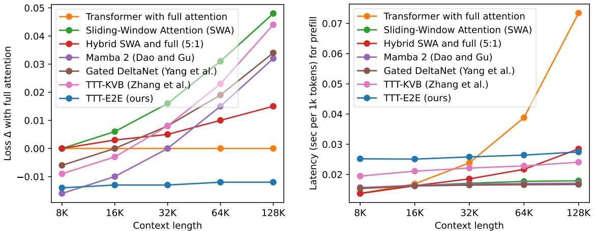

[← 返回 README](../README.md)

# 1. Introduction

## 📌 预览

Introduction 做了四件事：(1) 用"人类听课几年后还记得 intuition 但不记得细节"的类比，说明**压缩**是长期记忆的关键；(2) 吐槽 Transformer full attention 追求"近乎无损的 recall"，因此 $O(T^2)$；(3) 指出 RNN 路线（Mamba 2 / Gated DeltaNet / SWA stack）虽然 $O(1)$ per token，但在长 context 上 scaling 不如 full attention；(4) 提出本文的 **inner loop NTP + outer loop meta-learning** 双 E2E 方案。Figure 1 在这里第一次亮相 —— 把最 worst 的线（TTT-E2E, 绿线）变成最 best 的线（蓝线）。

---

*Figure 1. Scaling with context length, in terms of test loss (left) and latency (right). Left: Our method (TTT-E2E) turns the worst line (green) into the best (blue) at 128K context length. Loss Δ (↓), the y-value, is computed as (loss of the reported method) − (loss of Transformer with full attention), so loss Δ of full attention itself (orange) is the flat line at y = 0. While other methods produce worse loss Δ in longer context, TTT-E2E maintains the same advantage over full attention. All models have 3B parameters and are trained with 164B tokens. Right: Similar to SWA and the RNN baselines, TTT-E2E has constant inference latency regardless of context length, making it 2.7× faster than full attention for 128K context on an H100.*

> 💡 **Figure 1 批读（整篇论文的 money plot）**:
>
> **左图 — Loss Δ vs Context Length**：
> - 橙色 full attention 是地平线 y=0（参照基准）。
> - 所有其他方法都是**负的 Δ**（比 full attention 差），但**离地平线越来越远**的才是真正的 loser。
> - SWA (绿线) 在 8K 时和 full attention 重合（因为 pre-train context 也是 8K, 窗口 8K == 全见），但 context 一长就断崖。
> - Mamba 2 / Gated DeltaNet / TTT-KVB 在 32K 附近是相对最好的，但之后**开始上翘**，这正是 Figure 9 提到的"更长 context 反而更差"的悖论。
> - Hybrid SWA+Full (5:1) 介于两者之间。
> - **TTT-E2E (蓝线)** 在 8K-128K 全程维持**几乎平坦**的 -0.01 ~ -0.02 的 Δ，这意味着它**相对 full attention 的优势恒定**，且永远略好。
>
> **右图 — Latency vs Context Length**：
> - Full attention 呈线性上涨（prefill O(T²), 单 token latency O(T)），128K 时最慢。
> - SWA / Mamba 2 / GDN / TTT-KVB / **TTT-E2E** 全部是 constant (因为都有 8K 的 SWA 窗口 + $O(1)$ hidden state update)。
> - 2.7× 是 128K 处的实测比值。
>
> **关键洞察**：这张图是整篇论文要你相信的 "one chart to rule them all" —— **scaling 像 full attention，latency 像 RNN**。这正是作者反复强调"我们得到了两个世界最好的部分"的依据。

---

Humans are able to improve themselves with more experience throughout their lives, despite their imperfect recall of the exact details. Consider your first lecture in machine learning: You might not recall the instructor's first word during the lecture, but the intuition you learned is probably helping you understand this paper, even if that lecture happened years ago.

> 💡 **这段的作用**：用"人类听课"的日常类比铺垫**"压缩 vs 无损 recall"**的二分法。后面会多次回到"人"的比喻 —— 人类不会记住每个细节，但能持续吸收经验。这正是 TTT-E2E 想要的长期记忆机制。

On the other hand, Transformers with self-attention still struggle to efficiently process long context equivalent to years of human experience, in part because they are designed for nearly lossless recall. Self-attention over the full context, also known as full attention, must scan through the keys and values of all previous tokens for every new token. As a consequence, it readily attends to every detail, but its cost per token grows linearly with context length and quickly becomes prohibitive.

> 💡 **批注**：作者把 full attention 称作"nearly lossless recall"—— 这是个挺好的 framing。self-attention 的 KV cache 事实上就是**显式存储**了所有 token 的 key 和 value，就像把所有讲课录音都留着。代价就是 per-token cost 随 context 线性增长。

As an alternative to Transformers, RNNs such as Mamba 2 [32] and Gated DeltaNet [104] have constant cost per token, but become less effective in longer context, as shown in Figure 1. Some modern architectures approximate full attention with a sliding window [1, 107], or stack attention and RNN layers together [91, 11]. However, these techniques are still less effective than full attention in using longer context to achieve better performance in language modeling.

> 💡 **批注**：这是建立"问题空间"—— 现有方案要么效率好但 scaling 差（RNN），要么效果好但效率差（full attention）。**本文要打的缺口**：一个既有 RNN 效率又有 full-attention scaling 的方法。

How can we design an effective method for language modeling with only constant cost per token? Specifically, how can we achieve better performance in longer context without recalling every detail, as in the opening example? The key mechanism is compression. For example, humans compress a massive amount of experience into their brains, which preserve the important information while leaving out many details. For language models, training with next-token prediction also compresses a massive amount of data into their weights. So what if we just continue training the language model at test time via next-token prediction on the given context?

> 💡 **批注（全文最重要的一段 idea）**：
>
> - **压缩 = next-token prediction**：pre-train 本身就是把 trillion-token 数据集压进几十 GB 的权重，这个过程的损失函数是 NTP。那么**压缩 context**为什么不能用同样的损失函数？
> - **继续训练**：把推理看成"继续 pre-train 这个模型，只不过训练集换成了当前的 context"。
> - 这就是**把 context 压成权重更新**的思想根源。在 Titans / Mamba 等 RNN 形式里，"hidden state" 通常是一个独立张量；而 TTT-E2E 里 hidden state = **被更新的 MLP 权重本身**。

This form of Test-Time Training (TTT), similar to an old idea known as dynamic evaluation [72, 60], still has a missing piece: At training time, we were optimizing the model for its loss out of the box, not for its loss after TTT. To resolve this mismatch, we prepare the model's initialization for TTT via meta-learning [38, 79, 58] instead of standard pre-training. Specifically, each training sequence is first treated as if it were a test sequence, so we perform TTT on it in the inner loop. Then we average the loss after TTT over many independent training sequences, and optimize this average w.r.t. the model's initialization for TTT through gradients of gradients in the outer loop [71, 3, 27].

> 💡 **批注（第二关键段）— "missing piece" 到底是什么？**
>
> 想象一个 student model：
> - **Dynamic Evaluation (老派思路)**：在训练时用标准 NTP 训练一个 student $W_0$；到测试时拿着 $W_0$ 对 context 做 TTT，得到 $W_T$。问题：$W_0$ 被训练时从没有看过"我会被 TTT"，所以不知道要预留空间给 TTT 去更新 —— 我称之为 TTT-naive。
> - **TTT-E2E (本文)**：训练时就模拟"先 TTT 再评估"的整个过程 —— inner loop 做 TTT，outer loop 看 TTT 之后的 loss，用**二阶梯度**（gradients of gradients）更新 $W_0$。结果：$W_0$ 是一个**适合被 TTT 的初始化**，而不是一个"自己直接跑就已经最好"的初始化。
>
> **类比**：这就像 MAML —— MAML 的 $W_0$ 单看自己并不厉害，但**几步梯度下降之后**就能在新任务上起飞。本文就是 MAML 在语言建模上的一种实例。

In summary, our method is end-to-end in two ways. Our inner loop directly optimizes the next-token prediction loss at the end of the network, in contrast to prior work on long-context TTT [86, 110]; Subsection 2.4 explains this difference through an alternative derivation of our method. Moreover, our outer loop directly optimizes the final loss after TTT, in contrast to dynamic evaluation [72, 60], as discussed. Our key results are highlighted in Figure 1, with the rest presented in Section 3.

> 💡 **"双 E2E" 表格化记忆**:
>
> | 方法 | Test-time E2E? | Train-time E2E? |
> |------|:---:|:---:|
> | Dynamic Evaluation | ✓ (inner loop 用 NTP) | ✗ (outer loop 直接学 static loss) |
> | TTT-KVB / Titans / MesaNet / Nested Learning | ✗ (inner loop 用 layer-wise KV reconstruction) | ✓ (outer loop 优化 TTT 之后 loss) |
> | **TTT-E2E (本文)** | **✓** | **✓** |
>
> 两个前人工作各自解决了一半，本文把两半拼起来。

The conceptual framework of TTT has a long history with many applications beyond long context, and many forms without meta-learning [85, 12, 45, 2]. Our work is also inspired by the literature on fast weights [38, 79, 77, 49], especially [17] by Clark et al., which shares our high-level approach. Section 4 discusses related work in detail.

> 💡 **批注**：Clark et al. 2022 ("Meta-learning fast weight language models") 是最接近本文方法论的前辈。Section 4.3 会详细讨论。区别主要是 Clark et al. 的 fast weights 只加在**最后一层**，本文 interleave 在 SWA layers 里；另外 Clark et al. 没有 linear-complexity attention，所以效率上不如本文。

---

## 🔖 Section 1 小结

**核心一句话**：不要再把长 context 当架构问题，把它当**持续学习**问题。

**Introduction 的论证链条**：
1. 人类 = 有损压缩记忆 → 长期有效
2. Full attention = 无损 recall → $O(T^2)$ 贵
3. RNN = 压缩 → 便宜，但 scaling 不好
4. 为什么 scaling 不好？因为 RNN 的压缩机制是 hand-crafted 的 state update rule
5. **本文核心洞察**：用 next-token prediction loss 做压缩机制 —— 就是 TTT
6. **让 TTT 真正管用**：outer loop 用 meta-learning 学一个"TTT-friendly" 的 $W_0$
7. **实验验证**：Figure 1 —— scaling 像 full attention，latency 像 RNN

**待理解的关键问题（到 Section 2 求解）**：
- Inner loop 具体是什么？哪些参数被更新？更新频率？
- outer loop 的 gradients of gradients 怎么实现？
- 更新多少层？哪些层？—— 这些是本文做 extensive ablation 的核心。
