[← 返回 README](../README.md)

# 2. Method

## 📌 预览

这是全文最硬核的章节，5 个子节环环相扣：

- **2.1** 用一个"去掉所有 self-attention 的 Transformer"作 toy baseline，引入**online NTP TTT**（Eq 1, 2）。
- **2.2** 说明 outer loop 必须用 E2E loss（Eq 3），否则就是 TTT-naive（Eq 4, 和 dynamic evaluation 同构）。Figure 2 右图用这个 toy 把 4 条线画出来。
- **2.3** 解决 2.1 的两个实际问题（效率差、不稳定）：上**mini-batch**（Eq 5, 6）+ **sliding window attention**，这才是真正的 TTT-E2E。然后给出 **3 个实现细节**：只 TTT MLP / 只 TTT 最后 1/4 的 block / 每个 TTT block 两个 MLP。还顺便讲 decode 多 token 时怎么继续 TTT。
- **2.4** 从**完全相反的方向**（prior work TTT-KVB）出发，一步步换掉差异，最后得到一模一样的 TTT-E2E —— 这是"对偶推导"。同时给出了 Table 1 的消融证据。

> ⚠️ 所有 display math 都用图片（per 规则 4），inline 用简单符号保留。

---

Consider the standard task of next-token prediction, which consists of two phases at test time:

- **Prefill**: conditioning on $T+1$ given tokens $x_0, x_1, \ldots, x_T$, where $x_0$ is the Beginning of Sequence (`<BOS>`) token.
- **Decode**: predicting a distribution $\hat{p}_{T+1}$ over all possible instantiations of the next token.

The test loss is then CE($\hat{p}_{T+1}, x_{T+1}$), where CE is the cross entropy and $x_{T+1}$ is generated by nature.

For ease of exposition, we first focus on the task of prefilling $T+1$ tokens and then decoding a single token. In this setting, self-attention over the full context, also known as full attention, has computational complexity $O(T^2)$ for prefill and $O(T)$ for decode. We now discuss our method using Test-Time Training (TTT), which has $O(T)$ for prefill and $O(1)$ for decode.

> 💡 **批注**：复杂度表把对手和本文的目标清楚写出来 ——
>
> | 方法 | Prefill | Decode (per token) |
> |------|:---:|:---:|
> | Full attention | $O(T^2)$ | $O(T)$ |
> | **TTT-E2E (ours)** | $O(T)$ | $O(1)$ |
>
> 为什么 prefill 是 $O(T)$？因为有 SWA 窗口 $k$ 固定，每个 token 只看窗口内的 $k$ 个 token，所以总 prefill = $O(T \cdot k) = O(T)$（$k$ 是常数）。decode 是 $O(1)$ 因为 hidden state（更新的 MLP 权重）大小固定，每次只前向+一次梯度步。

---

## 2.1 TTT via Next-Token Prediction

> 💡 **2.1 要点预览**: 先用一个"去掉所有 attention 的 Transformer"作为 straw-man baseline —— 它对上下文一无所知（bigram），然后我们**在测试时用 NTP loss 做 online SGD**。这样模型就"能记住"前面的 token 了。这里还不是 E2E，只是 inner loop 的定义。

To motivate our main method, we introduce a toy example that we will develop all the way up to the middle of Subsection 2.3. This toy example is based on a rather silly architecture: a Transformer with all of its self-attention layers removed, leaving only the MLP layers. Our toy baseline – blithely applying this architecture to language modeling – is effectively a bigram since it has no memory of previous tokens. Our goal is to understand the effect of TTT in isolation, without the confounding of other sequence modeling components.

> 💡 **批注 — 为什么要搞这么 silly 的 baseline？**
> 因为作者想让你清清楚楚地看见**TTT 单独的贡献**：如果 baseline 本身已经有 attention，那你很难分辨"改善是来自 attention 还是来自 TTT"。去掉 attention 后 baseline 就是 bigram（只看上一个 token），任何上下文记忆能力**都必然来自 TTT**。这是非常 clean 的 controlled experiment。

One way to give our baseline architecture some memory is to train it on the context. Similar to standard pre-training, we can predict $\hat{p}_t$ and compare it to $x_t$ at every $t = 1, \ldots, T$ as an exercise. Specifically, denote the baseline architecture as $f$ with weights $W$, then the standard next-token prediction loss at time $t$ can be written as:

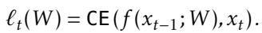

> 💡 **Eq 1 白话**：$\ell_t(W) = \text{CE}(f(x_{t-1}; W), x_t)$ —— 就是一个标准的"给前一个 token 预测下一个"的 cross entropy，没啥特别。特别的是**我们在测试时要真的对这个 loss 求梯度下降**。

We update $W$ at test time for every $t = 1, \ldots, T$, in sequential order, with gradient descent:

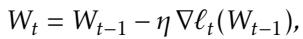

where $\eta$ is a learning rate, and $W_0$ is the initial weights at test time. In the end, we simply output $\hat{p}_{T+1} = f(x_T; W_T)$. We illustrate this form of TTT in the left panel of Figure 2: Our toy baseline only uses the upward arrows, while TTT adds the backward and horizontal arrows.

> 💡 **Eq 2 白话 — "online SGD on the context"**：
> - 对 context 的每一个 token $t=1,\ldots,T$，都做**一步**标准 SGD：$W_t = W_{t-1} - \eta \nabla \ell_t(W_{t-1})$。
> - 这里的 $\eta$ 和 $W_0$ 是 outer loop 要学的（在 2.2 节说）。
> - 每步只用**一个 token** 的 loss 来更新 —— 这正是 2.3 节说的"不稳定"和"不 parallel"的来源。

---

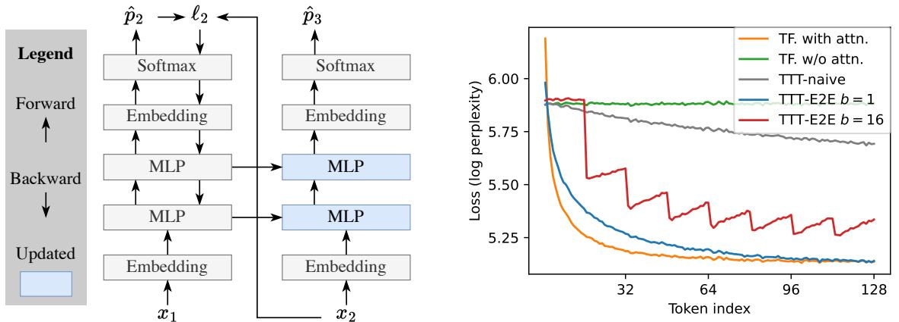

*Figure 2. Toy example. Left: Given $x_1$ and $x_2$ as context, we want to predict the unknown $x_3$. Our toy baseline, a Transformer without self-attention (using only the upward arrows), is effectively a bigram since it has no memory of $x_1$. TTT (using all the arrows) first tries to predict $x_2$ from $x_1$ as an exercise: It computes the loss $\ell_2$ between $x_2$ and the prediction $\hat{p}_2$, then takes a gradient step on $\ell_2$. Now information of $x_1$ is stored in the updated MLPs (blue). Right: Token-level test loss $\ell_t$ for various methods in our toy example, as discussed in Subsection 2.2, except for TTT-E2E $b=16$ discussed in Subsection 2.3. In particular, TTT-E2E $b=1$ turns the green line (our toy baseline) into the blue line, which performs almost as well as orange (using full attention).*

> 💡 **Figure 2 批读（理解全文的锚点图）**:
>
> **左图 — 计算图**：
> - 竖直向上的箭头 = 前向计算（input embedding → MLPs → prediction）。
> - 向后/水平的箭头 = **TTT 的梯度流**：在 $x_2$ 这个位置，先用 $W_0$ 预测 $\hat p_2$，和真实的 $x_2$ 算 loss $\ell_2$，然后对这个 loss 求梯度，更新 MLP 权重得到 $W_1$。
> - 然后再用 $W_1$ 预测下一步 $\hat p_3$。**$x_1$ 的信息被"压"进了蓝色 MLP 的权重差** —— 这就是 compression 的具体形式。
>
> **右图 — 4 条线的相对位置**（按从高到低）：
> 1. **绿色 (toy baseline without attention)** — 最差，完全是 bigram，看不见 context。
> 2. **灰色 (TTT-naive)** — 比 green 稍好（因为虽然 outer loop 是 naive，但 inner loop 确实还在做 TTT），但差距有限。
> 3. **红色 (TTT-E2E b=16)** — 还是差绿线一些，因为 mini-batch 太大，每个 mini-batch 内部又变成 bigram（2.3 节会详细解释）。
> 4. **蓝色 (TTT-E2E b=1)** — 和橙色 full attention 几乎重合！用 meta-learning + online TTT 居然能几乎追上 full attention。
> 5. **橙色 (full attention)** — 理论上的"压缩上界"。
>
> 特别注意：**蓝线在 t 增大时持续下降**，这说明 TTT 真的在用更多 context 更好地预测 —— 这是"context is being compressed into weights"的直接证据。

---

## 2.2 Learning to (Learn at Test Time)

> 💡 **2.2 要点预览**: 这一节解释"怎么得到 $W_0$" —— 就是 outer loop。核心对比：**TTT-E2E（优化 TTT 之后的 loss）** vs **TTT-naive（优化 static loss，假装 TTT 不存在）**。Eq 3 是 E2E loss，Eq 4 是 naive loss。然后用 Figure 2 右图四条线的对比来说明：**E2E 是必需的，不是锦上添花**。

We now consider how $W_0$ – the initial weights after (training-time) training but before test-time training – is obtained, within the scope of the same toy example. By definition, our test-time training loss $\ell_t(W_{t-1})$ is also the test loss for the next-token prediction task that conditions on $x_0, \ldots, x_{t-1}$ and tries to predict $x_t$. Therefore, the test loss over a sequence $X = (x_1, \ldots, x_T)$ is:

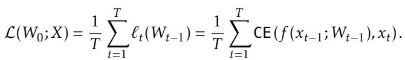

To obtain a $W_0$ that will produce low $L(W_0; X)$ at test time, the most direct approach is to optimize the same loss at training time over a large training set of sequences on average. This direct approach is an example of End-to-End (E2E) training, where the training loss matches the test loss. When TTT uses a $W_0$ trained in this fashion, we call it TTT-E2E.

> 💡 **Eq 3 白话 — "E2E loss"**：
> - 左边 $L(W_0; X)$ 是"整条序列的平均 test loss"。
> - 右边的**关键细节**：每一项 $\ell_t$ 里的权重是 $W_{t-1}$，**不是 $W_0$**。也就是说这个 loss 承认"前面的 TTT 已经发生了"。
> - outer loop 优化这个 $L$ 关于 $W_0$ 的梯度 —— 要通过整个 TTT 链条反向传播，这就是 **gradients of gradients**（因为 $W_{t-1}$ 本身就含 $\nabla$ 运算）。

As a contrasting example, consider another approach that naively imitates the training loss of a static model without taking into account that $W_0$ will be updated at test time:

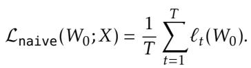

This approach is not E2E, since there is a mismatch between the model's behavior at training and test time. As a consequence, we can provide little guarantee that a minimizer of $L_{\text{naive}}$ will also produce low test loss $L$. We call this approach TTT-naive. It has been the mainstream approach in the literature of dynamic evaluation [72, 60].

> 💡 **Eq 3 vs Eq 4 对比（关键！）**:
>
> | | Eq 3 (E2E) | Eq 4 (naive) |
> |---|---|---|
> | 每个 $\ell_t$ 用的权重 | $W_{t-1}$ (被 TTT 更新过的) | $W_0$ (静态) |
> | 反向传播经过 | 整条 TTT 链 | 只有当前一步 |
> | 二阶梯度？ | **是** | 否 |
> | 等价于 | Meta-learning / MAML-like | Standard pre-training + separate TTT |
>
> **为什么 naive 不行？** 它相当于告诉模型："假装 TTT 不存在，train 成最好的 static 模型就行。" 但这样 train 出来的 $W_0$ 面对 TTT 时**没有留任何空间**给 TTT 去更新 —— 就像一个已经填得很满的 hash table，再 insert 就是无效操作。

The right panel of Figure 2 plots the token-level test loss $\ell_t$, averaged over many test sequences, for $t = 1, \ldots, 128$. So far, we have discussed four methods: Transformer with full attention (orange), our toy baseline without attention (green), TTT-naive (gray), and TTT-E2E (blue for $b=1$; we will cover the variant with $b=16$ in Subsection 2.3); see details of the experimental setup in Appendix A. While TTT-naive performs only slightly better than the toy baseline, TTT-E2E performs almost as well as full attention. In particular, TTT-E2E can effectively use more context to better predict the next token, as demonstrated by the test loss decreasing over time.

> 💡 **批注 — Figure 2 右图给出的证据**:
>
> - TTT-naive (灰色) ≈ toy baseline (绿色)，只略好一点 → **只做 inner loop 没用**。
> - TTT-E2E b=1 (蓝色) ≈ full attention (橙色) → **加上 outer loop 的 E2E 才真的管用**。
> - **蓝线随 t 单调下降** → TTT 真的在"越看越会"，而 bigram baseline 是水平的。
>
> 这是全文最有力的"ablation on being E2E" 证据。

For gradient-based optimization, computing $\nabla L(W_0)$ for the E2E $L$ entails computing gradients of gradients, since the update rule in Equation 2 itself contains a gradient operation. Fortunately, modern frameworks for automatic differentiation can efficiently compute gradients of gradients with minimal overhead [13, 25]. Once $\nabla L(W_0)$ is computed, we can plug it into standard optimizers. In the field of meta-learning, gradient steps on $L$ are called the outer loop, and on $\ell$ the inner loop.

> 💡 **批注 — 实现问题**：
> - 理论上 gradients of gradients 非常贵（$O(T^2)$ 的 backward pass on the TTT chain），但是作者说 JAX (+ metagradient descent) 实现起来 overhead 小。
> - 3.7 节会讲：这种 metagradient 目前**不能用 cuDNN FlashAttention**（FlashAttention 不支持二阶梯度），所以训练 latency 还是个瓶颈。未来如果有自定义 FlashAttention kernel 支持二阶梯度，训练速度能显著提升。

The current version of TTT-E2E still has two problems for large models in long context. The first is efficiency, because our inner loop has many steps that cannot be parallelized. The second is stability, because each gradient step in the inner loop depends on only a single token, which can easily lead to gradient explosion by chance. The next subsection addresses these two problems.

> 💡 **过渡批注**：online TTT ($b=1$) 有两个致命问题：
> 1. **效率**：每步一个 token，顺序执行，不能并行 → 慢。
> 2. **稳定性**：单 token 的梯度噪声极大，容易 explode → 难训。
>
> 2.3 的 mini-batch 就是来解决这两点的。

---

## 2.3 Mini-Batch TTT and Sliding Window

> 💡 **2.3 要点预览**: 两个核心改动：(1) **mini-batch**（每 $b$ 个 token 做一步梯度）—— 提升并行度和稳定性；(2) **SWA 骨架**（保留窗口大小 $k$ 的 self-attention）—— 解决 mini-batch 内部"bigram 化"的问题。这才是真正的 TTT-E2E。另外：3 个实现细节 + decode 多 token 的处理。

The two problems above share a common cause: Equation 2 performs online instead of mini-batch gradient descent. Given a training set of size $T$, the standard practice is to partition it into $T/b$ batches, each of size $b$ (assuming divisible), and take one gradient step per batch. Compared to online gradient descent, where $b=1$, a larger $b$ is known to improve both parallelism and stability. We can apply the mini-batch idea to TTT for the same benefits. Given the (test-time) training set that contains $x_1, \ldots, x_T$, we generalize Equation 2 to:

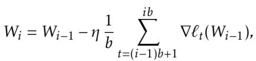

for $i = 1, \ldots, T/b$ (assuming divisible), then output $\hat{p}_{T+1} = f(x_T; W_{T/b})$. In addition, for (training-time) training to reflect the change in test-time training, we also generalize Equation 3 to:

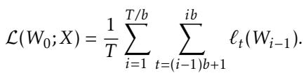

Note that $b=1$ recovers Equation 2 and 3.

> 💡 **Eq 5/6 白话**：把"每 token 一步 SGD"变成"每 $b$ 个 token 平均一次梯度再做一步"。理论上是标准 mini-batch SGD 的一个直接套用。但引入了一个新问题 ⬇️

However, our model with mini-batch TTT is now a bigram again within each batch, as illustrated by the red line in Figure 2 with $b=16$. For example, consider the first mini-batch that contains $x_1, \ldots, x_b$. Since every prediction $\hat{p}_t = f(x_{t-1}; W_0)$ is made with $W_0$ instead of $W_{t-1}$, we observe that $\ell_t(W_0)$ increases with $t$ as $\hat{p}_t$ misses more context, namely all the tokens up to $t-1$. This observation holds within every mini-batch, where the only predictions without missing context are the first and second ones inside the mini-batch. These increasing losses produce worse gradient steps for TTT, which ultimately translate into worse performance of the purple line compared to the blue line.

> 💡 **核心洞察 — mini-batch 破坏了 TTT 的关键机制**:
>
> 在 online TTT ($b=1$) 里，每个 token 前都做过一次 weight update，所以 $\hat p_t$ 能"看到"前面的 $x_{t-1}$。
> 在 mini-batch TTT 里，**一个 mini-batch 内部的所有 token 都用同一个 $W$ 做预测**，所以 mini-batch 内部的 token 之间又恢复成了 bigram —— 你 predict $x_{10}$ 时还用着 $W_0$，完全不知道 $x_2, \ldots, x_9$。
>
> 所以 loss 在 mini-batch 内部**越往后越差**，梯度质量也越差 —— 整体收敛反而不如 $b=1$（见 Figure 2 的紫线）。
>
> **这就是为什么必须加 SWA** ⬇️

To address this problem, we finally advance beyond the toy example and augment our architecture with sliding-window attention layers. While our toy example removes the self-attention layers entirely, our main method only restricts them to a fixed window size $k$. For our main results with $T=128K$, we set the window size $k$ to 8K and the TTT mini-batch size $b$ to 1K. It is important to set $k \geq b$ so our model can remember the context within each mini-batch before TTT has a chance to update its weights.

> 💡 **批注 — 为什么 $k \geq b$ 是关键约束**:
>
> SWA 负责 mini-batch 内部的**"短期记忆"** —— 只要窗口 $k$ 覆盖了整个 mini-batch (即 $k \geq b$)，mini-batch 内的任何 token 都能通过 SWA 看见它之前的所有 token，就不会再有 bigram 问题。
>
> 而 TTT 更新的 MLP 权重负责**"长期记忆"** —— mini-batch 跨越之后的信息压到权重里。
>
> **这是一个生物学启发的 hierarchy**：
> ```
> SWA 窗口 (k=8K)         = 短期记忆（对应 Working Memory）
> TTT 更新的 MLP 权重     = 长期记忆（对应 Long-term Memory）
> ```
> Conclusion 节明确提到这一点。

This modification of the baseline architecture completes our main method. Next, we introduce three implementation details, and then consider the task of decoding multiple tokens. Our main method, complete with the implementation details, is illustrated in the left panel of Figure 3.

### 2.3.1 Implementation Details

Three implementation details are necessary for achieving our reported results. We will justify these details with ablations in Section 3. However, it is still possible that they are merely artifacts of our experimental setup, and different design choices could be better suited in other setups.

**TTT only the MLP layers.** Modern Transformers are built in repeated blocks, each consisting of a full attention layer (which we have replaced with sliding window attention), an MLP layer, and a few normalization layers. We freeze the embedding layers, normalization layers, and attention layers during TTT, since updating them in the inner loop causes instability in the outer loop. Therefore, the MLP layers are the only ones updated during TTT.

> 💡 **细节 1 批读**：只 TTT MLP layer，冻结 norm / embedding / attention。原因是**稳定性**：如果 inner loop 动了 LN/attention，outer loop 的二阶梯度会爆炸。
>
> 这也意味着**TTT 的"hidden state"就是 MLP 的权重差** —— 这是一个非常 compact 的 state，每个 block 大概几十 MB。

**TTT only 1/4 of the blocks.** In general, less information is lost during compression when we have a larger amount of storage. In our case, the information is the context, and the storage is the updated MLP layers. However, updating more layers also implies more computation to back-propagate the gradients. Therefore, we have an intuitive trade-off between computational cost and the ability to scale with context length, as we will illustrate with ablations in Section 3. We choose to TTT only the last 1/4 of the blocks according to the ablations, but other experimental setups, especially those with even longer contexts, might require a different choice.

> 💡 **细节 2 批读 — "更新 1/4 的 block"的直觉**:
>
> - 更新**更多** block → 更大的 storage (更多 MLP 权重) → 理论上压缩更多信息 → 但 backward pass 更长，训练更慢。
> - 更新**更少** block → 更小的 state → 可能丢信息。
> - 为什么是 **最后** 1/4？因为 gradients 从 loss 往下传，最后几层距离 loss 最近，梯度信号最强。也符合"low-level 特征靠 attention，high-level 表征靠 TTT 更新"的 intuition。
> - **Section 3.2.1 的 ablation** 会证明：从 1/4 到 1/2 收益不大，从 1/4 到 1/8 掉得很快。1/4 是甜点。

**Two MLP layers per block.** One of the concerns of TTT is forgetting the knowledge learned during pre-training. We adopt the simplest way to address this concern. In the blocks updated during TTT, we add a static, second MLP layer as a "safe" storage for pre-trained knowledge. For fair comparison with the baselines, we reduce the hidden dimension of the MLPs throughout the entire network (including those frozen during TTT), so the total number of parameters remains the same.

> 💡 **细节 3 批读 — "双 MLP" 为什么必要**:
>
> catastrophic forgetting 是所有 continual learning 工作的永恒主题。这里的解决方案非常直接：
>
> - 每个被 TTT 的 block 里放**两个并行的 MLP**。
> - 一个是"动的" —— 参与 TTT，吸收 context。
> - 一个是"静的" —— 保留 pre-train 知识，不被 TTT 触碰。
>
> 这就像你有两个抽屉：一个是工作记忆（每天换内容），一个是长期技能记忆（几十年不变）。
>
> 为了**公平对比** baseline（参数量一致），作者把整个网络的 MLP hidden dim 缩小一点，总参数量保持不变。

---

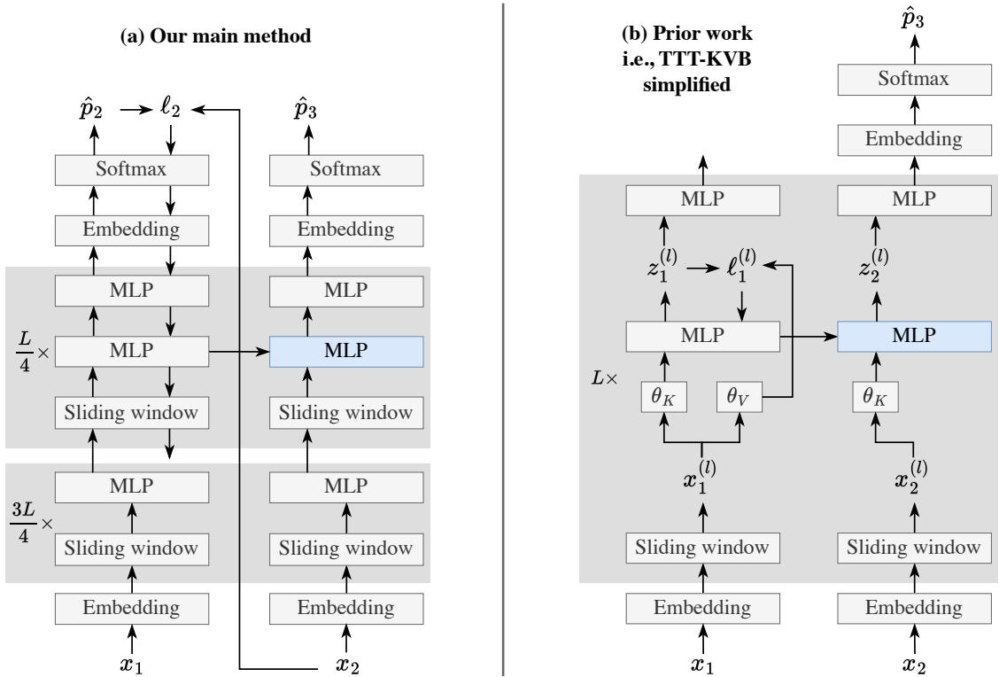

*Figure 3. Computation graphs following the setup in Figure 2: Given $x_1$ and $x_2$ as context, we want to predict the unknown $x_3$. Left: Our main method with the sliding-window attention layers and the implementation details discussed in Subsection 2.3. For ease of notation, our illustration uses online gradient descent ($b=1$). The lowest downward arrow is disconnected to the MLP below, since gradients pass through the last $L/4$ blocks but not further down. Right: The first step of our alternative derivation in Subsection 2.4: a simplified version of TTT-KVB in prior work [110, 87].*

> 💡 **Figure 3 批读 — 左右两个 TTT 计算图的对比**:
>
> **左图 (TTT-E2E, 本文主方法)**：
> - **一条长链** 从 $x_1$ 往上穿过 SWA layer + MLP layer 层层叠加，最后得到 $\hat p_2$。
> - 只有一个 loss $\ell_2$，在最顶上（next-token prediction loss）。
> - 梯度从 $\ell_2$ 反向传播，穿过整个"最后 $L/4$ 个 block"的 MLP（浅蓝色）。
> - 最下面的 downward 箭头是**虚线**：gradients 只传到最后 $L/4$，不会继续往下（这是细节 2：只 TTT 1/4）。
> - 旁边的黑色 MLP 是 "safe storage" MLP（细节 3），不在反向传播路径上。
>
> **右图 (TTT-KVB simplified, 对比物)**：
> - **每个 block 有自己的 loss** $\ell^{(l)}$，每个 block 在 layer 内部独立做 TTT。
> - Loss 是 layer-wise 的 **reconstruction loss** $\|g(\theta_K x) - \theta_V x\|^2$（KV binding），不是 NTP loss。
> - 梯度**不跨 block** —— 每个 block 内部完成"看 key → predict value → 更新 MLP"的闭环。
> - 这就是为什么 TTT-KVB 是"很多个小 RNN layer 并排"，而 TTT-E2E 是**一个超大 RNN 但只有一个 layer**（整个网络 = 一个 layer）。
>
> **这两种风格的核心差别**：
> | 维度 | TTT-E2E (左) | TTT-KVB (右) |
> |---|---|---|
> | Loss | 最终 NTP loss (end-to-end) | 每 block 的 KV 重建 loss (layer-wise) |
> | TTT 作用域 | 末 1/4 block 的 MLP，梯度跨多层 | 每个 block 的独立 fast weight，梯度不跨 block |
> | RNN 层数 | **1 层大 RNN** | $L$ 个小 RNN |
> | 有 $\theta_K, \theta_V$ 吗 | 否（不需要 key-value 分离） | 是 |
> | Head 分裂 | 否（完整 MLP） | 是（multi-head，每个 head 小 MLP + LoRA） |

---

### 2.3.2 Decoding Multiple Tokens

Up to this point, we have focused on the task of prefilling $T+1$ tokens (including `<BOS>` as $x_0$) and then decoding a single token. We now consider decoding multiple tokens, for which our method admits a natural extension: It only takes a gradient step once the decoded tokens have completely filled a TTT mini-batch. For example, assuming that $T$ is divisible by $b$, so TTT depletes the prefilled tokens in exactly $T/b$ mini-batches. Then our method does not need to do anything special when decoding the next $b$ tokens. After that, it performs TTT on this batch of decoded tokens, and then continues to decode using the updated weights.

> 💡 **批注 — decode 多 token 时的自然扩展**:
>
> 核心规则：**生成的 token 也算进 TTT mini-batch**。
>
> - Prefill 完 T 个 token 后，已经做了 $T/b$ 次 TTT update。
> - 开始 decode：生成第 1 个 token 用当前权重，第 2 个也用，...，第 $b$ 个生成完之后，现在这 $b$ 个生成 token 满了一个 mini-batch。
> - **对这 $b$ 个生成的 token 做一次 TTT 梯度步**（就像它们是"新的"context 一样）。
> - 然后继续 decode 下一个 batch。
>
> **这意味着 decode 阶段模型可以"自我训练"** —— 3.6 节会用 Qwen-8B 做 evaluator 验证这种 self-training 是否 work。

---

## 2.4 Alternative Derivation

> 💡 **2.4 要点预览**: 这节是全文思想上最有品的部分 —— **对偶推导**。从 prior work TTT-KVB 出发，一步步换掉差异，最后得到一模一样的 TTT-E2E。四个步骤：(1) 简化 KVB 的 output rule（Eq 9）；(2) 把 KVB loss 换成 NTP loss（删 $\theta_K, \theta_V$，删 layer-wise loss）；(3) 只更新最后 1/4 block；(4) 去掉 multi-head MLP + LoRA，用完整 MLP。Table 1 是这四步的消融证据。这节的核心 takeaway：**"TTT-KVB 的 layer-wise 分解是个技术选择，而不是必然"** —— 一旦你愿意算二阶梯度，就可以做一个"整网一条链"的大 RNN，反而效果更好。

This subsection discusses an alternative derivation of our main method, starting from prior work on long-context TTT based on Key-Value Binding (KVB) [87, 110]. The key step is to replace their layer-wise reconstruction loss with the standard next-token prediction loss, so TTT becomes E2E at test time. This derivation is not needed to understand the results in Section 3, but it provides additional insight into how our method is connected to the literature on RNNs.

### 2.4.1 Starting Point: Key-Value Binding

Building on the same idea of compressing context into the weights of a model, prior work [87] uses TTT to construct a sequence modeling layer that serves as a drop-in replacement for self-attention.

<table><tr><td>Method</td><td>Loss</td><td>Diff.</td></tr><tr><td>SWA (k = 8K) baseline</td><td>2.827</td><td>-</td></tr><tr><td>TTT-KVB (Zhang et al.)</td><td>2.818</td><td>-0.009</td></tr><tr><td>TTT-KVB simplified</td><td>2.819</td><td>+0.001</td></tr><tr><td>TTT-E2E all layers MH</td><td>2.806</td><td>-0.013</td></tr><tr><td>TTT-E2E (ours)</td><td>2.805</td><td>-0.001</td></tr></table>

*Table 1. Ablation for the alternative derivation in Subsection 2.4. Each row is obtained from the previous row by one modification. All experiments use 760M models trained at 8K context.*

> 💡 **Table 1 批读 — 对偶推导的消融阶梯**:
>
> | 方法 | Loss | Δ vs 上一行 | 含义 |
> |---|---|---|---|
> | SWA (k=8K) baseline | 2.827 | — | 起点：没有 TTT 的 SWA Transformer |
> | TTT-KVB (Zhang 2025) | 2.818 | **-0.009** | 加 KVB 风格的 TTT，受益 -0.009 |
> | TTT-KVB simplified (Eq 9 替换 output rule) | 2.819 | +0.001 | 简化无损害 |
> | TTT-E2E all layers MH | 2.806 | **-0.013** | 把 KVB loss 换成 NTP loss —— 这一步是**魔法**发生的地方 |
> | TTT-E2E (ours) | 2.805 | -0.001 | 进一步去掉 multi-head，只更新 1/4 block，**效果不变但 state × 5 倍、latency 减半** |
>
> **最重要的一行**：从 "TTT-KVB simplified" 到 "TTT-E2E all layers MH"，**仅仅换个 loss** (KVB → NTP)，loss 从 2.819 降到 2.806，改善 0.013 —— 比原本加 TTT 本身带来的改善还要多！这说明**"E2E at test time"** 的意义比人们以为的要大得多。

While self-attention associates the key and value of every previous token by storing them explicitly in a cache, prior work proposes storing these associations implicitly in a model, by learning at test time to predict each value from its key. This learning objective, later known as KV Binding, has been the core component in many popular variants of TTT, such as MesaNet [98], Titans [7], and Nested Learning [6]; linear attention [79, 55] and many of its variants, such as Gated DeltaNet [104], can also be derived from this perspective.

> 💡 **批注 — "KV Binding" 是什么**:
>
> self-attention 的本质是 **把 token 的 key 映射到它的 value**。KV Binding 说："不用把 KV 存在 cache 里，直接**训**一个小网络让它 memorize 这个映射。" 就是：
>
> $$g(\theta_K \cdot x_t; W) \approx \theta_V \cdot x_t$$
>
> 然后用梯度下降把 $W$ 调到真的满足这个等式。这是一种**隐式存储**：KV pairs 不在 cache 里，而在 $W$ 的更新量里。
>
> 这是 Titans / MesaNet / Nested Learning / GDN 等很多工作的核心 objective。作者在此提醒：**GDN 和 linear attention 也能从这个视角推出来**，所以 KVB 是一个"统一的祖先"。

Concretely, given the input embeddings $x_t^{(l)}$ at layer $l$, the basic form of TTT-KVB takes a gradient step at each $t = 1, \ldots, T$ on the following loss [87]:

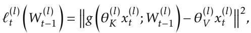

where $g$ is usually an MLP, $W_{t-1}^{(l)}$ is the weights of $g$ after the previous timestep, and $\theta_K^{(l)}$ and $\theta_V^{(l)}$ are outer-loop parameters, similar to the key-value projection matrices in Transformers. After the gradient step, $g$ uses the updated weights to produce the output embedding:

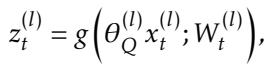

where $\theta_Q^{(l)}$ is also a set of outer-loop parameters. The mechanism above is known as a TTT layer. When used inside a network, every TTT layer is an independent unit with its own loss and weights. At training time, the outer loop of TTT-KVB is identical to that of TTT-E2E in Equation 6, and all the outer-loop parameters, including $\theta_K, \theta_V$, and $\theta_Q$ of all the TTT layers, are optimized together. Similar to TTT-E2E in Subsection 2.3, TTT(-KVB) layers can effectively use (inner-loop) mini-batch gradient descent when preceded by sliding-window attention layers [110]. This hybrid architecture serves as the starting point of our derivation.

> 💡 **Eq 7/8 白话 — TTT-KVB 的 inner loop**:
>
> 在每个 transformer block 里：
> 1. 计算 query / key / value：$\theta_Q x, \theta_K x, \theta_V x$（就像 attention）。
> 2. **inner loop loss**（Eq 7）：$\|g(\theta_K x; W) - \theta_V x\|^2$ —— 用 MLP $g$ 预测 value，从 key 出发。
> 3. **内 SGD**：对 $W$ 做一步 GD。
> 4. **output**（Eq 8）：用**更新后的 $W$**，对 query 做一次前向 $z = g(\theta_Q x; W_t)$。
> 5. $z$ 替代 self-attention 的输出继续往上走。
>
> 这是一个"per-block TTT layer"，一共有 $L$ 个独立的 TTT 子系统（每个 block 一个）。

### 2.4.2 First Step: Simplified Output Rule

First, we observe that the output rule in Equation 8 can be simplified into:

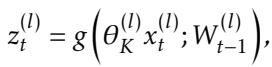

with practically no harm, as shown in Table 1. This new output rule is a simplification because it reuses the prediction of $g$ in Equation 7 as the output embedding instead of calling $g$ again with the updated weights and the separate input $\theta_Q x_t$. Intuitively, calling $g$ with the updated weights can be unnecessary if sliding-window attention already provides enough local context, and prior work has argued that the separation between $\theta_K$ and $\theta_Q$ can also be unnecessary [59, 89, 108].

> 💡 **Step 1 批注**：直接**重用** inner loop 计算过的 $g(\theta_K x; W_{t-1})$ 作为 output，不再调用 $g(\theta_Q x; W_t)$。这样省掉了 $\theta_Q$ 这一组参数，也省掉"再前向一次"的开销。Table 1 显示损失几乎不变（2.818 → 2.819，+0.001）。

In the right panel of Figure 3, we illustrate TTT-KVB after this simplification. Compared to TTT-E2E in the left panel, there are four differences, with the latter two considered implementation details:

1. Each Transformer block in TTT-KVB has a reconstruction loss $\ell^{(l)}$, whereas TTT-E2E has a single next-token prediction loss $\ell$ at the end of the entire network.
2. Each Transformer block in TTT-KVB has additional outer-loop parameters $\theta_K$ and $\theta_V$.
3. TTT-KVB updates an MLP layer in every Transformer block, whereas TTT-E2E only updates an MLP layer in the last 1/4 of the blocks.
4. Not shown in the figure, the updated MLPs in TTT-KVB are split into multiple heads in the same way as self-attention, so these MLPs are much smaller than the regular ones in TTT-E2E. Moreover, these MLPs are updated with LoRA [43], so their effective capacity is even smaller.

> 💡 **"四大差异"记忆表**:
>
> | 差异 # | TTT-KVB | TTT-E2E | 重要性 |
> |---|---|---|---|
> | 1 | Layer-wise reconstruction loss $\ell^{(l)}$ | 整网 NTP loss $\ell$ | ⭐⭐⭐ 核心 |
> | 2 | 有 $\theta_K, \theta_V$ | 无 | ⭐⭐ 伴随差异 1 |
> | 3 | 每个 block 都 TTT | 只最后 1/4 block | ⭐ 实现细节 |
> | 4 | Multi-head + LoRA MLP | 完整 MLP | ⭐ 实现细节 |

However, Figure 3 also highlights the similarity between these two forms of TTT: Similar to TTT-E2E, TTT-KVB can be understood from the perspective of training the entire network. First, there is a forward pass through the entire network, as illustrated by all the upward arrows. Then there is a backward pass, with contributions from many losses in the fashion of Deeply Supervised Nets [62]. However, the gradients are stopped after reaching only one MLP layer, as illustrated by the single downward arrow in each block.

> 💡 **批注 — "TTT-KVB = Deeply Supervised Net"**:
>
> 这是一个非常有启发的视角：TTT-KVB 就像 [Deeply Supervised Nets (Lee et al. 2015)]，每层都有自己的辅助 loss。每个 block 的 $\ell^{(l)}$ 都 push 一次梯度，但**梯度不跨 block 传播**（每个 block 的 loss 只更新自己那一个 MLP）。
>
> 相比之下 TTT-E2E 只有一个最顶上的 NTP loss，梯度**从顶部反向传播穿透多个 block**（但只穿到最后 $L/4$ 个 block 就停）。

### 2.4.3 Key Step: E2E at Test Time

The key step in this derivation is to replace the KVB loss with the next-token prediction loss, which implies removing differences 1 and 2 together, since without the layer-wise reconstruction losses, there is also no use for $\theta_K$ or $\theta_V$. This step brings us to an intermediate method called TTT-E2E all layers MH, where MH stands for multi-head. As shown in Table 1, replacing the loss significantly improves performance in language modeling, essentially reaching the level of our final method.

> 💡 **关键 step 批注 — 只换 loss，改善 0.013**：
>
> 这是整个推导中**效果最大**的一步。只把 Eq 7 的 KVB loss 换成整网的 NTP loss $\ell$，loss 从 2.819 降到 2.806。因为没有了 layer-wise loss，就也不再需要 $\theta_K, \theta_V$（它们本来就只是为了 KVB loss 定义 key/value 映射而存在）。
>
> 这个中间版本叫 "TTT-E2E all layers MH" —— all layers = 差异 3 还没改，multi-head = 差异 4 还没改。

This intermediate method is now E2E at test time, because its (test-time) training loss is exactly the token-level test loss $\ell_t$. At this point, it is especially interesting to recognize the duality between our two derivations. Our primary derivation starts from TTT via next-token prediction, which is E2E at test time, and focused on making it E2E at training time via meta-learning in Subsection 2.2. Our alternative derivation, on the other hand, starts from TTT-KVB, which is E2E at training time, and focused on making it E2E at test time via next-token prediction.

> 💡 **"对偶"的诗意 —— 两个推导的起点和终点**:
>
> - **主推导** (2.1-2.3)：起点 = naive online NTP TTT（E2E at test time ✓, train-time ✗），需要加 meta-learning outer loop 变成 train-time E2E。
> - **对偶推导** (2.4)：起点 = TTT-KVB（test-time ✗，train-time E2E ✓），需要换 loss 变成 test-time E2E。
>
> **两条路殊途同归**，都到达"双 E2E"这一点。作者把这个对偶写得很漂亮 —— 它说明 TTT-E2E 在设计空间里是一个**必然的最小公倍数**，而不是偶然的工程选择。

### 2.4.4 Final Step: Larger State with Less Compute

TTT(-KVB) layers are often viewed as a class of RNN layers [87], and TTT-KVB is often viewed as an RNN. Similarly, TTT-E2E can also be viewed as an RNN, except that it only has one RNN layer, since the entire network is updated in one backward pass. Among the three components of an RNN, we have modified the output rule in the first step of this derivation, and the update rule in the second (the key) step. Now we modify the hidden state.

A critical factor that often improves the long-context performance of an RNN is a larger hidden state, which, in turn, often requires more compute to be updated. Consider our intermediate method, TTT-E2E all layers MH. If we remove difference 3 by updating only the last 1/4 of the blocks, then we save compute at test time but end up with a smaller state. And if we remove difference 4 by reverting to regular MLPs (instead of multi-head MLPs with LoRA), then we have a larger effective state at the cost of more compute (and memory).

However, when using the E2E loss, the trade-offs of these two differences are rather disproportionate: In order to update the small multi-head MLP in a block, gradients need to back-propagate through the large MLP above it, let alone the attention layer below for the backward pass to proceed further. Given the heavy cost of preparing the upstream gradients, it should be more cost-effective to update fewer blocks, each containing a larger hidden state. Indeed, our final method (TTT-E2E), which removes both differences together, has 5× larger hidden state (88M vs. 18M for the 760M model) and half the inference latency (0.0086 vs. 0.017 sec per 1K tokens for prefill on H100) compared to TTT-E2E all layers MH.

Does this larger state actually improve performance? It is difficult to see the difference in Table 1 because these experiments are only at 8K context length. In Subsection 3.2, we will investigate the effect of state size in terms of scaling with context length, by ablating the number of layers updated. This ablation will clearly show that a smaller state leads to worse context scaling.

> 💡 **Step 4 批读 — "更少层 × 更大 state"的关键洞察**:
>
> 当你用 E2E loss 时，**更新一个 block 的成本 ≈ 更新所有 block 的成本**，因为 upstream 的 gradients 无论如何都要准备好（否则没法 back-prop 到这个 block）。
>
> 所以设计选择变成：
> - **多 block × 小 state**（TTT-KVB all layers MH）：每个 block 一点点 multi-head LoRA MLP，总 state 小。
> - **少 block × 大 state**（TTT-E2E）：只 TTT 最后 1/4，但每个 block 的 MLP 是完整的。
>
> 两种做法 compute 差不多，但 TTT-E2E 的 state **大 5 倍**（88M vs 18M @ 760M），inference latency **减半**（0.0086 vs 0.017 sec/1K token）。
>
> **为什么 state 大更重要？** 更大的 hidden state 才能承载更长的 context；这在 Figure 4 的 "number of layers updated" ablation 里会被明确证实。

---

## 🔖 Section 2 总结

### 核心公式速查

| Eq | 公式含义 |
|---|---|
| 1 | Per-token NTP loss $\ell_t(W) = \text{CE}(f(x_{t-1}; W), x_t)$ |
| 2 | Online SGD: $W_t = W_{t-1} - \eta \nabla\ell_t(W_{t-1})$ |
| 3 | **E2E loss**: $L(W_0; X) = \frac{1}{T}\sum_t \ell_t(W_{t-1})$ ← 注意是 $W_{t-1}$ |
| 4 | **Naive loss**: $L_{\text{naive}}(W_0; X) = \frac{1}{T}\sum_t \ell_t(W_0)$ ← 全是 $W_0$ |
| 5 | Mini-batch SGD: 每 $b$ 步一次梯度 |
| 6 | Mini-batch E2E loss |
| 7 | **KVB loss**: $\|g(\theta_K x) - \theta_V x\|^2$ |
| 8 | KVB output: $z = g(\theta_Q x; W_t)$ |
| 9 | **Simplified KVB output**: $z = g(\theta_K x; W_{t-1})$ |

### 核心超参

| 符号 | 含义 | 最终取值 |
|---|---|---|
| $k$ | SWA 窗口大小 | **8K** |
| $b$ | TTT mini-batch 大小 | **1K** |
| — | TTT 更新的 block 数 | **最后 1/4** |
| — | 每个 TTT block 的 MLP 数 | **2**（一动一静） |
| $\eta$ | Inner loop learning rate | outer loop 学习 |
| $W_0$ | Inner loop 初始权重 | outer loop 学习 |

### 核心洞察

1. **Inner loop = 压缩机制**：把 $\ell_t$ 当作 loss 做 SGD，把 context 压进 MLP 权重。
2. **Outer loop = Learning to learn**：通过 gradients of gradients 学一个"适合被 TTT" 的初始化 —— 这是 dynamic evaluation 做不到的。
3. **Mini-batch 必须配 SWA**：单独用 mini-batch 会让 mini-batch 内部变回 bigram（Figure 2 紫线），加 SWA 才能同时拥有并行度、稳定性和短期记忆。
4. **少数 block × 大 state** > 多数 block × 小 state：在 E2E 体制下 compute 差不多，但 context scaling 更好。
5. **"对偶推导"**：TTT-KVB 换个 loss 就是 TTT-E2E，差一个 loss 就是差 0.013。这是本文"少即是多"的核心美学。
