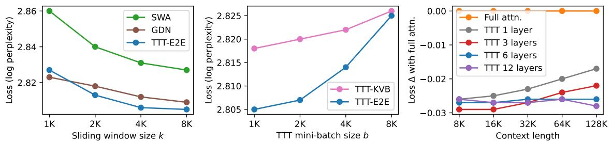
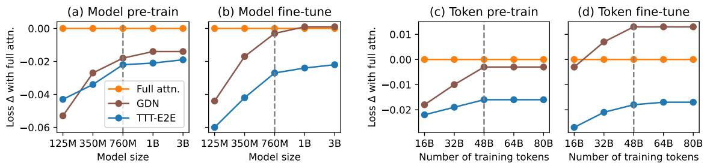
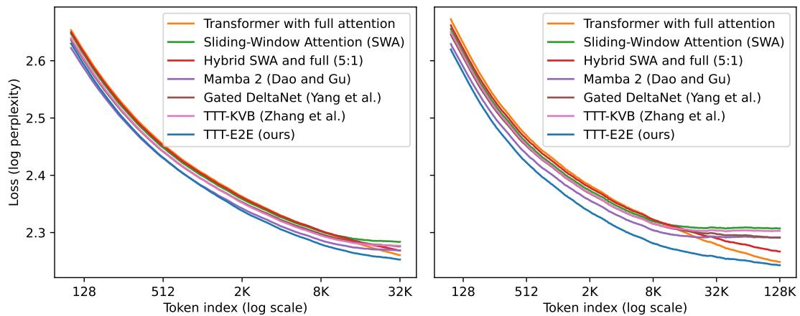
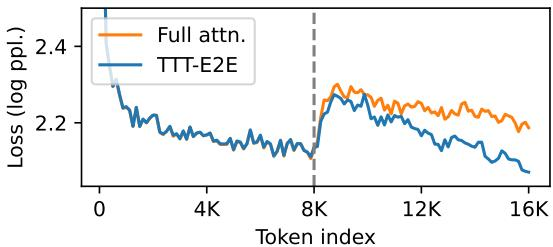
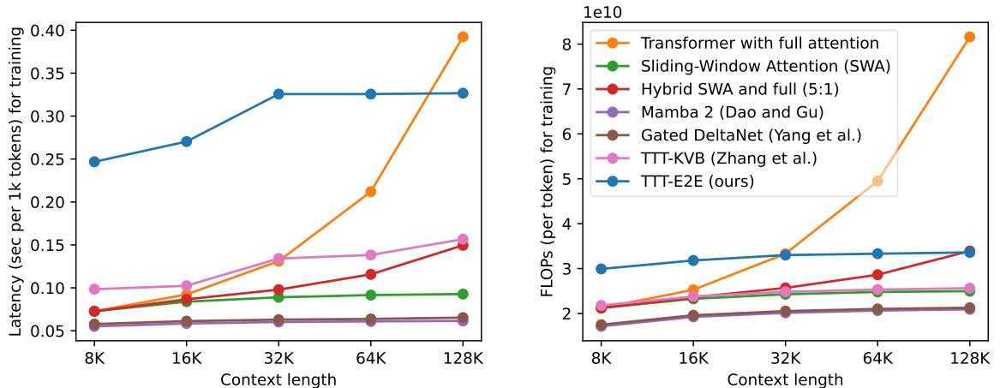

[← 返回 README](../README.md)

# 3. Main Results

## 📌 预览

Section 3 的结构特别清晰：
- **3.1 Setup** — 5 种模型大小 (125M-3B), 7 种 baseline, DCLM (pre-train) + Books (fine-tune)
- **3.2 Ablations** — $k$, $b$, 更新层数的三个消融 (Figure 4)
- **3.3 Compute scaling** — model size 轴 + training tokens 轴 (Figure 5)
- **3.4 Context length scaling** — 本文的 money plot, Figure 1 的详细故事 (Figure 6)
- **3.5 NIAH** — 诚实的失败 case：recall 任务上比 full attention 差（Table 2）
- **3.6 Long decode** — 用 Qwen-8B 当 evaluator 验证长序列生成（Figure 7）
- **3.7 Efficiency** — prefill / decode / training latency（Figure 8）

---

All experiments can be reproduced using the code and datasets provided in our public repository: https://github.com/test-time-training/e2e.

## 3.1 Setup

> 💡 **3.1 要点预览**: 快速建立实验框架 —— **2 阶段训练** (pre-train 8K + fine-tune 至 128K)，**5 种模型** (125M-3B)，**6 种 baseline + 1 种 ours**，pre-train 用 DCLM，fine-tune/eval 用 Books。

Given the research nature of this paper, our goal is to experiment in the simplest setups at small and medium scales that can inform production-level training runs at large scale. In general, today's large-scale runs usually consist of two or more stages [24, 103, 65, 74]:

- Pre-training at short context length on a general dataset containing diverse knowledge.
- Extending the context length by fine-tuning on a dataset of long sequences. To gradually reach very long context, e.g., 1M, extension is usually broken down further into multiple stages.

For simplicity, our training runs consist of only two stages: pre-training at 8K context length, and extension fine-tuning at the final context length, at most 128K, depending on the experiment.

> 💡 **批注 — 为什么是两阶段**：像 Llama 3、DeepSeek-V3 都是这种两阶段范式。作者强调 "research nature" —— 不是生产级别的 3 阶段 4 阶段，只保留最核心的 2 阶段，方便对照实验。

**Datasets.** For pre-training, we use DCLM, specifically DCLM-Baseline, a heavily filtered subset of Common Crawl [63]. Given the 3.8T tokens in DCLM-Baseline, we first discard all documents shorter than 8K, our pre-training context length, and then randomly sample from the remaining ones to construct training sets of various sizes. However, most of the sequences in DCLM that are longer than 128K, our maximum context length for extension, are of low quality. So for fine-tuning, we use Books [29], a standard academic dataset for long-context extension [4, 66]. We also use a held-out partition of Books for language modeling evaluation.

> 💡 **批注 — 数据集选择**：
> - **DCLM-Baseline** 是目前预训练数据集的 state-of-art（筛选质量比 SlimPajama 好）。作者特意提到 Tokenizer 和 data quality 影响非常显著 —— Llama 3 tokenizer 比 Llama 2 好 0.01 的 loss Δ；DCLM 比 SlimPajama 好到让 scaling 趋势都改变。
> - **Books** 是 Pile 的子集，有大量长文档，是做长 context 扩展的事实标准。
>
> **注意**：fine-tune 和 eval **都在 Books 上**。这意味着"out-of-distribution 能力" 不在测试范围内 —— 测的是"能不能在 Books 分布上利用长 context"。

**Basic recipe.** We experiment with models of five sizes, ranging from 125M to 3B parameters. Our configurations and training hyper-parameters in various experiments are all derived from a single basic recipe detailed in Appendix B. In summary, the basic recipe for model configurations and pre-training is taken from GPT-3 [14] and Mamba [32]; to produce the basic recipe for fine-tuning, we performed grid search for the Transformer baseline with full attention.

**Baselines.** We compare our method with six baselines that represent the state-of-the-art approaches in architecture design. All the baselines with sliding window use the same window size $k = 8K$.

1. **Transformer with full attention** [95]: with the model configurations discussed above.
2. **Transformer with Sliding-Window Attention (SWA)** [8]: with every full attention layer replaced by a SWA layer. Our main method in Subsection 2.3, without the implementation details, is also based on this architecture. The window size $k$ is set to 8K in all our experiments, except for the window size ablations. Since the pre-training context length is also 8K, the full attention and SWA baselines are identical until extension fine-tuning.
3. **Hybrid SWA and full attention (5:1)** [90]: repeating the pattern of five SWA layers followed by one full attention layer, in the style of Gemma [90].
4. **Mamba 2** [21]: a popular RNN that uses a hybrid of Mamba 2 layers and SWA layers; tested at large scale in Nemotron-H [11].
5. **Gated DeltaNet** [104]: a popular RNN that extends Mamba 2 and DeltaNet [106], and uses a hybrid of Gated DeltaNet layers and SWA layers; tested at large scale in Kimi Linear [91].
6. **TTT-KVB** [110]: a popular RNN that uses a hybrid of TTT-MLP layers with Key-Value Binding (KVB) [87] and SWA layers; also our starting point in Subsection 2.4 (without the simplified output rule). Titans [7] and Nested Learning [6] follow a similar construction.

We implement baselines 1–3 in JAX, together with our own method. For baselines 4–6, we use the official code and configurations provided by the authors and have consulted them to improve the baselines when possible. Our improvements to the baselines are discussed in Appendix C.

> 💡 **Baseline 批读 — 按"近亲程度"排序**:
>
> | # | Baseline | 和本文的关系 | 代表 |
> |---|---|---|---|
> | 1 | Full attention | **理论上界** | Llama / GPT |
> | 2 | SWA | **本文的骨架** | Longformer / gpt-oss |
> | 3 | Hybrid SWA:Full (5:1) | 折中方案 | Gemma 2 |
> | 4 | Mamba 2 (hybrid) | 最主流 RNN | Nemotron-H |
> | 5 | Gated DeltaNet (hybrid) | 最新 RNN | Kimi Linear |
> | 6 | **TTT-KVB** | **本文对偶推导的起点** | Titans / Nested Learning / MesaNet 家族 |
>
> 特别关注 baseline #6 —— 它和 TTT-E2E 最像（同样用 TTT + SWA），差别就在 2.4 节推的那四点（loss 类型 / KVθ / 更新层数 / multi-head）。
>
> 作者特地提了 **"consulted the authors to improve the baselines"** —— 这在这类对比论文里很少见，显示学术诚意。

---

## 3.2 Ablations on Hyper-Parameters

> 💡 **3.2 要点预览**: 三个消融：(1) **sliding window size $k$** — 大 $k$ 好但 8K 已足够；(2) **TTT mini-batch $b$** — 小 $b$ 好，1K 是甜点（更小会拖垮 GPU 利用率）；(3) **更新层数** — 本文最重要的消融，1/4 是甜点。三个子图合成 Figure 4。

To help readers gradually build an empirical intuition for our method, we start with the simplest experiments – ablations on the hyper-parameters introduced in Subsection 2.3. For all the ablations, we use the 760M model with the basic recipe.



*Figure 4. Ablations on three hyper-parameters: sliding window size $k$, mini-batch size $b$, and the number of layers updated during TTT; see details in Subsection 3.2. Given the trends in these ablations, we set $k = 8K$, $b = 1K$, and we update 1/4 the total number of layers. Loss Δ (↓), the y-value in the rightmost panel, is the same as in Figure 1. It is computed as (loss of the reported method) − (loss of Transformer with full attention), so loss Δ of full attention itself (orange) is the flat line at y = 0. GDN stands for Gated DeltaNet [105].*

> 💡 **Figure 4 批读（三个消融合一）**:
>
> **左子图 ($k$ 消融 on DCLM pre-train, 760M)**:
> - 横轴：SWA window $k$ (2K → 8K)
> - 三条线：SWA baseline / GDN / **TTT-E2E**
> - 趋势：都是单调下降（窗口越大越好），TTT-E2E 最低。
> - 结论：选 $k = 8K$ 性价比最好；更大的 $k$ 收益递减。
>
> **中子图 ($b$ 消融 on DCLM, 760M)**:
> - 横轴：TTT mini-batch $b$ (1K → 8K)
> - 两条线：**TTT-E2E** / TTT-KVB (only other method that has $b$)
> - 趋势：$b$ 越大 loss 越差（因为 mini-batch 内部越长、bigram 现象越严重）。
> - 但 $b$ 小于 1K 时 GPU 利用率掉得太厉害，实验不下去。**$b=1K$ 是硬件可行的最小值**。
> - 重要观察：$b = 8K$ 等价于 "完全不做 TTT"（因为 pre-train context 也是 8K）。此时 TTT-E2E 和 TTT-KVB 的 loss 都几乎等于 full attention（2.825 / 2.826 vs 2.827）—— **这说明 TTT 带来的改善几乎全来自 TTT 本身，不来自架构调整**。
>
> **右子图 (更新层数 on Books fine-tune eval)**:
> - 横轴：**context length** (8K → 128K)
> - Y 轴：Loss Δ 相对 full attention
> - 多条蓝色曲线：TTT 更新最后 1, 3, 6, 12 层
> - 趋势：更新 **12 层 ≈ 6 层**（过剩了），更新 **6 层**（= 1/4）就够，更新 **3 层** context 长起来就追不上，更新 **1 层**断崖。
> - 结论：**至少要 1/4 的层**，但 1/2 也没必要。

**Sliding window size $k$.** This hyper-parameter is present in all the methods, except for full attention. Therefore, we also conduct this ablation for two representative baselines: SWA and Gated DeltaNet. Not surprisingly, a larger $k$ improves performance for all three methods, as shown in the leftmost panel of Figure 4, and TTT-E2E has similar sensitivity to changes in $k$ compared to the baselines. We choose $k = 8K$ as the default since a smaller $k$ does not significantly improve runtime.

**TTT-E2E with full attention.** The window size ablation is conducted with only pre-training on DCLM without fine-tuning on Books, so the results above are evaluated on DCLM as well. Since the pre-training context length is also 8K, SWA with $k = 8K$ is exactly full attention, and TTT-E2E with $k = 8K$ becomes the same as TTT-E2E on top of full attention. It is especially interesting to observe that TTT-E2E can improve the test loss (by 0.018) even on top of full attention, and the difference between TTT-E2E and SWA does not change significantly as $k$ increases. This observation suggests that TTT-E2E is not merely compensating for the difference between full attention and SWA; instead, it produces an orthogonal improvement when other factors, such as context length, are fixed.

> 💡 **非常重要的 side observation — "TTT-E2E 是正交收益"**:
>
> 当 $k = 8K$ 且 pre-train context = 8K 时，SWA 等价于 full attention。但 **TTT-E2E (窗口 8K) 仍然比 full attention 低 0.018**！
>
> 这意味着 TTT 带来的改善**不是在"弥补 SWA 的缺点"** —— SWA 在这个设定下没缺点 —— 而是**一种正交的改善**。你可以把 TTT-E2E 叠到 full attention 上也能拿到这个 0.018。
>
> 这也暗示 TTT-E2E 可以和 full attention 正交组合：对极长 context（如 RAG context 是 2M+），也许可以用 full attention + TTT-E2E 的混合方案。

**TTT mini-batch size $b$.** The middle panel of Figure 4 experiments with the TTT mini-batch size $b$, ranging from 1K to 8K. This hyper-parameter is unique to methods derived from the TTT perspective, so the only other baseline that allows for a meaningful comparison here is TTT-KVB. Similar to the window size ablation, the models are evaluated on DCLM after pre-training. For both TTT-E2E and TTT-KVB, we observe that a larger choice of $b$ significantly hurts performance. However, a choice of $b$ smaller than 1K also significantly hurts our hardware utilization and stability, to the point that it becomes difficult to experiment with. Therefore, we choose $b = 1K$ as the default.

**Modified architectures without TTT.** The choice of $b = 8K$ is equivalent to not doing TTT at all, because our pre-training context length is also 8K. However, both TTT-E2E and TTT-KVB without TTT are slightly different from Transformer with full attention, because both of these methods have slightly modified the Transformer architecture, as previously illustrated in Figure 3. So do these modifications still matter without TTT? Figure 4 suggests that the answer is no. Without TTT, the loss for either TTT-E2E (2.825) or TTT-KVB (2.826) is almost no different from full attention (2.827). This observation suggests that architecture design plays a minor, supporting role in our method.

> 💡 **批注 — "架构几乎无贡献"的诚实说法**:
>
> 作者这里很诚实：如果你去掉 TTT，只保留本文的架构改动（双 MLP，末 1/4 等），效果 **几乎和 full attention 一样**（2.825 vs 2.827）。这意味着：
>
> **几乎所有的 gain 都来自 TTT 这个动态的压缩过程，而不是静态的架构设计**。
>
> 这很符合 Section 1 那句"long context 不是架构问题，而是 continual learning 问题"。

### 3.2.1 Number of Layers Updated

We now turn to the most important ablation. As discussed in Subsection 2.3, the number of layers updated during TTT controls the amount of storage in which we can compress the information in the context window. Therefore, we investigate its effect in terms of context scaling, and present this ablation in the format of Figure 1 (left). Specifically, for each number of layers, we pre-train a single checkpoint on DCLM and then fine-tune five versions on Books, one for each context length, so the final results are evaluated on Books.

We experiment with updating the last 1/2, 1/4, and 1/8 of the layers. For our 760M model with a total of 24 layers, these ratios translate to the last 12, 6, and 3 layers. We also experiment with updating only the final layer. From the rightmost panel of Figure 4, we observe that when updating only 1 or 3 layers, our method does not scale with context length in the same way as full attention. When updating 6 or 12 layers, our method does scale. However, updating 12 layers only performs at roughly the same level as 6. Therefore, we always update the last 1/4 regardless of model size.

> 💡 **"最重要的消融"批读**:
>
> 作者明确说这是"most important ablation"。从 Figure 4 右子图：
>
> - **1 层**：几乎等于 SWA baseline —— state 太小，压不下东西。
> - **3 层** (1/8)：中间档，长 context 会落下。
> - **6 层** (1/4) ⭐ **甜点**：和 full attention 完美 parallel。
> - **12 层** (1/2)：和 6 层差不多，但 compute 翻倍。
>
> **Takeaway**：存储量 (state size) 是 context scaling 的**决定性**因素，但超过 1/4 就 saturate。这和 GDN 等工作里 "hidden state size 要足够大"的 lesson 一致。

---

## 3.3 Scaling with Training Compute

> 💡 **3.3 要点预览**: 两个轴（模型大小 + 训练 tokens）× 两个评估场景（DCLM 预训练直接 eval + Books fine-tune 后 eval @ 32K）= 4 个 subpanel。核心观察：**在 medium-large budget 下 TTT-E2E 的 scaling 和 full attention 平行**。turning points: 760M / 48B tokens。

In general, there are two axes of training compute: the model size and the number of training tokens. We investigate the behavior of our method along these axes when compared to full attention and Gated DeltaNet, and present the results in Figure 5. We choose Gated DeltaNet as the representative among the RNN baselines because it is the most recent work with highly optimized training time.

One popular practice for measuring the effect of training compute is to evaluate on the pre-training dataset immediately after pre-training, as in many scaling law papers [53, 40]. In the left panels of Figure 5, we follow this practice and evaluate on DCLM after pre-training. But as discussed in Subsection 3.2, our window size is the same as the pre-training context length, making SWA, our baseline architecture, equivalent to full attention. This equivalence raises the concern that the practice discussed above might not reveal the true behavior of our method without full attention. So we also evaluate on Books at 32K context length after fine-tuning, as shown in the right panels.



*Figure 5. Scaling with training compute in two axes: model size (left) and number of training tokens (right); see details in Subsection 3.3. Overall, TTT-E2E exhibits a similar trend to full attention under a large training budget (right of the dotted line). We report results both on DCLM at 8K context length after pre-training (a, c) and on Books at 32K after fine-tuning with the same context length (b, d). Loss Δ (↓), the y-value, is the same as in Figure 1 and 4. The legend in the leftmost panel is shared across all panels.*

> 💡 **Figure 5 批读 — 四个子图的 takeaway**:
>
> 所有子图的 y 轴都是 **Loss Δ 相对 full attention**（横线 y=0 是 full attention 自己）。
>
> | Panel | X 轴 | 评估 | Takeaway |
> |---|---|---|---|
> | (a) | Model size | DCLM @ 8K pre-train | 小模型时 TTT-E2E 明显差，大模型趋同 |
> | (b) | Model size | Books @ 32K fine-tune | 同样趋势，但转折点 @ 760M 更明显 |
> | (c) | # train tokens | DCLM @ 8K pre-train | 小 token 量时 TTT-E2E 和 full 差距大 |
> | (d) | # train tokens | Books @ 32K fine-tune | 48B tokens 是转折点 |
>
> **两条虚线标记"转折点"**：760M 参数 / 48B tokens。在这两个边界之上，TTT-E2E 和 full attention 的**趋势平行**（Δ 不再恶化）。
>
> 同时 GDN 也有类似趋势 —— 作者给了两种解释：
> 1. TTT-E2E 本身可以视为一种 hybrid RNN，和 GDN 同属一类，共享 scaling 特征。
> 2. 或者：Transformer 在 small compute 下本来就弱于 RNN，"TTT-E2E 小模型差"是 Transformer baseline 的问题，不是 RNN 的问题。

For scaling with model size, we simply vary across the five sizes in our basic recipe. For scaling with the number of training tokens, we keep the model size fixed at 760M, and vary the number of training tokens for pre-training and fine-tuning. Specifically, our basic number of tokens for pre-training is taken from the Chinchilla recipe [40], and our basic number for fine-tuning is 5% of that for pre-training, as discussed in Appendix B. We experiment with up to 5× the basic number for pre-training and fine-tuning, keeping the 5% ratio fixed.

**Similar trend to full attention under large budget.** We observe a similar trend across the panels:

- The advantage of TTT-E2E over full attention visibly decreases with more training compute in the regime of small compute budget.
- However, in the regime of medium compute budget, TTT-E2E follows a similar scaling trend to full attention, as indicated by the blue line staying relatively flat. Although there is still a small uptick for scaling with model size, we expect this uptick to disappear for even larger models given the overall trend.

For scaling with model size, the boundary for the change of regime is roughly 760M. For scaling with number of training tokens, this boundary is roughly 48B. We mark these boundaries in Figure 5 with dotted vertical lines. It is especially interesting to observe that Gated DeltaNet follows the same trend as TTT-E2E. We offer two potential explanations for this observation:

- Our method can also be interpreted as a hybrid RNN, similar to Gated DeltaNet, as explained in Subsection 2.4. We expect RNNs (sequence models with hidden states of fixed size) to share a similar trend for scaling with training compute.
- Transformers are widely known to under-perform with insufficient training compute compared to RNNs [53, 40]. Our observations can be interpreted as a deficiency of the full attention baseline with small compute, rather than a deficiency of RNNs with large compute.

Overall, our empirical observations strongly indicate that TTT-E2E should produce the same trend as full attention for scaling with training compute in large-budget production runs.

> 💡 **批注 — "从 760M 往上看是平的"的含义**:
>
> 从 production 角度看，现代 LLM pre-train 基本都是 1B+ 规模、100B+ tokens，**全部在 dotted line 右边**。所以 TTT-E2E 在真实生产环境下的 scaling 和 full attention 没有差距。"小模型劣势"只是学术玩具级实验的一个 artifact。

**Sensitivity to tokenizer and data quality.** During our scaling investigation, we collected anecdotal observations on the effect of tokenizer and data quality, as indicated by recency. Specifically:

- Switching to the Llama 3 tokenizer (2024) from the Llama 2 tokenizer (2023) improved our advantage over full attention by about 0.01 for 3B models.
- Switching to DCLM (2024) from SlimPajama (2023) [84] enabled our method to produce the same trend as full attention for scaling with number of training tokens after 48B; our trend with FineWebEdu (2024) [69] is also the same as full attention. With SlimPajama, our lines in the right panels of Figure 5 exhibited a small uptick, similar to those in the left panels for scaling with model size.

A comprehensive investigation of these effects would entail reproducing Figure 5 for a wide variety of tokenizers and datasets, which is beyond the scope of our paper. Nevertheless, our anecdotal observations might still offer a starting point for future work. An especially interesting direction is TTT on self-generated tokens, which can be a filtered or rephrased version of the current mini-batch of tokens or a review of the previous mini-batches. It is widely known that the gating mechanisms in RNNs can guard the hidden states against spurious inputs and better retain the information in valuable ones [39, 16]. We believe that self-generation during TTT can play a similar role.

> 💡 **批注 — 数据/tokenizer 的"神秘效应"**:
>
> 这段是全文最耐人寻味的**非正式观察**之一：
>
> - **Tokenizer**: Llama 3 (2024) vs Llama 2 (2023) → 本方法的优势多了 0.01（相对 full attention）。
> - **数据集**: DCLM (2024) 比 SlimPajama (2023) 让 TTT-E2E 真的能 parallel scaling；FineWebEdu 也是。SlimPajama 会产生 uptick。
>
> **为什么新数据集对 TTT-E2E 帮助更大？** 作者假设：更干净的数据使 inner loop 的梯度更 informative，压缩更有效；脏数据让"压成权重"的过程学到噪声。他们提出 future work：**TTT on self-generated tokens** —— 先让模型重述/清洗 context，再对清洗过的版本做 TTT。这很像 Titans 的 "surprise + momentum" gating，有异曲同工之妙。

---

## 3.4 Scaling with Context Length

> 💡 **3.4 要点预览**: 这就是 Figure 1 的完整故事。4 种 context length (8K, 32K, 64K, 128K)，每个都 pre-train @ 8K 然后 fine-tune。核心 finding：**TTT-E2E 是唯一在全 context 段维持对 full attention 一致优势的方法**。3.4.1 用 token-level 的 loss 做了一个"好处到底来自哪里"的分析 —— 结论：**early tokens**。

We presented the key results for scaling with context length in Figure 1 on the first page. Here, we discuss the setup of these experiments and present a breakdown of some of these results in Figure 6. In addition, Figure 9 in the appendix directly plots the loss values in Figure 1 instead of the loss Δs.

For the experiments in Figure 1, we use the largest model (3B) in our basic recipe. We also use 3× the basic number of tokens for both pre-training and fine-tuning. As discussed, the basic number for pre-training is taken from the Chinchilla recipe, and that for fine-tuning is 5% of pre-training. As in our previous experiments, we pre-train a single checkpoint on DCLM and then fine-tune five versions on Books, one for each context length, so the final results are evaluated on Books.

### 3.4.1 Loss Breakdown by Token Index



*Figure 6. Loss breakdown by token index, for context length 32K (left) and 128K (right), following the same process as when we produced the right panel of Figure 2; see details in Subsection 3.4. Overall, TTT-E2E is the only method that always achieves lower losses than full attention throughout the entire context length, and its aggregated advantage mostly comes from the earlier tokens.*

> 💡 **Figure 6 批读 — "优势到底来自哪里？"**:
>
> **横轴是 token index**（log scale），**纵轴是 token-level loss $\ell_t$**。
>
> 左（32K）和右（128K）的**两个关键观察**（都成立）：
>
> 1. **TTT-E2E 是唯一全程低于 full attention 的方法**。其他 RNN 系方法在早期 token 上低，但后期会追上或超过 full attention。
> 2. **TTT-E2E 的优势主要来自"早期 token"**（$t < 1K$），到 context 末端优势缩小。
>
> 这两个观察放一起有一个**悖论**：左图看起来 "两条线在 32K 处几乎相交"，你以为继续延长 context 它们就会交叉。但右图告诉你 —— 没有交叉！128K 的图只是 32K 图的一个**"拉伸版"**，TTT-E2E 一直在下面。
>
> **自然的问题**：为什么 TTT-E2E 在**早期 token**（$t < 1K$，此时 TTT 还没做第一步梯度更新）就已经比 full attention 好？答案在下一段。

Figure 6 focuses on two context lengths, 32K and 128K, and breaks down the corresponding results in Figure 1 by token index; we have followed the same process in Subsection 2.1 to produce the right panel of Figure 2. Specifically, given a context length $T$, for each $t = 1, \ldots, T$, we plot the test loss of the next-token prediction task that conditions on $x_0, \ldots, x_{t-1}$ and tries to predict $x_t$. Therefore, for each method with context length $T$, its test loss in Figure 1 is the average of all the losses on its corresponding curve in Figure 6. It is important to note that the breakdown for 32K is not a subset of that for 128K, since they are produced from two different models.

We make the following observations from both panels of Figure 6:

- TTT-E2E is the only method that always achieves lower losses than full attention throughout the entire context length.
- The difference in test loss between TTT-E2E and full attention is small around the end of the context window. The aggregated advantage of TTT-E2E over full attention mostly comes from the earlier tokens.

The fact that both observations hold simultaneously for both panels is especially interesting in a somewhat paradoxical way. As part of the second observation, the difference between TTT-E2E and full attention in the left panel is small around $t = 32K$, the end of the context window. Without other information, one might even speculate that the curves would cross for larger context lengths, such as 128K. But this speculation is false, as asserted by the first observation from the right panel. The breakdown plot for 128K better resembles a stretched out version of that for 32K rather than a speculated continuation. Given that TTT-E2E maintains the same advantage over full attention across context lengths in Figure 1, this stretching effect should not be surprising.

What gives TTT-E2E an advantage over full attention for the earlier tokens? Note that this advantage exists even before $t = 1K$, when TTT takes the first gradient step on the first (inner-loop) mini-batch. In other words, before $t = 1K$, TTT-E2E and full attention have exactly the same computation graph and only differ in their weights. So why do the weights of TTT-E2E produce much lower losses?

Here is an intuitive explanation: The weights of full attention must prepare to be good at all future tokens in the context window. Such a task can be very hard, because being good at all possible futures limits the model's capacity to be good at any particular one. But the weights of TTT-E2E only need to be good at the present mini-batch of tokens, since TTT will produce future weights for the future tokens. This more focused task should be much easier. In fact, a key intuition of TTT in general, as we will discuss in Subsection 4.2, is to focus on the present.

> 💡 **批注 — "TTT-E2E 在没 TTT 的时候就已经更好"的深意**:
>
> 这一段是全文最具哲学意味的观察之一：
>
> **在 $t < 1K$ 的区间里，TTT-E2E 还没有做任何梯度更新，它的 weights 就是初始化 $W_0$，计算图和 full attention 完全一样**（SWA 窗口 8K > 1K, 所以这段没被截断）。但它的 loss **就已经比 full attention 低很多**。
>
> 为什么？因为 TTT-E2E 的 $W_0$ 是被 outer loop 优化过的 —— 它**不是一个"自己单打独斗最强"的权重**，而是一个**"被 TTT 接力后最强"的权重**。这个 $W_0$ 只需要**擅长预测当前 mini-batch**，不需要担心遥远的未来（因为未来会由 TTT 更新后的 $W_t$ 接管）。
>
> **这就是 MAML 的核心哲学** —— 一个好的 meta 初始化比一个好的单点解更有价值。Section 4 的 "focus on the present" 会再强调一次。

---

## 3.5 Needle in a Haystack

> 💡 **3.5 要点预览**: **诚实的失败 case**。NIAH 是用来测试 recall 能力的任务（在 haystack 里找特定的针），本文在这上面显著**差于 full attention**。作者把这个失败写得很坦诚：这正符合"本文的核心机制是压缩，不是无损 recall"的设计哲学。

The motivation for our method, as discussed in Section 1, was to use longer context to achieve better performance in language modeling without having to recall every detail. Up to this point, we have focused on evaluations that do not require detailed recall. Here, we consider a popular evaluation explicitly designed for recall known as Needle in a Haystack (NIAH): The model needs to retrieve a target string (needle) in a passage (haystack), where the target string is distinguished by its clear irrelevance to the rest of the passage. Specifically, we evaluate all the 3B models fine-tuned at 128K context length, on the three NIAH tasks in RULER [42].

<table><tr><td></td><td colspan="5">S-NIAH-1 (pass-key retrieval)</td><td colspan="5">S-NIAH-2 (number in haystack)</td><td colspan="5">S-NIAH-3 (UUID in haystack)</td></tr><tr><td>Method</td><td>8K</td><td>16K</td><td>32K</td><td>64K</td><td>128K</td><td>8K</td><td>16K</td><td>32K</td><td>64K</td><td>128K</td><td>8K</td><td>16K</td><td>32K</td><td>64K</td><td>128K</td></tr><tr><td>Full attention</td><td>1.00</td><td>1.00</td><td>1.00</td><td>1.00</td><td>0.99</td><td>0.99</td><td>1.00</td><td>1.00</td><td>1.00</td><td>0.86</td><td>0.64</td><td>0.64</td><td>0.67</td><td>0.83</td><td>0.64</td></tr><tr><td>SWA</td><td>1.00</td><td>0.50</td><td>0.26</td><td>0.13</td><td>0.07</td><td>1.00</td><td>0.43</td><td>0.28</td><td>0.16</td><td>0.05</td><td>0.57</td><td>0.41</td><td>0.24</td><td>0.09</td><td>0.05</td></tr><tr><td>Hybrid SWA and full</td><td>1.00</td><td>0.93</td><td>0.88</td><td>0.69</td><td>0.21</td><td>1.00</td><td>1.00</td><td>0.99</td><td>0.89</td><td>0.29</td><td>0.63</td><td>0.56</td><td>0.32</td><td>0.17</td><td>0.06</td></tr><tr><td>Mamba 2 [21]</td><td>0.99</td><td>0.49</td><td>0.26</td><td>0.13</td><td>0.07</td><td>0.99</td><td>0.43</td><td>0.28</td><td>0.16</td><td>0.05</td><td>0.77</td><td>0.36</td><td>0.24</td><td>0.08</td><td>0.04</td></tr><tr><td>Gated DeltaNet [104]</td><td>1.00</td><td>0.50</td><td>0.26</td><td>0.13</td><td>0.07</td><td>1.00</td><td>0.43</td><td>0.27</td><td>0.16</td><td>0.05</td><td>0.91</td><td>0.45</td><td>0.23</td><td>0.07</td><td>0.03</td></tr><tr><td>TTT-KVB [110]</td><td>0.98</td><td>0.43</td><td>0.22</td><td>0.10</td><td>0.01</td><td>1.00</td><td>0.43</td><td>0.27</td><td>0.16</td><td>0.05</td><td>0.74</td><td>0.34</td><td>0.23</td><td>0.06</td><td>0.04</td></tr><tr><td>TTT-E2E (ours)</td><td>1.00</td><td>0.46</td><td>0.24</td><td>0.13</td><td>0.06</td><td>0.99</td><td>0.43</td><td>0.28</td><td>0.16</td><td>0.05</td><td>0.77</td><td>0.44</td><td>0.24</td><td>0.10</td><td>0.03</td></tr></table>

*Table 2. S-NIAH performance across context lengths, with the best results in bold; see details in Subsection 3.5. Overall, Transformer with full attention dramatically outperforms the other methods, including ours, especially in long context. This observation, combined with findings from our previous subsections, supports the intuition that the strength of full attention lies in its nearly lossless recall.*

> 💡 **Table 2 批读 — 本文最尴尬的数据（但作者拥抱它）**:
>
> 三个子任务（pass-key / 数字 / UUID retrieval），5 个 context 长度 (8K-128K)：
>
> - **Full attention 几乎全满分**（至少在 SNIAH-1 和 SNIAH-2 上）。128K 时 SNIAH-1 = 0.99, SNIAH-2 = 0.86 —— 几乎完美 recall。
> - **TTT-E2E 和所有 RNN baseline 一样差**。128K 时 SNIAH-1 = 0.06, SNIAH-2 = 0.05, SNIAH-3 = 0.03。几乎随机。
> - **Hybrid (5:1)** 稍好一点，因为还有几层 full attention 可用。
>
> **作者的态度**：这正是"压缩 vs 无损 recall"二分法的**实验验证**。TTT-E2E 的机制是**压缩**，压缩必然丢失"看起来无关的细节"——而 NIAH 里的 needle **故意设计成与 context 完全无关**，所以必然被压缩丢弃。
>
> **但是这意味着 TTT-E2E 在实际应用里有局限**：RAG 系统、code search、文档 QA 等需要精确 recall 的任务，TTT-E2E 目前并不适合。作者没有回避这个事实。
>
> **可能的未来方向**：TTT-E2E + 一个小的 full-attention layer / external KV cache 作补充（就像 Hybrid 5:1 的做法）。

From Table 2, we observe that Transformer with full attention dramatically outperforms the other methods, including ours, especially in long context. This observation, combined with findings from our previous subsections, supports the intuition that the strength of full attention lies in its nearly lossless recall. This strength is inherent to the design of self-attention, which attends to the keys and values of all previous tokens in its cache. In contrast, the key mechanism in our method is compression, which leaves out seemingly irrelevant details, such as the target string.

---

## 3.6 Decoding Long Sequences

> 💡 **3.6 要点预览**: 验证 2.3.2 节提到的"生成 token 也参与 TTT"的方案是否 work。方法：用 Qwen-8B 当 evaluator 评测 TTT-E2E 生成的 8K token 是否比 full attention 的生成更合理。结果：**TTT-E2E 生成的序列 Qwen loss 更低**，说明 self-training 在 decode 阶段也 work。



*Figure 7. Decoding long sequences, using Qwen-8B as the evaluator; see details in Subsection 3.6. For each method, we prefill its context window with 8K tokens from Books, decode another 8K tokens as continuation, and then plot the loss of Qwen-8B by token index, averaged over 512 sequences. The dotted line marks the boundary between prefill and decode. This plot is in linear scale instead of log scale.*

> 💡 **Figure 7 批读 — Self-Evaluator 的诚实办法**:
>
> 作者面临的问题：怎么评价 base model 生成的长 continuation 的质量？没有 instruction fine-tuning 的模型生成质量很难直接定量。
>
> 解决：**用一个独立的强模型 (Qwen-3-8B-Base) 当 "judge"**，计算它对这 16K (8K prefill + 8K decoded) 的 log-likelihood。
>
> - 横轴：token index (16K)
> - 纵轴：Qwen-8B 对该 token 的负 log-likelihood
> - 虚线：prefill / decode 分界
>
> **观察**：
> - Prefill 段 (0-8K)：两种方法 Qwen loss 差不多（因为输入的 8K 是相同的 Books 文本）。
> - **Decode 起点 (8K 处) Qwen loss 突然升高** —— Qwen 还没"适应"生成器的风格。
> - 之后逐渐下降 —— Qwen 在它自己的 8K context 里"学会"了看生成器的风格。
> - **TTT-E2E 的生成 loss 全程低于 full attention**（细微但稳定的优势）。
>
> 这说明 2.3.2 节的 "生成 token 也做 TTT" 是真的 work —— **decode 时的 self-training 没有把模型带歪**。

Up to this point, all our evaluations have required the model to decode no more than a dozen tokens. As discussed in the end of Subsection 2.3, when the decoded tokens have filled a TTT mini-batch, TTT-E2E takes a gradient step on this batch of decoded tokens. Does this method of "self-training" at test time work for decoding long sequences?

In practice, scenarios that require decoding long sequences typically arise either after instruction fine-tuning or during reinforcement learning, e.g., when the model generates long chains of thought. Therefore, it is inherently challenging to evaluate base models, without the two stages above, in a realistic way. Since these two stages are beyond the scope of our paper, we make our best effort to evaluate the 3B base models we have trained in Subsection 3.4.

For the evaluation in Figure 7, we use Qwen-3-8B-Base [92] as the evaluator. Since our models were trained on Books, we prefill their context windows with 8K tokens from Books, decode another 8K tokens as continuation, and then plot the loss (log likelihood) of Qwen-8B on the concatenated 16K sequence by token index. While Figure 6 uses log scale for the x-axis, Figure 7 here uses linear scale, allowing us to easily compare the trends for prefill and decode. Additional details of this evaluation are provided in Appendix D.

Similar to our previous observations, TTT-E2E achieves lower Qwen loss than full attention in this limited evaluation. In addition, we have carefully inspected ≈20 samples of the generated text and found them reasonable. For both methods, the Qwen loss increases sharply at the boundary between prefill and decode, and then gradually decreases again. This behavior likely arises because Qwen is initially unfamiliar with the generation style of the evaluated method, but then gradually adapts as more generated content accumulates within its context window.

> 💡 **批注 — 为什么用 Qwen 当 judge**:
>
> 评测 base model 生成质量的"鸡蛋问题"：
> - 没有 instruction tuning 的 base model 不会生成符合人类指令的东西，所以人工评分不 fair。
> - 做自动 metric (BLEU/ROUGE) 又和语义质量关联不大。
> - 用另一个强模型的 perplexity/likelihood 作为 proxy 是比较合理的 —— 如果 Qwen 觉得你生成的"看起来像人写的"，那就是好的。
>
> 作者还人工看了 ≈20 个样本确认"reasonable"，这在 base model 生成评估里是很负责的做法。

---

## 3.7 Computational Efficiency

> 💡 **3.7 要点预览**: 三个 efficiency 轴：(1) **prefill latency** — 完全和 SWA/RNN 持平，128K 时 2.7× 快过 full attention。(2) **decode latency** — 等于 SWA decode + prefill 的一个 batch。(3) **training latency** — **当前最大短板**：128K 比 full attention 快 1.2×，但 8K 慢 3.4×。作者给出两个改进方向：自定义 FlashAttention kernel for 二阶梯度 / 从 full-attention checkpoint 初始化。

In Figure 1, we have presented our inference latency, specifically prefill latency, compared to that of the baselines. Here, we discuss our setup for measuring prefill latency, and consider two additional axes where computational efficiency is important: decode and training. In particular, we highlight training latency as a significant limitation of our current implementation and discuss two potential directions for improving it.



*Figure 8. Training efficiency, in terms of latency on an H200 (left) and FLOPs (right); see details in Subsection 3.3. Overall, training latency is still a significant limitation of our current implementation. The legend is shared across both panels.*

> 💡 **Figure 8 批读 — 诚实的训练速度问题**:
>
> **左 (Latency)**: TTT-E2E 在 8K 时比 full attention 慢 3.4×，到 128K 才反超（1.2×）。Full attention 线性上涨，TTT-E2E 是"先慢后追上"。
>
> **右 (FLOPs)**: TTT-E2E 的 FLOPs 曲线**几乎不增长**（因为 hidden state 大小固定，理论上 FLOPs/token 是常数）。但 latency 上涨了 —— 为什么？**gradient checkpointing through time 的开销**：为了避免存所有 TTT 中间权重，每 $\log(T)$ 个 step 重算一次；context 越长，重算次数越多。
>
> **主要瓶颈原因**：当前 JAX 实现**不能用 cuDNN FlashAttention**（因为 FlashAttention kernel 不支持二阶梯度）。用普通 attention kernel 的效率低 → 训练慢。

**Setup for prefill latency.** For each method in the right panel of Figure 1, we took its corresponding 3B model in the left panel and measured its prefill latency on one H100. We also took additional steps to optimize the inference latency of the PyTorch baselines, as discussed in Appendix C. Following Gated DeltaNet [104], the latency experiments are performed with a constant number of tokens (128K) per (outer-loop) batch. For example, at 128K context length, each batch contains one sequence, and at 8K each batch contains 16 sequences.

**TTT-E2E only uses standard infrastructure.** At test time, TTT-E2E can simply use the standard infrastructure optimized for training a regular Transformer. Specifically, since our hidden state takes the form of regular MLP layers, it can be sharded across GPUs using standard tools with no custom kernel. In contrast, prior work must fit their hidden states onto the individual chips inside a GPU, which significantly limits their hidden state size. For example, TTT-KVB [110] must reduce its state size with LoRA, while other prior work, such as Mamba 2 [21] and Gated DeltaNet [104], must use a linear hidden state and write custom kernels for efficient memory I/O.

> 💡 **批注 — 一个被低估的实用优势**:
>
> 这段在论文里被轻描淡写但其实非常重要：**TTT-E2E 的 hidden state 就是标准的 MLP 权重**，可以用标准的 model parallelism / tensor parallelism 工具直接 shard，**不需要写任何 custom CUDA kernel**。
>
> 对比：
> - **Mamba 2 / GDN**：必须写 custom SSM/scan kernel，必须把 hidden state 塞进 single chip 的 SRAM。
> - **TTT-KVB**：hidden state 太大会放不下，所以被迫用 LoRA 把 state 减小。
> - **TTT-E2E**：一个完整 MLP 能有 88M 参数（760M 模型）—— 这种大小在任何现代 GPU 都能自然 shard。
>
> **意义**：TTT-E2E 更容易落地到已有的 LLM 训练栈里（vLLM/SGLang 类推理框架很容易支持），不需要编写和维护大量 custom code。

**Decode latency.** As discussed in the end of Subsection 2.3, our method does not perform TTT until the decoded tokens have completely filled a TTT mini-batch. So before reaching a full batch, our decode latency is the same as that of a regular Transformer with SWA. Once we have a full batch, we need a step of TTT before decoding the next batch of tokens, and our latency for this TTT step is the same as that for prefill. Altogether, our latency for decoding a long sequence of multiple batches is simply the sum of the two latencies above: that of SWA decode and that of our prefill. Since both are readily available, we do not report separate measurements for the decode latency of TTT-E2E.

> 💡 **Decode 模式的 mental model**:
>
> ```
> Prefill (T tokens)      : T/b 个 TTT step + 持续生成
> Decode 第 1 个 token    : 一次 SWA decode (no TTT)
> Decode 第 b 个 token    : SWA decode
> Decode 第 b+1 个 token  : 先做一次 TTT step（对前 b 个生成 token），然后 SWA decode
> Decode 第 2b 个 token   : SWA decode
> ...
> ```
>
> 所以 "长 decode 的 latency" = SWA decode 的 latency + 每 $b$ 个 token 一次"mini prefill" latency。两者都是常数，加起来还是常数。

**Setup for training latency.** Most of our training was performed on GB200s. Since many of our baselines do not have custom kernels written for GB200s (Blackwell), we benchmark training latency on an H200 (Hopper) for fairness to the baselines. Following our protocol for prefill, we use a constant number of tokens (128K) per batch regardless of context length.

**Training latency is a limitation.** At training time, TTT-E2E takes gradients of gradients, which is a much less optimized procedure compared to training a regular Transformer. As shown in the left panel Figure 8, our training latency is 1.2× faster than full attention at 128K context length, but 3.4× slower at 8K. Since most of the training compute is typically spent on pre-training with short context, the training latency of our current implementation remains a significant limitation. Note that even though our number of FLOPs per token remains constant, as shown in the right panel, our latency grows between 8K and 32K. This trend arises because we have to increase the amount of gradient checkpointing through time by a factor of $\log(T)$, where $T$ is the context length.

**Directions for faster training.** There are two directions for improving our overall training time:

- Our current implementation cannot use cuDNN FlashAttention [20] at training time because it does not support gradients of gradients. A custom attention kernel would significantly improve our hardware utilization, and potentially eliminate the undesirable trend caused by gradient checkpointing through time.
- We believe that the training of TTT-E2E can be initialized from a pre-trained Transformer without TTT – a technique often adopted by prior work on RNNs [54, 10, 99]. This practical technique allows TTT-E2E to only take up a small portion of the overall training compute, so the negative effect of its training latency is minimal.

We leave these directions for future work.

> 💡 **批注 — 对"训练慢"问题的 future work**:
>
> **方向 1 — Custom FlashAttention kernel**：当前 cuDNN FlashAttention 不支持二阶梯度。一旦有支持的 kernel，利用率能大幅提升，log(T) gradient checkpointing 的开销也能消除。这是一个**工程问题**，不是方法本身的 fundamental limitation。
>
> **方向 2 — Transformer → TTT-E2E 的 warm start**：像 Kasai et al. 把预训练 Transformer 蒸馏成 RNN 一样，可以先用 full attention 预训练 3T tokens，再切换到 TTT-E2E 做少量 fine-tuning。这样 TTT-E2E 的训练开销只占总开销的很小一部分。
>
> 综合两个方向：training latency **不是根本性障碍**，只是一个当前的实现问题。如果你是做 production，现在就可以用方向 2 规避。

---

## 🔖 Section 3 总结

### 关键数字速查

| 指标 | 数值 |
|------|------|
| 模型大小 | 125M, 350M, 760M, 1.3B, 2.7B (basic recipe); 3B (main results) |
| Pre-train 数据 | DCLM-Baseline (Chinchilla recipe) |
| Fine-tune 数据 | Books (5% of pre-train tokens) |
| Pre-train context | 8K |
| Fine-tune context | 8K / 16K / 32K / 64K / 128K |
| SWA 窗口 $k$ | 8K |
| TTT mini-batch $b$ | 1K |
| TTT 更新层数 | 最后 1/4 (760M = 6 层；3B 类推) |
| 模型 scaling 转折点 | 760M |
| Token scaling 转折点 | 48B |
| 128K prefill 加速 | 2.7× 快于 full attention |
| 8K training 减速 | 3.4× 慢于 full attention ⚠️ |
| 128K training 加速 | 1.2× 快于 full attention |

### 每个小节的 one-liner

| 小节 | Takeaway |
|---|---|
| 3.1 Setup | 2 阶段 pre-train + fine-tune，6 种 baseline 覆盖 Transformer / SWA / Hybrid / Mamba / GDN / TTT-KVB |
| 3.2 Ablations | $k=8K, b=1K$, 最后 1/4 的 block 的 MLP 是甜点 |
| 3.2 side obs | **TTT-E2E 是正交收益** —— 叠到 full attention 上还能多拿 0.018 |
| 3.3 Compute scaling | 760M / 48B tokens 往上 TTT-E2E 和 full attention 趋势平行 |
| 3.3 side obs | Tokenizer + data 质量对 TTT-E2E 影响显著；future work: TTT on self-generated |
| 3.4 Context scaling | TTT-E2E 是**唯一**全 context 段维持对 full attention 优势的方法 |
| 3.4.1 Breakdown | 优势主要来自早期 token；$W_0$ 是"被 TTT 接力后最强"而不是"单打最强" |
| 3.5 NIAH | TTT-E2E 在 recall 任务上显著劣于 full attention —— 压缩的代价 |
| 3.6 Long decode | decode 阶段 self-training 真的 work (Qwen-8B 做 judge 验证) |
| 3.7 Efficiency | Prefill/decode 完美；**training 8K 慢 3.4× 是最大短板**；两个 future work 方向 |
