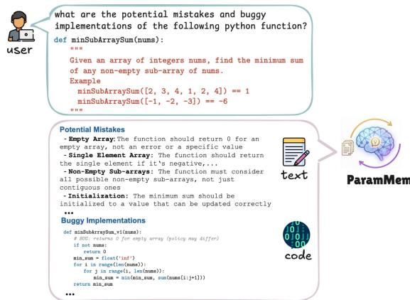

[← 返回 README](../README.md)

# 3. Augmenting Language Agents with ParamMem

## 📌 预览
ParamMem 构建流程 + ParamAgent 框架设计。

---

## 3.1 Building ParamMem

Core idea: Capture cross-sample regularities via training dynamics rather than retrieval.

**Steps**:
1. Curate auxiliary dataset $\mathcal{D} = \{(x_i, r_i^g)\}_{i=1}^n$
   - For code/math: $r_i^g$ = reflective feedback (potential mistakes, buggy implementations)
   - For multi-hop QA: $r_i^g$ = decomposed query into semantic units + sub-tasks
2. Fine-tune a pretrained LLM on $\mathcal{D}$ using **LoRA** → parametric module $\mathcal{M}_g$

*Figure 3: Output examples from ParamMem on programming and multi-hop QA.*

> 💡 **批注**: ParamMem 的构建极其简单——就是 LoRA SFT！但关键是**训练数据的构造**：不是训练模型输出答案，而是训练它输出"可能犯的错误"和"分解后的子问题"。这使得推理时 temperature 采样能产生多样化的诊断/分析。

## 3.2 Incorporating ParamMem into Reflexion

At iteration $k$:
1. Sample reflection from ParamMem: $r_k^g \sim p_\psi(\cdot \mid x)$
   - Temperature $T=0.2$ for first iteration (more deterministic)
   - Temperature $T=1.0$ for subsequent iterations (more diverse)
2. Concatenate with episodic reflections: $y_k \sim p_\theta(\cdot \mid x, r_{1:k-1}, r_k^g)$

**ParamAgent-plus**: Additionally retrieve from cross-sample memory bank.

> 💡 **Temperature 策略**:
> - 第 1 轮 T=0.2: 生成最可能的 reflection（先给个靠谱的方向）
> - 后续轮 T=1.0: 增加多样性（探索不同的诊断角度）
> - 这与 RL 中的 exploration-exploitation trade-off 很像

> 💡 **为什么 ParamMem 能增加多样性**:
> 1. **Prompt-based**: 受限于固定模板
> 2. **Retrieval-based**: 受限于 embedding 相似度（容易 collapse）
> 3. **ParamMem**: 通过参数化学习泛化模式，temperature 采样天然产生多样性
>    - 关键：LoRA 微调学到的是**分布**而非单个样本，采样时自然多样

---

## 🔖 Section 总结

### 核心洞察
1. **ParamMem = LoRA SFT on reflection data**: 简单但有效，因为它学的是"如何反思"而非"答案"
2. **Temperature 控制多样性**: 第 1 轮保守，后续轮探索，平衡质量和多样性
3. **仅需 ~500 样本**: Sample-efficient，适合资源有限的场景
4. **Weak-to-strong transfer**: 弱模型训练的 ParamMem 也能帮强模型——因为"反思模式"跨模型通用
