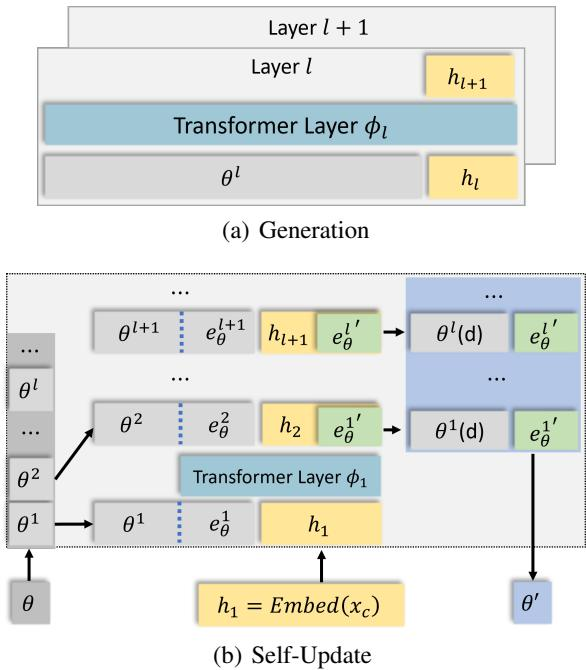
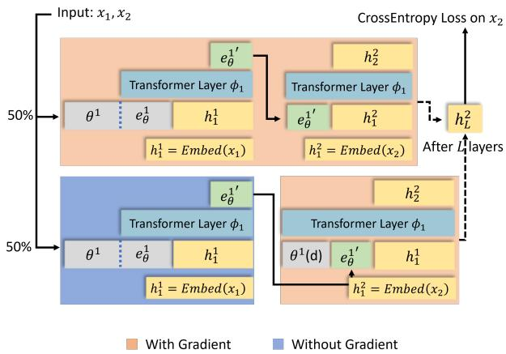

[← 返回 README](../README.md)

# 2-3. Preliminaries & MEMORYLLM Method

## 📌 预览
详细设计：Memory Pool 结构、Self-Update 过程、指数遗忘分析、三阶段训练策略。

---

## 2.1 Problem Statement

Essential properties for the new model:
1. **Efficiency**: Knowledge injection without back-propagation
2. **Efficacy**: Knowledge effectively impacts model performance
3. **Knowledge Retention**: Gradual phase-out of older knowledge (fixed-size memory)
4. **Integrity**: Full functionality regardless of update count
5. **Non-redundancy**: Compact storage, reducing redundancy

> 💡 **批注**: 5 个设计约束定义了问题空间。最独特的是 (1) 不用反向传播 和 (4) 任意次更新后仍正常——这两个约束排除了大多数参数更新方法。

## 2.2 Sketch: $\phi$ + $\theta$ 双参数模型

Model $\mathcal{M}_{\theta, \phi}$:
- $\phi$: static parameters (Llama2 weights) — persistent knowledge
- $\theta$: dynamic memory pool — continuously updated

Update function: $\theta' = U(\theta, x)$

For multi-step: $\theta_n = U(\cdots(U(\theta, x_1), x_n)$

> 💡 **批注**: 这个 $\phi$/$\theta$ 分离与 Titans 的三层记忆系统对应：$\phi$ = persistent memory + core attention，$\theta$ = long-term memory。

---

## 3.1 Structure Design

### 3.1.1 Memory Pool

$\theta = \{\theta_l\}_{l=1}^{L}$, where each $\theta_l \in \mathbb{R}^{N \times d}$ (N memory tokens per layer).

*Figure 1: (a) Generation: all memory tokens attended by hidden states. (b) Self-update: extract last K tokens, process with Transformer, replace.*

> 💡 **Figure 1 批读**:
> - **生成时 (a)**: 输入 tokens 通过 cross-attention 关注所有 N 个 memory tokens。注意力矩阵形状 $n_x \times (n_x + N)$，对 N 线性复杂度。
> - **更新时 (b)**: 只取最后 K 个 memory tokens + 新知识文本，送入 Transformer 处理。输出的最后 K 个 hidden states 成为新 memory tokens。然后 random drop 旧的 K 个，拼接新的。

### 3.1.2 Self-Update Process

1. Extract last K tokens from $\theta_l$ → $e_\theta^l$
2. Concatenate with hidden states $h_l$ from new knowledge $x_c$
3. Process through $\phi_l$ → output $h_{l+1}$
4. Last K tokens of $h_{l+1}$ become new memory $e_\theta^{l'}$
5. Random drop K tokens from $\theta_l$, append $e_\theta^{l'}$

> 💡 **批注**: Self-update 的巧妙之处——用 Transformer 本身来"理解"新知识并生成压缩表示，不需要额外的 encoder。这是一种隐式的知识压缩。

### 3.1.3 Analysis of Forgetting

Each update drops $K/N$ of existing memory. After $N/K$ updates, retention ratio:

$$
(1 - K/N)^{N/K} \to 1/e \approx 36.8\%
$$

> 💡 **批注**: 优雅的数学保证——N 越大（记忆池越大）、K 越小（压缩越紧），遗忘越慢。极限情况下，$N/K$ 步前的知识保留 $1/e$。这比 random eviction 好——后者没有理论保证。

---

## 3.2 Training Strategy

### 3.2.1 New Knowledge Incorporation
- Split document into $(x_1, x_2)$
- Update memory with $x_1$, predict $x_2$
- 50% 概率保留梯度 / 50% 不保留梯度

*Figure 2: Training process for new knowledge incorporation.*

### 3.2.2 Continuous Contexts Understanding
- Split long document into n parts $(x_1, \ldots, x_n)$
- Sequentially inject $x_1, \ldots, x_{n-1}$ into memory (no gradient)
- Calculate loss on $x_n$

### 3.2.3 Mitigating Forgetting
- Sample main doc + side docs, interleave injection
- Force model to recall main doc's last segment after side doc interference

> 💡 **训练策略总结**:
> | 目标 | 方法 | 梯度 |
> |------|------|------|
> | 知识注入 | 两段式 $(x_1 \to \theta, \theta \to x_2)$ | 50% 有/无 |
> | 连续理解 | n 段序列注入，预测最后一段 | 注入时无 |
> | 抗遗忘 | 主文档+干扰文档交错，回忆主文档 | 注入时无 |

## 3.3 Model Instantiation

- Base: Llama2-7B (32 layers, hidden dim 4096)
- Memory: 7,680 tokens/layer → $32 \times 7680 \times 4096 = 1.066B$ params

---

## 🔖 Section 总结

### 核心洞察
1. **Memory Pool 在每层都有**: 不同于只在某些层加记忆的方法，MemoryLLM 在所有 32 层都嵌入 memory tokens，最大化容量
2. **Self-Update 不需要梯度**: 用 Transformer 前向传播完成知识压缩和注入，极其高效
3. **指数遗忘 = Random Dropping**: 看似简单的 random drop 有优雅的数学保证（$1/e$ 保留率极限）
4. **训练的关键**: 50/50 的梯度开关策略平衡了"知识压缩质量"和"GPU 内存"
