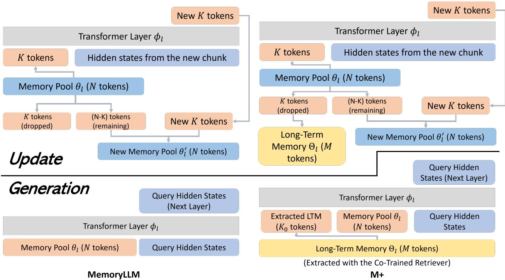

[← 返回 README](../README.md)

# 3. Methodology

## 📌 预览
M+ 的完整方法：Short-term + Long-term memory 结构、Retriever 设计与训练、Multi-LoRA、三阶段数据课程。

---

## 3.1 Preliminaries (MemoryLLM recap)

MemoryLLM: $\theta$ (memory pool) + $\phi$ (transformer). Each layer $\theta_l$ has N memory tokens. During update, last K tokens extracted, processed with chunk, new K tokens merged back via random dropping.

## 3.2 Equipping MemoryLLM with Long-Term Memory

### 3.2.1 Memory Structures

*Figure 1: Left: MemoryLLM update/generate. Right: M+ with Long-Term Memory $\Theta$.*

> 💡 **Figure 1 批读**:
> - **MemoryLLM**: dropped tokens → 永久丢弃
> - **M+**: dropped tokens → 存入 LTM $\Theta_l$（CPU 端），最大 M=150k tokens
> - 每个 token 带 "age" 变量，超过 M 时丢弃最老的
> - 生成时：从 $\Theta_l$ 检索 $K_0=2,560$ tokens，按 age 排序，与 $\theta_l$ 拼接

**Update Process**: Dropped K tokens stored in LTM $\Theta$ instead of discarded. Each token has "age" variable. When LTM reaches max capacity M, oldest tokens dropped.

**Generation Process**: At each layer, retrieve $K_0$ tokens from $\Theta_l$, sort by age, concatenate with short-term memory $\theta_l$ for cross-attention.

**Multi-LoRA Design**: Two sets of LoRA weights — one for update (writing), one for generation (reading).

> 💡 **批注**: Multi-LoRA 的动机类似 T5 encoder/decoder 分离——写入和读取是不同的操作，共享权重会互相干扰。

### 3.2.2 Retriever Design and Training

- Two projectors: $f_q$ (query) and $f_k$ (key), both 2-layer MLP
- Output dimension $d_{proj} = d/20$ (very compact)
- Training objective: maximize similarity between $h_n$ and $\theta_+$ (relevant memory), minimize with $\theta_-$ (irrelevant)

$$
\min_{f_q, f_k} -\log(p_+) - \log(1 - p_-)
$$

> 💡 **批注**: Retriever 极其轻量（d/20 维输出），且与 LM 共同训练。对比 RAG 的外挂 retriever，M+ 的 retriever 更好地理解 latent space 的语义。

### 3.2.4 Data Curriculum (3 Stages)

| Stage | 内容 | 数据 | 时长 |
|-------|------|------|------|
| 1 | MemoryLLM 续训 | fineweb-edu | 1.2M steps, 4 weeks |
| 2 | 长文档训练 | SlimPajama 4k-64k | 1 epoch, 1 week |
| 3 | LTM 训练 | SlimPajama (new instances) | - |

> 💡 **批注**: 三阶段课程设计很重要：Stage 1 建立基础 memory 能力，Stage 2 扩展到长文档，Stage 3 才引入 LTM。如果直接从 Stage 3 开始，模型无法学好 short-term memory 的使用。

---

## 🔖 Section 总结

### 关键数字速查
| 配置 | 值 |
|------|-----|
| Short-term memory $\theta_l$ | 10,240 tokens/层 |
| LTM retrieved $K_0$ | 2,560 tokens/层 |
| LTM max capacity M | 150k tokens |
| Retriever output dim | d/20 = 204.8 |
| Generation window | 2,048 tokens |

### 核心洞察
1. **"Archive" not "Forget"**: M+ 把 MemoryLLM 的遗忘变成了归档，是个简单但有效的 insight
2. **Co-trained Retriever**: 与 LM 一起训练的检索器比外挂检索器更好理解 hidden state 语义
3. **CPU-GPU 分离**: LTM 在 CPU，不增加 GPU 开销，是实用的工程设计
