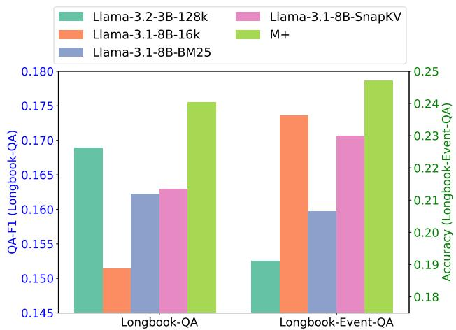

[← 返回 README](../README.md)

# 4. Experiments

## 📌 预览
Long Book QA、Event QA、知识保留、消融实验。M+ 显著超越 MemoryLLM 和其他基线。

---

*Figure 2: Overall Performance on Long Book QA. M+ significantly outperforms all baselines.*

> 💡 **Figure 2 批读**: M+ 在 Long Book QA 上全面超越 MemoryLLM、Llama-3.1-8B-16k 等基线，尤其在长距离依赖（>20k tokens）上优势明显。

## 4.1 Long Book QA and Event QA

M+ extends knowledge retention from <20k to 160k+ tokens, achieving significant improvements on both Long Book QA and Event QA benchmarks.

## 4.2 GPU Cost Comparison

M+ maintains similar GPU memory overhead to MemoryLLM since LTM is stored on CPU. The only additional GPU cost comes from the lightweight retriever.

## 4.5 Ablation Study

Key findings:
- LTM is critical: removing it drops performance to MemoryLLM level
- Retriever quality matters: random retrieval << co-trained retriever
- Multi-LoRA helps: single LoRA slightly worse

> 💡 **消融实验关键发现**: LTM 贡献最大，co-trained retriever 次之，Multi-LoRA 锦上添花。

---

## 🔖 Section 总结

### 核心洞察
1. M+ 的主要收益来自 LTM（知识不再被丢弃），retriever 保证了检索质量
2. 160k+ 的保留范围 vs MemoryLLM 的 <20k，是 **8x** 的提升
3. GPU 开销几乎不变——LTM 全在 CPU
