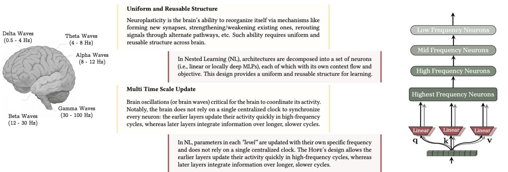
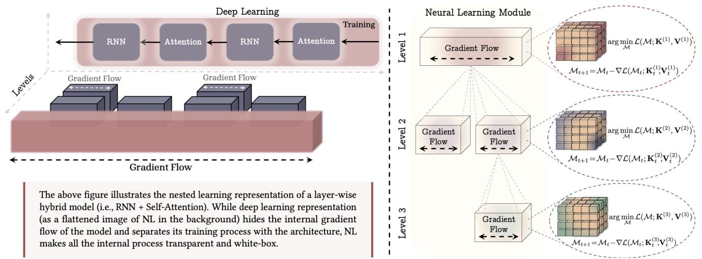

[← 返回 README](../README.md)

# 1 Introduction

## 📌 预览
从 LLM 的"顺行性遗忘"类比出发，讨论大脑的多时间尺度处理和均匀可复用结构，引出 Nested Learning。

---

## LLM 的静态性问题

For decades, AI research has focused on designing machine learning algorithms that learn from data or experience. Deep learning has been an inseparable part of large-scale computational models with seminal success. However, stacking of multiple layers is not a universal solution — it doesn't help with: (i) computational depth, (ii) parameter capacity, (iii) convergence to optimal solution, (iv) fast adaptation and continual learning.

> 💡 **批注**: 开篇就挑战"deeper is better"的信念。4 个具体反例说明单纯堆叠层数不够。

**Current Models = Anterograde Amnesia**: LLMs' knowledge is limited to either the immediate context (context window) or long past (pre-training MLPs). Like anterograde amnesia — cannot form new long-term memories after the onset of "end of pre-training."

> 💡 **批注**: 用"顺行性遗忘"比喻 LLM 的静态性——部署后无法形成新的长期记忆，永远活在"当下+远古"。非常有力的类比。

---

## 1.1 Human Brain Perspective

### Memory Consolidation

Two processes:
1. **Online consolidation** (synaptic): Rapid, during wakefulness — new memories stabilized and begin transferring from short-term to long-term
2. **Offline consolidation** (systems): During sleep — replay, reorganize, transfer to cortical sites

> 💡 **批注**: LLM 缺少的恰好是第一阶段（online consolidation）——新信息从来不影响长期记忆参数。Titans 的 test-time learning 就是在做 online consolidation。

### Multi Time-Scale Processing

Brain oscillations operate at different frequencies:
- **Gamma waves** (30-150 Hz): Sensory information (fastest)
- **Beta waves** (13-30 Hz): Active thinking
- **Delta/Theta waves** (0.5-8 Hz): Memory consolidation (slowest)

In deep learning: weights are fixed at test time, and all layers use the same update rate. Transformers use only two extreme frequencies: ∞ (attention) and 0 (MLP).

> 💡 **批注**: 关键 insight——大脑用**连续频谱**的多时间尺度处理信息，但 Transformer 只有两个极端（attention = 无限频率/每个 token 都更新，MLP = 零频率/训练后固定）。CMS 要填补这个空白。

### Brain's Uniform and Reusable Structure

Hemispherectomy example: removing half the brain in childhood → patients can still function normally. This proves the brain has **uniform, reusable** architecture — not rigidly dedicated to one function.

> 💡 **批注**: 如果大脑是均匀可复用的，为什么现代架构（attention + MLP + convolution）看起来异构？NL 的回答：它们**看起来**异构，但本质上都是"压缩自己 context flow 的优化问题"。

*Figure 1: Multi time-scale update in the brain → NL allows multi time-scale updates for each component.*

> 💡 **Figure 1 批读**: 左侧是大脑的多频率振荡，右侧是 NL 的对应设计。Transformer 被重新解读为：attention = 高频（每 token 更新），MLP = 低频（训练后固定）。NL 主张所有频率之间都应该有中间层级。

---

## 1.2 Contributions and Roadmap

*Figure 2: Nested Learning Paradigm — model as nested optimization problems.*

> 💡 **Figure 2 批读**:
> - **左**: 传统视角看 hybrid 架构只是不同模块的堆叠；NL 视角透明展示了所有内部梯度流
> - **右**: Neural Learning Module = 一个压缩自己 context flow 的计算模型。第一层（最外层）= 预训练

**Nested Learning Paradigm (§3)**: Each component has its own internal gradient flow on its own context in multiple levels. Optimization and architecture are fundamentally the same concept but at different levels with different context (gradients vs. tokens).

**Optimizers as Learning Modules (§4, §5)**: Training with backpropagation is a compression problem — training an associative memory to map inputs to local errors. Adam, SGD+momentum are associative memories compressing gradients. Pre-training is in-context learning where the context is the entire training data.

**Continuum Memory System + Hope (§7, §8)**: Generalize "long-term/short-term" to a continuum of frequency updates. Higher frequency = fast adaptation, short retention; Lower frequency = slow adaptation, persistent knowledge.

---

## 🔖 Section 总结

### 核心洞察
1. **LLM = 顺行性遗忘**: 部署后无法形成新长期记忆，这是架构层面的根本问题
2. **大脑的秘密**: 多时间尺度 + 均匀可复用结构 → NL 的两个核心设计原则
3. **优化器 = 记忆模块**: Titans 提出了这个 insight，NL 将其形式化为完整理论
4. **Transformer 只有两个极端频率**: attention (∞) 和 MLP (0)，CMS 要填满中间的频谱
5. **预训练 = 超大上下文的 in-context learning**: 重新定义了预训练的含义
