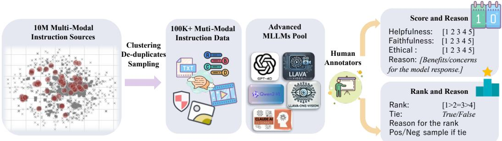

[← 返回 README](../README.md)

# 1 Introduction

## 📌 预览
Introduction 提出核心问题"对齐只能提升有限任务吗？"，回答"不"，并介绍 MM-RLHF 在数据、奖励建模、对齐算法三方面的贡献。

---

Although Multimodal Large Language Models (MLLMs) have demonstrated remarkable potential in addressing complex tasks that involve the integration of vision, language, and audio, state-of-the-art models today seldom undergo a rigorous alignment stage [64, 17, 12, 16, 2]. Typically, these models only progress to the Supervised Fine-tuning (SFT) stage, leaving critical aspects such as truthfulness, safety, and alignment with human preferences largely unaddressed. While recent efforts have begun to explore MLLM alignment, they often focus on specific domains, such as mitigating hallucination or enhancing conversational capabilities, which fail to comprehensively improve the model's overall performance and reliability. This raises a critical question:

**Is alignment with human preferences only capable of enhancing MLLMs in a limited set of tasks?**

> 💡 **核心问题**: 这是全文的出发点——现有 MLLM 对齐研究局限在特定领域（如减幻觉），MM-RLHF 要证明对齐可以全面提升。

In this work, we confidently answer this question with a resounding "No.". We demonstrate that a well-designed alignment pipeline can comprehensively enhance MLLMs along multiple dimensions, including visual perception, reasoning, dialogue, and trustworthiness, thereby significantly broadening their practical applicability. To achieve this, we conduct in-depth investigations into three pivotal areas: data curation, reward modeling, and alignment algorithms.

> 💡 **三大研究方向**: 数据构建、奖励建模、对齐算法——这三者构成了完整的 alignment pipeline。

---

At first, we introduce MM-RLHF, a dataset designed to advance Multimodal Reinforcement Learning from Human Feedback (RLHF). The dataset spans three domains: image, video understanding, and MLLM safety. Constructed through a rigorous pipeline, MM-RLHF ensures high-quality, fine-grained annotations. Dataset creation process involves the following steps (Figure 1):

*Figure 1: MM-RLHF Construction Pipeline. (1) Data Collection and Cleaning: Starting with 10 million instruction samples, we cluster data based on image similarity, and uniformly sample across diverse categories. (2) Response Generation: We leverage state-of-the-art models, including GPT-4o and Qwen2-VL-72B, to generate high-quality responses. (3) Human Annotation: We conduct manual annotation across nine categories, including scoring, ranking, and explanations, ensuring fine-grained evaluation.*

> 💡 **Figure 1 批读**:
> - Pipeline 分三阶段：数据收集清洗 → 响应生成 → 人工标注
> - 从 10M 样本出发，通过聚类采样得到 30k queries
> - 用 4 个 SOTA 模型生成响应，保证响应质量
> - 人工标注涵盖 9 个维度（打分 + 排名 + 解释）

• **Data Collection.** We curate a diverse set of multimodal tasks from various sources, totaling 10 million data instances, ensuring broad representation across tasks.
• **Data Selection.** Through rigorous re-sampling, we extract 30k representative queries, ensuring diversity across a wide range of data types, such as real-world scenarios, mathematical reasoning, chart understanding, and other practical domains (Figure 2).
• **Model Response Generation.** We utilize state-of-the-art models, such as Claude 3.5-Sonnet and Qwen2-VL-72B, to generate responses for various tasks.
• **Fine-grained Human Annotation.** We employ a meticulous annotation process, involving over 50 annotators over two months, to score, rank, and provide textual explanations for responses. This results in more than 120k high-quality ranked comparison pairs.

> 💡 **数据构建要点**:
> - 10M → 30k queries 的筛选比例约 1:333，保证多样性
> - 50+ 标注员、2 个月、120k 对比对——这是很大的人力投入
> - 标注不仅有排名，还有每个维度的打分和文字解释

Compared to existing datasets, MM-RLHF significantly advances in diversity, response quality, and annotation granularity, providing a robust foundation for MLLM alignment.

---

Building on the MM-RLHF dataset, we investigate how human-annotated data can enhance MLLM alignment, with a focus on reward modeling and training optimization. Recognizing the pivotal role of reward models in providing feedback signals to guide the alignment process, we propose a **Critique-Based Reward Model** (Figure 3). Traditional reward models, which output scalar values, often lack interpretability, while directly using MLLMs as reward models place high demands on their instruction-following capabilities, limiting their practicality. To address these limitations, we first transform concise human annotations into detailed, model-friendly formats using MLLMs. These enriched annotations serve as learning targets, guiding the reward model to first generate critiques and then assign scores based on the critiques. This approach enables the model to provide fine-grained scoring explanations, significantly enhancing the quality and interpretability of the reward signals. MM-RLHF-Reward-7B achieves SOTA performance on several reward model benchmarks, outperforming several 72B-scale models.

> 💡 **Critique-Based Reward Model 核心思路**:
> - 传统 RM 输出标量值，不可解释
> - 直接用 MLLM 当 judge 对指令跟随能力要求太高
> - 解法：先让 RM 生成 critique（评价文本），再基于 critique 打分
> - 用 GPT-4o 扩展人工标注 → 作为 critique 训练目标
> - 7B 模型就能超过 72B 级别的模型，效率很高

Building on this high-quality reward model, we introduce **Dynamic Reward Scaling** within the Direct Preference Optimization (DPO) framework. Traditional DPO methods [3] use a fixed training weight for all human-preferred and non-preferred training pairs. In contrast, Dynamic Reward Scaling calculates a reward margin for each comparison pair using MM-RLHF-Reward-7B. During training, it assigns higher weights to comparison pairs with larger reward margins. This ensures that the most informative samples have a stronger influence on model updates. As a result, the training process becomes more efficient, leading to improved model performance.

> 💡 **Dynamic Reward Scaling**: 传统 DPO 对所有样本一视同仁，但样本质量参差不齐。用 reward margin 来动态调整 $\beta$，高质量对比对获得更大权重。

---

Finally, to rigorously evaluate our approach, we construct two specialized benchmarks. The first, **MM-RLHF-RewardBench**, is sampled from our dataset and consists of meticulously human-annotated data for evaluating reward models. The second, **MM-RLHF-SafetyBench**, is curated and filtered from existing benchmarks and focuses on safety-related tasks, including privacy protection, adversarial attacks, jailbreaking, and harmful content detection.

We conduct extensive evaluations across ten key dimensions, covering 27 benchmarks. The results demonstrate that our training algorithm, combined with the high-quality MM-RLHF dataset, leads to significant improvements in model performance. Specifically, models fine-tuned with our approach achieve an average **11%** gain in conversational abilities and a **57%** reduction in unsafe behavior. The integration of our reward model further amplifies these gains, highlighting the effectiveness of our alignment algorithm.

> 💡 **评估规模**: 10 维度、27 benchmarks——这是 MLLM 对齐领域最全面的评估之一。两个自建 benchmark 填补了 reward model 和 safety 评估的空白。

---

## 🔖 Section 总结

### 核心贡献
1. **MM-RLHF 数据集**: 120k 人工标注偏好对比对，覆盖图像/视频/安全三大领域
2. **Critique-Based Reward Model**: 先生成 critique 再打分，7B 超越 72B
3. **Dynamic Reward Scaling (MM-DPO)**: 根据 reward margin 动态调权
4. **两个 Benchmark**: MM-RLHF-RewardBench + MM-RLHF-SafetyBench
5. **全面评估**: 10 维度 27 benchmarks 上一致提升
