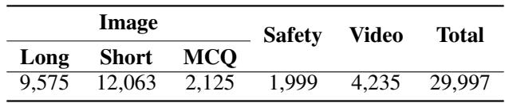

[← 返回 README](../README.md)

# 2 MM-RLHF-Dataset

## 📌 预览
详细介绍 MM-RLHF 数据集的构建流程：数据收集（10M 样本）→ 聚类采样（30k queries）→ 多模型响应生成 → 细粒度人工标注（120k 对比对）。标注维度包括 Helpfulness、Faithfulness、Ethical Considerations，并创新性地为 tie 情况构建正负样本。

---

In this section, we outline the construction of MM-RLHF, as illustrated in Figure 1. This includes the data collection process, data filtering methods, and human annotation procedures.

> 💡 **Section 概览**: 数据集构建分三步：收集 → 筛选 → 标注。每一步都有精心设计的策略。

---

## 2.1 Data Collection

> 💡 **2.1 要点预览**: 数据来源覆盖图像理解、视频理解、安全三大领域，共 10M+ 样本。

Our goal is to construct a comprehensive post-training dataset that covers a wide range of task types. To achieve this, we categorize tasks into three main domains: image understanding, video understanding, and multimodal safety.

For image understanding, we integrate data from multiple sources, including LLaVA-OV, VLfeedback [37], LLaVA-RLHF [58], lrv-instruction [42], and Unimm-Chat. Since some datasets contain multi-turn dialogues, which are less suitable for response generation, we decompose them into single-turn dialogues. This process yields over 10 million dialogue samples, covering tasks such as conversation, safety, multiple-choice questions, captions, and commonsense reasoning.

For video understanding, the primary data source is SharedGPT-4 video [10].

For safety, data is primarily derived from VLGuard [84] and self-constructed content. VLGuard contains over 2,000 harmful samples, while additional red teaming, safety, and robustness data are included. The pipeline for constructing safety data is detailed in the Appendix C.1.

> 💡 **数据来源总结**:
> | 领域 | 来源 | 规模 |
> |------|------|------|
> | 图像理解 | LLaVA-OV, VLfeedback, LLaVA-RLHF, lrv-instruction, Unimm-Chat | 10M+ |
> | 视频理解 | SharedGPT-4 video | - |
> | 安全 | VLGuard + 自建 | 2000+ harmful samples |
>
> 注意多轮对话被拆成单轮，便于响应生成。

---

## 2.2 Data Filtering and Model Response Generation

> 💡 **2.2 要点预览**: 核心挑战是从 10M 筛选到 30k，保持多样性。策略：预定义采样权重 + 基于图像聚类的采样。

The core goal of data filtering is to reduce the number of samples while maintaining the diversity of the original dataset. To achieve this, the following strategies are adopted:

**Predefined sampling weights.** For image understanding tasks, we define three categories based on the nature of the questions and the length of model responses:
1. **Multiple-choice questions (MCQ)**; (Questions with options such as A, B, C, or D.) These tasks include visual question answering, mathematics, OCR, and icon recognition, focusing on the model's reasoning and visual perception abilities.
2. **Long-text questions**; (Questions for which GPT-4o generates responses exceeding 128 characters.) These typically involve detailed captions or complex descriptions, testing the model's conversational and descriptive capabilities.
3. **Short-text questions**; (Questions for which GPT-4o generates responses shorter than 128 characters.) These require concise answers, often involving simple image analysis, and represent a broader range of task types.

The initial distribution of these three types in the image understanding dataset is highly imbalanced, with proportions of 12.17% (Long), 83.68% (Short), and 4.14% (MCQ). To align with diversity goals, we adjust the sampling ratio to **4:5:1**, reducing disparities among task types while maintaining a dominance of comprehensive samples.

> 💡 **采样策略批读**:
> - 原始分布极不平衡：Short 占 83.68%，MCQ 仅 4.14%
> - 调整为 4:5:1 (Long:Short:MCQ)，大幅提升 Long 和 MCQ 的比例
> - 128 字符作为长短文本分界——这是用 GPT-4o 响应长度来分类，不是问题长度

*Figure 2: Re-Sample results from the clustering process. Due to the large total number of samples, the clustered and deduplicated results contain a rich diversity of categories. Selected samples include topics such as mathematics, daily life, natural scenes, medicine, electronic technology, and OCR scenarios, showcasing a variety of problem-image pairs. The 2D features were obtained via UMAP dimensionality reduction.*

> 💡 **Figure 2 批读**:
> - UMAP 降维可视化显示聚类结果覆盖了数学、日常生活、自然场景、医学、电子技术、OCR 等多个领域
> - 说明基于 CLIP 图像特征的 KNN 聚类确实能保持多样性

*Table 1: Dataset Composition Statistics*

> 💡 **Table 1 批读**:
> - 总计 29,997 queries
> - Image: Long 9,575 + Short 12,063 + MCQ 2,125 = 23,763
> - Safety: 1,999; Video: 4,235
> - 实际采样比例 Long:Short:MCQ ≈ 4:5:1，与预定义一致

**Cluster-based Sampling.** Text deduplication is not performed because many questions, while similar in text, are paired with different images, leading to substantially different outcomes—an intrinsic characteristic of multimodal data. Instead, we encode all images using CLIP, and for videos, we use the feature of the first frame as a representative. We then apply KNN clustering with 100 cluster centers and randomly sample $N$ instances from each cluster. The value of $N$ is determined to satisfy the predefined sampling ratios, ensuring a balanced representation of task diversity.

> 💡 **为什么不做文本去重？** 多模态数据的特性：相同文本 + 不同图片 = 完全不同的任务。所以用图像特征聚类而非文本去重。这是一个很好的 insight。

**Model response generation.** To generate high-quality responses, we select state-of-the-art models from both open-source and closed-source domains. For image understanding and safety-related tasks, we use Qwen2-VL-72B [64], LLaVA-OV-72B [32], GPT-4o, and Claude 3.5-sonnet. For video understanding tasks, we employ GPT-4o, LLaVA-Video-72B [83], and Qwen2-VL-72B [64]. These models are chosen for their advanced capabilities and performance, ensuring a comprehensive evaluation of leading solutions in multimodal understanding.

> 💡 **响应生成模型选择**:
> - 混合开源 + 闭源，保证响应质量和多样性
> - 图像任务用 4 个模型，视频用 3 个模型
> - 每个 query 有多个模型的响应，便于后续排名标注

---

## 2.3 Annotation

The annotation process follows rigorous standards to ensure comprehensive and fine-grained evaluations of MLLM responses. Detailed standards are provided in Appendix B, and the scoring and annotation structure are illustrated in Figure 1.

> 💡 **标注流程概览**: 评分 + 排名 + 文字解释，三管齐下。

### 2.3.1 Annotation Standards

Compared to prior work, our annotation approach introduces two significant advantages: **richness** and **granularity**. First, the evaluation incorporates three core dimensions—**Helpfulness**, **Faithfulness**, and **Ethical Considerations**—to comprehensively capture model performance. Helpfulness ensures that responses are relevant and provide meaningful assistance aligned with the user's intent. Faithfulness evaluates the accuracy of responses in describing visual elements, such as objects, relationships, and attributes, ensuring alignment with the ground truth while avoiding hallucinated content. Ethical Considerations assess adherence to ethical principles, including safety, privacy, fairness, and harm avoidance, ensuring responses are free from harmful or biased content. Annotators score each dimension while documenting the reasoning behind their assessments, adding valuable context for understanding model performance.

> 💡 **三维评分体系**:
> | 维度 | 评估内容 |
> |------|----------|
> | Helpfulness | 响应是否有用、是否回答了用户问题 |
> | Faithfulness | 视觉描述是否准确、有无幻觉 |
> | Ethical Considerations | 安全、隐私、公平、无害 |

Second, annotators are required to assign an overall ranking to the responses, along with justifications for their rankings. This ranking mechanism provides a transparent and nuanced comparison of model outputs. Additionally, innovative strategies are employed to enhance data quality:

- **Constructing positive samples for poor quality ties.** When multiple responses are equally poor, annotators provide correct answers to create positive examples. This ensures that challenging samples contribute to the training dataset, addressing issues where no valid model responses exist.

- **Constructing negative samples for high-quality ties.** When multiple responses are of equally high quality, annotators introduce deliberate errors to create negative samples. This prevents ties from reducing the utility of the data and allows for more efficient use in training.

> 💡 **Tie 处理策略——非常创新！**
> - 全差的响应 → 人工写正确答案作为正样本
> - 全好的响应 → 人工引入错误作为负样本
> - 这样 tie 情况也能产生有效的训练对，不浪费数据

By combining fine-grained scoring criteria, textual annotations, and innovative strategies, our annotation framework produces a high-quality dataset that comprehensively captures model performance and supports effective downstream applications.

---

### 2.3.2 Human Annotation vs. Machine Annotation

**Annotation workers and costs.** The annotation process employs over 50 annotators, supported by 8 multimodal research experts with strong English proficiency and academic backgrounds. The entire task completes within two months, with periodic quality checks and interactive reviews conducted by experts to ensure the reliability and accuracy of the annotations. Low-quality samples undergo re-annotation during the process. Due to the fine-grained nature of the annotation standards, the task involves significant challenges. For example, annotating a single question in the long split of image perception tasks requires an average of over **8 minutes**.

> 💡 **标注成本**: 50+ 标注员 + 8 专家，2 个月。Long 类问题平均 8 分钟/题——这个成本非常高，但保证了质量。

**Why human annotation?** Many existing MLLM alignment datasets rely on annotations generated by external models due to their cost-effectiveness and scalability. However, MLLM alignment tasks demand fine-grained perceptual capabilities and sensitivity to subtle differences, which current models lack. In many cases, the differences between responses are nuanced, requiring an in-depth understanding that models struggle to achieve. As demonstrated in our experiments, even state-of-the-art models like GPT-4o significantly underperform human experts in tasks involving response comparison. Moreover, these models cannot provide professional-grade scoring or well-reasoned explanations for rankings. These limitations highlight the necessity of human annotation, which ensures the precision, reasoning, and insight required for constructing high-quality alignment datasets.

> 💡 **人工 vs. 机器标注**: 即使 GPT-4o 在响应对比任务上也显著不如人类专家。模型缺乏对细微差异的感知能力，无法提供专业级的评分和排名解释。

Appendix D further discusses the advantages of human annotation, particularly in handling ambiguous or incomplete questions and closely matched responses requiring subtle differentiation. Human annotators excel at identifying fine-grained errors, inconsistencies, and context-specific nuances that models overlook. By relying on human feedback, our approach ensures the dataset achieves the quality and reliability necessary for advancing MLLM alignment efforts.

We acknowledge that the cost of human annotation poses scalability challenges. However, as demonstrated in later sections, our high-quality alignment dataset enables the training of a powerful reward model. In the future, by combining this reward model with human annotators in a collaborative framework, we can significantly reduce annotation costs and scale up the dataset efficiently. This hybrid approach not only maintains the precision of human annotation but also enhances scalability, making it a practical solution for large-scale MLLM alignment.

> 💡 **可扩展性路线图**: 人工标注 → 训练 reward model → 未来 reward model + 人工协作，降低成本。这是一个 bootstrapping 思路。

---

## 🔖 Section 总结

### 关键数字速查
| 指标 | 数值 |
|------|------|
| 初始数据规模 | 10M 样本 |
| 筛选后 queries | 29,997 |
| 对比对数量 | 120k+ |
| 标注员数量 | 50+ 标注员 + 8 专家 |
| 标注周期 | 2 个月 |
| 每题标注时间 (Long) | ~8 分钟 |
| 数据领域 | 图像/视频/安全 |
| 响应生成模型 | GPT-4o, Claude 3.5, Qwen2-VL-72B, LLaVA-OV-72B |
| 聚类中心数 | 100 |

### 核心洞察
1. **多模态数据不适合文本去重**——相同问题+不同图像是完全不同的任务
2. **Tie 处理策略**是一个创新——为 tie 情况构建正负样本
3. **三维评分 + 排名 + 解释**提供了远超现有数据集的标注粒度
4. 人工标注虽然昂贵但不可替代——GPT-4o 也做不到专业级对比评分
