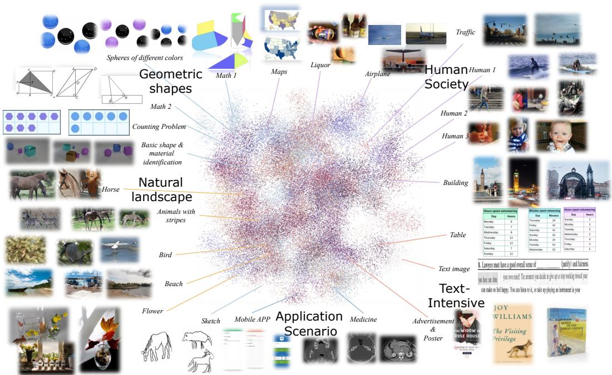
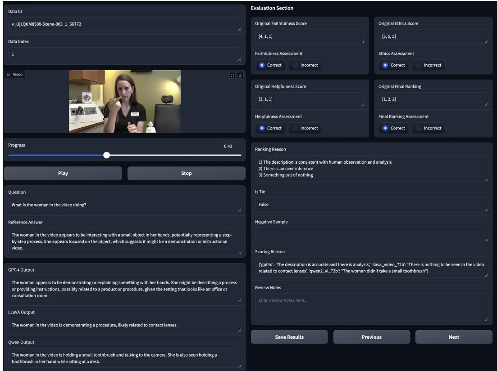

# 2. MM-RLHF-Dataset

> 来源: MM-RLHF (ICML 2025)

---

## 📄 原文

In this section, we outline the construction of MM-RLHF, as illustrated in Figure 1. This includes the data collection process, data filtering methods, and human annotation procedures.

> 💡 **Section 概览**: 这是全文最重要的 section 之一（对 Apple Assignment 而言）。详细描述了从 10M 原始数据到 120K preference pairs 的完整流程：数据收集 → 过滤采样 → 模型生成 response → 人工标注。

---

### 2.1 Data Collection

> 💡 **2.1 要点预览**: 数据来源覆盖三大域：image understanding、video understanding、safety。

Our goal is to construct a comprehensive post-training dataset that covers a wide range of task types. To achieve this, we categorize tasks into three main domains: image understanding, video understanding, and multimodal safety.

For **image understanding**, we integrate data from multiple sources, including LLaVA-OV, VLfeedback [37], LLaVA-RLHF [58], lrv-instruction [42], and Unimm-Chat. Since some datasets contain multi-turn dialogues, which are less suitable for response generation, we decompose them into single-turn dialogues. This process yields over **10 million** dialogue samples, covering tasks such as conversation, safety, multiple-choice questions, captions, and commonsense reasoning.

For **video understanding**, the primary data source is SharedGPT-4 video [10].

For **safety**, data is primarily derived from VLGuard [84] and self-constructed content. VLGuard contains over 2,000 harmful samples, while additional red teaming, safety, and robustness data are included. The pipeline for constructing safety data is detailed in the Appendix C.1.

> 💡 **2.1 小结**:
> | 域 | 数据来源 | 规模 |
> |------|----------|------|
> | Image Understanding | LLaVA-OV, VLfeedback, LLaVA-RLHF, lrv-instruction, Unimm-Chat | 10M+ samples |
> | Video Understanding | SharedGPT-4 video | — |
> | Safety | VLGuard (2K+ harmful) + self-constructed (850 safety + 500 adversarial) | ~3.3K |
>
> **注意**: 多轮对话被拆成单轮，方便后续生成 response。

---

### 2.2 Data Filtering and Model Response Generation

> 💡 **2.2 要点预览**: 核心问题——如何从 10M 降到 30K 同时保持多样性？答案：预定义采样权重 + 基于 CLIP 的聚类采样。

The core goal of data filtering is to reduce the number of samples while maintaining the diversity of the original dataset. To achieve this, the following strategies are adopted:

**Predefined sampling weights.** For image understanding tasks, we define three categories based on the nature of the questions and the length of model responses:
1. **Multiple-choice questions (MCQ)**: Questions with options such as A, B, C, or D. These tasks include visual question answering, mathematics, OCR, and icon recognition, focusing on the model's reasoning and visual perception abilities.
2. **Long-text questions**: Questions for which GPT-4o generates responses exceeding 128 characters. These typically involve detailed captions or complex descriptions, testing the model's conversational and descriptive capabilities.
3. **Short-text questions**: Questions for which GPT-4o generates responses shorter than 128 characters. These require concise answers, often involving simple image analysis, and represent a broader range of task types.

The initial distribution of these three types in the image understanding dataset is highly imbalanced, with proportions of 12.17% (Long), 83.68% (Short), and 4.14% (MCQ). To align with diversity goals, we adjust the sampling ratio to **4:5:1** (Long:Short:MCQ), reducing disparities among task types while maintaining a dominance of comprehensive samples.

> 💡 **采样策略详解（Apple Assignment 重点）**:
> ```
> 原始分布:        调整后:
> Long:  12.17%    Long:  40% (↑↑)
> Short: 83.68%    Short: 50% (↓↓)
> MCQ:    4.14%    MCQ:   10% (↑)
> ```
> 为什么这么调？Long text questions 更能测试模型的描述能力和对话能力，但原始数据中占比很小。MCQ 测试推理能力也被低估。调整后更均衡。


*Figure 2: Re-Sample results from the clustering process. 聚类后的样本涵盖数学、日常生活、自然场景、医学、电子科技、OCR 等多样类别。2D 特征通过 UMAP 降维获得。*

> 💡 **Figure 2 批读**:
> - UMAP 可视化展示了 CLIP 聚类后的样本分布
> - 可以看到类别非常多样：数学公式、街景、医学图像、电路图、OCR 文档等
> - 这种多样性是数据集的核心价值——覆盖了 MLLM 实际使用中会遇到的各种场景

**Cluster-based Sampling.** Text deduplication is not performed because many questions, while similar in text, are paired with different images, leading to substantially different outcomes—an intrinsic characteristic of multimodal data. Instead, we encode all images using CLIP, and for videos, we use the feature of the first frame as a representative. We then apply KNN clustering with **100 cluster centers** and randomly sample N instances from each cluster. The value of N is determined to satisfy the predefined sampling ratios, ensuring a balanced representation of task diversity.

> 💡 **为什么不做文本去重？** 多模态数据的特点——同样的问题搭配不同图片，含义完全不同。所以用**图像相似度**（CLIP embedding）聚类，而非文本去重。这是一个重要的设计决策。

**Data statistics.** The composition of the dataset is summarized in Table 1, and a visualization of the clustering results is shown in Figure 2, demonstrating the rich diversity of data categories.

| | Long | Short | MCQ | Safety | Video | Total |
|---|---|---|---|---|---|---|
| 数量 | 9,575 | 12,063 | 2,125 | 1,999 | 4,235 | **29,997** |

> 💡 **数据组成小结**: 近 30K queries，Image 占主体（~24K），Video 和 Safety 各 ~2-4K。注意这是 queries 数量，每个 query 有多个 model responses，所以最终产生 120K+ comparison pairs。

**Model response generation.** To generate high-quality responses, we select state-of-the-art models from both open-source and closed-source domains.
- **Image understanding & safety**: Qwen2-VL-72B, LLaVA-OV-72B, GPT-4o, Claude 3.5-sonnet
- **Video understanding**: GPT-4o, LLaVA-Video-72B, Qwen2-VL-72B

> 💡 **Response 生成策略**: 用多个 SOTA 模型生成 response，每个 query 有 3-4 个不同模型的回答。这样做的好处：
> 1. 不同模型有不同的强项和弱点，产生有区分度的 response pairs
> 2. 包含开源和闭源模型，覆盖不同能力水平
> 3. 为 annotators 提供了有意义的排序任务（而不是都一样好或都一样差）

---

### 2.3 Annotation

The annotation process follows rigorous standards to ensure comprehensive and fine-grained evaluations of MLLM responses. Detailed standards are provided in Appendix B, and the scoring and annotation structure are illustrated in Figure 1. Additionally, we design a web UI to streamline the annotation process, as shown in Figure 7.


*Figure 7: 数据标注的用户界面，包含图片/视频展示、问题、各模型输出、详细评分标准和审核区域。*

> 💡 **Figure 7 批读**: 
> - 左侧：原始图片/视频 + 问题
> - 中间：各个模型的 response 并排展示
> - 右侧：评分区域——每个维度（Faithfulness, Helpfulness, Ethics）单独打分 + 文字理由
> - 底部：Overall ranking + ranking 理由
> - **这是一个专业的标注工具**，比简单的 A/B 比较复杂得多

#### 2.3.1 Annotation Standards

> 💡 **2.3.1 要点预览（Apple Assignment 核心！）**: 标注标准的两大优势——richness（多维度评估）和 granularity（细粒度打分+理由）。

Compared to prior work, our annotation approach introduces two significant advantages: **richness** and **granularity**.

First, the evaluation incorporates three core dimensions—**Helpfulness**, **Faithfulness**, and **Ethical Considerations**—to comprehensively capture model performance.
- **Helpfulness** ensures that responses are relevant and provide meaningful assistance aligned with the user's intent.
- **Faithfulness** evaluates the accuracy of responses in describing visual elements, such as objects, relationships, and attributes, ensuring alignment with the ground truth while avoiding hallucinated content.
- **Ethical Considerations** assess adherence to ethical principles, including safety, privacy, fairness, and harm avoidance, ensuring responses are free from harmful or biased content.

Annotators score each dimension while documenting the reasoning behind their assessments, adding valuable context for understanding model performance.

> 💡 **三维度评估框架（重点）**:
> | 维度 | 评估内容 | 对应能力 |
> |------|----------|----------|
> | **Helpfulness** | 回答是否有用、是否符合用户意图 | 对话能力、任务完成度 |
> | **Faithfulness** | 视觉描述是否准确、有无幻觉 | 视觉感知、真实性 |
> | **Ethical Considerations** | 安全、隐私、公平、无害 | 可信赖性 |
>
> 每个维度都有**打分 + 文字理由**，这比单纯的 pairwise comparison 丰富得多。

Second, annotators are required to assign an **overall ranking** to the responses, along with justifications for their rankings. This ranking mechanism provides a transparent and nuanced comparison of model outputs. Additionally, innovative strategies are employed to enhance data quality:

- **Constructing positive samples for poor quality ties.** When multiple responses are equally poor, annotators provide correct answers to create positive examples. This ensures that challenging samples contribute to the training dataset, addressing issues where no valid model responses exist.

- **Constructing negative samples for high-quality ties.** When multiple responses are of equally high quality, annotators introduce deliberate errors to create negative samples. This prevents ties from reducing the utility of the data and allows for more efficient use in training.

> 💡 **处理平局的创新策略（重要设计决策）**:
> ```
> 情况1: 所有模型回答都很差 (poor tie)
>   → annotator 自己写正确答案作为 positive sample
>   → 解决了"全军覆没"场景的数据浪费问题
> 
> 情况2: 所有模型回答都很好 (high-quality tie)
>   → annotator 故意引入错误，构造 negative sample
>   → 解决了"都对"场景无法产生 preference pair 的问题
> ```
> 这两个策略非常聪明——确保每个 query 都能产生有用的训练数据。

By combining fine-grained scoring criteria, textual annotations, and innovative strategies, our annotation framework produces a high-quality dataset that comprehensively captures model performance and supports effective downstream applications.

#### 2.3.2 Human Annotation vs. Machine Annotation

> 💡 **2.3.2 要点预览**: 为什么坚持人工标注？成本多高？

**Annotation workers and costs.** The annotation process employs **over 50 annotators**, supported by **8 multimodal research experts** with strong English proficiency and academic backgrounds. The entire task completes within **two months**, with periodic quality checks and interactive reviews conducted by experts to ensure the reliability and accuracy of the annotations. Low-quality samples undergo re-annotation during the process. Due to the fine-grained nature of the annotation standards, the task involves significant challenges. For example, annotating a single question in the long split of image perception tasks requires an average of **over 8 minutes**.

> 💡 **标注团队和成本（Apple Assignment 重点）**:
> | 指标 | 数值 |
> |------|------|
> | 标注人员 | **50+ annotators** |
> | 专家审核 | **8 multimodal research experts** |
> | 标注时长 | **2 months** |
> | 单题时间 (Long) | **>8 min/question** |
> | 质量控制 | 定期检查 + 交互审核 + 低质量重标 |
>
> **注意**: 8 min/question 只是 Long 类别的平均值。考虑到 30K queries，这是巨大的人力投入。

**Why human annotation?** Many existing MLLM alignment datasets rely on annotations generated by external models due to their cost-effectiveness and scalability. However, MLLM alignment tasks demand fine-grained perceptual capabilities and sensitivity to subtle differences, which current models lack. In many cases, the differences between responses are nuanced, requiring an in-depth understanding that models struggle to achieve. As demonstrated in our experiments, even state-of-the-art models like GPT-4o significantly underperform human experts in tasks involving response comparison. Moreover, these models cannot provide professional-grade scoring or well-reasoned explanations for rankings. These limitations highlight the necessity of human annotation, which ensures the precision, reasoning, and insight required for constructing high-quality alignment datasets.

> 💡 **为什么不用 GPT-4o 标注？**
> 1. MLLM alignment 需要**细粒度感知能力**和对细微差异的敏感度，模型不够
> 2. Response 之间的差异往往很微妙（nuanced），需要深度理解
> 3. 实验证明：即使 GPT-4o 在 response comparison 任务上也**显著不如人类专家**
> 4. 模型无法提供**专业级评分**和**有理有据的排序解释**
>
> 这个观点在 Appendix D 有更详细的 case study 支撑。

Appendix D further discusses the advantages of human annotation, particularly in handling ambiguous or incomplete questions and closely matched responses requiring subtle differentiation. Human annotators excel at identifying fine-grained errors, inconsistencies, and context-specific nuances that models overlook. By relying on human feedback, our approach ensures the dataset achieves the quality and reliability necessary for advancing MLLM alignment efforts.

We acknowledge that the cost of human annotation poses scalability challenges. However, as demonstrated in later sections, our high-quality alignment dataset enables the training of a powerful reward model. In the future, by combining this reward model with human annotators in a collaborative framework, we can significantly reduce annotation costs and scale up the dataset efficiently. This hybrid approach not only maintains the precision of human annotation but also enhances scalability, making it a practical solution for large-scale MLLM alignment.

> 💡 **可扩展性方案**: 承认人工标注贵，但提出 human-in-the-loop 方案——先用人标数据训 RM，再用 RM + 人工协作标注新数据。这是一个实际的 scaling strategy。

---

## 💡 Section 总结

### 关键数字速查
| 指标 | 数值 |
|------|------|
| 原始数据 | 10M+ dialogue samples |
| 筛选后 queries | 29,997 |
| Image (Long/Short/MCQ) | 9,575 / 12,063 / 2,125 |
| Video | 4,235 |
| Safety | 1,999 |
| Comparison pairs | **120K+** |
| 生成模型 | GPT-4o, Claude 3.5, Qwen2-VL-72B, LLaVA-OV-72B |
| 标注人员 | 50+ annotators + 8 experts |
| 标注时长 | 2 months |
| 单题标注时间 (Long) | >8 min |
| 评估维度 | Helpfulness, Faithfulness, Ethics |
| CLIP clusters | 100 centers |
| 采样比例 | Long:Short:MCQ = 4:5:1 |

### 核心洞察
1. **多模态数据的去重应基于图像而非文本**——同一问题+不同图片=不同样本
2. **重采样改变数据分布比保持原始分布更好**——原始分布 Short 占 83%，调整到 50%
3. **处理 tie 的策略**是数据质量的关键——poor tie 补正例，good tie 补负例
4. **人工标注虽贵但不可替代**——GPT-4o 在 response comparison 上显著不如人类
5. **Inter-rater reliability**: 论文**没有明确报告 annotator agreement 指标**（如 Krippendorff's α 或 Cohen's κ），这是一个可以讨论的点
