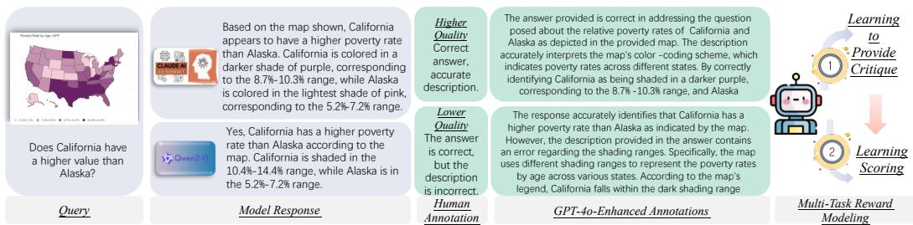
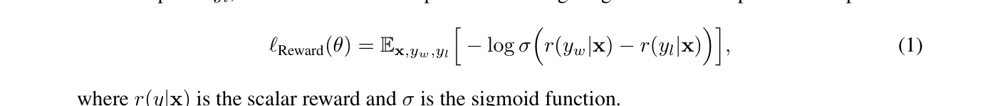
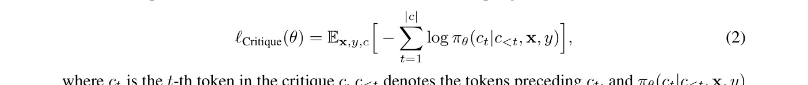
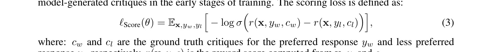

[← 返回 README](../README.md)

# 3 MM-RLHF-Reward Model

## 📌 预览
提出 Critique-Based Reward Model：先生成 critique 再打分，结合 GPT-4o 增强的标注作为训练目标。联合训练 critique 生成和评分两个任务，并构建 MM-RLHF-RewardBench 用于评估。

---

In this section, we explore how to train a high-quality reward model using the MM-RLHF dataset to provide a robust supervision signal for subsequent model alignment. The reward model is designed to combine critique generation and scoring (Figure 3), ensuring a comprehensive evaluation process.

*Figure 3: Illustration of the multi-task reward model training process. The process begins with a user query and corresponding model responses, which are ranked and annotated by humans. Human annotations are expanded using GPT-4o to provide enhanced rationales. The reward model is trained with two objectives: (1) Learning to Provide Critique, and (2) Learning Scoring.*

> 💡 **Figure 3 批读**:
> - 训练流程：Query + Response → 人工排名标注 → GPT-4o 扩展标注 → 双任务训练
> - Task 1（Critique Head $h_l$）：学习生成评价文本
> - Task 2（Scoring Head $h_r$）：基于 critique 学习打分
> - 关键：人工标注虽然准确但简短，用 GPT-4o 扩展成详细的 critique 作为训练目标

---

## 3.1 Background and Limitations of Standard Reward Models

> 💡 **3.1 要点预览**: 传统 reward model 的两个问题：不能充分利用丰富的人工标注，且标量输出不可解释。

Reward models are a key component for aligning model outputs with human preferences. Typically, a reward model starts with a pretrained LLM $\phi$, where the LLM head $h_l$ is replaced with a linear reward head $l_r$, enabling the model to output a scalar reward value. These models are trained using human-provided pairwise comparisons. Given a query $\mathbf{x}$, a preferred response $y_w$ and a less preferred response $y_l$, the reward model is optimized to assign higher rewards to preferred responses:

*Equation 1: Standard reward model loss*

where $r(y|\mathbf{x})$ is the scalar reward and $\sigma$ is the sigmoid function.

> 💡 **标准 RM 训练**: 经典的 Bradley-Terry 模型，通过 pairwise comparison 训练。输出标量 reward，期望 preferred response 获得更高分。

Despite their utility, standard reward models face significant limitations. First, they fail to fully utilize the rich and detailed feedback provided by high-quality human annotations, such as textual explanations and nuanced reasoning. Second, scalar rewards lack transparency, making it difficult for humans to understand how the reward is generated. These challenges highlight the need for a more interpretable and robust reward model that leverages critiques as intermediate reasoning steps.

> 💡 **两大局限**:
> 1. 浪费了人工标注中的文字解释信息——只用了排名
> 2. 标量输出不可解释——不知道为什么给这个分

---

## 3.2 Critique-Based Reward Model Training

> 💡 **3.2 要点预览**: 核心创新——双头架构：Critique Head 生成评价文本 + Scoring Head 基于 critique 打分。训练时用 GPT-4o 增强的标注作为 critique 目标，评分用 teacher-forcing。

**Extending to critique-based training.** To overcome the limitations of traditional reward models, we propose a critique-based training framework: the model first generates a critique $c$ conditioned on the query $\mathbf{x}$. This critique serves as an intermediate reasoning step, providing context for scoring responses. The critique-based reward model comprises two components:
1. **Critique Head ($h_l$)**: Generates critiques $c_w$ and $c_l$ for the preferred ($y_w$) and less preferred ($y_l$) responses, respectively, based on the query $\mathbf{x}$.
2. **Scoring Head ($h_r$)**: Assigns scalar rewards based on the generated critiques, enabling more fine-grained evaluation.

> 💡 **双头架构**:
> - Critique Head = 原始 LLM head，生成文本
> - Scoring Head = 线性 reward head，输出标量
> - 先 critique 再 score，类似 Chain-of-Thought 的思路——让模型"想清楚再打分"

**Learning to provide critique from enhanced annotation.** The critique head ($h_l$) is trained to align with human-provided annotations. The loss function for critique generation is:

*Equation 2: Critique generation loss*

where $c_t$ is the $t$-th token in the critique $c$, $c_{<t}$ denotes the tokens preceding $c_t$, and $\pi_{\theta}(c_t|c_{<t}, \mathbf{x}, y)$ is the probability of token $c_t$ given its context, query $\mathbf{x}$, and model response $y$.

> 💡 **Critique Loss**: 本质上就是标准的 next-token prediction loss，条件是 query $\mathbf{x}$ + response $y$，目标是生成 critique $c$。

However, as shown in Figure 3, while human-provided scoring reasons are highly accurate, they tend to be concise. Directly using these concise annotations as training targets for the reward model's language head does not yield significant performance improvements. To address this issue, we use GPT-4o to augment the human annotations by adding more detail and improving the fluency of the critiques. These enhanced scoring reasons are then used as the training targets for the language head. To prevent GPT-4o from introducing hallucinated content or irrelevant analysis, we impose strict constraints in the prompt (Table 7), to ensure the model only expands on the original content without introducing speculative or uncertain information.

> 💡 **标注增强是关键**:
> - 人工标注简短但准确 → 直接用效果不好
> - 用 GPT-4o 扩展为详细、流畅的 critique → 效果大幅提升
> - 严格约束 GPT-4o 只能扩展，不能添加推测性内容
> - 这是一种巧妙的"人机协作"：人类提供准确骨架，GPT-4o 填充细节

**Scoring loss with teacher-forcing.** $h_r$ computes scalar rewards based on the query $\mathbf{x}$, response $y$, and critique $c$. During training, we adopt a teacher-forcing strategy, where the scoring head uses ground truth critiques instead of critiques generated by itself. This avoids potential noise from model-generated critiques in the early stages of training. The scoring loss is defined as:

*Equation 3: Scoring loss with teacher-forcing*

where: $c_w$ and $c_l$ are the ground truth critiques for the preferred response $y_w$ and less preferred response $y_l$, respectively, $r(\mathbf{x}, y, c)$ is the reward score computed from $\mathbf{x}$, $y$, and $c$.

> 💡 **Teacher-forcing 策略**: 训练时用 ground truth critique（而非模型自己生成的）来计算 score loss，避免早期训练中 critique 质量差导致的噪声。推理时才用模型自己生成的 critique。

**Joint training objective.** The overall training objective combines the critique generation loss and the scoring loss: $\ell_{\mathrm{Total}}(\theta) = \ell_{\mathrm{Critique}}(\theta) + \ell_{\mathrm{Score}}(\theta)$.

> 💡 **联合训练**: 两个 loss 直接相加，权重相等。简单但有效。

**Inference.** During inference, the critique head ($h_l$) generates a critique $c$ conditioned on the query $\mathbf{x}$ and response $y$. The scoring head ($h_r$) then uses $\mathbf{x}$, $y$, and the generated critique $c$ to compute the final reward score $r(\mathbf{x}, y, c)$. This two-step process mirrors the human evaluation process by explicitly reasoning about critiques before scoring.

> 💡 **推理流程**: Query + Response → Critique Head 生成 critique → Scoring Head 基于(query, response, critique) 打分。类比人类：先分析优劣，再给分。

---

**MM-RLHF-RewardBench.** To evaluate the effectiveness of the signals provided by our reward model in guiding subsequent model training, we randomly sample 10 examples from each category of the MM-RLHF dataset to create a test set. Each example includes multiple model responses and their corresponding rankings, enabling the generation of several comparison pairs. This results in a total of 170 pairs for evaluation. We design two evaluation metrics:
1. **Traditional Accuracy (ACC)**: Measures the proportion of cases where the model correctly identifies the preferred response.
2. **ACC+**: Measures the proportion of cases where the model correctly ranks **all** response pairs for a given sample. This metric emphasizes the model's ability to handle challenging cases, such as those with small ranking differences or hard-to-distinguish pairs.

> 💡 **ACC vs ACC+**: ACC 只看单个对是否判对，ACC+ 要求一个样本的所有对比对都排对——这是更严格的评估。ACC+ 低说明模型在细粒度区分上还不够好。

---

## 3.3 Discussion

In the MLLM community, there is currently no unified paradigm for the design of reward models. Some approaches rely on traditional reward models [58], which lack interpretability due to their reliance on scalar outputs. Others directly use LLMs to generate rankings [67], which heavily depend on instruction-following capabilities and often exhibit high variance in scoring. In the broader LLM community, works such as [74] explore reward models that first generate critiques. However, their focus is primarily on improving the reliability of model-generated critiques, such as increasing scoring confidence through multiple sampling—a goal distinct from ours. To the best of our knowledge, this is the first study to explore how MLLMs can effectively leverage human annotations to enhance both interpretability and the final model's scoring ability.

> 💡 **与 LLM 领域 critique RM 的区别**: LLM 领域的 Self-Generated Critiques [74] 关注如何让模型生成可靠的 critique（如多次采样求平均），MM-RLHF 关注如何利用人工标注来训练更好的 critique 和评分能力。

---

## 🔖 Section 总结

### 关键数字速查
| 指标 | 数值 |
|------|------|
| RewardBench 测试对数 | 170 pairs |
| 评估指标 | ACC, ACC+ |
| 训练目标数 | 2 (Critique + Score) |

### 核心洞察
1. **Critique-as-CoT**: 先生成评价文本再打分，类似 Chain-of-Thought 提升推理能力
2. **标注增强是关键突破**: 人工简短标注 + GPT-4o 扩展 = 最佳训练目标
3. **Teacher-forcing 防止误差累积**: 训练时用 GT critique，推理时用模型生成的
4. 7B 模型通过 critique 训练可以超越 72B 传统 RM——说明方法比规模更重要
