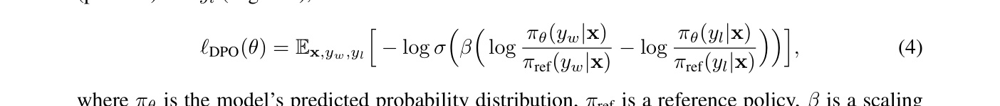
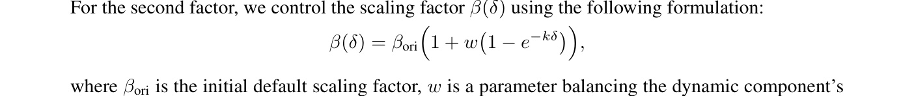

[← 返回 README](../README.md)

# 4 MM-DPO

## 📌 预览
提出 MM-DPO：在 DPO 基础上引入 Dynamic Reward Scaling，通过 reward margin 动态调整 $\beta$，让高质量对比对获得更大权重。关键创新：使用所有可能的对比对（而非只用最难的），并通过有界的指数函数控制缩放因子。

---

In this section, we propose MM-DPO, an extension of the traditional DPO framework. MM-DPO introduces Dynamic Reward Scaling, which dynamically adjusts the update strength based on the confidence of training pairs, ensuring effective utilization of high-quality samples while mitigating the impact of noisy or low-confidence data.

*Figure 4: Overview of the MM-DPO framework. The dynamic reward scaling mechanism adjusts the update strength based on the reward margin, improving optimization stability and robustness.*

> 💡 **Figure 4 批读**:
> - 核心流程：Query + Responses → Reward Model 计算 margin → 动态调整 $\beta$ → DPO 训练
> - margin 大的对比对（质量差异明显）获得更大 $\beta$，更新更强
> - margin 小的对比对（质量相近）$\beta$ 接近基础值，避免噪声

---

## 4.1 Background: Direct Preference Optimization

> 💡 **4.1 要点预览**: DPO 是 RLHF 的简化版——直接从偏好数据优化策略，不需要单独的 reward model 训练循环。但传统 DPO 对所有样本一视同仁。

The DPO framework is a preference-based learning method that optimizes model parameters $\theta$ by aligning model outputs with human preferences. Given a query $\mathbf{x}$ and corresponding responses $y_w$ (positive) and $y_l$ (negative), the DPO loss is defined as:

*Equation 4: Standard DPO loss*

where $\pi_\theta$ is the model's predicted probability distribution, $\pi_{\mathrm{ref}}$ is a reference policy, $\beta$ is a scaling factor, and $\sigma(\cdot)$ is the sigmoid function. Traditional DPO treats all training pairs equally, regardless of their quality differences. This uniform scaling fails to prioritize high-quality pairs with clear preference distinctions, leading to inefficient use of informative samples and suboptimal optimization.

> 💡 **DPO 核心思想**: 让 preferred response 的 log-prob 增加（相对 ref），让 rejected response 的降低。$\beta$ 控制偏离 ref 的惩罚强度。问题：所有样本共享同一个 $\beta$。

---

## 4.2 MM-DPO: Key Contributions and Improvements

> 💡 **4.2 要点预览**: 两大改进——(1) 用所有对比对而非只用最难的；(2) Dynamic Reward Scaling 动态调 $\beta$。

**Training on all possible comparison pairs instead of the hardest pairs.** Unlike many recent MLLM alignment approaches that prioritize training on the hardest comparison pairs, MM-DPO incorporates all possible comparison pairs for a single query into the training process. Specifically, for any query with multiple responses, every response pair with differing ranks is treated as a valid comparison pair. This comprehensive approach captures more nuanced ranking information, allowing the model to learn from a broader set of preferences. However, this strategy also introduces a challenge: pairs involving responses with similar ranks (e.g., rank 3 and rank 4) often have lower reward margins compared to pairs with more distinct rankings (e.g., rank 1 and rank 4). Treating all pairs equally, as in traditional DPO, exacerbates the issue of uniform scaling and underutilizes the high-confidence information contained in larger reward margins. To address this, MM-DPO introduces Dynamic Reward Scaling, which dynamically adjusts the update strength based on the reward margin to prioritize high-confidence training pairs.

> 💡 **所有对比对 vs. 最难对比对**:
> - 假设一个 query 有 4 个响应排名 1,2,3,4
> - "最难对"方法只用 (1,2) 这种相邻排名的对
> - MM-DPO 用所有 $\binom{4}{2}=6$ 个对比对
> - 优势：信息利用更充分；挑战：质量参差不齐
> - 解决：Dynamic Reward Scaling

**Definition of dynamic reward scaling.** Reward models can naturally provide a pairwise reward margin, which serves as a straightforward signal for scaling. However, two critical aspects must be addressed: (1) ensuring the signal quality is sufficiently high, and (2) bounding the signal to prevent overly aggressive updates that might destabilize training.

Regarding the first aspect, our experiments reveal that publicly available models, such as GPT-4o and LLaVA-Critic, perform inadequately in scoring our dataset. Conversely, our MM-RLHF-Reward-7B model surpasses several publicly available 72B models, offering a reliable and robust reward signal. We use this model to compute the reward margin: $\delta = r(y_w) - r(y_l)$, where $r(y_w)$ and $r(y_l)$ are the scores assigned to the positive and negative samples.

*Figure 5: Effect of $k$ on $1 - e^{-k\delta}$.*

> 💡 **Figure 5 批读**:
> - $k$ 控制缩放函数的敏感度
> - $k=0.1$: 几乎是线性的，对 margin 变化不敏感
> - $k=5$: 快速饱和，margin 稍大就接近最大值
> - $k=0.5$（默认）: 温和的非线性，是个好平衡

For the second factor, we control the scaling factor $\beta(\delta)$ using the following formulation:

*Equation 5: Dynamic reward scaling*

where $\beta_{\mathrm{ori}}$ is the initial default scaling factor, $w$ is a parameter balancing the dynamic component's contribution, and $k$ is a tunable hyperparameter that adjusts $\beta(\delta)$'s sensitivity to changes in $\delta$. The function $1 - e^{-k\delta}$ is bounded between $[0, 1]$, as illustrated in Figure 5. A smaller $k$ value keeps most $\beta(\delta)$ values near $\beta_{\mathrm{ori}}$, with slow growth as $\delta$ increases. In contrast, a larger $k$ makes $\beta(\delta)$ highly responsive to changes in $\delta$, quickly reaching its maximum. To avoid overly aggressive updates, we constrain $\beta(\delta)$ within $[\beta_{\mathrm{ori}}, (1+w)\beta_{\mathrm{ori}}]$.

> 💡 **Dynamic Reward Scaling 公式解读**:
> - $\beta(\delta) = \beta_{\text{ori}} \cdot (1 + w \cdot (1 - e^{-k\delta}))$
> - 当 $\delta = 0$（margin 为 0）: $\beta = \beta_{\text{ori}}$（最小值）
> - 当 $\delta \to \infty$: $\beta = (1+w) \cdot \beta_{\text{ori}}$（最大值）
> - $w$ 控制动态范围: $w=0.5$ 意味着 $\beta$ 最多增加 50%
> - $k$ 控制敏感度: 多大的 margin 开始产生显著影响
> - 默认 $w=0.5$, $k=0.5$, $\beta_{\text{ori}}=0.1$

Overall, Dynamic Reward Scaling significantly enhances MM-DPO by leveraging high-quality reward signals and tailoring optimization steps to the confidence level of training pairs. This results in improved robustness, efficiency, and overall effectiveness of the framework. We discuss the similarities and differing perspectives between our approach and existing methods in Appendix E.

> 💡 **与 LLM 领域动态 $\beta$ 方法的区别** (Appendix E):
> - LLM 领域用 implicit reward（模型自身的 log-prob 差异）来调 $\beta$
> - MM-RLHF 发现 implicit reward 在 MLLM 上不 work（Figure 12a）
> - 因此使用外部高质量 reward model 提供的显式信号
> - 这是 MLLM 领域首次探索动态 $\beta$ 调整

---

## 🔖 Section 总结

### 关键数字速查
| 参数 | 默认值 |
|------|--------|
| $\beta_{\text{ori}}$ | 0.1 |
| $w$ | 0.5 |
| $k$ | 0.5 |
| $\beta$ 范围 | $[0.1, 0.15]$ |

### 核心洞察
1. **用所有对比对训练**比只用最难的对更好——信息利用更充分
2. **Dynamic Reward Scaling** 的关键是有界的指数函数 $1-e^{-k\delta}$，保证稳定性
3. MLLM 的 implicit reward 信号质量差，需要外部高质量 RM 提供显式信号
4. 方法简洁优雅：只多了两个超参数 $w$ 和 $k$，且对超参数选择有一定鲁棒性
