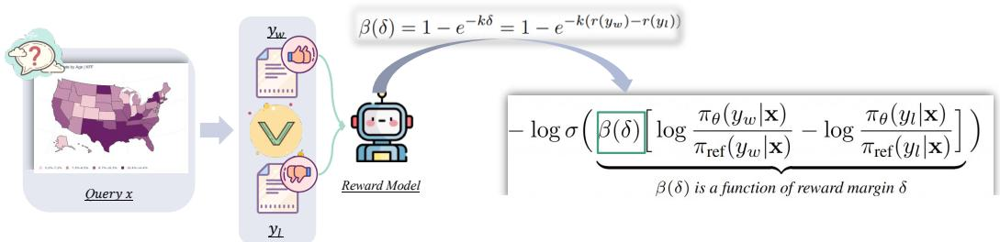
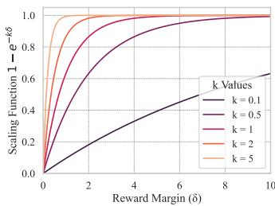

# 4. MM-DPO

> 来源: MM-RLHF (ICML 2025)

---

## 📄 原文

In this section, we propose MM-DPO, an extension of the traditional DPO framework. MM-DPO introduces Dynamic Reward Scaling, which dynamically adjusts the update strength based on the confidence of training pairs, ensuring effective utilization of high-quality samples while mitigating the impact of noisy or low-confidence data.

> 💡 **Section 概览**: MM-DPO = 标准 DPO + Dynamic Reward Scaling。核心思想：不同 preference pair 的质量不同，高 reward margin 的 pair 应该有更大的训练权重。


*Figure 4: MM-DPO 框架概览。Dynamic reward scaling 机制根据 reward margin 调整更新强度，提高优化稳定性和鲁棒性。*

> 💡 **Figure 4 批读**:
> ```
> MM-DPO 流程:
> ├── 输入: query + preferred response + non-preferred response
> ├── MM-RLHF-Reward-7B 计算:
> │   ├── r(y_w): preferred 的 reward score
> │   ├── r(y_l): non-preferred 的 reward score
> │   └── δ = r(y_w) - r(y_l): reward margin
> ├── Dynamic Scaling:
> │   └── β(δ) = β_ori × (1 + w × (1 - e^(-kδ)))
> └── DPO Loss with scaled β(δ)
> ```

---

### 4.1 Background: Direct Preference Optimization

The DPO framework is a preference-based learning method that optimizes model parameters θ by aligning model outputs with human preferences. Given a query **x** and corresponding responses $y_w$ (positive) and $y_l$ (negative), the DPO loss is defined as:

$$\ell_{\mathrm{DPO}}(\theta) = \mathbb{E}_{\mathbf{x}, y_w, y_l} \Big[ -\log \sigma \Big( \beta \Big( \log \frac{\pi_\theta(y_w | \mathbf{x})}{\pi_{\mathrm{ref}}(y_w | \mathbf{x})} - \log \frac{\pi_\theta(y_l | \mathbf{x})}{\pi_{\mathrm{ref}}(y_l | \mathbf{x})} \Big) \Big) \Big]$$

where $\pi_\theta$ is the model's predicted probability distribution, $\pi_{\mathrm{ref}}$ is a reference policy, β is a scaling factor, and σ(·) is the sigmoid function. Traditional DPO treats all training pairs equally, regardless of their quality differences. This uniform scaling fails to prioritize high-quality pairs with clear preference distinctions, leading to inefficient use of informative samples and suboptimal optimization.

> 💡 **标准 DPO 的问题**: 所有 pair 权重一样。但实际上：
> - Rank 1 vs Rank 4 的 pair 信息量很大（明显差异）
> - Rank 3 vs Rank 4 的 pair 信息量小（差异微弱）
> - 都用同样的 β，浪费了高信息量样本的价值

---

### 4.2 MM-DPO: Key Contributions and Improvements

**Training on all possible comparison pairs instead of the hardest pairs.** Unlike many recent MLLM alignment approaches that prioritize training on the hardest comparison pairs, MM-DPO incorporates **all possible comparison pairs** for a single query into the training process. Specifically, for any query with multiple responses, every response pair with differing ranks is treated as a valid comparison pair. This comprehensive approach captures more nuanced ranking information, allowing the model to learn from a broader set of preferences.

> 💡 **用所有 pair 而非最难的 pair**: 
> - 假设一个 query 有 4 个 response (rank 1-4)
> - 最难 pair: 只用 (rank 1, rank 2)
> - 本文: 用所有 C(4,2)=6 个 pair: (1,2), (1,3), (1,4), (2,3), (2,4), (3,4)
> - 这就是为什么 30K queries 能产生 120K+ pairs

However, this strategy also introduces a challenge: pairs involving responses with similar ranks (e.g., rank 3 and rank 4) often have lower reward margins compared to pairs with more distinct rankings (e.g., rank 1 and rank 4). Treating all pairs equally, as in traditional DPO, exacerbates the issue of uniform scaling and underutilizes the high-confidence information contained in larger reward margins. To address this, MM-DPO introduces Dynamic Reward Scaling, which dynamically adjusts the update strength based on the reward margin to prioritize high-confidence training pairs.

**Definition of dynamic reward scaling.** Reward models can naturally provide a pairwise reward margin, which serves as a straightforward signal for scaling. However, two critical aspects must be addressed: (1) ensuring the signal quality is sufficiently high, and (2) bounding the signal to prevent overly aggressive updates that might destabilize training.

Regarding the first aspect, our experiments reveal that publicly available models, such as GPT-4o and LLaVA-Critic, perform inadequately in scoring our dataset. Conversely, our MM-RLHF-Reward-7B model surpasses several publicly available 72B models, offering a reliable and robust reward signal. We use this model to compute the reward margin: $\delta = r(y_w) - r(y_l)$, where $r(y_w)$ and $r(y_l)$ are the scores assigned to the positive and negative samples.

For the second factor, we control the scaling factor β(δ) using the following formulation:

$$\beta(\delta) = \beta_{\mathrm{ori}} \Big( 1 + w \big( 1 - e^{-k\delta} \big) \Big)$$

where $\beta_{\mathrm{ori}}$ is the initial default scaling factor, $w$ is a parameter balancing the dynamic component's contribution, and $k$ is a tunable hyperparameter that adjusts β(δ)'s sensitivity to changes in δ.


*Figure 5: k 对 1 - e^(-kδ) 的影响。*

> 💡 **Figure 5 批读**: 
> - k 小 (e.g., 0.5): 缓慢增长，大多数 β(δ) 接近 β_ori
> - k 大 (e.g., 5.0): 快速饱和，小 δ 就能达到最大权重
> - 默认 k=0.5, w=0.5 效果最好

The function $1 - e^{-k\delta}$ is bounded between [0, 1]. A smaller $k$ value keeps most β(δ) values near $\beta_{\mathrm{ori}}$, with slow growth as δ increases. In contrast, a larger $k$ makes β(δ) highly responsive to changes in δ, quickly reaching its maximum. To avoid overly aggressive updates, we constrain β(δ) within $[\beta_{\mathrm{ori}}, (1+w)\beta_{\mathrm{ori}}]$.

> 💡 **Dynamic Reward Scaling 公式详解**:
> ```
> β(δ) = β_ori × (1 + w × (1 - e^(-kδ)))
> 
> 其中:
> - β_ori = 0.1 (初始值，设得很小)
> - w = 0.5 (控制动态范围: β 最大为 1.5 × β_ori)
> - k = 0.5 (控制灵敏度)
> - δ = r(y_w) - r(y_l) (reward margin，由 MM-RLHF-Reward-7B 计算)
> 
> 效果:
> - δ 大 (pair 差异明显) → β 大 → 更新幅度大
> - δ 小 (pair 差异微弱) → β ≈ β_ori → 更新幅度小
> - β 有上界 (1+w)β_ori，防止过激更新
> ```
> 
> **与 LLM 领域的 β-DPO [65] 区别**:
> - β-DPO 用 implicit reward (模型自身信号) 调整 β → 在 MLLM 上不 work
> - MM-DPO 用 **external high-quality RM** 的 reward margin → 有效
> - 原因: MLLM 自身的信号判别力太弱，无法指导 β 选择

Overall, Dynamic Reward Scaling significantly enhances MM-DPO by leveraging high-quality reward signals and tailoring optimization steps to the confidence level of training pairs. This results in improved robustness, efficiency, and overall effectiveness of the framework.

---

## 💡 Section 总结

### 关键数字速查
| 超参数 | 默认值 | 含义 |
|--------|--------|------|
| β_ori | 0.1 | 初始 β（设很小） |
| w | 0.5 | 动态范围控制 |
| k | 0.5 | 灵敏度控制 |
| SFT loss weight | grid search {0, 0.1, 0.25, 0.5, 1.0} | 稳定训练 |
| Learning rate | grid search {1e-7, 5e-7, 1e-6, 5e-6, 1e-5} | — |

### 核心洞察
1. **用所有 pair + 加权 > 只用最难 pair**: 信息更丰富，但需要 dynamic scaling 处理 noise
2. **External RM 信号 > Implicit reward**: MLLM 领域的重要发现——不能直接照搬 LLM 的 β-DPO
3. **bounded scaling 很重要**: 无上界的 β 会导致训练不稳定
4. **β_ori 设很小 (0.1)**: 因为 dynamic scaling 会增大，所以初始值不需要手调

### 对 Apple Assignment 的价值
- Dynamic Reward Scaling 是一个简单但有效的技术，公式清晰，易于实现
- 核心 insight: reward margin 作为 sample importance weight，比统一权重更合理
- 与 curriculum learning / importance sampling 有联系，可以在 assignment 中扩展讨论
