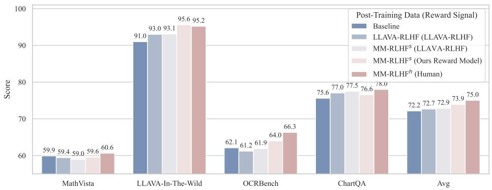

# 5. Experiments

> 来源: MM-RLHF (ICML 2025)

---

## 📄 原文

We evaluate our data and algorithms on 10 tasks across 20+ benchmarks. The key findings are:

1. Alignment training on the MM-RLHF dataset consistently improves performance across nearly all benchmarks for various baselines. The integration of reward signals in MM-DPO further amplifies these improvements, demonstrating the effectiveness of our approach.
2. The MM-RLHF-Reward-7B model achieves state-of-the-art performance on reward model benchmarks among open-source models, surpassing even several 72B models. This highlights the efficiency and scalability of our method.
3. We conduct extensive ablation studies and analyses, such as investigating the importance of critique learning for reward models and the sensitivity to hyperparameters. Additionally, we identify several experimental phenomena that challenge mainstream perspectives, such as the observation that small-scale MLLMs struggle to perform effective self-improvement.

> 💡 **实验三大发现**:
> 1. MM-RLHF 数据 + MM-DPO → **几乎所有 benchmark 都提升**
> 2. MM-RLHF-Reward-7B → **SOTA among open-source, 超过 72B 模型**
> 3. **小模型自我改进目前不现实**（与 LLM 领域的乐观看法相反）

---

### 5.1 Benchmarks and Experimental Details

We categorize the benchmark datasets used in our experiments into the following domains:

| 维度 | Benchmarks |
|------|-----------|
| Chart & Document | AI2D, ChartQA, DocVQA, InfoVQA |
| OCR | WebSRC, OCRBench, TextVQA |
| Hallucination | MMHal-Bench, POPE, Object-Hal |
| Math Reasoning | MathVista, MathVerse |
| General Knowledge | MME, MMBench, MMStar, SeedBench2-Plus, VQAv2 |
| Conversation | LLaVA-Wilder, LLaVA-In-The-Wild, WildVision-Bench |
| High-Resolution | RealworldQA, MME-RealWorld |
| Video Understanding | VideoChatGPT, Video-MME, VideoDC |
| Multi-Image | LLaVA-Next-Interleave, MMMU-Pro |
| MLLM Safety | MM-RLHF-SafeBench (self-constructed) |

> 💡 **评估覆盖面**: 10 个维度，27 个 benchmark，非常全面。特别注意 **Video Understanding** 有 3 个 benchmark（VideoChatGPT, Video-MME, VideoDC），可以看出对 video 的重视。

**实验设置关键参数:**
- GPU: 32×H800 (80G)
- 消融实验: 1/5 数据
- SFT loss weight: grid search {0, 0.1, 0.25, 0.5, 1.0}
- Learning rate: grid search {1e-7, 5e-7, 1e-6, 5e-6, 1e-5}
- β_ori = 0.1
- Vision encoder: frozen

---

### 5.2 Evaluation of MM-RLHF and MM-DPO

> 💡 **5.2 要点预览**: 三个基线模型（LLaVA-OV-7B, LLaVA-OV-0.5B, InternVL-1B）在 alignment 后的表现。


**Table 2** (understanding tasks) 和 **Table 3** (safety tasks) 展示了三个模型在 alignment 后的表现变化。

**Significant improvements in conversational ability and safety.**
- Conversation benchmarks: **平均 >10% 提升**
- Unsafe behaviors: **至少 50% 减少**
- WildVision win rate: **至少 50% 提升**

> 💡 **对话和安全提升最显著**: 说明现有 MLLM 在这两个维度上缺少优化，MM-RLHF 填补了这个空缺。LLaVA-OV-7B 在 WildVision win rate 上从 15.2% → 37.2%（+22%），效果惊人。

**Broad enhancements in hallucination, mathematical reasoning, multi-image, and video understanding.**
- 幻觉、数学推理、多图、视频理解都有提升
- **值得注意**: 训练数据中没有专门的多图数据，但多图性能仍然提升 → alignment 数据提升了泛化能力

> 💡 **Video Understanding 具体提升（Apple Assignment 相关）**:
> | Benchmark | LLaVA-OV-7B | Ours | Δ |
> |-----------|------------|------|---|
> | Video-MME (w. caption) | 61.61% | 61.81% | +0.20% |
> | Video-MME (wo. caption) | 58.29% | 58.33% | +0.04% |
> | VideoChatGPT | 2.87 | 3.22 | **+0.35** |
> | VideoDC | 3.32 | 3.41 | +0.09 |
>
> Video 的提升相对温和，Video-MME 几乎持平。VideoChatGPT 提升较明显（conversation-style evaluation）。这可能是因为 video 在训练数据中只占 4,235/29,997 ≈ 14%。

**Model-specific preferences for data and hyperparameters.** Different models exhibit varying performance trends during alignment, with distinct preferences for hyperparameter settings across different benchmarks. For instance, InternVL-1B found that excluding the SFT loss led to better results.

> 💡 **重要发现**: 不同模型需要不同的超参数。InternVL-1B 不要 SFT loss 更好，LLaVA 系列需要。这说明 alignment 不是 one-size-fits-all。

**Limited gains in high-resolution benchmarks.** The model shows no significant improvement on high-resolution benchmarks, likely because our dataset contains relatively few ultra-high-resolution images.

---

### 5.3 Evaluation of MM-RLHF-Reward


**Table 4: MM-RLHF-RewardBench 结果**

> 💡 **Table 4 批读（关键结果）**:
> ```
> ACC / ACC+ 排行:
> ├── LLaVA-OV-7B:     0.24 / 0.07 (几乎随机)
> ├── LLaVA-Critic:     0.45 / 0.17 (有限改进)
> ├── GPT-4o:           0.74 / 0.50 (强基线)
> ├── w/o Task 1:       0.75 / 0.50 (没有 critique learning)
> ├── w/o enhanced ann: 0.79 / 0.57 (用原始人工标注)
> ├── MM-RLHF-Reward:   0.85 / 0.67 ⭐ (完整版)
> └── w. GT annotation:  0.93 / 0.87 (上界)
> ```
>
> **关键对比**:
> - **无 critique (w/o Task 1)**: ACC+ = 50% → 加 critique 后 67% (+17%)
> - **无 enhanced annotation**: ACC+ = 57% → 加 GPT-4o expansion 后 67% (+10%)
> - **GT annotation**: ACC+ = 87% → 说明 critique 质量是瓶颈，还有提升空间
> - **7B > GPT-4o**: 0.85 vs 0.74 in ACC，说明专门训练的小模型 > 通用大模型

**Table 5: VLRewardBench 结果**

> 💡 **Table 5 批读**: MM-RLHF-Reward-7B (Avg 50.15) 超过所有开源模型（包括 72B 级别），接近 Claude-3.5-Sonnet (53.57)，但仍落后 GPT-4o (62.40) 和 Gemini-1.5-Pro (62.50)。

**The importance of an effective critic in reward modeling.** When the reward head is directly trained using pair-wise datasets, the ACC+ stabilizes around 50%. By incorporating human annotations as the learning target, the ACC+ improves by a consistent 5%. By expanding the human annotations using GPT-4o, producing enriched annotations, this results in a significant **17% improvement in ACC+** compared to the baseline. When human annotations are directly provided as the critic during evaluation, both ACC and ACC+ reach approximately **90%**.

> 💡 **Critique 质量阶梯**:
> ```
> 无 critique           → ACC+ ≈ 50%
> + 原始人工理由         → ACC+ ≈ 55% (+5%)
> + GPT-4o 扩展理由      → ACC+ ≈ 67% (+17%)
> + GT annotation (上界) → ACC+ ≈ 87% (+37%)
> ```
> 这个阶梯清晰说明了 critique 质量对 RM 性能的影响。

**Multiple sampling of critiques does not yield significant performance gains.** In LLM research, multiple sampling + averaging is effective. But here, lowering temperature and computing rewards multiple times actually **declined** performance. Reason: the model already generates accurate critiques (aligned with human annotations), and extra sampling occasionally introduces inaccurate critiques that hurt the average.

---

### 5.4 Self-Improvement of Small-Scale MLLMs is Currently Unrealistic

> 💡 **5.4 要点预览**: 这一节挑战了"MLLM 可以自我改进"的乐观看法，提出小模型 (<7B) 目前做不到。


*Figure 6: 不同方法在 LLaVA-OV-7B 上的性能对比。Baseline vs LLaVA-RLHF vs MM-RLHF (self-sampled + 不同 RM) vs MM-RLHF (Human)。*

> 💡 **Figure 6 批读**:
> ```
> 性能从低到高:
> ├── Baseline (无 post-training)
> ├── LLaVA-RLHF (用 LLaVA-RLHF 数据+RM)
> ├── MM-RLHF_s (self-sampled, 不同 RM)
> │   ├── GPT-4o as RM → 有限提升
> │   ├── LLaVA-Critic as RM → 有限提升
> │   └── MM-RLHF-Reward as RM → 略好
> └── MM-RLHF_h (Human) → 显著最好 ⭐
> ```
> **核心结论**: 人工标注 >> self-improvement。即使用最好的 RM，self-sampled 的结果仍远不如人工数据。

Two primary reasons:
1. **Model capacity constraints**: For challenging tasks (MCQ, scientific reasoning), smaller models even after 8 samples still produce wrong answers consistently.
2. **Limitations in reward signal quality**: Existing multimodal RM trained on limited data (natural images, dialogue) cannot generalize to math, charts, etc.

> 💡 **对 Apple Assignment 的意义**: 
> - 这个发现说明**高质量人工标注数据仍然不可替代**
> - Self-improvement 在 LLM 领域 works，但在 MLLM 领域目前 doesn't → 说明 MLLM alignment 更难
> - 未来方向: Human-in-the-loop + RM 协作 → 兼顾质量和效率

---

## 💡 Section 总结

### 关键数字速查
| 指标 | 数值 |
|------|------|
| 评估维度 | 10 dimensions, 27 benchmarks |
| Conversation 提升 | >10% avg, WildVision +22% (7B) |
| Safety 提升 | Unsafe ↓50%+, Safety ↑9.6% (7B) |
| RM ACC (7B) | 0.85 (ACC), 0.67 (ACC+) |
| RM vs GPT-4o | 0.85 vs 0.74 (ACC) |
| Critique impact | +17% ACC+ (vs no critique) |
| GPU | 32×H800 |

### 核心洞察
1. **Alignment 全面有效**: 对话、安全、幻觉、数学、视频都有提升
2. **Conversation 和 Safety 提升最大**: 说明这两个维度是现有 MLLM 的明显短板
3. **Video 提升温和**: 可能受限于训练数据中 video 比例 (~14%)
4. **小模型自我改进不现实**: MLLM ≠ LLM，multimodal 数据复杂度更高
5. **高分辨率没有提升**: 数据分布决定了 alignment 的能力边界
