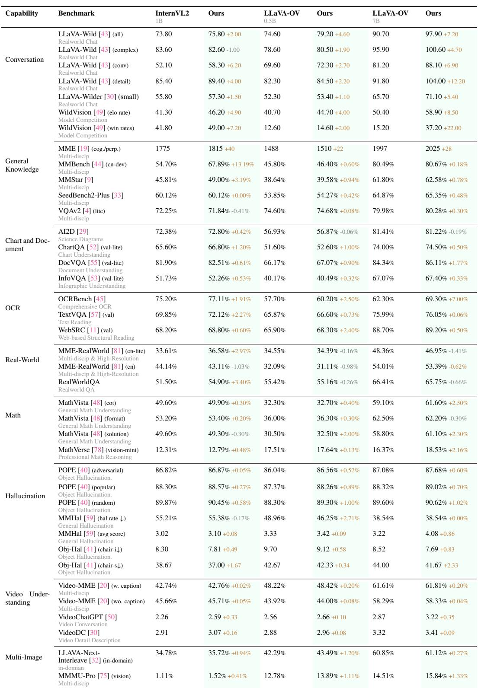
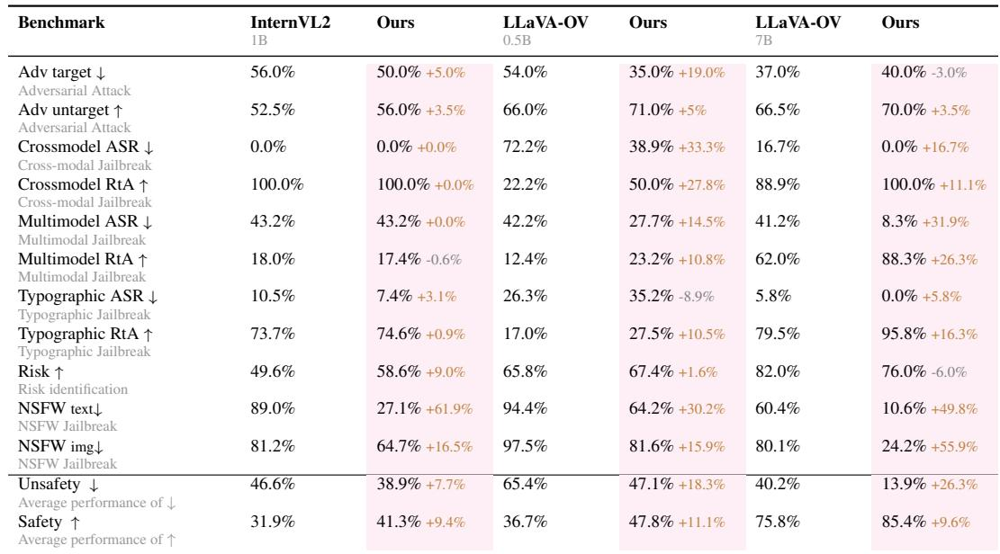
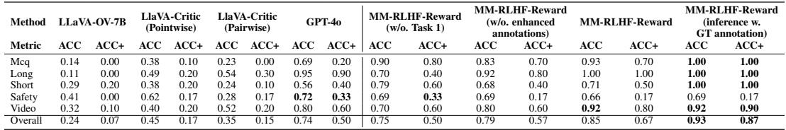
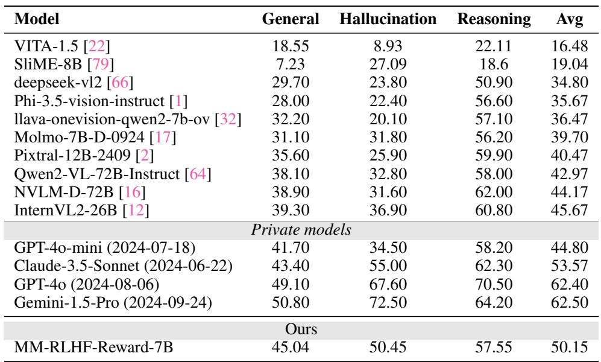

[← 返回 README](../README.md)

# 5 Experiments

## 📌 预览
大规模实验验证：10 维度 27 benchmarks 上的全面评估。主要发现：对话能力 +10%+，安全性 +50%+，幻觉/数学/视频/多图也有提升；Reward Model 7B 超越 72B 开源模型；小规模 MLLM 自我改进不现实。

---

We evaluate our data and algorithms on 10 tasks across 20+ benchmarks. The key findings are:

1. Alignment training on the MM-RLHF dataset consistently improves performance across nearly all benchmarks for various baselines. The integration of reward signals in MM-DPO further amplifies these improvements, demonstrating the effectiveness of our approach.

2. The MM-RLHF-Reward-7B model achieves state-of-the-art performance on reward model benchmarks among open-source models, surpassing even several 72B models. This highlights the efficiency and scalability of our method.

3. We conduct extensive ablation studies and analyses, such as investigating the importance of critique learning for reward models and the sensitivity to hyperparameters. Additionally, we identify several experimental phenomena that challenge mainstream perspectives, such as the observation that small-scale MLLMs struggle to perform effective self-improvement.

> 💡 **三大发现概览**:
> 1. MM-RLHF 数据 + MM-DPO → 几乎所有 benchmark 一致提升
> 2. 7B Reward Model SOTA（开源），超越 72B
> 3. 小模型自我改进目前不可行——这是对主流观点的挑战

---

## 5.1 Benchmarks and Experimental Details

We categorize the benchmark datasets used in our experiments into the following domains:

| 维度 | Benchmarks |
|------|-----------|
| Chart & Document | AI2D, ChartQA, DocVQA, InfoVQA |
| OCR | WebSRC, OCRBench, TextVQA |
| Hallucination | MMHal-Bench, POPE, Object-Hal |
| Math Reasoning | MathVista, MathVerse |
| General Knowledge | MME, MMBench, MMStar, SeedBench2-Plus, VQAv2 |
| Conversation | LLaVA-Wilder, LLaVA-In-The-Wild, WildVision-Bench |
| High-Resolution & Real-World | RealworldQA, MME-RealWorld |
| Video Understanding | VideoChatGPT, Video-MME, VideoDC |
| Multi-Image | LLAVA-Next-Interleave, MMMU-Pro |
| MLLM Safety | MM-RLHF-SafeBench |

> 💡 **评估规模**: 10 个维度、27 个 benchmarks——这是 MLLM 对齐领域最全面的评估之一。

For all benchmarks requiring GPT-assisted evaluation, we consistently employ GPT-4o as the evaluation model. All model results are rigorously re-evaluated and reported by our team. All experiments are conducted on a high-performance computing cluster equipped with 32× H800 (80G) GPUs. Due to computational cost constraints, we utilize the full dataset for the main results presented in Tables 2, 3, and 5. For ablation studies, we uniformly sample 1/5 of the data, which may result in minor performance discrepancies compared to the full dataset.

In the implementation of MM-DPO, we adopt a common stabilization technique by incorporating an SFT loss. The weight of the SFT loss is selected through a grid search over the values {0, 0.1, 0.25, 0.5, 1.0}. Additionally, the learning rate is optimized via a search over {1e-7, 5e-7, 1e-6, 5e-6, 1e-5} to identify the best-performing configuration. Since we dynamically adjust the $\beta$ parameter during training, the initial value of $\beta_{\mathrm{ori}}$ is set to a small default value of 0.1, eliminating the need for manual tuning. Throughout all training processes, the vision encoder remains frozen to ensure stable and efficient training.

> 💡 **训练细节**:
> - 32× H800 GPU，算力充足
> - SFT loss 稳定训练，权重从 {0, 0.1, 0.25, 0.5, 1.0} 搜索
> - $\beta_{\text{ori}} = 0.1$（因为有动态调整所以可以用小值）
> - Vision encoder 冻结——不破坏视觉特征提取

---

## 5.2 Evaluation of MM-RLHF and MM-DPO

*Table 2: Performance variations after alignment across 8 different evaluation dimensions, comparing multiple models under our alignment strategy.*

> 💡 **Table 2 批读（理解任务）**:
> - **对话能力**: LLaVA-OV-7B 在 WildVision win rate 上从 15.2% 提升到 37.2%（+22%!）
> - **通用知识**: 小模型 InternVL-1B 在 MMBench 上提升 13.19%，大模型提升较小
> - **OCR**: OCRBench 上 LLaVA-OV-7B 提升 7.0%，非常显著
> - **幻觉**: 各指标稳定提升，MMHal 分数从 3.22 → 4.08
> - **高分辨率**: 基本持平甚至略降——数据中缺少超高分辨率图像

*Table 3: Performance variations after alignment across MM-RLHF-SafeBench.*

> 💡 **Table 3 批读（安全任务）**:
> - **NSFW 防护**: LLaVA-OV-7B 的 NSFW text 从 60.4% → 10.6%（降低 49.8%!），NSFW img 从 80.1% → 24.2%
> - **Jailbreak 防护**: Multimodal ASR 从 41.2% → 8.3%，RtA 从 62.0% → 88.3%
> - **总体安全**: Unsafety 平均从 40.2% → 13.9%（-26.3%），Safety 从 75.8% → 85.4%
> - 安全提升非常显著，说明现有模型在安全方面严重欠优化

**Significant improvements in conversational ability and safety.** Our experiments show that the alignment process leads to substantial improvements in these two aspects without requiring hyperparameter tuning. The average improvement in conversational benchmarks exceeds 10%, while unsafe behaviors are reduced by at least 50%. Additionally, in WildVision, the win rate increases by at least 50%.

> 💡 **对话 + 安全是最大受益者**: 说明现有 MLLM 在这两方面最缺乏显式优化。

**Broad enhancements in hallucination, mathematical reasoning, multi-image, and video understanding.** The aligned models also exhibit notable improvements in these areas. Interestingly, despite the lack of dedicated multi-image data in our dataset, the model's performance in multi-image tasks improves significantly. This indicates that the diversity of our alignment data enhances generalization across multiple dimensions.

> 💡 **泛化能力**: 没有专门的多图数据，多图任务也提升了——说明对齐的泛化效果。

**Model-specific preferences for data and hyperparameter.** Different models exhibit varying performance trends during alignment, with distinct preferences for hyperparameter settings across different benchmarks. For instance, in our training of InternVL-1B, we found that excluding the SFT loss led to better results.

**Limited gains in high-resolution benchmarks.** The model shows no significant improvement on high-resolution benchmarks, likely because our dataset contains relatively few ultra-high-resolution images.

> 💡 **局限性**: 高分辨率任务无提升——数据中缺少高分辨率图像，且采样策略基于图像相似性而非分辨率。

---

## 5.3 Evaluation of MM-RLHF-Reward

*Table 4: Performance comparison across metrics and methods on MM-RLHF-RewardBench.*

> 💡 **Table 4 批读（RewardBench 消融）**:
> - **Baseline (w/o Task 1)**: ACC+ 50%——只训练评分，不训练 critique
> - **+ 人工标注 critique**: ACC+ 57%（+7%）
> - **+ GPT-4o 增强标注**: ACC+ 67%（+17% vs baseline）——增强标注是关键！
> - **推理时用 GT 标注**: ACC+ 87%——说明 critique 质量是瓶颈
> - 结论：critique 质量越高，评分越准确

*Table 5: Performance comparison of our reward model with existing open-source and private multi-modal models.*

> 💡 **Table 5 批读（Reward Model 对比）**:
> - MM-RLHF-Reward-7B 平均 50.15，超越所有 72B 开源模型
> - GPT-4o: 62.40, Gemini-1.5-Pro: 62.50——闭源模型仍然领先
> - 但 7B 已经非常有竞争力，特别是 General 维度 45.04 接近 GPT-4o 的 49.10

**Existing reward models exhibit significant overfitting.** As shown in Table 4, LLaVA-Critic's performance on MM-RLHF-Reward-Bench is suboptimal, with a considerable gap compared to GPT-4o. This can likely be attributed to the overfitting of existing reward models to their training data.

**Closed-source models like GPT-4o consistently deliver competitive performance.** Across both Table 4 and Table 5, closed-source models such as GPT-4o demonstrate superior generalization capabilities.

**The importance of an effective critic in reward modeling.** When human annotations are directly provided as the critic (i.e., scoring based on human-provided evaluations rather than model-generated critics), both ACC and ACC+ reach approximately 90%. This demonstrates the pivotal role of evaluation quality in the overall effectiveness of reward models.

**Multiple sampling of critiques does not yield significant performance gains.** When we lowered the sampling temperature and computed rewards multiple times, the performance actually declined. Since our model already generates accurate critiques due to its alignment with human annotations, extra sampling introduces occasional inaccurate critiques that hurt performance.

> 💡 **多次采样反而有害**: 因为模型已经能生成足够准确的 critique，偶尔一次不准确的采样会拉低平均分。这与 LLM 领域的经验不同。

---

## 5.4 Self-Improvement of Small-Scale MLLMs is Currently Unrealistic

> 💡 **5.4 要点预览**: 这是一个重要的 negative result——小模型自我改进在 MLLM 领域目前不可行，与 LLM 领域不同。

While recent work on MLLMs explores the concept of self-improvement, these efforts largely focus on specific domains, such as conversational systems [67]. In this section, we present an alternative perspective distinct from the LLM domain, arguing that MLLMs, particularly small models (fewer than 7B parameters), currently face significant challenges in achieving comprehensive performance improvements through self-improvement.

*Figure 6: Performance comparison across datasets using various methods based on the LLaVA-OV-7B model. "MM-RLHF s" reflects self-sampled responses ranked using different reward signals. "MM-RLHF h (Human)" uses human-annotated DPO pairs.*

> 💡 **Figure 6 批读**:
> - 蓝色 (Human) 全面优于绿色/橙色 (Self-sampled + RM)
> - 自采样 + 自家 RM 排名 只有微弱提升
> - 自采样 + LLaVA-RLHF RM 有时甚至降低性能
> - 结论：自我改进 << 人工标注的对比数据

Our experimental results suggest two primary reasons for this limitation:

1. **Model capacity constraints.** For tasks involving long-form or conversational data, sampling multiple responses often results in at least one reasonably good answer. However, for more challenging tasks, such as multiple-choice questions or scientific reasoning, smaller models struggle to generate correct answers even after extensive sampling. In our experiments, where the maximum number of samples reached eight, we observed instances where the model produced identical incorrect responses across all samples.

2. **Limitations in reward signal quality.** Most existing multimodal reward models are trained on datasets with limited diversity. When preference datasets encompass broader domains, reward models trained on existing datasets fail to provide effective reward signals.

> 💡 **为什么 MLLM 自我改进不 work？**
> 1. **采样能力受限**: 小模型在 MCQ/推理任务上采 8 次都是错的
> 2. **RM 泛化差**: 现有 RM 在 VLFeedback/LLaVA-RLHF 上训练，对数学/OCR 等领域不 work
> - 对比 LLM 领域：语言任务采样多样性高，RM 也更成熟
> - 这是 MLLM alignment 领域的重要 gap

---

## 🔖 Section 总结

### 关键数字速查
| 指标 | LLaVA-OV-7B 提升 |
|------|-----------------|
| 对话能力 (WildVision win rate) | +22.0% |
| 安全性 (Unsafety ↓) | -26.3% |
| NSFW text ↓ | -49.8% |
| OCRBench | +7.0% |
| MMHal avg score | +0.86 |
| Multimodal Jailbreak ASR ↓ | -31.9% |
| Reward Model ACC+ | 67% (vs 50% baseline) |

### 核心洞察
1. **对话和安全**是对齐收益最大的维度——现有模型严重欠优化
2. 7B Reward Model 通过 critique 训练可超越 72B，**方法 > 规模**
3. 标注增强（GPT-4o 扩展）贡献了 ACC+ 17% 的提升——这是最关键的设计选择
4. MLLM 自我改进 ≠ LLM 自我改进——采样能力和 RM 质量都是瓶颈
5. 高分辨率任务无提升——数据覆盖的局限性
