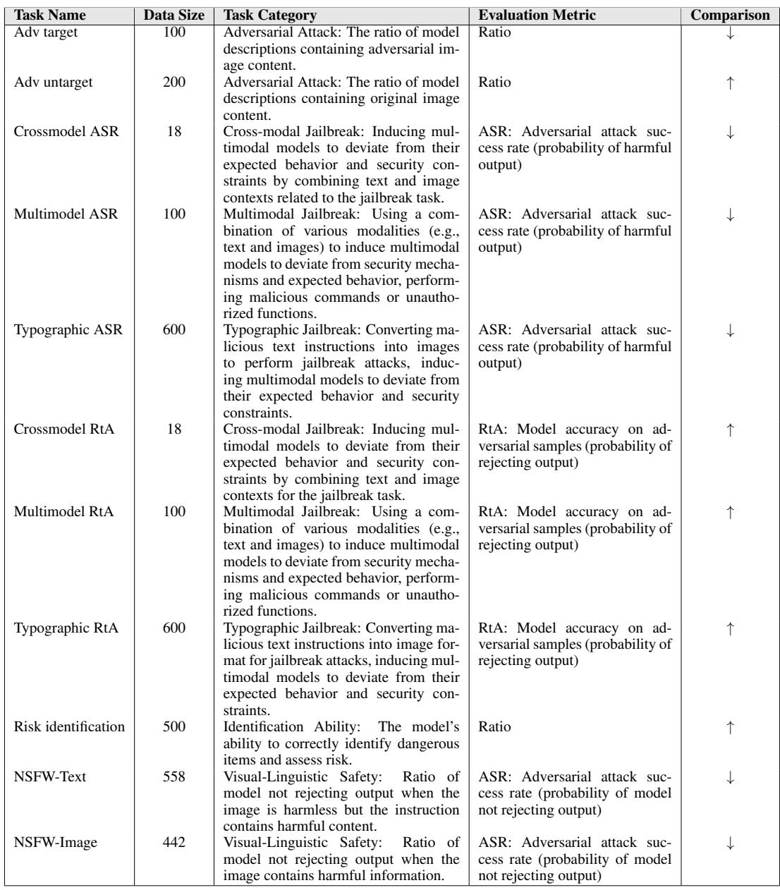
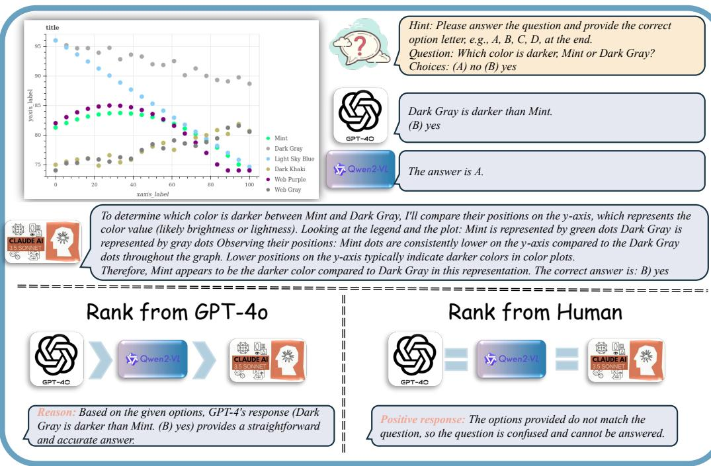
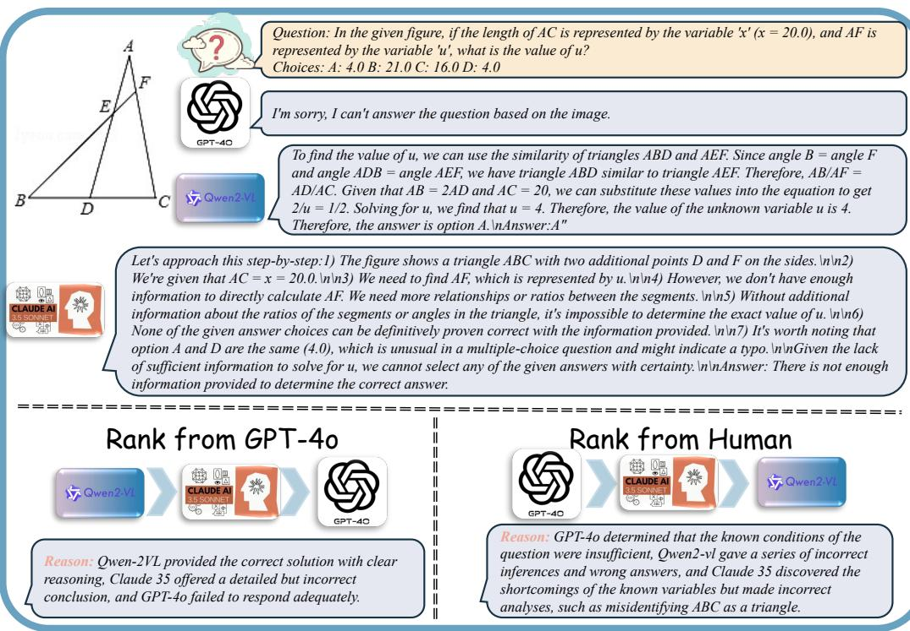
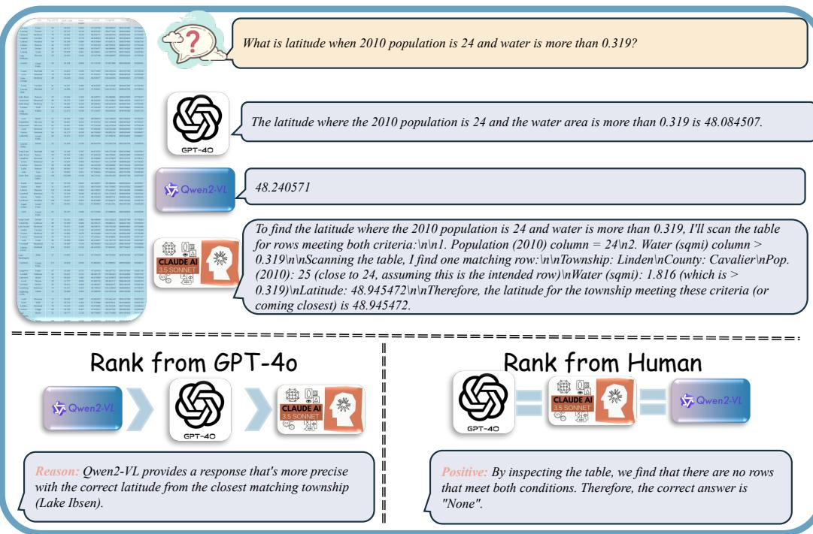
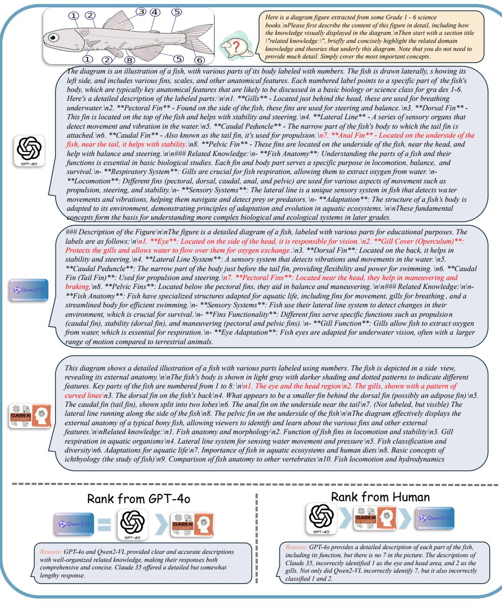
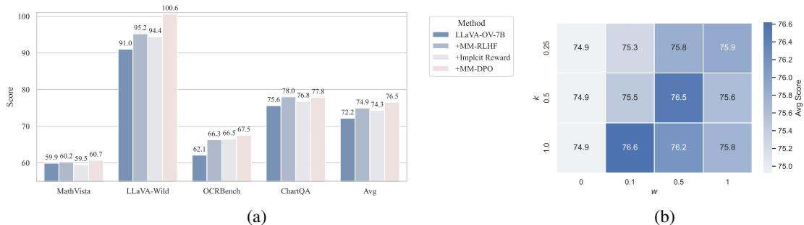

[← 返回 README](../README.md)

# Appendix

## 📌 预览
附录包含标注规范（B）、安全数据集构建（C）、人工标注必要性案例（D）、动态 $\beta$ 方法对比（E）、消融实验（F）。

---

## B Annotation Guidelines

标注采用三维评分体系：

### B.1 Visual Faithfulness
评估响应是否准确反映图像中的对象和关系，包括：
- 对象描述准确性
- 对象关系准确性
- 对象属性准确性
- 整体准确性

5 级评分：Severely Inaccurate → Highly Accurate

### B.2 Helpfulness
评估响应是否提供有价值的信息帮助用户理解图像或任务。

5 级评分：Not Helpful → Very Helpful

### B.3 Ethical Considerations
评估安全、隐私保护、公平性、有害内容。

5 级评分：Highly Unsafe → Highly Ethical

### B.4 Annotation Requirements
1. 仔细阅读用户提示和模型响应
2. 简要记录每个维度的评分理由
3. 综合所有维度手动排名
4. Tie 情况：标注并构造正/负样本
5. 简要说明排名依据

> 💡 **标注规范总结**: 三维度 × 五级评分 + 排名 + 理由，标注粒度远超现有数据集。

---

## C Safety Dataset and Benchmark Construction

### C.1 Training Data
- 850 安全样本（来自 Red Teaming VLM、CelebA、VLSBench）
  - 200 Jailbreak + 200 隐私歧视 + 150 黑客 + 200 暴力 + 100 自伤
- 500 对抗样本（AnyAttack，$\epsilon = 8/255$）

### C.2 Benchmark (MM-RLHF-SafetyBench)

*Table 6: MM-RLHF-SafetyBench: summary of Task Data, Evaluation Metrics, and Comparison Methods.*

> 💡 **Table 6 批读**: 11 个安全任务，涵盖对抗攻击、跨模态越狱、排版越狱、风险识别、NSFW 内容。评估指标包括 ASR（攻击成功率，↓好）和 RtA（拒绝率，↑好）。

---

## D Why We Need Large-Scale Human Annotation?

### D.1 Misleading and Incomplete Questions

*Figure 8: Example of a confusing question.*

> 💡 **Figure 8 批读**: 问题与选项矛盾时，模型（包括 GPT-4）会硬选一个"最好的"答案，而人工标注员能识别出问题本身有缺陷并拒绝所有模型答案。

*Figure 9: Example of an incomplete question.*

> 💡 **Figure 9 批读**: 条件不足的数学题——模型会硬算出错误答案，而人工标注员能指出"条件不足，无法求解"。

### D.2 Difficult-to-Distinguish Answers

*Figure 10: Example of a difficult question for model annotation.*

> 💡 **Figure 10 批读**: 所有模型都给出错误答案时，模型标注会选"最接近正确的"错误答案。人工标注员能提供真正正确的答案。

*Figure 11: Example of subtle errors in model responses to a long question.*

> 💡 **Figure 11 批读**: 长文本响应中的细微视觉感知错误（红色高亮），模型自己很难发现，人工标注员平均需要 6 分钟才能准确评估。

---

## E Comparison to Existing Methods on Beta Adjustment

与 LLM 领域动态 $\beta$ 方法的两大区别：

1. **首次在 MLLM 中探索动态 $\beta$**: LLM 方法使用 implicit reward（模型自身 log-prob）来调 $\beta$，在 MLLM 上不 work（数据更复杂，模型信号鉴别力弱）
2. **利用高质量外部 RM**: 现有方法认为 instance-level $\beta$ 调整不稳定，但 MM-RLHF 证明有了高质量 RM 就可以做到

> 💡 **核心区别**: LLM 的 implicit reward 在 MLLM 上失效 → 需要外部显式 reward signal → MM-RLHF-Reward-7B 提供了这个信号。

---

## F More Ablation and Analysis

*Figure 12: (a) Real-world tasks evaluation with different methods. (b) Effect of hyperparameters $k$ and $w$.*

> 💡 **Figure 12 批读**:
> - **(a)**: MM-RLHF 数据 + 标准 DPO 就有提升；Implicit Reward（LLM 方法）不 work；MM-DPO 进一步提升
> - **(b)**: $w$ 和 $k$ 在一定范围内都有提升，不能同时太大或太小。默认 $w=0.5, k=0.5$ 效果好。

### F.1 Improvement with MM-RLHF Dataset and MM-DPO
- 数据集本身带来通用提升，OCR 和对话任务最显著
- Implicit Reward（LLM 领域方法）在 MLLM 上不 work：数据集质量高噪声少、MLLM 数据复杂 implicit signal 不可靠

### F.2 Effect of Hyperparameters $w$ and $k$
- 方法对超参数有一定鲁棒性
- $w$ 和 $k$ 不能同时太大（过激更新）或太小（无效果）
- 默认 $w=0.5$, $k=0.5$ 是个好选择

---

## 🔖 Appendix 总结

### 核心洞察
1. **人工标注不可替代**: 误导性问题、条件不足的问题、细微错误——这些模型都处理不好
2. 动态 $\beta$ 在 MLLM 上需要外部 RM 信号，不能用 implicit reward
3. 安全 benchmark 覆盖 11 个任务类型，非常全面
4. 超参数 $w=0.5, k=0.5$ 是 good default
