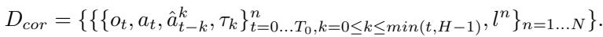
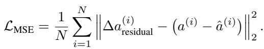

[← 返回 README](../README.md)

# 3 Method

## 📌 预览
这是全文核心。A2C2 的方法论很清楚: base policy 继续负责生成 chunk，correction head 只负责在执行阶段逐步做 residual correction。前半节解释 online correction 怎么接入，后半节解释 residual head 怎么训练。

---

## 3.1 Overview

We extend the action chunk-based policy $\pi$ by Asynchronous Action Chunking Correction (A2C2), introducing a lightweight correction head $\pi_{a2c2}$ that refines each action within a predicted chunk using the most recent observation, features of the base policy, and a temporal position feature. This framework enables step-wise online correction without retraining the base policy and is complementary to methods such as RTC (Black et al., 2025).

> 💡 **方法的角色分工**:
> - **base policy**: 继续生成 chunk，保留大模型能力
> - **correction head**: 每步纠偏，专门看最新 observation
>
> 所以 A2C2 不是替代 base policy，而是把“规划”和“闭环修正”拆成两个时间尺度。

At time $t$, observation $o_t$ is sent to the policy server. Then, the base policy $\pi$ generates the action chunk $A_t = \{ a_t^{\mathrm{base}}, \dots, a_{t + H - 1}^{\mathrm{base}} \}$ within inference delay $d$ as

$$
A_t = \{ a_t^{\mathrm{base}}, \ldots, a_{t + H - 1}^{\mathrm{base}} \} = \pi(o_t, l).
$$

> 💡 **Base Chunk 批读**:
> - A2C2 并不改变 base policy 的 chunk 生成方式
> - 大模型依然负责给出一个完整的 chunk 主干
> - 这也是它能作为 plug-in 模块接到现有 VLA / diffusion / flow policy 上的前提

Subsequently, at time $t + k$ ($d \leq k \leq d + e$), time feature $\tau_k$, base action $a_{t + k}^{\mathrm{base}}$, latest observation $o_{t + k}$, base policy latest representation $z_{t + k}$, and language instruction $l$ are added to the correction head $\pi_{a2c2}$. The positional feature $\tau_k$ is represented by a sinusoidal embedding that provides periodic structure over the chunk length $(\sin(2 \pi \frac{k}{H}), \cos(2 \pi \frac{k}{H}))$. The correction head integrates this information and predicts the residual action $\Delta a_{t + k}$ as

$$
\Delta a_{t + k} = \pi_{a2c2}(o_{t + k}, a_{t + k}^{\mathrm{base}}, \tau_k, z_{t + k}, l).
$$

> 💡 **Residual Prediction 批读**:
> - 该式表示：correction head 在时刻 $t+k$ 基于最新观测、base action、时间位置与任务上下文，预测一个残差项 $\Delta a_{t+k}$，用于对当前将执行的动作做局部修正。
> - $\Delta a_{t+k}$ 是在时刻 $t+k$ 对 base action 的残差修正，因此 correction head 预测的不是整段新动作，而是当前执行步的增量。
> - $o_{t+k}$ 是执行时刻 $t+k$ 的最新 observation，用于补偿 chunk 生成之后环境状态的变化。
> - $a_{t+k}^{\mathrm{base}}$ 是 base policy 为该时刻给出的原始动作，作为 correction 的参照中心，保证修正建立在原有计划之上。
> - $\tau_k$ 是 chunk 内位置特征，指示当前修正对应第 $k$ 个 action，使模型区分 chunk 前段、中段和后段的时间语义。
> - $z_{t+k}$ 是 base policy 的内部表示，$l$ 是语言指令；二者共同提供任务上下文，约束 correction 不偏离原任务语义。

*Figure 2: A2C2 总览。大模型继续产出 chunk，小模型在 chunk 内逐步修正当前动作。*

> 💡 **Figure 2 批读**: 如果 RTC 是“新旧 chunk 的粘合剂”，A2C2 更像“当前 action 的校准器”。它并不回头重采整个 chunk，而是只修改马上要执行的那个 action。
> - 图的下半部分表示：base policy 先基于时刻 $t$ 的 observation 生成一个完整的 action chunk，A2C2 不改变这一步的 chunk-level 规划方式。
> - 中间一排方块表示 base chunk 中的各个 action；其中真正进入执行阶段的是从 $t+d$ 开始的一段，而不是整段动作一次性重写。
> - 图中的 `RP` / correction head 表示：当系统执行到 chunk 内第 $k$ 步时，会取出当前的 base action，并结合最新 observation $o_{t+k}$ 与位置特征 $\tau_k$ 预测一个残差项。
> - 图的上半部分表示：最终执行的不是原始的 $a_{t+k}^{\mathrm{base}}$，而是修正后的 $a_{t+k}^{\mathrm{exec}} = a_{t+k}^{\mathrm{base}} + \Delta a_{t+k}$。
> - 因此，这张图最想强调的是 A2C2 的双时间尺度结构：base policy 负责 chunk-level 主方案，correction head 负责 step-level 局部修正；它修的是当前 action，而不是重写整个 chunk。

The residual action $\Delta a_{t + k}$ is added to the base action $a_{t + k}^{\mathrm{base}}$ and outputs the execution action $a_{t + k}^{\mathrm{exec}}$ as

$$
a_{t + k}^{\mathrm{exec}} = a_{t + k}^{\mathrm{base}} + \Delta a_{t + k}.
$$

> 💡 **Execution Action 批读**: 
> - 最终执行动作是 **base action + residual**
> - 这种写法把 base policy 的能力默认保留下来，把 correction head 的职责限制在“局部修偏”
> - 这也是 A2C2 计算开销小、训练更稳定的重要原因

Base policy $\pi$ infers an action chunk every $e$ steps with $d$ delay. On the other hand, we assume that the model size of the correction head $\pi_{a2c2}$ is small enough to run every step, which means the inference time of the head is smaller than the duration of a single control step $\Delta t$. Refer to Figure 2 for the overview.

Our method differs from existing approaches for asynchronous inference in the following aspects:

- **Time-aware correction**: The correction head explicitly conditions on the position within the action chunking VLA using a temporal feature.
- **Chunk-level smoothness**: By specifying which element of the chunk is being corrected, the method produces smoother corrections across horizons.
- **Data compatibility**: Training uses the same demonstration datasets as the base VLA policy, which does not require reinforcement learning fine-tuning.
- **Real-time feedback**: New observations are always incorporated, improving robustness under inference delay in dynamic tasks.

> 💡 **这四点里最关键的是最后一点**: A2C2 真正恢复的是 **实时反馈链路**。其余设计都是为了让这个反馈既稳定又能和 base chunk 对齐。

---

## 3.2 Model Training Procedure

First, we train the base policy $\pi$ with the dataset

$$
\mathcal{D}_{\mathrm{base}} = \left\{ \left\{ \{o_t, a_t\}_{t=0 \ldots T_n}^{\,n}, l^n \right\}_{n=1 \ldots N} \right\},
$$

> 💡 **Base Dataset 批读**:
> - 第一阶段仍然是普通的 imitation learning 数据：observation、action 和 language instruction，先沿用 base policy 原本的数据形态

where $N$ denotes the number of episodes in the dataset. Afterward, we add the output action chunk $\hat{A}_t$ of the inference from base policy $\pi$ for each step in the dataset $D_{\mathrm{base}}$ as

$$
\hat{A}_t = \{\hat{a}_t, \ldots, \hat{a}_{t + H - 1}\} = \pi(o_t, l).
$$

> 💡 **Predicted Chunk 批读**:
> - 第二阶段先让 base policy 在数据上离线跑一遍
> - 这样 correction head 训练时看到的不是理想 expert chunk，而是 **base policy 实际会吐出来的 chunk**
> - 这是后面 residual 学习成立的关键，因为它学的是“expert 相对 base 输出差多少”

With these inference results, we created a new dataset for correction head training $D_{\mathrm{cor}}$ as

*复杂数据集定义：correction head 的训练样本显式包含历史时刻预测出的 base action 与时间特征。*

> 💡 **Correction Dataset 批读**:
> - 这一步是在 $\mathcal{D}_{\mathrm{base}}$ 的基础上，为每个时刻补上 base policy 实际预测出来的 chunk 信息，从而构造 correction head 的训练样本。
> - 其中 $\hat{a}_{t-k}^{k}$ 表示：在时刻 $t-k$ 基于当时 observation 预测出的 chunk 中，第 $k$ 个位置对应的 base action；它正对应了执行到时刻 $t$ 时将要被修正的那个动作。
> - 因此，$\mathcal{D}_{\mathrm{cor}}$ 的核心作用是把训练输入改写成测试时的真实形式：当前 observation、chunk 内位置以及 base policy 给出的原始动作共同决定 correction，而不是直接从 observation 重新学习一个新 policy。

$\hat{a}_{t-k}^k$ is the $k$-th action in the action chunk inferred by the base policy from the observation at time $t-k$. Then, the correction head $\pi_{a2c2}$ is trained to predict the residual action, i.e., the difference between the target action and the base policy output. The target action is the action in the dataset that was originally collected from expert demonstrations. Formally, given the target action $a_{\mathrm{target}}$ and the base policy output $a_{\mathrm{base}}$, the residual target is defined as

$$
\Delta a_{\mathrm{residual}} = a - \hat{a}.
$$

$\hat{a}$ is a base action inferred by the base policy. There are some possible combinations of the base action with different time features $\tau$. The predicted residual action is denoted by $\Delta a_{\mathrm{residual}}$. The loss function is the mean squared error (MSE):

*复杂损失定义：correction head 只学 residual，不需要重新学习整条动作序列。*

Where $N$ denotes the batch size, i.e., the number of training samples in a mini-batch.

> 💡 **Residual Target&MSE Loss 批读**:
> - 训练目标直接拟合 $a - \hat{a}$，监督的仍然是 residual，而不是最终 action 本身
> - 所以 loss 的语义很直接：只要 correction head 把“expert 相对 base 的偏差”学准，它就完成任务了
> - 默认承认 base policy 已经会做大部分事情，correction head 只负责补最后那点由 stale observation 带来的误差

## 🔖 Section 总结

### 核心洞察
1. **推理时分工明确**: base chunk 负责“主计划”，correction head 负责“每步纠偏”。
2. **训练时只学残差**: correction head 学的是 expert action 相对 base action 的偏差，不是重学整条策略。
3. **系统设计足够克制**: A2C2 不回头重采 chunk，而是在现有 chunk 上做局部、低成本、实时的闭环修正。
