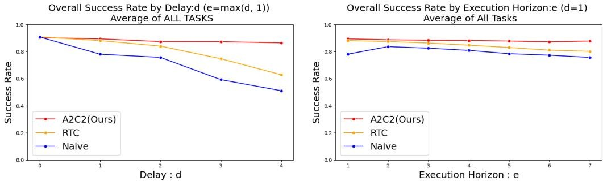
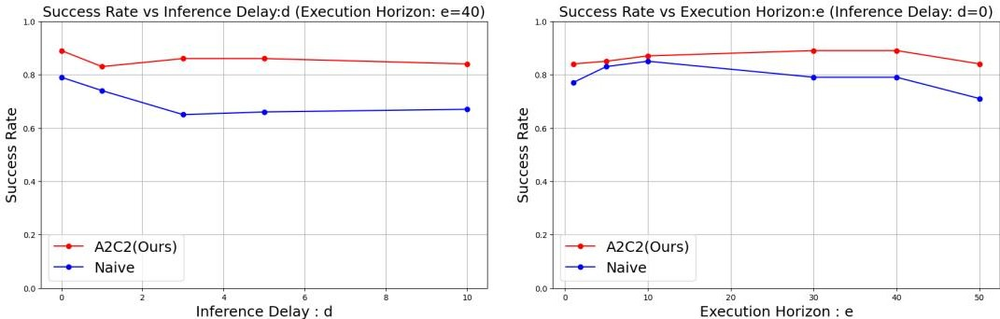

[← 返回 README](../README.md)

# 5 Results

## 📌 预览
这一节直接检验论文 claim: A2C2 是否真的比 naive async 和 RTC 更稳。关键信号有两个: 随着 `delay` 增大它掉得更慢；即使 `delay = 0`，只要 `horizon` 变长它也仍然有收益。

---

## 5.1 Kinetix

We evaluate the proposed action chunk correction framework in the Kinetix benchmark under varying inference delays $d$ and execution horizons $e$. Figure 5 reports success rates aggregated across all 12 tasks. There are two baseline comparisons. First is Naive async. This strategy does not pay attention to the previous action chunk at all when generating a new one, naively switching chunks as soon as the new one is ready. Second is RTC. As expected, both the naive async and RTC baselines degrade significantly as either the delay $d$ increases or the horizon $H$ becomes longer. In particular, when $d \geq 3$, the naive baseline suffers a sharp drop in success rate due to compounding errors from executing outdated action chunks. RTC inference partially mitigates this issue by overlapping prediction and execution, but performance still declines as the execution horizon increases.

In contrast, the action chunk correction maintains consistently higher success rates across all settings. Because it refines each action using the most recent observation, the action chunk correction can counteract both the temporal misalignment introduced by inference delay and the drift that accumulates within long action horizons. For example, at delay $d = 4$, our proposed method achieves nearly `35%` higher success than the naive baseline, and remains above `85%` even for horizons $H = 7$. This demonstrates that real-time correction of action chunks maintains performance both with inference delays and with long-horizon execution.

*Figure 5: Kinetix 总结果。左图固定 `e = max(d, 1)` 看 delay 效应，右图固定 `d = 1` 看 execution horizon 效应。*

> 💡 **Figure 5 批读**:
> - **左图** 说明 A2C2 对显式推理延迟更稳
> - **右图** 说明 A2C2 对长 horizon 带来的 chunk 内漂移也更稳
> - RTC 通常比 naive 好，但 A2C2 整体抬高了曲线下界

---

## 5.2 LIBERO Spatial

Figure 6 and Table 1 summarize the evaluation on the LIBERO Spatial benchmark. We tested the Naive async and A2C2 on this setting. Across 10 manipulation tasks with multimodal inputs, the correction head consistently improved success rates over the naive baseline under both long horizons and injected delays. For example, with execution horizon $H = 40$ and delay $d = 10$, the naive baseline achieved only `67%` success, whereas A2C2 reached `84%`. Even when no delay was present, action chunk correction provided notable gains at long horizons ($H = 50$, $d = 0$), raising success from `72.2%` to `81.6%`. These results demonstrate that residual refinement by the correction head mitigates the degradation caused by outdated action chunks and restores closed-loop responsiveness, enabling large VLA models to maintain high success rates in tasks that require fine-grained spatial reasoning.

*Figure 6: LIBERO Spatial 结果。左图固定 execution horizon 看 delay 效应，右图固定 `d = 0` 看 execution horizon 效应。*

> 💡 **Figure 6 批读**:
> - 这里已经不是低维状态控制，而是多模态 VLA 设置，所以结果比 Kinetix 更接近“真实大模型部署”场景
> - 左图说明即使 base policy 变成 SmolVLA，A2C2 仍然能对抗显式 delay
> - 右图说明即使没有注入 delay，随着 horizon 变长，A2C2 仍然能持续提分，这再次证明它修的是 chunk 执行期的 open-loop 缺口

**Table 1: LIBERO Spatial success rate.** 50 rollouts per task.

> 💡 **Table 1 批读**:
> 
> | Method | Execution Horizon `e` | Delay `d` | Success Rate (%) |
> |------|------:|------:|------:|
> | Naive | 10 | 0 | 81.8 |
> | A2C2 (Ours) | 10 | 0 | 89.2 |
> | Naive | 40 | 10 | 64.4 |
> | A2C2 (Ours) | 40 | 10 | 84.2 |
> | Naive | 50 | 0 | 72.2 |
> | A2C2 (Ours) | 50 | 0 | 81.6 |
> 
>  `e = 50, d = 0` 这一行提升很大，说明它修补的不只是通信/推理延迟，还包括 chunk 自身越来越 open-loop 的问题

## 🔖 Section 总结

### 核心洞察
1. **Kinetix 结果证明两件事**: delay 上升时 A2C2 更稳，horizon 变长时 A2C2 也更稳。
2. **LIBERO 结果把结论推进到真正 VLA 场景**: 多模态输入下它依然能提升成功率，不只是低维控制里的技巧。
3. **最关键的证据是 zero-delay long-horizon 仍能提分**: 这说明 A2C2 修的是更一般的 step-level closed-loop feedback 缺口。
