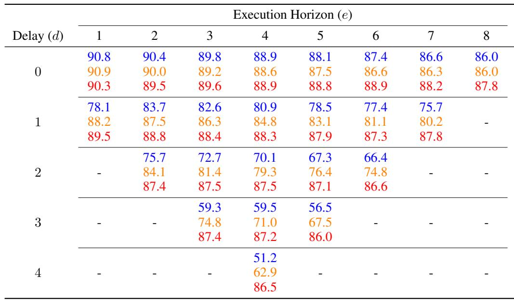

[← 返回 README](../README.md)

# 8 Appendix

## 📌 预览
Appendix 里最值钱的是三类信息: 任务环境、训练超参数、以及推理时间/硬件成本。正文负责说明 A2C2 为什么有效，这一节负责说明作者到底是怎么把它做出来的。

---

## A.1 Kinetix Simulation Detail

### A.1.1 Environment

We reused the 12 tasks from the Kinetix benchmark (Matthews et al., 2025) used in the RTC paper (Black et al., 2025). A sample visualization of each of the environments is shown in Figure 7. The Kinetix environment has an observation space with 2722 dimensions which do not include any images. Instead, it encodes information about polygons, circles, joints, thrusters, gravity, and the states of motors and thrusters described below. For entities not used in a given task, their corresponding entries are zero-padded. The action space has 6 dimensions. The first four correspond to motor controls, and the last two correspond to thruster controls. For unused actuators, their entries are set to zero via padding.

*Figure 7: Kinetix 的 12 个任务示意图。*

> 💡 **Kinetix 环境特点**: 没有图像输入，状态向量很大，但最关键的是物理过程动态性强，所以 stale action 会很快放大成失败。

### A.1.2 Dataset Generation and Training Detail

An imitation learning dataset was required to test the flow policy and our correction head. In the Kinetix simulation, we follow the RTC implementation. First, we trained the expert policy with RPO (Rahman & Xue, 2022) on 8 seeds per task for 64 million environment steps each. For each task, we load the best-performing checkpoint for each seed and discard some seeds if they did not reach a certain success threshold. Then, we used the expert model to generate 1 million environment steps for each task. After that, we train the flow policy with the generated dataset. We saved the checkpoints for each, but used the last checkpoint for the evaluation.

> 💡 **Table 2 批读**:
> **Table 2: Kinetix flow policy 的训练超参数。**
>
> | Hyperparameter | Value |
> |------|------|
> | Learning rate | `3 x 10^-4` |
> | Gradient norm clip | `10.0` |
> | Weight decay | `1 x 10^-2` |
> | Warmup steps | `1000` |
> | Batch size | `512` |
> | Number of epochs | `32` |
>
> 这张表说明 Kinetix 的 base flow policy 训练并不夸张，重点是一个相对标准的 imitation-learning 配置：较大的 batch、固定 warmup、32 个 epoch。A2C2 后面的收益不是靠把 base policy 训练得异常复杂换来的。

> 💡 **Table 3 批读**:
> **Table 3: Kinetix correction head 的训练超参数。**
>
> | Hyperparameter | Value |
> |------|------|
> | Batch size | `512` |
> | Number of epochs | `16` |
> | Learning rate | `1 x 10^-4` |
> | Weight decay | `1 x 10^-3` |
> | Gradient norm clip | `5.0` |
> | Warmup steps | `500` |
>
> 和 Table 2 对照看，correction head 的训练更短、更轻，学习率和 warmup 也更保守。这很符合它的角色：不是重学整条策略，而是在 base policy 上做第二阶段 residual 校正。

The correction head is then trained with the flow policy. The correction policy requires the base action from the base policy, so at every step, we infer the action chunk from the base policy and use it and the dataset to train the correction head. During the base flow policy training, we used a constant learning rate and added some warmup stage. See Table 2 for more details on the settings. For the correction head training, we used the parameters shown in Table 3. In both the flow policy and A2C2 training, the AdamW optimizer (Loshchilov & Hutter, 2017) was used.

> 💡 **训练成本观察**: 在 Kinetix 里，A2C2 的训练流程仍然依赖先把 base policy 训练好，然后再围绕 base action 构造 correction 数据集。这意味着它是一个明确的“第二阶段训练”方案。

### A.1.3 Evaluation Details

In the evaluation, we rolled out 2048 per task and computed the success rate for different delays and execution horizon lengths. In the Kinetix simulation, we tested all combinations of delay and execution horizons compatible with the chosen action chunk size. All results are in Table 4.

*Table 4: Kinetix 在不同 delay / execution horizon 下的完整结果。每个单元格依次给出 naive、RTC、A2C2。*

> 💡 **Table 4 批读**:
> - 这张表是 Kinetix 的完整结果矩阵：列是 execution horizon `e`，行是 inference delay `d`，每个可行单元格按顺序给出 **naive / RTC / A2C2**
> - 最值得看的不是单个格子，而是整体趋势：随着 `d` 变大、`e` 变长，naive 先明显崩，RTC 能缓一部分，但 A2C2 基本一直把成功率维持在更高的平台
> - 例如在最困难的几组条件里，naive 和 RTC 已经掉到 `50%` 到 `70%` 左右时，A2C2 仍然大多维持在 `86%` 到 `87%` 一带，这说明它补的不是边缘收益，而是系统性的 step-level feedback
> - 表里空白的位置也不是漏实验，而是因为那些 `d / e` 组合本身不满足前面 problem formulation 里的可行约束

---

## A.2 LIBERO Simulation Detail

### A.2.1 Environment

LIBERO Spatial consists of 10 tasks. We evaluated all tasks, and the corresponding language instructions are listed below. The language instructions are:

1. pick up the black bowl between the plate and the ramekin and place it on the plate
2. pick up the black bowl next to the ramekin and place it on the plate
3. pick up the black bowl from the table center and place it on the plate
4. pick up the black bowl on the cookie box and place it on the plate
5. pick up the black bowl in the top drawer of the wooden cabinet and place it on the plate
6. pick up the black bowl on the ramekin and place it on the plate
7. pick up the black bowl next to the cookie box and place it on the plate
8. pick up the black bowl on the stove and place it on the plate
9. pick up the black bowl next to the plate and place it on the plate
10. pick up the black bowl on the wooden cabinet and place it on the plate

> 💡 **这里能看出 LIBERO 的作用**: 任务虽然都围绕一个 object family，但输入已经包含语言和视觉，所以比 Kinetix 更接近真实 VLA 设置。

### A.2.2 Dataset and Training Detail

We used the LIBERO dataset with the LeRobot dataset format available on Hugging Face and used the LeRobot framework to read the dataset. LeRobot also has a well-organized training pipeline and makes it easy to create and try new architectures.

First, we trained SmolVLA as a base policy. There is an option for training the policy from scratch or fine-tuning the pretrained model. In our setting, we chose training from scratch because SmolVLA is pretrained mainly with S0-101, which is a different embodiment from the Franka arm used in the LIBERO benchmark.

In the Kinetix simulation, the base policy predicts the action chunk every time in correction head training. However, this is too time-consuming with a large VLA model. Then, we added the inference result of SmolVLA on the dataset for training the correction head. The new dataset has all the LIBERO Spatial data, the action chunk result, and the VLM latent representation from the SmolVLA policy for each step.

After that, we trained the correction head with the dataset we created. For SmolVLA training, we trained a model from scratch with a cosine learning scheduler, which is the default setting for SmolVLA training. The parameters for SmolVLA training are in Table 5.

For correction head training, we use a constant learning rate of `1e-5`. High learning rates, such as `1e-4`, do not work well for correction head training. See Table 6.

In both SmolVLA and correction head training, the AdamW optimizer was used (Loshchilov & Hutter, 2017).

> 💡 **Table 5 批读**:
> **Table 5: LIBERO 上 SmolVLA 的训练超参数。**
>
> | Hyperparameter | Value |
> |------|------|
> | Learning rate | `1 x 10^-4` |
> | Scheduler | `Cosine` |
> | Warmup steps | `1000` |
> | Decay steps | `30000` |
> | Minimum learning rate | `2.5 x 10^-6` |
> | Batch size | `64` |
> | Training steps | `100000` |
> | Optimizer epsilon | `1 x 10^-8` |
> | Optimizer weight decay | `1 x 10^-10` |
> | Gradient norm clip | `10` |
>
> Cosine scheduler、10 万步训练、较小 batch size，说明 LIBERO 这边的 base policy 成本远高于 Kinetix。

> 💡 **Table 6 批读**:
> **Table 6: LIBERO correction head 的训练超参数。**
>
> | Hyperparameter | Value |
> |------|------|
> | Learning rate | `1 x 10^-5` (constant) |
> | Batch size | `64` |
> | Training steps | `200000` |
> | Optimizer weight decay | `1 x 10^-5` |
> | Model dimension | `512` |
> | Number of heads | `8` |
> | Number of encoder layers | `6` |
>
> 这张表和 Table 5 必须对照着看。SmolVLA 用的是标准的大模型训练配方，而 correction head 这里最醒目的信息是学习率被压到 `1e-5` 且保持 constant。作者正文也明确说了 `1e-4` 不行，这说明多模态 correction head 对优化稳定性更敏感。
> 在真正的大 VLA 上，作者不再每步都实时跑 base model 生成训练监督，而是先离线缓存 SmolVLA 的 chunk 与 latent，再训练 correction head。这是工程上必须做的折中。

### A.2.3 Evaluation Detail

For the evaluation, we tested various combinations of delay steps and horizon steps first. We tested 10 rollouts per task, and LIBERO Spatial has 10 tasks. Then, to evaluate more precisely, we selected 3 pairs of delay and horizon, `(0, 10)`, `(10, 40)`, `(0, 50)`, and rolled out 50 episodes per task. All results for LIBERO Spatial are shown in Table 7.

> 💡 **Table 7 批读**:
> **Table 7: LIBERO Spatial 在不同 execution horizon / delay 组合下的完整结果。**
>
> | Execution Horizon `e` | Inference Delay `d` | Naive | A2C2 (Ours) |
> |------:|------:|------:|------:|
> | 40 | 10 | 0.67 | 0.84 |
> | 40 | 5 | 0.66 | 0.86 |
> | 40 | 3 | 0.65 | 0.86 |
> | 40 | 1 | 0.74 | 0.83 |
> | 10 | 10 | 0.75 | 0.88 |
> | 10 | 5 | 0.82 | 0.92 |
> | 10 | 3 | 0.81 | 0.89 |
> | 10 | 1 | 0.83 | 0.92 |
> | 50 | 0 | 0.71 | 0.84 |
> | 40 | 0 | 0.79 | 0.89 |
> | 30 | 0 | 0.79 | 0.89 |
> | 10 | 0 | 0.85 | 0.87 |
> | 5 | 0 | 0.83 | 0.85 |
> | 1 | 0 | 0.77 | 0.84 |
>
> `e = 40` 且 `d > 0` 时，A2C2 对 naive 有稳定的大幅优势；
> 即使 `d = 0`，只要 horizon 拉长到 `30/40/50`，A2C2 也依然持续领先。这和正文结论完全一致。

---

## A.3 Source Code for Experiments

To facilitate reproducibility, we have released the source code for our experiments:

- Kinetix: https://github.com/k1000dai/a2c2-kinetix
- LIBERO: https://github.com/k1000dai/a2c2-libero

## A.4 Computational Resources

We trained both models on NVIDIA RTX A6000 and H200 GPUs. Training in Kinetix required about 20 minutes per task on A6000, while LIBERO residual training (200k steps) took about 4 hours on H200.

> 💡 **资源成本**: 这说明作者想强调 A2C2 的附加训练成本是可接受的，尤其和大 VLA 本体相比更是如此。

## A.5 Inference Time Comparison

We benchmarked the average inference time per step for SmolVLA (450M parameters) and our correction head (32M parameters) over 100 trials each. All measurements were performed on an NVIDIA RTX 5080 laptop GPU (16GB VRAM).

The results confirm that the correction head is significantly faster, with an average step time of `0.0047s` compared to SmolVLA's `0.101s`. This `~20×` speed difference highlights that the proposed correction head can be integrated into high-frequency control loops without introducing prohibitive overhead, while still preserving the benefits of large foundation models at the chunk level.

> 💡 **Table 8 批读**:
> **Table 8: 平均每步推理时间对比。**
>
> | Model | Avg. Inference Time |
> |------|------|
> | SmolVLA (base policy) | `101 msec` |
> | Correction head (Ours) | `4.7 msec` |
>
> 这张表是全文工程可行性的关键证据。A2C2 之所以站得住，不只是因为有效，还因为它确实快到能在控制环里每步跑；`~20x` 的差距说明它在系统里扮演的就是“高频小模块”，而不是第二个大模型。

## A.6 The Use of Large Language Models

We used Large Language Models to polish our writing.

## 🔖 Appendix 总结

Appendix 读完后，关于 A2C2 的工程画像会更清楚:

1. 它是一个 **两阶段训练** 方案
2. 它在大 VLA 上需要 **离线缓存 base outputs / latents**
3. 它真正成立的关键，是 correction head 的 **推理时间远小于 base model**
