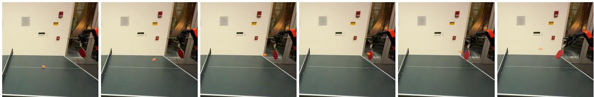
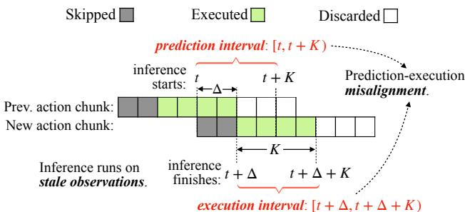

[← 返回 README](../README.md)

# 1 Introduction

## 📌 预览
Introduction 先从同步推理的停顿问题切入，再说明异步推理虽然能消除 stall，却会带来 prediction-execution misalignment。然后作者顺势给出 VLASH 的定位：不用改模型结构，也不增加运行时开销，通过 future-state-aware conditioning 让 VLA 真正可用于实时控制。

---

Recent advances in Vision-Language-Action models (VLAs) such as $\pi _ { 0 . 5 }$ [16], Gemini [1, 34] and $\mathrm { G r 0 0 t }$ [26] have demonstrated remarkable capabilities in solving complex robotic tasks. In real-world deployment, these models are typically executed under a synchronous inference paradigm: the robot first performs model inference to generate an action chunk [41], then sequentially executes the actions before initiating the next inference cycle. This sequential pipeline introduces action stalls and delayed reactions to environmental changes, since the model remains idle during action execution and cannot update its perception in real time [4]. As a result, many VLA demonstration videos are sped up by several times to mask the discontinuous and slow motion.

> 💡 **开场批读**: 介绍“先想后动、想完再动” 的同步推理导致两个严重问题
>
> 1. 动作卡顿（action stalls） —— 模型在执行动作期间是空闲的
> 2. 对环境变化反应迟钝 —— 无法实时更新感知

---

To prevent this stop-and-go behavior, researchers have proposed asynchronous inference [4, 24, 29, 31]. In a nutshell, asynchronous inference allows the robot to execute the current action chunk while simultaneously performing inference for the next one. Because the execution duration of an action chunk is typically longer than the model inference time, the robot can immediately switch to the next chunk once the inference completes, avoiding idle period between chunks [4, 24, 29, 31]. This design eliminates action stalls and allows the robot to perform smooth, continuous motion. Moreover, since inference is performed continuously, the robot can maintain real-time perception and thus react to environmental changes more promptly and accurately [4, 24]. In summary, asynchronous inference provides a promising way to achieve smooth, accurate, and fast reaction control for VLAs.

> 💡 **动机批注**: 第二段说明 async inference 的吸引力很直接：一边执行当前 chunk，一边准备下一段动作。只要执行时间长于推理时间，就能显著减少 idle period，同时提升对环境变化的响应频率，持续进行推理，能实时感知环境，反应更快、更准确

---

*Figure 1. VLASH enables VLA to play ping-pong rallies with humans. Snapshots showing $\pi _ { 0 . 5 }$ [16] with VLASH successfully tracking and striking a fast-moving ping-pong ball during a rally. The robot initiates its reaction by the third frame, demonstrating low-latency perception-to-action response. The task requires both fast reaction and smooth continuous motion, which are enabled by our asynchronous inference with future-state-awareness. Under synchronous inference, the robot fails to achieve this dynamic interaction.*

> 💡 **Figure 1 批读**: 图中展示的是 π0.5 模型在使用 VLASH 后，能够成功追踪并击打快速移动的乒乓球：让 VLA 在高动态、高精度任务里真正做到连续反应。机器人在第三帧就做出了反应，体现了极低的感知-动作延迟。

---

*Figure 2. Prediction-execution misalignment in asynchronous inference. Due to inference delay $\Delta$ , the model predicts actions for the prediction interval $[ t , t + K )$ but they execute during the execution interval $[ t + \Delta , t + \Delta + K )$ .*

> 💡 **Figure 2 批读**: Figure 2 把 async 的根本矛盾画得很清楚：模型在区间 `[t, t+K)` 看到环境并做预测，但因为推理耗时 `Δ`，动作实际落地在区间 `[t+Δ, t+Δ+K)`。只要 `Δ > 0`，这种“用旧状态控制未来世界”的时间错位就是不可避免的根本性挑战（fundamental challenge）。

---

However, asynchronous inference faces a fundamental challenge that makes it unstable and inaccurate in practice. Since both the robot and the environment continue to evolve during inference, a temporal misalignment arises between the prediction interval starting when inference begins and the execution interval starting when inference finishes [4, 29]. As a result, the newly generated action misaligns with the robot’s execution-time state and environment, leading to severe instability and degraded control accuracy. For example, naive asynchronous inference reduces reaction latency but exhibits unstable and laggy control performance [4]. RTC [4] mitigates this by freezing the actions guaranteed to execute and inpainting the rest, but it introduces additional runtime overhead and complicates the deployment. In addition, current implementations [24, 29, 31] often require multi-threaded redesign of the inference framework to support asynchronous inference efficiently. Together, these create a significant barrier for the adoption of asynchronous inference for VLAs.

> 💡 **核心矛盾**: 这一段是对已有 async 方法痛点的总括。naive async 会直接失稳；RTC 通过 freezing + inpainting 缓解错位，但有额外开销；现有工程实现还常常依赖多线程重构，这些因素共同构成了 VLA 采用异步推理的重要障碍

---

To address these challenges, we propose VLASH, a general asynchronous inference framework for VLAs that achieves smooth, accurate, and fast reaction control without additional overhead or architectural changes. In a nutshell, VLASH makes the model future-state-aware by accurately estimating the execution-time robot state using the previously issued action chunk, effectively bridging the gap between prediction and execution. VLASH integrates seamlessly into existing fine-tuning pipelines and introduces no additional cost or latency. With a clean and lightweight implementation, VLASH provides a full-stack asynchronous inference framework from fine-tuning to inference at deployment, making asynchronous control practical and easy to adopt for real-time VLA systems.

> 💡 **VLASH 核心思想**: 
>
> 1. **without additional overhead or architectural changes**
>
>    VLASH 不是靠更重的运行时补丁，不是靠多加一个复杂模块，也不是靠改模型结构才起作用，保持轻量化
>
> 2. **future-state-aware**
>
>    VLASH 不是在动作已经生成之后再去“修动作”，而是在模型生成动作之前，就让模型看到更接近执行时刻的机器人状态，也就是把对齐问题前移到输入条件上
>
> 3. **integrates seamlessly into existing fine-tuning pipelines**
>
>    可以嵌进现有 VLA 微调和部署流程的框架

---

We build and evaluate VLASH across various VLA models, including $\pi _ { 0 . 5 }$ [16] and SmolVLA [31]. On simulation benchmarks [25], VLASH achieves up to $3 0 . 5 \%$ accuracy improvement compared to naive asynchronous inference and consistently outperforms all baselines. On real-world benchmarks [31], VLASH achieves up to $2 . 0 3 \times$ speedup and reduces reaction latency by up to $1 7 . 4 \times$ compared to synchronous inference while fully preserving the original accuracy. Beyond quantitative gains, VLASH demonstrates that large VLA models can handle fast-reaction, high-precision tasks such as playing ping-pong and playing whack-a-mole, which were previously infeasible under synchronous inference. We hope these results will inspire future research toward extending VLAs to more dynamic and physically interactive robotics.

> 💡 **贡献总结**: 仿真里最多 `30.5%` 精度提升，真实世界里最多 `2.03x` 速度提升和 `17.4x` reaction-latency 改善，同时还不损失原有精度

---

## 🔖 Section 总结

### 核心洞察
1. 同步推理的 stop-and-go 是 VLA 真实部署中的第一层瓶颈
2. 异步推理能解决停顿，但会引入更本质的时序错位（用旧环境控制新时刻的本体）
3. VLASH 的切入点是“生成动作时看对 state”，而不是“执行动作时再补救”，这种预见性思路为降低部署开销指明了方向
4. **对实时控制的意义**: 未来的状态和当前的画面结合，能在不改模型的前提下实现零运行时惩罚的异步执行，这使得打乒乓球这样对低延迟要求极高的任务变得可能
