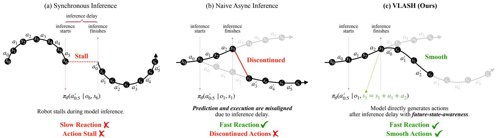

[← 返回 README](../README.md)

# 2 Related Work

## 📌 预览
作者用两段话把本文放进两个脉络里：一是 generalist VLA 的发展，二是 VLA 异步推理的几条代表路线。读这一节的关键是弄清 VLASH 相比 RTC 和 A2C2 到底少做了什么、又多做了什么。

---

Vision-Language-Action Models (VLAs). Recent advances in Vision-Language-Action models have demonstrated remarkable capabilities in robotic manipulation by leveraging large-scale pretraining on diverse and internetscale vision-language data. Models such as $\pi _ { 0 . 5 }$ [16], RT-2 [43], and $\mathrm { G r 0 0 t }$ [26], etc. [3, 19] combine visual encoders with large language models to enable generalist robotic policies that can follow natural language instructions and generalize across tasks and embodiments. These models are typically deployed under synchronous inference, where the robot waits for model inference to complete before executing actions, resulting in action stall and slow reaction to environmental changes [4, 29]. Our work addresses this limitation by enabling efficient asynchronous inference for VLAs.

> 💡 **动机批注**: 第一段只是很快交代背景：VLA 已经在通用操控上展现出很强能力，但默认部署范式仍是同步推理，因此 stall 和慢反应依旧是现实痛点。

---

Asynchronous VLA Inference. Asynchronous inference offers a promising way to eliminate action stalls and improve reaction speed of VLAs, but existing approaches still face significant barriers to adoption in the VLA community. SmolVLA [31] implements naive asynchronous inference by directly switching to new action chunks, but this causes severe prediction-execution misalignment and unstable control. Real-time Chunking (RTC) [4] mitigates this by freezing actions guaranteed to execute and inpainting the remaining actions, but this introduces additional runtime overhead for the inpainting process and complicates deployment. A concurrent work, A2C2 [29], adds an additional correction head to the model to mitigate the prediction-execution misalignment, but this also introduces runtime overhead and requires architecture changes to the model. In contrast, our method achieves asynchronous inference through future-state-awareness without additional overhead.

> 💡 **方法对比**: 
> - **SmolVLA / naive async**: 直接切换新 chunk，优点是简单，缺点是 prediction-execution misalignment 最严重。
> - **RTC**: 承认错位问题存在，在运行时通过 freeze + inpainting 修补，但代价是额外开销和更复杂部署。
> - **A2C2**: 不做 inpainting，而是给模型加 correction head，本质上仍是“额外模块换稳定性”。
> - **VLASH**: 不在运行时补救，也不加额外头，而是通过 future-state-aware conditioning 改变模型生成动作时看的 state。
> - 所以 VLASH 的卖点不只是“效果更好”，而是“少做了很多额外的事”

---

*Figure 3. Comparison between VLASH and existing methods. (a) Synchronous inference: the robot stalls during inference, introducing slow reactions. (b) Naive async: the model predicts based on stale state $s _ { 1 }$ while execution begins at future state $s _ { 3 }$ , causing misalignment and discontinuity. (c) VLASH rolls forward the robot state $( s _ { 3 } = s _ { 1 } + a _ { 1 } + a _ { 2 } )$ ) and condition on the execution-time state, achieving fast reaction and smooth actions.*

> 💡 **技术细节**: Figure 3 用一张图把三条路线的差异画出来了。Synchronous 的问题是停顿，naive async 的问题是 stale state，VLASH 的思路则是先把 robot state 推进到真正开始执行新 chunk 的时刻，再基于执行时刻的 state 生成新动作

---

## 🔖 Section 总结

### 核心洞察
1. VLASH 不是否定异步推理，而是在异步范式内部重新定义 conditioning（状态条件输入）。
2. 与 RTC 相比，它少了运行时 inpainting；与 A2C2 相比，它少了额外 correction head。
3. **对实时控制的意义**: 作者试图证明，只要对齐 state 本身，就足以消解大部分由于异步引起的不稳定，这意味着我们不需要复杂的运行时修复组件，即可享受低延迟带来的操作红利。
