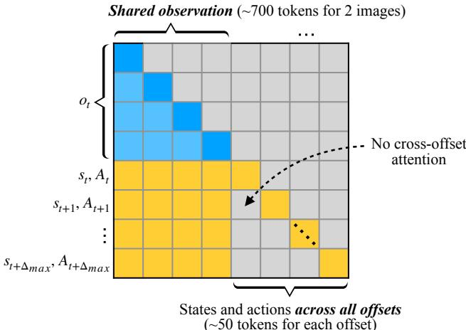
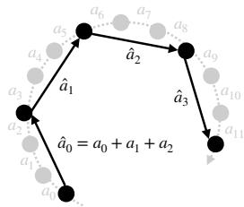

[← 返回 README](../README.md)

# 4 VLASH

## 📌 预览
Method 是全文核心。作者实际上做了四件相互衔接的事：先在推理时用旧 chunk 把 robot state 前滚；再在 fine-tuning 阶段通过 offset augmentation 逼模型真正学会利用 future state；然后用 shared observation 降低多 offset 训练成本；最后再用 action quantization 压缩物理执行时间。

---

## 4.1 Future State Awareness

In asynchronous inference, the robot keeps moving while the VLA performs a forward pass, so the state at inference start generally differs from the state at which the new actions actually begin execution. Our key idea is to make the policy future-state-aware: instead of conditioning on the current robot state $s _ { t }$ , we condition on the robot state at the beginning of the next execution interval $s _ { t + \Delta }$ .

> 💡 **核心原理**: 这一段是 VLASH 最核心的一句话：与其让模型看推理开始时刻的 $s_t$，不如直接给它看新 chunk 真正开始执行时刻的 $s_{t+\Delta}$。方法的本质是重新定义 conditioning 的时刻

---

Although the future environment observation is unknown, the robot state at the beginning of the execution interval $s _ { t + \Delta }$ is determined by the current robot state $s _ { t }$ and the actions executed during the inference delay $a _ { t : t + \Delta - 1 }$ . As shown in Fig. 3(c), when inference for the new chunk starts at state $s _ { 1 }$ , the robot will still execute the remaining actions $a _ { 1 } , a _ { 2 }$ from the previous chunk before the new chunk is ready to take over. Since the actions $a _ { 1 } , a _ { 2 }$ are already known, we can roll the state forward under them to obtain the execution-time state. In the Fig. 3(c), this corresponds to computing $s _ { 3 } = s _ { 1 } + a _ { 1 } + a _ { 2 }$ , which gives the robot state at the start of the execution interval.

> 💡 **技术细节**: 关键点在于未来 observation（环境画面）不可知，但未来 robot state（本体姿态）有一部分是可精确预测的，因为推理期间机器人还会继续执行旧 chunk 剩余的动作。于是作者只去 roll forward “系统自己能确定的那部分未来”。

---

During the forward pass, VLASH feeds both the current environment observation $o _ { 1 }$ and this rolled-forward future state $s _ { 3 }$ into the VLA. In this way, the model generates actions for the state at the execution-time rather than for the stale state at inference start, bridging the gap between prediction and execution in terms of robot state. While the future environment is still unknown, this mechanism mirrors how humans act under reaction delays: we react to the world with slightly outdated visual input, but use our internal body state to anticipate what we will do when the action actually takes effect. Thus, humans inherently have the ability to compensate for such reaction delay, and we expect VLAs to possess the same capability.

> 💡 **直观类别**: 这里的 human analogy 很绝。作者承认缺失未来视觉输入是不完美的，但强调人类在打球时也是这样：眼睛看到的画面总有延迟（outdated visual input），但大脑会用肌肉的本体感觉（internal body state）预测挥拍真正发力时的身体姿态。VLASH 就是想让 VLA 学会这种“用本体状态补偿视觉延迟”的生物本能。

---

## 4.2 Fine-tuning with Offsets to States and Actions

The future-state-awareness assumes that the VLA is able to leverage the rolled-forward robot state. However, we find that existing VLAs often fail to exploit this future state properly. Even more, current VLAs appear to largely rely on visual input and under-utilize the robot state. In our experiments with $\pi _ { 0 . 5 }$ (Table 1), fine-tuning without state input (visual only) consistently outperforms fine-tuning with state input on LIBERO [23]. Therefore, simply feeding a future robot state at test time is insufficient to achieve accurate and stable asynchronous control.

> 💡 **核心矛盾**: 这一段其实揭示了只做 inference-time hack 会失败的原因。现有 VLA 往往重度依赖视觉特征（overfit to visual features）而很少真正听从 robot state。比如实验表明，$\pi_{0.5}$ 在 LIBERO 上甚至不输入 state 效果更好（visual-only 强于带 state）。所以，如果在推理时硬塞一个 future state，模型根本不懂怎么利用它来出动作。

---

Since large VLAs are almost always fine-tuned on downstream data before analogy, we design a training augmentation that can be seamlessly integrated into the standard fine-tuning stage with no additional overhead. We keep the architecture and fine-tuning pipeline unchanged, and only modify how training samples are constructed.

> 💡 **技术细节**: 因此 VLASH 不只是 inference trick，它还包含一个训练数据构造。作者强调不改架构、不改 fine-tuning pipeline，只改训练样本构造方式，这一点与 A2C2 的改头部设计形成对比。

---

Concretely, given a trajectory $\{ ( o _ { t } , s _ { t } , a _ { t } ) \}$ , standard fine-tuning trains the model to predict the action chunk $\scriptstyle a _ { t : t + H - 1 }$ from $\left( o _ { t } , s _ { t } \right)$ . We instead apply a simple temporal-offset augmentation with two key steps:

(i) Offset state and action together. We sample a random offset $\delta$ from a predefined range (e.g., $\delta \in \{ 0 , \ldots , \Delta _ { \operatorname* { m a x } } \} )$ and construct training targets from the future state $s _ { t + \delta }$ and future action chunk $a _ { ( t + \delta ) : ( t + \delta + H - 1 ) }$ on the same trajectory. 
(ii) Fix the environment observation. For each timestep $t$ , we always use the same visual input $o _ { t }$ when varying $\delta$ . Therefore, the model is trained to predict $a _ { ( t + \delta ) : ( t + \delta + H - 1 ) }$ from the pair $\left( o _ { t } , s _ { t + \delta } \right)$ .

Under this scheme, the same image $o _ { t }$ can correspond to different ground-truth actions depending on the offset robot state $s _ { t + \delta }$ . To fit the data, the VLA is forced to attend to the state input rather than overfitting purely to visual features. In particular, it learns to interpret $s _ { t + \delta }$ as a meaningful future state for action selection.

> 💡 **核心原理**: 先对照标准 fine-tuning 的输入输出形式，把“不同延迟下的未来对齐问题”提前注入到训练数据里，这两步 augmentation 的设计非常直接：
>
> 1. **采样一个 offset $\delta$，使state 和 target action一起向未来偏移**，用$s_{t+\delta}$和未来动作块 $a_{(t+\delta):(t+\delta+H-1)}$ 做目标
> 2. **observation 固定不动。**也就是说，变的是 state 和 action，不变的是同一帧图像 $o_t$
> 
> 这样同一张图会配上不同的 state-action 对，逼模型不能只偷看视觉线索，必须认真去读 $s_{t+\delta}$，才能知道现在该出哪一个动作，这正是 offset augmentation 的训练信号来源

---

We randomly sample $\delta$ during training because, in practice, the same VLA may be deployed on hardware with different compute budgets, leading to different inference delays $\Delta$ , and sometimes even in synchronous settings where there is no gap between prediction and execution. By training over a range of offsets, our augmentation makes the model compatible with different inference delays while preserving performance in the synchronous case. At deployment with asynchronous inference, we can then feed the rolled-forward execution-time state together with the current observation, and the fine-tuned VLA naturally leverages this future state to produce actions that are aligned and stable over the execution interval.

> 💡 **技术实现**: 随机采样 $\delta$ 则是在为不同硬件预算、不同推理延迟做 domain randomization。这样得到的模型既能兼容同步场景，也能兼容不同程度的异步延迟。

---

## 4.3 Efficient Fine-tuning with Shared Observation

The temporal-offset augmentation creates multiple state-action pairs for the same observation $o _ { t }$ . A naive implementation would treat each offset $\delta$ as a separate training example, i.e., run the VLA independently on $\left( o _ { t } , s _ { t + \delta } , A _ { t + \delta } \right)$ for each sampled $\delta$ . This implementation is completely plug-and-play and can be seamlessly integrated into existing VLA fine-tuning pipeline. However, it repeatedly encodes the same observation $o _ { t }$ for every offset, leaving substantial room for further efficiency gains.

> 💡 **核心问题**: 进入 4.3 之后，焦点从“能不能学会”转向“这样训练会不会太贵”。如果每个 offset 都单独跑一遍前向，那么最浪费的就是重复编码相同 observation。

---

Instead, we exploit the fact that all offsets share the same observation $o _ { t }$ and design an efficient attention pattern that reuses the observation tokens across offsets in a single pass (Fig. 4). Concretely, we pack one observation and multiple offset branches into a single sequence:

> 💡 **核心原理**: 作者的工程优化点很自然：既然多个 offset 共享同一帧 observation，就把它们打包进同一个序列里，只让 observation 编码一次。

---

$$
\left[ o_t,\ \left( s_t, A_t \right),\ \left( s_{t+1}, A_{t+1} \right),\ \dots,\ \left( s_{t+\Delta_{\max}}, A_{t+\Delta_{\max}} \right) \right],
$$

where each $\left( { { s _ { t + \delta } } , { A _ { t + \delta } } } \right)$ corresponds to one temporal offset. We then apply a block-sparse self-attention mask with the following structure:

> 💡 **公式理解**: 公式(4) 把一个共享的 $o_t$ 放在最前面，后面接多个 offset branch $(s_{t+\delta}, A_{t+\delta})$。它体现的不是新语义，而是训练时的并行批处理布局，让一个序列能同时计算多个延迟情况下的损失。
> 
> 这里开始定义 **block-sparse attention mask**。在训练序列里打包了多个 offset，但它们不能串味：每个 offset 分支都能看到最前面共享的 observation token，同时只能看到自己分支内的 state-action token。这就像在做 batch inference，只是把多 batch 压缩进了一个 token 序列的注意力掩码里。

---

- All observation tokens (e.g., image tokens from two views and language prompt, about $\sim 700$ tokens for $\pi_{0.5}$) can attend to each other, as in standard VLA fine-tuning.
- For each offset branch, the state-action tokens $(s_{t+\delta}, A_{t+\delta})$ can attend to all observation tokens and to tokens within the same offset, but cannot attend to tokens from other offsets.

> 💡 **核心分析**: 这两个 attention 约束合起来，就把“共享 observation、独立 offset”的结构编码进了 self-attention。它本质上相当于把多个样本拼成一个大样本，但避免了重复编码视觉 token。

---

*Figure 4. Attention pattern for efficient fine-tuning with shared observation. We pack one shared observation $o _ { t }$ and multiple offset branches $\left( { { s _ { t + \delta } } , { A _ { t + \delta } } } \right)$ into a single sequence. Blue and yellow cells indicate allowed attention, while gray cells indicate masked attention. Positional encodings of each offset branch are reassigned to start at the same index, equal to the length of observation tokens.*

> 💡 **图片解读**: 可以把它理解成一个 attention 矩阵：
>
>   - 第 i 行：第 i 个 token 去看别人
>   - 第 j 列：第 j 个 token 被别人看
>
> $$
> \text{token}_i \rightarrow \text{token}_j
> $$
>
> 蓝色/黄色表示允许，灰色是被mask掉
>
>   - 左上角大块：observation 看 observation
>   - 每个 branch 朝左那块：branch 看 observation
>   - 每个 branch 自己对角线那块：branch 看自己
>   - branch 和 branch 之间的非对角块：灰色，表示不能互相看

---

This attention map, illustrated in Fig. 4, makes different offsets condition on a shared observation while remaining independent of each other. For each offset branch, the positional encodings of $\left( { { s _ { t + \delta } } , { A _ { t + \delta } } } \right)$ are assigned to start at the same index, equal to the length of observation tokens. From the model’s perspective, this is equivalent to training on multiple $\left( o _ { t } , s _ { t + \delta } , A _ { t + \delta } \right)$ examples that share the same $o _ { t }$ , but we only encode $o _ { t }$ once.

For $\pi _ { 0 . 5 }$ , an observation with two images and language prompt corresponds to $\sim 7 0 0$ tokens, while one state and action chunk are about $\sim 5 0$ tokens [16]. Therefore, packing $N _ { \delta } = 5$ offsets into a single sequence therefore increases the token length by only $\sim 2 0 \%$ , while the number of effective training trajectories becomes $5 \times$ larger. In practice, under the same effective batch size as standard fine-tuning, this method can significantly improve training efficiency by reusing each observation across multiple offset targets in a single pass.

> 💡 **核心分析**: 把每个 offset branch 的位置重新对齐到 observation token 之后，相当于让模型“感觉”自己在看多份共享同一 observation 的独立样本。$\pi_{0.5}$ 中 observation 大约 $\sim 700$ 个 token，state + action chunk 只有 $\sim 50$ 个 token，所以同时打包 5 个 offset，序列长度只增加约 $20\%$，有效训练样本却扩大 $5\times$。

---

## 4.4 Action Quantization

With asynchronous inference and future-state-awareness, the model inference time is effectively hidden behind execution. Once this inference latency is removed, the overall speed of the system is primarily limited by how fast the robot can physically execute the action sequence. To push the execution speed further, we need to accelerate the motion itself.

> 💡 **量化动机**: 到这里作者认为推理延迟已经基本被隐藏在执行过程后面了，剩下的瓶颈就从“模型算得够不够快”转成“机器人本体动得够不够快”。

---

Our approach is to quantize actions, in analogy to weight quantization for LLMs [11, 22, 37]. State-of-the-art VLAs are typically trained on fine-grained teleoperation data (e.g., ${ \sim } 5 0 \mathrm { H z }$ control with small deltas at each step) [3, 16], which leads to action sequences with high granularity. However, many short micro-movements are more precise than what is actually required to solve the tasks. In LLMs, 16-bit weights provide high numerical precision, but quantizing them to 8-bit or 4-bit can substantially accelerate inference with only a mild drop in accuracy [11, 22, 37]. We apply the same philosophy to robot control.

> 💡 **降采样稀疏化**: action quantization 的类比很有意思：像 LLM 里做 weight quantization 一样，这里把高频、细粒度的 micro-action 合并成更粗的 macro-action，用更少步数完成类似位移。

---

*Figure 5. Action quantization for efficient execution. We group consecutive fine-grained micro-actions into coarser macro-actions to accelerate robot motion. The original trajectory with fine-grained actions $a _ { 0 } , a _ { 1 } , a _ { 2 } , \dots$ (gray) is quantized into a shorter trajectory with macro-actions $\hat { a } _ { 0 } , \hat { a } _ { 1 } , \hat { a } _ { 2 } , \hat { a } _ { 3 }$ (black), where each macro-action summarizes $q$ consecutive fine-grained actions (e.g., $\hat { a } _ { 0 } = a _ { 0 } + a _ { 1 } + a _ { 2 }$ for quantization factor $q = 3$ ).*

> 💡 **技术细节**: Figure 5 直观看到量化后的轨迹更稀疏。它不是让策略学新动作，而是把已有动作序列在执行时重新聚合成更长的步长。

---

Given a fine-grained action sequence $\{ a_{0}, a_{1}, \ldots, a_{T} \}$, we group consecutive actions into coarser macro-actions. For a chosen quantization factor $q$, we construct a new sequence $\{ \hat{a}_{0}, \hat{a}_{1}, \ldots \}$ where each macro-action summarizes a block of $q$ fine-grained actions. For delta actions, this can be implemented as

$$
\hat{a}_i = \sum_{j=0}^{q-1} a_{iq+j}
$$

> 💡 **公式理解**: 公式(5) 把量化因子 $q$ 写成了最直接的求和形式：$\hat{a}_i = \sum_{j=0}^{q-1} a_{iq+j}$。$q$ 越大，一次执行跨越的细粒度动作越多，速度也越快。

---

so that $\hat { a } _ { i }$ takes the robot approximately from the start state of $a _ { i q }$ to the end state of $a _ { ( i + 1 ) q - 1 }$ in a single, longer step. Fig. 5 illustrates this process: the original fine-grained trajectory (gray) is replaced by a shorter, quantized trajectory (black) with macro-actions $\hat { a } _ { 0 } , \hat { a } _ { 1 } , \hat { a } _ { 2 } , \hat { a } _ { 3 }$ , where $\hat { a } _ { 0 } = a _ { 0 } + a _ { 1 } + a _ { 2 }$ .

> 💡 **核心分析**: 作者这里强调 macro-action 的语义：它大致把机器人从 $a_{iq}$ 的起点直接带到 $a_{(i+1)q-1}$ 的终点，因此跳过了一些中间 waypoint，这本质上是一个 inference-execution trade-off。

---

Executing macro-actions instead of all micro-actions increases the distance moved per control step, effectively speeding up the robot’s motion. The temporal granularity of control becomes coarser, but in many tasks the robot does not need to visit every intermediate waypoint explicitly; moving directly between sparser waypoints is sufficient to achieve the goal. As a result, action quantization offers a tunable speed-accuracy trade-off: small quantization factors behave like the original fine-grained policy, while larger factors yield progressively faster but less fine-grained motion. In practice, we select task-dependent quantization factors that maintain success rates close to the unquantized policy while substantially reducing the number of executed steps.

> 💡 **实验结论**: 最后一段给出一个很现实的结论：action quantization 并不是 VLASH 的核心对齐机制，但它决定了论文 headline 里的最大 speedup 能有多高，因为那部分收益来自执行步数本身的减少。

---

## 🔖 Section 总结

### 核心洞察
1. roll-forward state 是推理时机制，offset augmentation 才是让这种 future state 真正被模型学会使用的训练机制。单纯前滚状态是不够的。
2. shared observation 解决的是“多 offset 训练是否过贵”的工程问题，也是这个框架得以低成本落地的保障。
3. action quantization 进一步压榨的是物理执行瓶颈，因此要和 future-state alignment 消除系统等待的收益分开理解。
4. **对实时控制的意义**: 只要模型被教会了关注“执行时刻”的自身状态，我们就不再需要在运行中途用复杂的修复算法去缝合动作，VLA 在极高的计算负载下也能“优雅地打提前量”。
