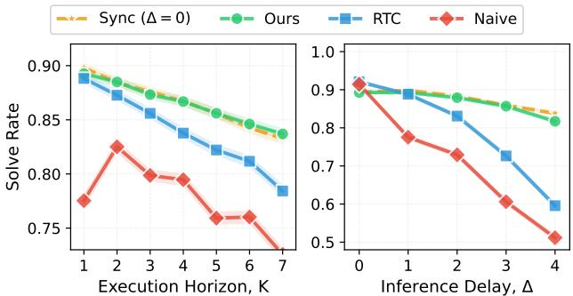
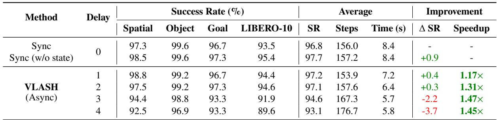
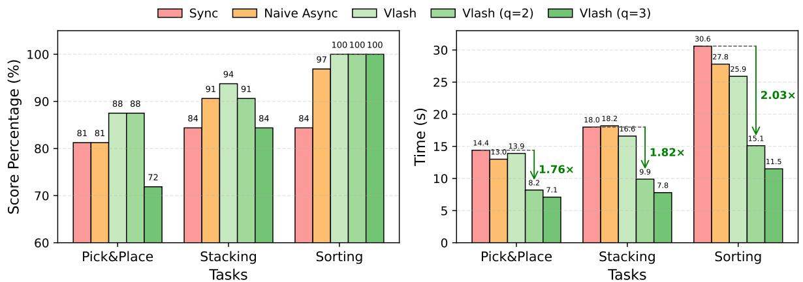
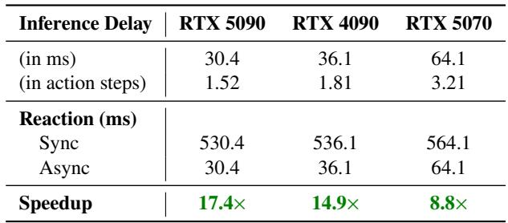
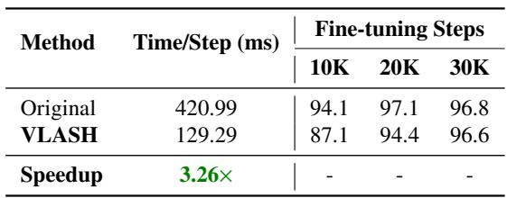

[← 返回 README](../README.md)

# 5 Experiments

## 📌 预览
Experiments 主要回答四件事：VLASH 是否真的比同步/朴素异步更稳、更快；它在不同延迟和不同 VLA 上是否泛化；action quantization 带来的速度-精度权衡如何；以及 shared-observation 训练到底省了多少成本。读这一节时，最好把 Kinetix、LIBERO、真实机器人和 reaction-latency 表分开看。

---

We design experiments to investigate the following questions:

1. Performance. How does our method compare to synchronous control, naive asynchronous and baselines in terms of accuracy and latency? (Sec. 5.1.1, Sec. 5.2) 2. Generalization. How well does our method generalize across different inference delays? Does it hurt the original model performance? How well does our method generalize across different VLAs? (Sec. 5.1.2) 3. Speed-accuracy trade-off. What is the speed-accuracy trade-off of action quantization at deployment? (Sec. 5.2) 4. Fine-tuning efficiency. How does our method compare to the standard fine-tuning in terms of training cost and data efficiency? How much the shared observation fine-tuning can reduce the training cost? (Sec. 5.3)

> 💡 **核心分析**: 四个 claim：方法有效、延迟泛化成立、执行可以继续提速、训练开销仍然可接受。

---

## 5.1 Simulated Evaluation

We evaluate VLASH on simulated robotic manipulation benchmarks including Kinetix [25] and LIBERO [23].

### 5.1.1 Kinetix

Experimental Setup. Kinetix [25] is a highly dynamic simulated robotic manipulation benchmark that demands asynchronous execution to handle rapidly changing environments. The tasks are designed to test dynamic reaction capabilities, including throwing, catching, and balancing.

Following the setup in RTC [4], we train action chunking flow policies with a prediction horizon of $H \ = \ 8$ and a 4-layer MLP-Mixer [35] architecture for 32 epochs. We report average success rates across 12 tasks, each evaluated with 1,024 rollouts per data point, under simulated delays ranging from 0 to 4 steps. We compare against the following baselines:

> 💡 **实现细节**: Kinetix 是这篇最适合检验 async 的仿真环境，因为任务本身就强调 throwing、catching、balancing 这类动态反应，而不是缓慢、近静态的操控。
>
>  Kinetix 训练和评测设置：`H=8`、4-layer MLP-Mixer、32 epochs、12 个高动态任务（如扔、接、平衡）、每点 1024 rollouts、延迟从 0 到 4 步。

---

- Sync. This baseline serves as an optimal baseline for all tasks. The inference delay is explicitly set to 0 at all times.

- Naive async. This baseline is the naive asynchronous inference baseline, which simply switches chunks as soon as the new one is ready [31].
- RTC. This baseline is the Real-time Chunking [4], which freezes the actions guaranteed to execute and inpaints the rest. This introduces additional overhead at runtime.

> 💡 **实验基线**: 
>
> * Sync 是理论上界，因为它强行把 delay 设成 0。后面的 async 方法都可以理解为在尽量逼近这个上界
> * Naive async 是最朴素的基线：新 chunk 一算完就切换，不做任何对齐或修正，因此最容易受到 stale state 影响
> * RTC 在这里是最直接的强基线，因为它同样关注 prediction-execution misalignment，但走的是 runtime inpainting 路线

---

*Figure 6. Performance on Kinetix benchmark. We evaluate the success rate under different execution horizons $K$ and inference delays $\Delta$ . Left: Fixed inference delay $\Delta = 1$ with varying execution horizon $K$ . Right: Execution horizon adapts to inference delay, i.e., $K \ = \ \operatorname* { m a x } ( \Delta , 1 )$ , with varying $\Delta$ . For the Sync baseline, inference delay is always $\Delta = 0$ , but the execution horizon $K$ follows the same settings as other baselines for fair comparison.*

> 💡 **实验结论**: Figure 6 是 Kinetix 的核心结果。左图看 execution horizon 变化，右图看 inference delay 增大时的鲁棒性；后者更能体现 VLASH 在大延迟下的稳定优势。

---

Results. As shown in Fig. 6, VLASH tracks the synchronous upper bound closely across execution horizons, while other baselines drop more noticeably as the execution horizon increases. When the inference delay increases, VLASH remains robust and consistently achieves high success rates, while RTC degrades rapidly and the Naive Async baseline collapses under larger delays. Notably, at inference delay of 4 steps, VLASH achieves $8 1 . 7 \%$ success rate compared to only $5 1 . 2 \%$ for Naive Async, which is a substantial $3 0 . 5 \%$ accuracy improvement. Overall, VLASH effectively mitigates prediction-execution misalignment, delivering high success rates under asynchronous operation.

> 💡 **核心洞察**: 结果部分最值得记的是这组核心数字：在 delay=4 的极高延迟下，Naive Async 已经崩塌到了 **51.2%**，而 VLASH 仍然坚挺在 **81.7%**，带来了 **+30.5%** 的绝对精度提升。这证明了在面对极端的 prediction-execution misalignment 时，future-state alignment 的鲁棒性远超朴素方法。

---

### 5.1.2 LIBERO

Experimental Setup. We evaluate on the LIBERO benchmark [23], one of the popular benchmarks for evaluating VLA, which includes 4 different sub-benchmarks (Spatial, Object, Goal, and LIBERO-10) that contain 10 tasks each. We evaluate on 2 state-of-the-art VLAs: $\pi _ { 0 . 5 }$ [16] and SmolVLA [31]. We report the performance by fine-tuning all models on the training dataset for 30K iterations with a batch size of 32. Following the setup in $\pi _ { 0 . 5 }$ [16], we set the execution horizon to $K = 5$ [10]. Since LIBERO tasks involve slowly changing environments with mild state transitions, different asynchronous methods behave similarly. Therefore, we focus our comparisons on synchronous inference to evaluate the effectiveness of VLASH under various inference delays. For time measurement, we use a laptop RTX 4090 GPU where the inference latency with 2 input images is $1 0 3 \mathrm { m s }$ . For synchronous inference, the time per action chunk is the sum of execution duration (166ms for $K = 5$ steps at $3 0 \mathrm { H z }$ ) and inference time. For asynchronous inference, larger delays are needed to overlap with the inference latency, so the time per action chunk is: execution duration + max(0, inference time − $\frac { \mathrm { e x e c u t i o n d u r a t i o n } } { K } \times \mathrm { d e l a y } )$

> 💡 **动机批注**: LIBERO 更偏向慢变化环境，因此不同 async 方法之间不会像 Kinetix 那样迅速拉开差距。这里的重点不在“谁更会追动态目标”，而在“VLASH 会不会破坏原本的操控精度，以及不同 delay 下能否保持合理的速度收益”。

---

*Table 1. Performance on LIBERO benchmarks with different inference delays. We evaluate $\pi _ { 0 . 5 }$ [16] across four LIBERO subbenchmarks (Spatial, Object, Goal, LIBERO-10) under various inference delays (0 to 4 steps). SR: average success rate; Steps: average execution steps to task completion; Time: completion time on a laptop RTX 4090 GPU (inference latency: $1 0 3 \mathrm { m s }$ for 2 images). Sync (w/o state): fine-tuned and evaluated with synchronous inference without robot state input.*

> 💡 **实验结论**: Table 1 是 `π0.5` 在四个 LIBERO 子基准上的细表。它显示小延迟时几乎不伤精度，同时已经开始带来 `1.17x` 到 `1.31x` 的时间收益；更大延迟时速度收益继续放大，但精度会开始小幅下降。

---

Results. As shown in Table 1, VLASH demonstrates strong performance across all LIBERO benchmarks under various inference delays. With small inference delays, VLASH maintains comparable accuracy to synchronous inference while achieving speedups of $1 . 1 7 \times$ and $1 . 3 1 \times$ , respectively. As the inference delay increases, the time advantages become more pronounced, achieving up to $1 . 4 7 \times$ speedup at delay 3. Although accuracy decreases slightly at higher delays, VLASH still achieves strong performance across all tasks, demonstrating an effective accuracy-latency trade-off. We also evaluate on SmolVLA [31], with detailed results provided in supplementary materials.

> 💡 **核心分析**: VLASH 在轻到中等延迟下能保持接近同步的成功率，同时获得更好的时间表现；在更大延迟下虽然有轻微精度损失，但整体仍具实用价值。

---

## 5.2 Real-World Evaluation

To evaluate VLASH in real-world settings, we deploy $\pi _ { 0 . 5 }$ [16] on two robotic platforms: the Galaxea R1 Lite [13] and the LeRobot SO-101 [15]. The R1 Lite is a dual-arm robot equipped with two 7-DOF arms from Galaxea [12]. The SO-101 is a 6-DOF collaborative robotic arm from LeRobot [5]. For $\pi _ { 0 . 5 }$ , we apply a projection layer to map the robot state into an embedding, bypassing the tokenizer instead of incorporating it into the language prompt in the original implementation. We design our real-world experiments to evaluate three key aspects: (1) Accuracy: the success rate of completing manipulation tasks; (2) Efficiency: the task completion time and motion smoothness; and (3) Reaction speed: the latency to react to dynamic changes in the environment.

> 💡 **动机批注**: 真实世界部分把实验落在两个具体平台上，并明确分成 Accuracy、Efficiency、Reaction speed 三个评价维度。这里的关注点已经从“会不会失稳”变成“真实机器人是不是更流畅、更快、反应更及时”。

---

### 5.2.1 Accuracy and Efficiency

Experimental Setup. Following the setup in SmolVLA [31], we evaluate $\pi _ { 0 . 5 }$ $\left( H \ = \ 5 0 \right)$ on three manipulation tasks that test different aspects of robotic control. We set the execution horizon to $K = 2 4$ steps at $3 0 \mathrm { H z }$ . All experiments are conducted on a laptop with NVIDIA RTX 4090 GPU, with an inference delay of 4 steps. On our robotic platforms, we evaluate three tasks:

> 💡 **实现细节**: 这一段给出真实操控实验的基准设定：`π0.5` 模型，预测步长 `H=50`，每次执行步数 `K=24`，控制频率 `30Hz`。基于 RTX 4090 测试，人为设定了 4 步的推理延迟。这套参数比仿真更贴近工业界双臂机器人的实际运行规格。

---

- Pick and Place: pick up a cube from varying starting 
positions and place it into a fixed box; 

- Stacking: pick up a blue cube and stack it on top of 
an orange cube, where both cubes’ initial positions vary across episodes; 

- Sorting: sort cubes by color, placing the orange cube in the left box and the blue cube in the right box, with cube positions varying across episodes.

For each task, we conduct 16 rollouts per method and report both the score percentage and the task completion time. The score percentage is calculated based on a 2-point scoring system per rollout: 1 point for successfully picking up the object, and 1 point for completing the task. We compare synchronous inference, naive asynchronous inference, and VLASH across these tasks.

> 💡 **技术细节**: 三类任务分别对应基础抓放、需要精确相对位姿的堆叠，以及更接近组合任务的 sorting。这样设计能同时观察流畅性、精度和任务完成时间。
>
> 每个 task 每种方法做 16 次 rollout，并用 2-point scoring 统计“抓起”和“完成任务”两个层级的成功，这样既能看最终结果，也能看任务中途是否更容易掉链子。

---

*Figure 7. Real-world evaluation results on manipulation tasks. We evaluate $\pi _ { 0 . 5 }$ [16] on three tasks with different inference methods. Left: Score percentages (based on 2-point scoring: 1 for success of picking up the object, 1 for task completion) of VLASH and baselines across three tasks. Right: Task completion times with green arrows indicating speedup of VLASH $( q = 2 )$ relative to synchronous baseline. VLASH $( q )$ applies action quantization with quantization ratio $q$ .*

> 💡 **实验结论**: Figure 7 给出了真实机器人里最直观的结果：左图看分数，右图看任务时间。绿色箭头强调的是叠加 action quantization 后，VLASH 相对同步基线的速度收益。

---

Results. As shown in Fig. 7, VLASH delivers better or comparable score percentage to synchronous inference while significantly reducing task completion time across all tasks. Specifically, VLASH maintains an $9 4 \%$ average score percentage, outperforming synchronous baseline $( 8 3 \% )$ and naive asynchronous inference $( 8 9 . 7 \% )$ , while completing tasks in 18.8 seconds on average compared to 21 seconds for synchronous inference, which is a $1 . 1 2 \times$ speedup.

> 💡 **核心分析**: 不加激进量化时，VLASH 已经能在平均分数上超过同步与 naive async，同时把平均完成时间从 21 秒压到 18.8 秒。这说明 future-state-aware async 本身就能兼顾精度和效率。

---

Furthermore, by applying action quantization, we can achieve greater speedups with minimal accuracy loss. VLASH with $q { = } 2$ achieves up to $2 . 0 3 \times$ speedup, while maintaining the original accuracy. With a more aggressive quantization ratio of $q { = } 3$ , VLASH achieves the faster execution at up to $2 . 6 7 \times$ speedup, with only a modest $4 . 7 \%$ drop in average score percentage, which demonstrates a favorable speed-accuracy trade-off.

> 💡 **核心原理**: `2.03x` 和 `2.67x` 则来自进一步叠加 action quantization。论文 headline 中最大的速度收益是 alignment 加上更粗粒度执行共同带来的。

---

### 5.2.2 Reaction Speed

Experimental Setup. To evaluate the reaction speed improvement of asynchronous inference, we compare the maximum reaction latency between synchronous and asynchronous inference across different hardware configurations. Following the setup in $\pi _ { 0 . 5 }$ [16], we set the execution horizon to $K \ = \ 2 5$ for synchronous inference and a control frequency of $5 0 \mathrm { H z }$ [4, 16], resulting in an execution duration of approximately 0.5 seconds per action chunk. We measure the model inference latency of $\pi _ { 0 . 5 }$ on three different GPUs: RTX 5090, RTX 4090, and RTX 5070, using torch.compile to enable CUDAGraph optimization and kernel fusion for minimal latency [2].

> 💡 **实验设计**: reaction speed 实验量测的是最大反应延迟，而不是任务总时间。设置 `K=25`、50Hz 后，同步推理的反应延迟本质上等于“整段 chunk 执行时间 + 推理时间”，async 则主要看推理时间本身。

---

*Table 2. Reaction speed comparison across devices. Latency of $\pi _ { 0 . 5 }$ [16] with 1 image input, $K = 2 5$ at $5 0 \mathrm { H z }$ . Execution duration is $5 0 0 \mathrm { m s }$ . Max reaction latency $=$ execution duration $^ +$ inference latency for Sync, inference latency only for Async.*

> 💡 **实验结论**: Table 2 把这个差异定量化了。在 RTX 5090 上，sync 约 530.4ms，而 async 只有 30.4ms，因此得到 `17.4x` 的 reaction-latency speedup

---

Results. As shown in Table 2, asynchronous inference significantly reduces the maximum reaction latency compared to synchronous inference, achieving up to $1 7 . 4 \times$ speedup. To showcase the fast reaction and smooth control capabilities of VLASH, we train $\pi _ { 0 . 5 }$ to perform highly dynamic interactive tasks: playing ping-pong with a human and playing whack-a-mole. These tasks demand both rapid reaction to dynamic changes and smooth continuous motion to maintain control accuracy. To the best of our knowledge, we are the first to demonstrate a VLA successfully playing ping-pong rallies with a human. Under synchronous inference, the robot’s reaction is too slow to track the fast-moving ball, while VLASH enables real-time response and stable rallies. We encourage readers to view the demo videos in the supplementary materials to see the dynamic performance of VLASH in action.

> 💡 **核心洞察**: 这一段顺便把 ping-pong 和 whack-a-mole 作为高动态 showcase。由于这两种游戏对微小延迟极其敏感，一旦卡顿就会全盘皆输，所以它们是检验“实时反应速度”和“平滑度”的试金石。VLASH 不只是跑分好，它在实际上让大参数 VLA 在真机上打乒乓球成为了可能。

---

## 5.3 Fine-tuning Efficiency

Experimental Setup. We evaluate the training efficiency gains from our efficient fine-tuning with shared observation approach. A key consideration is that training with multiple temporal offsets using shared observation effectively increases the effective batch size by a factor equal to the number of offsets. Therefore, we compare our method against standard fine-tuning under the same effective batch size to ensure a fair comparison. Specifically, we conduct experiments on the LIBERO benchmark using $\pi _ { 0 . 5 }$ [16] trained on $4 { \times } \mathrm { H } 1 0 0$ GPUs with DDP [21]. For our method, we use $\Delta _ { \operatorname* { m a x } } = 3$ with a physical batch size of 4 per GPU, resulting in an effective batch size of 16 per GPU and 64 in global. The standard baseline uses a physical batch size of 16 per GPU to match this effective batch size. Both methods are trained for 10K, 20K, and 30K iterations, and we report the average success rate across all LIBERO tasks. We also measure the training time per forward-backward pass to quantify the speedup.

> 💡 **实验设计**: 训练效率实验最重要的控制变量是“相同 effective batch size”。只有这样，shared-observation 带来的加速才不是因为偷偷增加了总样本量。

---

*Table 3. Fine-tuning efficiency. Original (without offset augmentation) vs VLASH (with offset augmentation and shared observation) on LIBERO with $\pi _ { 0 . 5 }$ [16]. Training on $4 { \times } \mathrm { H } 1 0 0$ GPUs using DDP, with effective batch size 16 per GPU (total 64). We report average LIBERO scores at different training steps. Both evaluated under synchronous inference.*

> 💡 **微调数据**: 
>
> * Original：没有 offset augmentation
> * VLASH：offset augmentation + shared observation
>
> 另外控制两边 effective batch size 一样

---

Results. As shown in Table 3, VLASH converges more slowly in the early stages but ultimately achieves comparable accuracy to standard fine-tuning. Although more training steps are needed for convergence, each step is significantly faster, achieving a $3 . 2 6 \times$ speedup per step. This efficiency gain comes from encoding the shared observation only once and reusing it across all temporal offsets. Furthermore, since both methods are evaluated under synchronous inference, these results also demonstrate that VLASH does not hurt the original synchronous performance of the model.

> 💡 **核心分析**: 最终结论也比较务实：VLASH 早期收敛稍慢，但终点精度与标准 fine-tuning 接近；既然同步评测下也没有明显伤害原模型性能，说明这套训练 recipe 至少是站得住的。

---

## 🔖 Section 总结

### 核心洞察
1. Kinetix 证明 VLASH 在高动态、大 delay 条件下比 naive async 和 RTC 更稳。
2. LIBERO 说明它对相对静态任务也能保持较好的 accuracy-latency trade-off。
3. 真实世界里的最大速度 headline 需要拆开看：future-state alignment 与 action quantization 都有贡献。
4. shared-observation 不是附带优化，而是让整套训练方法真正可用的关键。
5. **对实时控制的意义**: 大量且全面的实验证实，这不只是跑出好分数的 Trick，而是真正可以在真机上应用、且不会显著拉垮已有表现的泛化技术。
