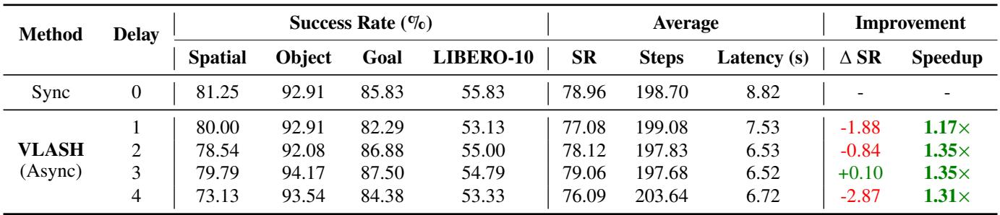
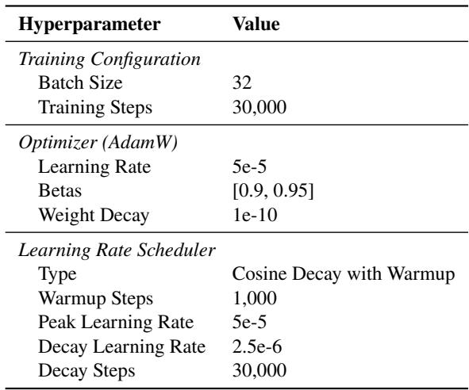

[← 返回 README](../README.md)

# 7 Appendix

## 📌 预览
附录补了三类正文外的重要信息：SmolVLA 上的泛化结果、完整训练超参数，以及补充视频与 `π0.5` 的 state 输入改造说明。它们分别对应“方法能否迁移”“实验是否可复现”“为什么某些架构更需要 state projection”这三件事。

---

## 7.1 SmolVLA Results on LIBERO Benchmarks

To further evaluate the generalization of VLASH across different VLAs, we conduct additional experiments on SmolVLA-450M [31], a compact yet efficient vision-language-action model. Following the same experimental setup as described in Sec. 5.1.2, we fine-tune SmolVLA on the LIBERO benchmark [23] for 30K iterations with a batch size of 32. We evaluate the model across four LIBERO subbenchmarks (Spatial, Object, Goal, and LIBERO-10) under various inference delays ranging from 0 to 4 steps, with an execution horizon of $K = 5$ .

> 💡 **泛化实验**: 这一节的作用是把 VLASH 从 `π0.5` 扩展到另一类更紧凑的 VLA。若这里也成立，说明方法并不依赖某一个特定 backbone。

---

*Table 4. Performance on LIBERO benchmarks with SmolVLA-450M and different inference delays. We evaluate SmolVLA across four LIBERO sub-benchmarks (Spatial, Object, Goal, LIBERO-10) under various inference delays (1 to 4 steps). SR: average success rate; Steps: average execution steps to task completion; Latency: inference latency in seconds.*

As shown in Table 4, VLASH achieves consistent speedups across all inference delays when applied to SmolVLA. At delay 2 and 3, VLASH achieves up to $1 . 3 5 \times$ speedup compared to synchronous inference. While the success rate shows minor variations across different delays, VLASH at delay 3 achieves $7 9 . 0 6 \%$ success rate, which is comparable to the synchronous baseline $( 7 8 . 9 6 \% )$ , demonstrating that VLASH can maintain performance while providing significant latency improvements. These results further validate that VLASH generalizes effectively across different VLA architectures.

> 💡 **实验结论**: Table 4 显示在 SmolVLA-450M 上，VLASH 仍然能持续带来 `1.17x` 到 `1.35x` 的速度收益，而且在 delay=3 时成功率 `79.06%` 与同步基线 `78.96%` 基本持平。作者据此把 VLASH 描述为对不同 VLA architecture 都有效的 async 框架。

---

## 7.2 Experimental Details

We present the detailed training hyperparameters used for fine-tuning VLAs in our experiments in Table 5. For all experiments on LIBERO benchmarks and real-world tasks, we use the same hyperparameters to ensure fair comparison across different methods and models. These hyperparameters are carefully tuned to balance training stability and convergence speed while preventing overfitting on the downstream tasks.

> 💡 **技术细节**: 这段主要服务复现。它说明正文所有 LIBERO 和 real-world fine-tuning 实验都共用一套超参数，避免不同方法因为 recipe 差异而失去可比性。

---

*Table 5. Training hyperparameters for fine-tuning VLAs. We use these hyperparameters for fine-tuning $\pi _ { 0 . 5 }$ and SmolVLA on LIBERO and real-world tasks.*

> 💡 **Table 5 批读**: 常规 fine-tuning 组合

---

## 7.3 Supplementary Demo Video

We provide comprehensive video demonstrations comparing our method against synchronous and naive asynchronous baselines across various real-world manipulation tasks. All demonstrations are conducted using $\pi _ { 0 . 5 }$ [16] deployed on a laptop with NVIDIA RTX 5090 GPU, achieving an inference frequency of $1 5 \mathrm { H z }$ .

We showcase the following tasks in the supplementary materials:
- Ping-pong: Interactive rallies with a human player, demonstrating rapid reaction capabilities. 
- Whack-a-mole: Fast-response game requiring quick detection and precise striking motions. 
- Pick and place: Standard manipulation task showing smooth motion control. 
- Folding clothes: Complex manipulation requiring coordinated movements.

We compare three inference modes: synchronous inference, naive asynchronous inference, and VLASH. Additionally, we demonstrate the effects of action quantization, showing how our method can achieve further speedups while maintaining task performance.

> 💡 **实验设计**: 补充视频使用 RTX 5090、15Hz 推理频率，目标是直观看到同步、naive async 和 VLASH 在真实机器人上的动作差异，覆盖了高动态交互任务与常规操控任务，因此不仅能看反应速度，也能看轨迹连续性和执行平滑度。作者还在视频里专门比较了 action quantization，这有助于把“方法本身更稳”和“执行更粗因此更快”两种收益分开观察。

---

The video demonstrations clearly show that VLASH produces noticeably smoother motions and faster task completion compared to both synchronous and naive asynchronous baselines. The synchronous baseline often exhibits stuttering behavior due to action stalls, while naive asynchronous inference suffers from prediction-execution misalignment that leads to erratic movements. In contrast, VLASH maintains fluid motion throughout task execution while achieving significant speedup. We encourage readers to view the video to appreciate the dynamic performance improvements of our approach.

> 💡 **核心分析**: smoothness、stuttering、erratic movement 这类现象很难只靠表格完全传达。

---

## 7.4 Architectural Modifications

A key advantage of VLASH is that it requires no architectural modifications to achieve effective performance across diverse VLA models. Since all current VLA models accept robot state inputs, VLASH can be applied directly by simply offsetting the state information during fine-tuning to account for inference delay. This straightforward approach enables the model to learn the temporal alignment between delayed observations and corresponding actions without any changes to the model architecture.

For standard VLA architectures like $\pi _ { 0 }$ [3] and SmolVLA [31], which incorporate a state projection layer to embed proprioceptive state vectors into continuous representations before feeding them into the transformer backbone, VLASH integrates seamlessly and achieves excellent results out of the box.

> 💡 **批读**: VLASH 的默认立场是不需要改架构，只需在 fine-tuning 时对 state 做 offset。也就是说，方法设计目标首先是最小侵入，对于像 `π0` 或 SmolVLA 这种本来就有 state projection layer 的模型，VLASH 能直接复用现有 proprioceptive state 通路，因此迁移起来更顺手。

---

We further note that VLASH also works directly with $\pi _ { 0 . 5 }$ [16] without modifications, as demonstrated in our experiments in Table 1. However, $\pi _ { 0 . 5 }$ employs a unique design that converts numerical state values into text tokens and appends them to the language prompt. This text-based encoding forces numerical state values through tokenization and one-hot encoding, disrupting their inherent numerical structure and making it more challenging for the model to learn from state information. For such architectures, we find that adding a lightweight state projection like the design of $\pi _ { 0 }$ and injecting the resulting embeddings back into their original positions can further enhance smoothness and stability. A simpler alternative is to incorporate the projected state embeddings into the AdaRMSNorm layers as conditioning signals alongside timestep embeddings. While entirely optional (and VLASH already performs well without it), this small architectural enhancement consistently improves control smoothness for $\pi _ { 0 . 5 }$ . Importantly, the additional parameters introduced by this state projection layer are negligible: it consists only of a linear mapping from the state dimension to the hidden dimension. Moreover, because it is zero-initialized, it completely preserves the pretrained model’s performance during the initial stages of fine-tuning.

> 💡 **技术细节**: 但 `π0.5` 的 state 是经由文本 token 注入的，这会破坏数值结构，所以作者额外指出轻量 state projection 可能进一步改善平滑度与稳定性。这个讨论很关键，因为它说明 VLASH 的效果一部分取决于 state 入口本身是否合适。

---

## 🔖 Section 总结

### 核心洞察
1. SmolVLA 结果表明 VLASH 不是单模型特例。
2. Table 5 说明这套方法的训练 recipe 并不离谱，具备复现可行性。
3. 对 `π0.5` 来说，state 该如何进入模型本身就是性能上限的一部分。
4. **对实时控制的意义**: 架构的微小调优（如补充 state projection）在异步部署中能显著影响最终的运动平滑度，提醒工程师在落地时不能完全忽视模型底层的数据流向。
